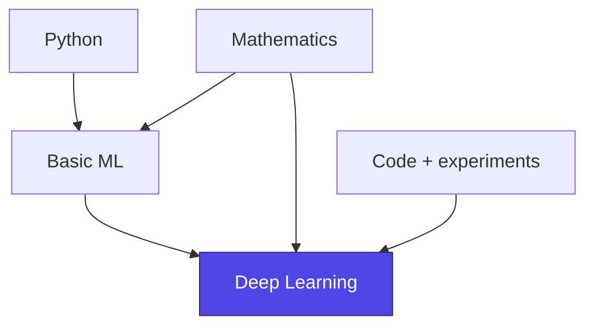
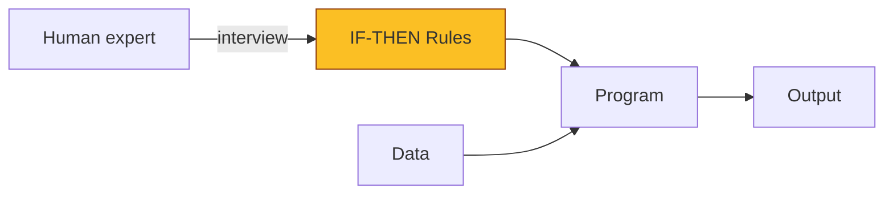
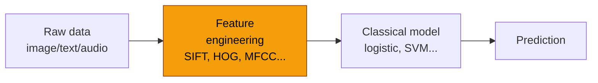
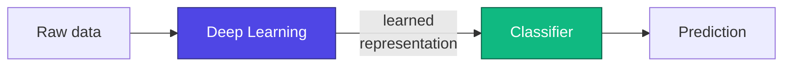
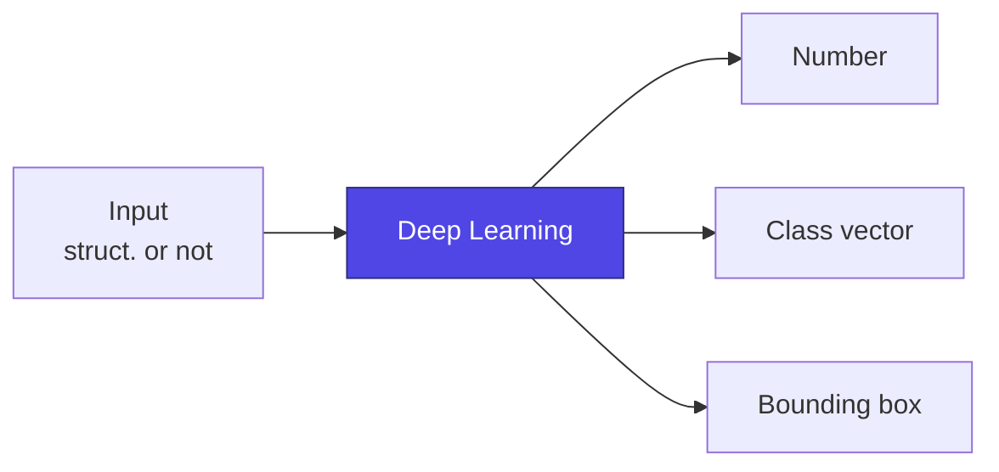
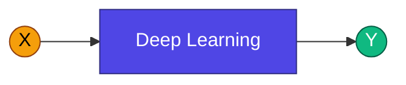
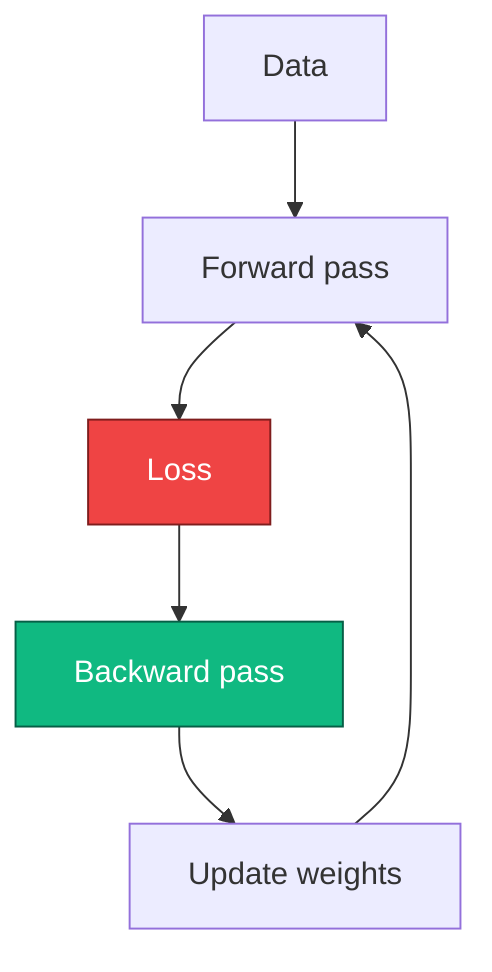

# Lecture 1

## Introduction to Neural Networks and *Deep Learning*

  
    Advanced Topics in Artificial Intelligence · UFABC
  

  Adapted from MIT 15.773 (Farias, Ramakrishnan) — OCW

---
layout: two-cols
---

# Prerequisites

<v-clicks>

- Intermediate-level familiarity with **Python**
- Knowledge of **fundamental Machine Learning concepts**:
  - train / validation / test
  - *overfitting* and *underfitting*
  - regularization
- Good intuition with **linear algebra and calculus**
  (vectors, matrices, partial derivatives)
- Willingness to **write code** and experiment

</v-clicks>

::right::

---
layout: section
---

# Course philosophy

Concepts before mathematics · Hands-on before theory

---

# How we will approach the content

<v-clicks>

- **Focus on the key ideas** that underpin *Deep Learning*
- Mathematics appears **when it helps**, not as an obstacle
- Learning DL is like **learning to swim**: you can't do it just by watching
  - We will write, train, and debug real models
- The goal is not to train ML engineers, but to give you the autonomy
  to build a **V1.0 model** without depending on others

</v-clicks>

> If you are looking for a strongly theoretical/mathematical approach, there are other more suitable courses.

---
layout: center
class: text-center
---

# AI, ML, DL, and Generative AI

Before diving into neural networks, let's understand the relationships between these ideas.

  <AIHierarchy />

---

# Artificial intelligence was born in **1956**

<v-clicks>

- The term **"Artificial Intelligence"** was coined at a historic workshop held at **Dartmouth College** (summer of 1956)
- It brought together names such as **John McCarthy, Marvin Minsky, Claude Shannon, Allen Newell, Herbert Simon**
- It defined an optimistic agenda: machines that could learn, reason, and use language
- Since then, AI has gone through several **winters** and **revivals**

</v-clicks>

  <Timeline />

---

# The classical AI approach

<v-clicks>

- **Goal**: give the computer the ability to perform tasks that only humans did well
- **Classical strategy**:
  ask *human experts* how they do it,
  transcribe into **IF…THEN rules**, program them explicitly
- Worked in **some well-delimited domains**
  (expert systems, rule-based chess)

</v-clicks>

---

# Why is this so hard?

<v-click>

> *"We know more than we can tell."*
> — **Polanyi's Paradox**

</v-click>

<v-clicks>

- We recognize a face, ride a bicycle, identify sarcasm —
  but it is **very hard to write the rules** that describe how we do it
- Explicit rules don't cover **edge cases** nor generalize to new situations
- Result: symbolic AI ran into the **complexity of the real world**

</v-clicks>

---
layout: center
---

# Paradigm shift

Instead of **telling** the computer what to do…

…<strong class="text-indigo-400">show</strong> it <em>many examples</em> of input and output,
and let <strong class="text-indigo-400">statistical techniques</strong> learn the relationship.

  
    This is Machine Learning
  

---

# Machine Learning, in one figure

  <MLDiagram />

Classical algorithms: linear regression, logistic regression, trees, *random forests*,
*gradient boosting*, SVMs, shallow neural networks…

---

# ML shines with **structured data**

<v-clicks>

- Structured data = data that fits **naturally into a spreadsheet**
- Each column is a meaningful numerical/categorical *feature*
- Classical ML works **very well** in these cases:
  - credit *score*
  - demand forecasting
  - fraud detection
  - diagnosis based on laboratory tests

</v-clicks>

| age | income | owns_property | defaulted |
|----:|-------:|:-------------:|:---------:|
| 32  | 5.4k   | yes           | 0         |
| 47  | 3.1k   | no            | 1         |
| 25  | 2.8k   | no            | 0         |
| 51  | 9.2k   | yes           | 0         |

Illustrative example (synthetic)

---

# But what about **unstructured data**?

  
🖼️

  
Images

  
RGB pixels without isolated meaning

  
📝

  
Text

  
sequences of characters/tokens

  
🔊

  
Audio

  
raw temporal samples

The **raw form** of this data has no intrinsic meaning for classical algorithms.
A pixel `(R=128, G=64, B=200)` says nothing on its own about whether there is
a cat in the image.

---

# The difficulty of unstructured data

  <PixelGrid />

A classifier <em>does not see</em> the cat — it sees a matrix of numbers.

---

# The pre-DL solution: **feature engineering**

<v-clicks>

- Experts designed **handcrafted representations** of the data:
  - **SIFT**, **HOG**, **SURF** for images
  - **MFCC** for audio
  - **TF-IDF**, *bag-of-words* for text
- The extracted representation was then fed
  into a **classical** model (usually logistic regression!)

</v-clicks>

This required **a great deal of human effort** — a *bottleneck* that drastically limited
the reach of ML on rich data such as images, speech, and natural language.

---
layout: center
class: text-center
---

# **Deep Learning** emerges

Models that **learn the representation** directly from raw data —
eliminating the bottleneck of manual feature engineering.

  <AIHierarchy showDL />

---

# What does **DL do** that classical ML didn't?

<v-clicks>

- **Automatically extracts** useful representations from unstructured data
- These representations can feed even trivial models (a logistic regression
  on top already delivers impressive results)
- Solves the **human bottleneck** that limited ML on images, text, and audio

</v-clicks>

Feature engineering stops being <em>human</em>
and becomes <em>learned</em>.

---

# Why did it happen **now**?

  
💡

  
Algorithms

  

    ReLU, dropout, batch norm,
    convolutional and
    transformer architectures, optimizers
    (Adam, etc.)
  

  
📊

  
Data

  

    Digitization of everything:
    photos, videos, social networks,
    sensors, logs.
     ImageNet, Common Crawl…
  

  
⚡

  
Compute

  

    GPUs, then TPUs.
    Massive parallel training
    in reduced precision.
  

…applied to an <strong>old</strong> idea: <strong>artificial neural networks</strong>.

---

# Immediate application: **perception**

Each **sensor** can gain the ability to detect, recognize, and
classify what it is perceiving. *Coupling* DL to cameras, microphones, and
sensors creates qualitatively different products.

  
📷

  
Object detection

  
🩺

  
Medical imaging diagnosis

  
🚗

  
Autonomous driving

  
🏭

  
Industrial inspection

  
🎤

  
Speech recognition

  
🔬

  
Microscopy analysis

  
🛰️

  
Remote sensing

  
🦅

  
Bio-acoustics

---
layout: center
---

# And what about **output**?

Classical DL easily predicted **structured outputs**
(a number, a label, a probability vector).

But **generating** text, images, audio, code? For a long time, that was
**difficult territory**.

---

# Outputs that ML/DL predicted well

<v-clicks>

- **A number**
  - probability of default
  - next week's demand
- **A few numbers**
  - distribution over 1,000 ImageNet classes
  - coordinates of a *bounding box*
- **A discrete label**
  - sentiment (positive/negative)
  - product category

</v-clicks>

---
layout: center
class: text-center
---

# Then came **Generative AI**

Models capable of **producing** unstructured content:
images, text, code, audio, video.

  <AIHierarchy showGenAI />

---

# The $X \to Y$ "matrix" of Generative AI

Both **$X$** and **$Y$** can be text, image, audio, video, code…
and even **multimodal**.

  <XYMatrix />

---

# Summary: $X \to Y$

> All the current excitement about AI is, in essence,
> the success of **Deep Learning** (and the Generative AI that came on top of it).

---
layout: section
---

# What is a neural network?

Let's start from the beginning.

---

# Back to **logistic regression**

Logistic regression maps an input vector to a **probability**:

$$
p(y=1\mid \mathbf{x}) \;=\; \sigma\!\left(b + \sum_{i=1}^{n} w_i\, x_i\right)
$$

where $\sigma(z) = \dfrac{1}{1 + e^{-z}}$ is the **sigmoid** function.

<v-click>

Let's look at this expression as a **network of mathematical operations**.

</v-click>

  <SigmoidPlot />

---

# Example: predicting who gets called for an interview

<v-clicks>

- **Inputs**:
  - GPA (grade point average)
  - Years of experience
- **Output**: probability of being called for an interview
  ($1$ = called, $0$ = not called)
- **Model**: logistic regression trained on historical data

</v-clicks>

| # | GPA | Exp. | Called |
|--:|----:|-----:|:------:|
| 1 | 3.27 | 1.93 | 0 |
| 2 | 3.37 | 0.07 | 0 |
| 3 | 3.57 | 1.91 | 0 |
| 4 | 3.91 | 4.35 | 0 |
| 6 | 3.90 | 2.41 | 1 |
| 7 | 3.94 | 3.00 | 1 |
| 15 | 3.77 | 2.06 | 1 |
| ... | ... | ... | ... |

---

# Suppose we trained and obtained:

$$
p(\text{called}) = \sigma\!\big(0{,}4 + 0{,}2\cdot\text{GPA} + 0{,}5\cdot\text{Exp}\big)
$$

Rewriting as a **network** with flow from left to right:

  <LogRegNetwork />

---

# Predicting with the "network"

Consider a candidate with <strong>GPA = 3.8</strong> and <strong>1.2 years</strong> of experience.

  <LogRegNetwork :gpa="3.8" :exp="1.2" showValues />

$$
\sigma(0{,}4 + 0{,}2\cdot 3{,}8 + 0{,}5\cdot 1{,}2) \;=\; \sigma(1{,}76) \;\approx\; 0{,}85
$$

The estimated probability of being called for an interview is about **85%**.

---

# Basic vocabulary

  <NeuralNetwork
    :layers="[3, 1]"
    :labels="['Inputs', 'Output']"
    showWeights
  />

<strong class="text-indigo-300">Weights</strong> — multipliers on the connections between neurons

<strong class="text-indigo-300">Bias</strong> — additive term (intercept) at each neuron

<strong class="text-indigo-300">Neuron</strong> — unit that computes $\sum + \text{bias}$ and applies activation

<strong class="text-indigo-300">Layer</strong> — vertical stack of neurons

---

# Why is the "network lens" useful?

<v-clicks>

- It allows us to **transform** the input data before the final decision
- Instead of feeding raw data directly to logistic regression,
  we can first **learn a better representation** of it
- This is the heart of *Deep Learning*: stacking learned transformations

</v-clicks>

---

# Stacking linear functions

Before the final decision, **insert** a layer of linear functions
that combines the inputs:

  <NeuralNetwork :layers="[3, 3, 1]" :labels="['Input', 'Hidden', 'Output']" />

Each node in the intermediate layer is $z_j = b_j + \sum_i w_{ji} x_i$
— a **linear transformation** of the inputs.

---

# Stacking even more

  <NeuralNetwork :layers="[3, 3, 3, 1]" :labels="['Input', 'Hidden 1', 'Hidden 2', 'Output']" />

We can stack **as many layers** as we want. At the end, we feed
logistic regression (sigmoid) with the transformed vector.

⚠ But with only <em>linear</em> layers the composition remains linear —
we need something more.

---

# **Non-linear** activation functions

For stacking layers to make a difference, each neuron applies a
**non-linear activation function** after the linear combination:

$$
a_j = \phi\!\Big(b_j + \sum_i w_{ji}\, x_i\Big)
$$

  <ActivationFunctions />

---

# Common activation functions

**Sigmoid**

$\sigma(z) = \dfrac{1}{1+e^{-z}}$

Output in (0,1). Used in the <strong>output layer</strong> for binary classification. Suffers from <em>vanishing gradients</em> in deep layers.

**Tanh**

$\tanh(z) = \dfrac{e^z - e^{-z}}{e^z + e^{-z}}$

Output in (−1,1), centered at zero. Better behaved than sigmoid, but still saturates.

**ReLU**

$\mathrm{ReLU}(z) = \max(0,\, z)$

Modern standard in hidden layers. Cheap, avoids saturation for z &gt; 0, enables much deeper networks.

Others: Leaky ReLU, ELU, GELU, Swish, Softmax (in multi-class output)…

---

# Visual notation

From here on, we will abbreviate each neuron with a **circle**, indicating
the activation by color/label:

  
+

  
Linear

  
+

  
ReLU

  
+

  
Sigmoid

---

# Anatomy of a DNN

  <NeuralNetwork
    :layers="[4, 5, 5, 1]"
    :labels="['Input', 'Hidden 1', 'Hidden 2', 'Output']"
    animate
  />

<strong>Input layer:</strong> the variables <em>x₁, …, xₖ</em>

<strong>Hidden layers:</strong> transform the representation

<strong>Output layer:</strong> produces the prediction

<strong>Dense connections:</strong> each neuron connects to all neurons in the next layer

When all layers are dense, we say the network is <em>fully connected</em>.

---

# Designing a DNN: the choices

When you design a feedforward (*vanilla*) neural network, you decide:

  
How many hidden layers?

  
depth

  
How many neurons per layer?

  
width

  
Which activation in the hidden layers?

  
typically ReLU/GELU

  
Which activation in the output?

  
depends on the task

The choice of output activation is guided by the nature of $y$:
linear (regression), sigmoid (binary classification), softmax (multi-class).

---

# Applying to the interview classifier

<v-clicks>

- **Inputs**: 2 variables (GPA, experience)
- **Output**: probability $\in (0,1)$
- **Design decisions**:
  - 1 hidden layer with **3 ReLU neurons**
  - **Sigmoid** at the output (probability)

</v-clicks>

  <NeuralNetwork
    :layers="[2, 3, 1]"
    :labels="['Input', 'Hidden (ReLU)', 'Output (σ)']"
  />

---

# How many parameters does this network have?

  <NeuralNetwork
    :layers="[2, 3, 1]"
    :labels="['Input', 'Hidden', 'Output']"
    showCount
  />

- From input to hidden: $2 \times 3 = 6$ weights $+ 3$ biases $= 9$
- From hidden to output:   $3 \times 1 = 3$ weights $+ 1$ bias $= 4$
- **Total**: <strong class="text-indigo-300">13 parameters</strong>

---

# Trained weights (assumption)

  <InterviewNet />

How these weights are <em>found</em> from data is the topic
of the <strong>next lecture</strong> (training, loss, backpropagation).

---

# *Forward pass* — computing a prediction

For a candidate with $x_1 = 2{,}3$ (GPA) and $x_2 = 10{,}2$ (experience*):

  <InterviewNet :x1="2.3" :x2="10.2" showActivations />

*Exaggerated value just to make the calculations didactic.

---

# Hidden layer: explicit calculations

$$
\begin{aligned}
a_1 &= \mathrm{ReLU}\!\big(-0{,}3 + 0{,}5\cdot 2{,}3 + 0{,}1\cdot 10{,}2\big) = \max(0;\,1{,}87) = 1{,}87\\
a_2 &= \mathrm{ReLU}\!\big( \;\;0{,}2 - 0{,}1\cdot 2{,}3 + 0{,}3\cdot 10{,}2\big) = \max(0;\,3{,}03) = 3{,}03\\
a_3 &= \mathrm{ReLU}\!\big( \;\;0{,}5 + 0{,}2\cdot 2{,}3 - 0{,}1\cdot 10{,}2\big) = \max(0;\,-0{,}06) = 0
\end{aligned}
$$

And the output:

$$
y = \sigma\!\big(0{,}05 + (-0{,}2)\cdot 1{,}87 + (-0{,}3)\cdot 3{,}03 + (-0{,}15)\cdot 0\big)
\approx \sigma(-1{,}23) \approx 0{,}226
$$

For this candidate, the network estimates ≈ <strong>22.6%</strong> chance of being called.

---

# The network as a function

The network's prediction can be written as **a single function** of the inputs:

$$
\hat y(\mathbf{x}) \;=\; \sigma\!\Big( \mathbf{w}^{(2)\top}\, \mathrm{ReLU}\big(\mathbf{W}^{(1)} \mathbf{x} + \mathbf{b}^{(1)}\big) + b^{(2)} \Big)
$$

**Pure logistic regression:**

$$
\hat y \;=\; \sigma\!\big(0{,}4 + 0{,}2 x_1 + 0{,}5 x_2\big)
$$

linear in the data before the sigmoid.

**Network with 1 hidden layer:**

a much richer non-linear composition —
capable of representing complex relationships between $\mathbf{x}$ and $y$.

---

# Summary: a DNN

  <NeuralNetwork
    :layers="[4, 6, 6, 6, 2]"
    :labels="['Input', 'Hidden 1', 'Hidden 2', 'Hidden 3', 'Output']"
    animate
  />

- **Feedforward** (vanilla): data flows from left to right
- **Architecture** = layers + activations + connections
- **Depth** comes from many hidden layers

- *Deep Learning* is, in essence, **neural networks with many layers**
- Training, backpropagation, and optimization — next lecture

---
layout: center
class: text-center
---

# Recap

<strong class="text-indigo-300">Hierarchy of ideas</strong>

AI ⊃ ML ⊃ DL ⊃ Generative AI

<strong class="text-indigo-300">Why DL is special</strong>

learns representations from unstructured data

<strong class="text-indigo-300">The combination that unlocked it</strong>

algorithms + data + GPUs

<strong class="text-indigo-300">Neural network ≈ regression</strong>

logistic stacked with non-linearities

<strong class="text-indigo-300">Components</strong>

layers, neurons, weights, biases, activations

<strong class="text-indigo-300">Forward pass</strong>

linear combination → non-linearity → repeat

---

# Next lecture

<v-clicks>

- How do you **train** a neural network?
- What is a **loss function**?
- **Gradient descent** and its variants
- **Backpropagation** (intuition + a numerical example)

</v-clicks>

---
layout: center
class: text-center
---

# Thank you! Questions?

Freely adapted from <em>15.773 Hands-on Deep Learning</em>
(MIT OpenCourseWare, 2024) — original English material by Vivek Farias and
Rama Ramakrishnan, distributed under the terms of MIT OCW.

For more information: https://ocw.mit.edu/terms

