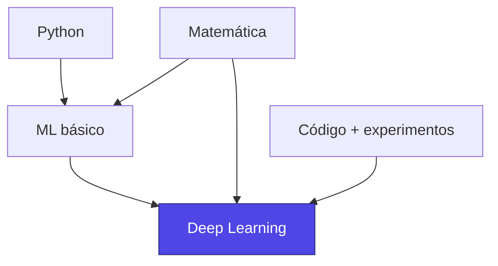
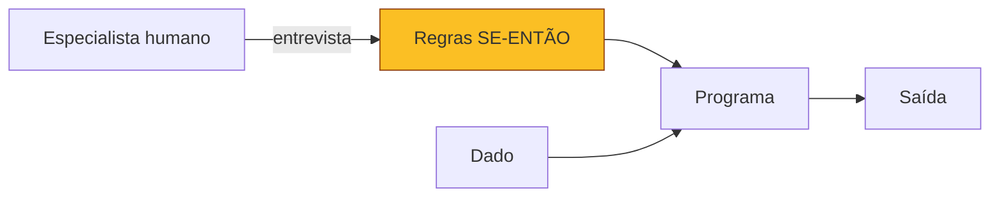
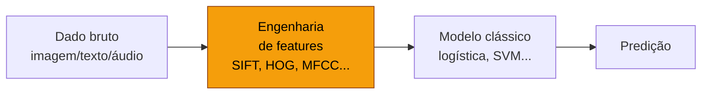
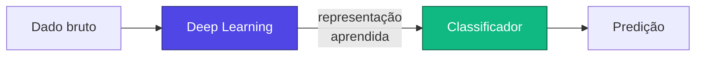
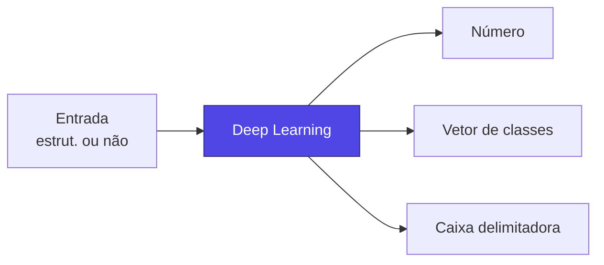
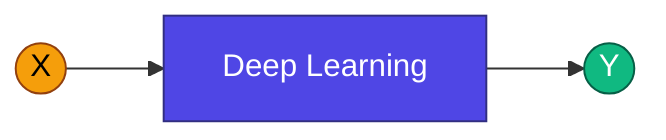
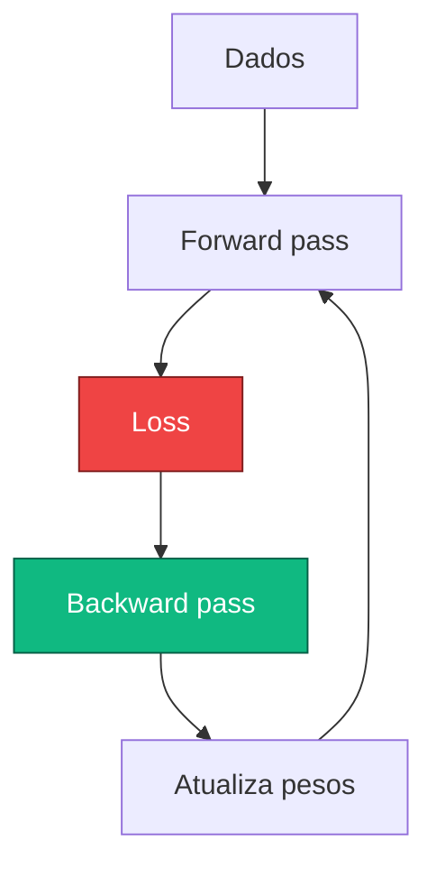

# Aula 1

## Introdução a Redes Neurais e *Deep Learning*

  
    Tópicos Avançados em Inteligência Artificial · UFABC
  

  Adaptado de MIT 15.773 (Farias, Ramakrishnan) — OCW

---
layout: two-cols
---

# Pré-requisitos

<v-clicks>

- Familiaridade com **Python** em nível intermediário
- Conhecimento de **conceitos fundamentais de Machine Learning**:
  - treino / validação / teste
  - *overfitting* e *underfitting*
  - regularização
- Boa intuição com **álgebra linear e cálculo**
  (vetores, matrizes, derivadas parciais)
- Disposição para **escrever código** e experimentar

</v-clicks>

::right::

---
layout: section
---

# Filosofia do curso

Conceitos antes da matemática · Mão na massa antes da teoria

---

# Como vamos abordar o conteúdo

<v-clicks>

- **Foco nas ideias-chave** que sustentam o *Deep Learning*
- A matemática aparece **quando ajuda**, não como obstáculo
- Aprender DL é como **aprender a nadar**: não dá só assistindo
  - Vamos escrever, treinar e depurar modelos reais
- O objetivo não é formar engenheiros de ML, mas dar autonomia
  para que vocês construam um **modelo V1.0** sem depender de terceiros

</v-clicks>

> Se você procura uma abordagem fortemente teórica/matemática, há outras disciplinas mais adequadas.

---
layout: center
class: text-center
---

# IA, ML, DL e IA Generativa

Antes de mergulhar nas redes neurais, vamos entender as relações entre essas ideias.

  <AIHierarchy />

---

# A inteligência artificial nasceu em **1956**

<v-clicks>

- O termo **"Inteligência Artificial"** foi cunhado em uma oficina histórica realizada na **Dartmouth College** (verão de 1956)
- Reunia nomes como **John McCarthy, Marvin Minsky, Claude Shannon, Allen Newell, Herbert Simon**
- Definia uma agenda otimista: máquinas que aprendessem, raciocinassem e usassem linguagem
- Desde então, a IA passou por vários **invernos** e **renascimentos**

</v-clicks>

  <Timeline />

---

# A abordagem clássica de IA

<v-clicks>

- **Meta**: dar ao computador a capacidade de fazer tarefas que só humanos faziam bem
- **Estratégia clássica**:
  perguntar a *especialistas humanos* como eles fazem,
  transcrever em **regras `SE…ENTÃO`**, programá-las explicitamente
- Funcionou em **alguns domínios bem delimitados**
  (sistemas especialistas, xadrez baseado em regras)

</v-clicks>

---

# Por que isso é tão difícil?

<v-click>

> *"Sabemos mais do que conseguimos contar."*
> — **Paradoxo de Polanyi**

</v-click>

<v-clicks>

- Reconhecemos um rosto, andamos de bicicleta, identificamos sarcasmo —
  mas é **muito difícil escrever as regras** que descrevem como fazemos isso
- Regras explícitas não cobrem **casos extremos** nem generalizam para situações novas
- Resultado: a IA simbólica esbarrou na **complexidade do mundo real**

</v-clicks>

---
layout: center
---

# Mudança de paradigma

Em vez de **dizer** ao computador o que fazer…

…<strong class="text-indigo-400">mostre</strong> a ele <em>muitos exemplos</em> de entrada e saída,
e deixe que <strong class="text-indigo-400">técnicas estatísticas</strong> aprendam a relação.

  
    Isto é Machine Learning
  

---

# Machine Learning, em uma figura

  <MLDiagram />

Algoritmos clássicos: regressão linear, regressão logística, árvores, *random forests*,
*gradient boosting*, SVMs, redes neurais rasas…

---

# ML brilha com **dados estruturados**

<v-clicks>

- Dados estruturados = aqueles que cabem **naturalmente em uma planilha**
- Cada coluna é uma *feature* numérica/categórica significativa
- ML clássico funciona **muito bem** nesses casos:
  - *score* de crédito
  - previsão de demanda
  - detecção de fraude
  - diagnóstico baseado em exames laboratoriais

</v-clicks>

| idade | renda | tem_imovel | inadimplente |
|------:|------:|:----------:|:------------:|
| 32    | 5.4k  | sim        | 0            |
| 47    | 3.1k  | não        | 1            |
| 25    | 2.8k  | não        | 0            |
| 51    | 9.2k  | sim        | 0            |

Exemplo ilustrativo (sintético)

---

# Mas e os **dados não estruturados**?

  
🖼️

  
Imagens

  
pixels RGB sem significado isolado

  
📝

  
Texto

  
sequências de caracteres/tokens

  
🔊

  
Áudio

  
amostras temporais brutas

A **forma bruta** desses dados não tem significado intrínseco para os algoritmos
clássicos. Um pixel `(R=128, G=64, B=200)` não diz nada sozinho sobre haver um
gato na imagem.

---

# A dificuldade dos dados não estruturados

  <PixelGrid />

Um classificador <em>não vê</em> o gato — vê uma matriz de números.

---

# A solução pré-DL: **engenharia de atributos**

<v-clicks>

- Especialistas projetavam **representações artesanais** dos dados:
  - **SIFT**, **HOG**, **SURF** para imagens
  - **MFCC** para áudio
  - **TF-IDF**, *bag-of-words* para texto
- A representação extraída era então alimentada
  em um modelo **clássico** (geralmente regressão logística!)

</v-clicks>

Isso exigia **muito esforço humano** — um *gargalo* que limitou drasticamente
o alcance de ML em dados ricos como imagens, voz e linguagem natural.

---
layout: center
class: text-center
---

# Surge o **Deep Learning**

Modelos que **aprendem a representação** diretamente dos dados brutos —
eliminando o gargalo da engenharia manual de atributos.

  <AIHierarchy showDL />

---

# O que **DL faz** que ML clássico não fazia?

<v-clicks>

- **Extrai automaticamente** representações úteis dos dados não estruturados
- Essas representações podem alimentar até modelos triviais (uma regressão
  logística no topo já entrega resultados impressionantes)
- Resolve o **gargalo humano** que limitava ML em imagens, texto e áudio

</v-clicks>

A engenharia de features deixa de ser <em>humana</em>
e passa a ser <em>aprendida</em>.

---

# Por que aconteceu **agora**?

  
💡

  
Algoritmos

  

    ReLU, dropout, batch norm,
    arquiteturas convolucionais e
    transformers, otimizadores
    (Adam, etc.)
  

  
📊

  
Dados

  

    Digitalização de tudo:
    fotos, vídeos, redes sociais,
    sensores, logs.
     ImageNet, Common Crawl…
  

  
⚡

  
Computação

  

    GPUs, depois TPUs.
    Treinos paralelos massivos
    em precisão reduzida.
  

…aplicados a uma ideia <strong>antiga</strong>: as <strong>redes neurais artificiais</strong>.

---

# Aplicação imediata: **percepção**

Cada **sensor** pode ganhar a capacidade de detectar, reconhecer e
classificar o que está percebendo. *Acoplar* DL a câmeras, microfones e
sensores cria produtos qualitativamente diferentes.

  
📷

  
Detecção de objetos

  
🩺

  
Diagnóstico por imagem

  
🚗

  
Direção autônoma

  
🏭

  
Inspeção industrial

  
🎤

  
Reconhecimento de fala

  
🔬

  
Análise de microscopia

  
🛰️

  
Sensoriamento remoto

  
🦅

  
Bio-acústica

---
layout: center
---

# E quanto à **saída**?

DL clássico previa **saídas estruturadas** com facilidade
(um número, um rótulo, um vetor de probabilidades).

Mas **gerar** texto, imagens, áudio, código? Por muito tempo, esse era
um **território difícil**.

---

# Saídas que ML/DL conseguia prever bem

<v-clicks>

- **Um número**
  - probabilidade de inadimplência
  - demanda da próxima semana
- **Poucos números**
  - distribuição sobre 1 000 classes do ImageNet
  - coordenadas de um *bounding box*
- **Um rótulo discreto**
  - sentimento (positivo/negativo)
  - categoria de produto

</v-clicks>

---
layout: center
class: text-center
---

# Então surgiu a **IA Generativa**

Modelos capazes de **produzir** conteúdo não estruturado:
imagens, texto, código, áudio, vídeo.

  <AIHierarchy showGenAI />

---

# A "matriz" $X \to Y$ da IA Generativa

Tanto **$X$** quanto **$Y$** podem ser texto, imagem, áudio, vídeo, código…
e até **multimodais**.

  <XYMatrix />

---

# Resumo: $X \to Y$

> Toda a empolgação atual com IA é, em essência,
> o sucesso do **Deep Learning** (e da IA Generativa que veio sobre ele).

---
layout: section
---

# O que é uma rede neural?

Vamos começar do começo.

---

# Voltando à **regressão logística**

A regressão logística mapeia um vetor de entradas em uma **probabilidade**:

$$
p(y=1\mid \mathbf{x}) \;=\; \sigma\!\left(b + \sum_{i=1}^{n} w_i\, x_i\right)
$$

onde $\sigma(z) = \dfrac{1}{1 + e^{-z}}$ é a função **sigmoide**.

<v-click>

Vamos olhar para essa expressão como uma **rede de operações matemáticas**.

</v-click>

  <SigmoidPlot />

---

# Exemplo: prever quem é chamado para entrevista

<v-clicks>

- **Entradas**:
  - GPA (coeficiente de rendimento)
  - Anos de experiência
- **Saída**: probabilidade de ser chamado para a entrevista
  ($1$ = chamado, $0$ = não chamado)
- **Modelo**: regressão logística treinada nos dados históricos

</v-clicks>

| # | GPA | Exp. | Chamado |
|--:|----:|-----:|:-------:|
| 1 | 3.27 | 1.93 | 0 |
| 2 | 3.37 | 0.07 | 0 |
| 3 | 3.57 | 1.91 | 0 |
| 4 | 3.91 | 4.35 | 0 |
| 6 | 3.90 | 2.41 | 1 |
| 7 | 3.94 | 3.00 | 1 |
| 15 | 3.77 | 2.06 | 1 |
| ... | ... | ... | ... |

---

# Suponha que treinamos e obtivemos:

$$
p(\text{chamado}) = \sigma\!\big(0{,}4 + 0{,}2\cdot\text{GPA} + 0{,}5\cdot\text{Exp}\big)
$$

Reescrevendo como uma **rede** com fluxo da esquerda para a direita:

  <LogRegNetwork />

---

# Predizendo com a "rede"

Considere um candidato com <strong>GPA = 3,8</strong> e <strong>1,2 anos</strong> de experiência.

  <LogRegNetwork :gpa="3.8" :exp="1.2" showValues />

$$
\sigma(0{,}4 + 0{,}2\cdot 3{,}8 + 0{,}5\cdot 1{,}2) \;=\; \sigma(1{,}76) \;\approx\; 0{,}85
$$

A probabilidade estimada de chamada para entrevista é cerca de **85 %**.

---

# Vocabulário básico

  <NeuralNetwork
    :layers="[3, 1]"
    :labels="['Entradas', 'Saída']"
    showWeights
  />

<strong class="text-indigo-300">Pesos</strong> — multiplicadores nas conexões entre neurônios

<strong class="text-indigo-300">Bias</strong> — termo aditivo (intercepto) em cada neurônio

<strong class="text-indigo-300">Neurônio</strong> — unidade que faz $\sum + \text{bias}$ e aplica ativação

<strong class="text-indigo-300">Camada</strong> — pilha vertical de neurônios

---

# Por que a "lente de rede" é útil?

<v-clicks>

- Ela nos permite **transformar** os dados de entrada antes da decisão final
- Em vez de alimentar a regressão logística com os dados crus,
  podemos primeiro **aprender uma melhor representação** deles
- Esse é o coração do *Deep Learning*: empilhar transformações aprendidas

</v-clicks>

---

# Empilhando funções lineares

Antes da decisão final, **insira** uma camada de funções lineares
que combine as entradas:

  <NeuralNetwork :layers="[3, 3, 1]" :labels="['Entrada', 'Oculta', 'Saída']" />

Cada nó da camada intermediária é $z_j = b_j + \sum_i w_{ji} x_i$
— uma **transformação linear** das entradas.

---

# Empilhando ainda mais

  <NeuralNetwork :layers="[3, 3, 3, 1]" :labels="['Entrada', 'Oculta 1', 'Oculta 2', 'Saída']" />

Podemos empilhar **quantas camadas** quisermos. No final, alimentamos
a regressão logística (sigmoide) com o vetor transformado.

⚠ Mas só com camadas <em>lineares</em> a composição segue sendo linear —
precisamos de algo a mais.

---

# Funções de ativação **não lineares**

Para que empilhar camadas faça diferença, cada neurônio aplica uma
**função de ativação não linear** depois da combinação linear:

$$
a_j = \phi\!\Big(b_j + \sum_i w_{ji}\, x_i\Big)
$$

  <ActivationFunctions />

---

# Funções de ativação comuns

**Sigmoide**

$\sigma(z) = \dfrac{1}{1+e^{-z}}$

Saída em (0,1). Usada na <strong>camada de saída</strong> para classificação binária. Sofre de <em>vanishing gradients</em> em camadas profundas.

**Tanh**

$\tanh(z) = \dfrac{e^z - e^{-z}}{e^z + e^{-z}}$

Saída em (−1,1), centrada em zero. Mais bem comportada que sigmoide, mas ainda satura.

**ReLU**

$\mathrm{ReLU}(z) = \max(0,\, z)$

Padrão moderno em camadas ocultas. Barata, evita saturação para z &gt; 0, permite redes muito mais profundas.

Outras: Leaky ReLU, ELU, GELU, Swish, Softmax (na saída multi-classe)…

---

# Notação visual

A partir daqui, vamos abreviar cada neurônio com um **círculo**, indicando
a ativação por cor/rótulo:

  
+

  
Linear

  
+

  
ReLU

  
+

  
Sigmoide

---

# Anatomia de uma DNN

  <NeuralNetwork
    :layers="[4, 5, 5, 1]"
    :labels="['Entrada', 'Oculta 1', 'Oculta 2', 'Saída']"
    animate
  />

<strong>Camada de entrada:</strong> as variáveis <em>x₁, …, xₖ</em>

<strong>Camadas ocultas:</strong> transformam a representação

<strong>Camada de saída:</strong> produz a predição

<strong>Conexões densas:</strong> cada neurônio se liga a todos da próxima camada

Quando todas as camadas são densas, dizemos que a rede é <em>fully connected</em>.

---

# Projetando uma DNN: as escolhas

Quando você desenha uma rede neural feedforward (*vanilla*), você decide:

  
Quantas camadas ocultas?

  
profundidade

  
Quantos neurônios em cada camada?

  
largura

  
Qual ativação nas ocultas?

  
tipicamente ReLU/GELU

  
Qual ativação na saída?

  
depende da tarefa

A escolha da ativação de saída é guiada pela natureza de $y$:
linear (regressão), sigmoide (classificação binária), softmax (multiclasse).

---

# Aplicando ao classificador de entrevistas

<v-clicks>

- **Entradas**: 2 variáveis (GPA, experiência)
- **Saída**: probabilidade $\in (0,1)$
- **Decisões de projeto**:
  - 1 camada oculta com **3 neurônios** ReLU
  - **Sigmoide** na saída (probabilidade)

</v-clicks>

  <NeuralNetwork
    :layers="[2, 3, 1]"
    :labels="['Entrada', 'Oculta (ReLU)', 'Saída (σ)']"
  />

---

# Quantos parâmetros tem essa rede?

  <NeuralNetwork
    :layers="[2, 3, 1]"
    :labels="['Entrada', 'Oculta', 'Saída']"
    showCount
  />

- Da entrada para a oculta: $2 \times 3 = 6$ pesos $+ 3$ biases $= 9$
- Da oculta para a saída:   $3 \times 1 = 3$ pesos $+ 1$ bias $= 4$
- **Total**: <strong class="text-indigo-300">13 parâmetros</strong>

---

# Pesos treinados (suposição)

  <InterviewNet />

Como esses pesos são <em>encontrados</em> a partir dos dados é o tema
da <strong>próxima aula</strong> (treinamento, perda, retropropagação).

---

# *Forward pass* — calculando uma predição

Para um candidato com $x_1 = 2{,}3$ (GPA) e $x_2 = 10{,}2$ (experiência*):

  <InterviewNet :x1="2.3" :x2="10.2" showActivations />

*Valor exagerado apenas para tornar as contas didáticas.

---

# Camada oculta: contas explícitas

$$
\begin{aligned}
a_1 &= \mathrm{ReLU}\!\big(-0{,}3 + 0{,}5\cdot 2{,}3 + 0{,}1\cdot 10{,}2\big) = \max(0;\,1{,}87) = 1{,}87\\
a_2 &= \mathrm{ReLU}\!\big( \;\;0{,}2 - 0{,}1\cdot 2{,}3 + 0{,}3\cdot 10{,}2\big) = \max(0;\,3{,}03) = 3{,}03\\
a_3 &= \mathrm{ReLU}\!\big( \;\;0{,}5 + 0{,}2\cdot 2{,}3 - 0{,}1\cdot 10{,}2\big) = \max(0;\,-0{,}06) = 0
\end{aligned}
$$

E a saída:

$$
y = \sigma\!\big(0{,}05 + (-0{,}2)\cdot 1{,}87 + (-0{,}3)\cdot 3{,}03 + (-0{,}15)\cdot 0\big)
\approx \sigma(-1{,}23) \approx 0{,}226
$$

Para este candidato, a rede estima ≈ <strong>22,6 %</strong> de chance de chamada.

---

# A rede como uma função

A predição da rede pode ser escrita como **uma única função** das entradas:

$$
\hat y(\mathbf{x}) \;=\; \sigma\!\Big( \mathbf{w}^{(2)\top}\, \mathrm{ReLU}\big(\mathbf{W}^{(1)} \mathbf{x} + \mathbf{b}^{(1)}\big) + b^{(2)} \Big)
$$

**Regressão logística pura:**

$$
\hat y \;=\; \sigma\!\big(0{,}4 + 0{,}2 x_1 + 0{,}5 x_2\big)
$$

linear nos dados antes da sigmoide.

**Rede com 1 camada oculta:**

uma composição não linear muito mais rica —
capaz de representar relações complexas entre $\mathbf{x}$ e $y$.

---

# Resumo: uma DNN

  <NeuralNetwork
    :layers="[4, 6, 6, 6, 2]"
    :labels="['Entrada', 'Oculta 1', 'Oculta 2', 'Oculta 3', 'Saída']"
    animate
  />

- **Feedforward** (vanilla): dados fluem da esquerda para a direita
- **Arquitetura** = camadas + ativações + conexões
- **Profundidade** vem de muitas camadas ocultas

- *Deep Learning* é, em essência, **redes neurais com muitas camadas**
- Treinamento, retropropagação e otimização — próxima aula

---
layout: center
class: text-center
---

# Recapitulando

<strong class="text-indigo-300">Hierarquia de ideias</strong>

IA ⊃ ML ⊃ DL ⊃ IA Generativa

<strong class="text-indigo-300">Por que DL é especial</strong>

aprende representações de dados não estruturados

<strong class="text-indigo-300">A combinação que destravou</strong>

algoritmos + dados + GPUs

<strong class="text-indigo-300">Rede neural ≈ regressão</strong>

logística empilhada com não linearidades

<strong class="text-indigo-300">Componentes</strong>

camadas, neurônios, pesos, biases, ativações

<strong class="text-indigo-300">Forward pass</strong>

composição linear → não linearidade → repetir

---

# Próxima aula

<v-clicks>

- Como **treinar** uma rede neural?
- O que é uma **função de perda**?
- **Gradiente descendente** e suas variantes
- **Retropropagação** (intuição + um exemplo numérico)

</v-clicks>

---
layout: center
class: text-center
---

# Obrigado! Perguntas?

Adaptado livremente de <em>15.773 Hands-on Deep Learning</em>
(MIT OpenCourseWare, 2024) — material original em inglês de Vivek Farias e
Rama Ramakrishnan, distribuído sob os termos do MIT OCW.

Para mais informações: https://ocw.mit.edu/terms

