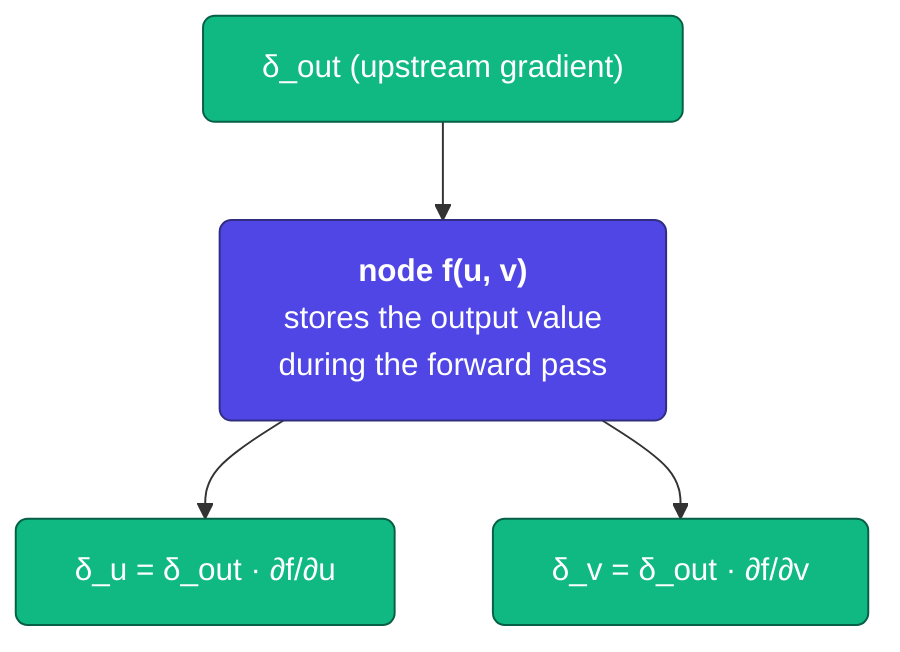
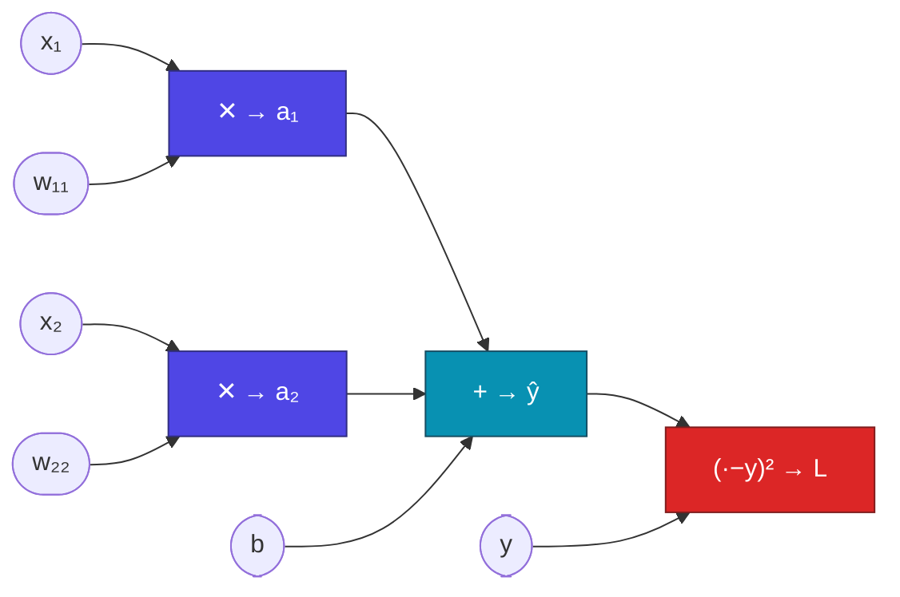
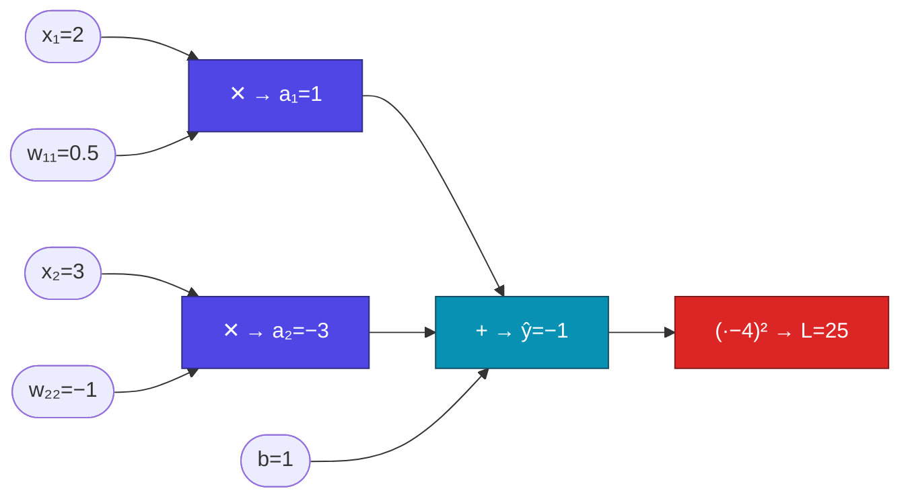
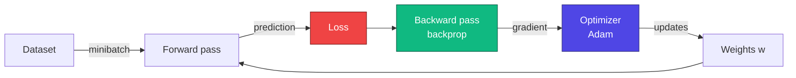
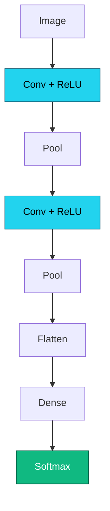

# Lecture 2

## Training Deep Neural Networks

<div class="pt-12">
  <span class="px-2 py-1 rounded cursor-pointer" hover:bg="white op-10">
    Advanced Topics in Artificial Intelligence · UFABC
  </span>
</div>

<div class="abs-br m-6 text-sm opacity-60">
  Adapted from MIT 15.773 (Farias, Ramakrishnan) — OCW
</div>

---
layout: section
---

# Part 1 — Application

A real-world problem as a running example: predicting **heart disease**.

---

# Application: heart disease prediction

<div class="grid grid-cols-2 gap-8 mt-2">

<div>

<v-clicks>

- **Cleveland Clinic Heart Disease** dataset (~300 patients)
- 13 clinical attributes (age, sex, cholesterol, ECG, …)
  → after *one-hot encoding*: **29 inputs**
- Binary output: was the patient diagnosed?
- **Network**: 1 hidden layer (16 ReLU) + sigmoid output

</v-clicks>

</div>

<div class="text-sm">

| patient | age | sex | chol. | ... | disease |
|---:|---:|:---:|---:|:---:|:---:|
| 1 | 63 | M | 233 | ... | 0 |
| 2 | 67 | M | 286 | ... | 1 |
| 3 | 67 | M | 229 | ... | 1 |
| 4 | 37 | M | 250 | ... | 0 |
| 5 | 41 | F | 204 | ... | 0 |

</div>

</div>

<div class="mt-4 text-center" v-click>

$$
\underbrace{29 \times 16}_{W^{(1)}} + \underbrace{16}_{b^{(1)}} + \underbrace{16 \times 1}_{W^{(2)}} + \underbrace{1}_{b^{(2)}} = \mathbf{497\ \text{parameters}}
$$

</div>

---

# In code — Keras vs PyTorch

<div class="grid grid-cols-2 gap-4 mt-2">

<div>

**Keras / TensorFlow**

```python
from tensorflow import keras

inp = keras.Input(shape=(29,))
h   = keras.layers.Dense(16, 'relu')(inp)
out = keras.layers.Dense(1, 'sigmoid')(h)
model = keras.Model(inp, out)

model.compile(
  loss='binary_crossentropy',
  optimizer='adam',
)
model.summary()
```

</div>

<div>

**PyTorch**

```python
import torch.nn as nn
import torch.optim as optim

model = nn.Sequential(
    nn.Linear(29, 16),
    nn.ReLU(),
    nn.Linear(16, 1),
    nn.Sigmoid(),
)

criterion = nn.BCELoss()
optimizer = optim.Adam(model.parameters())
print(model)
```

</div>

</div>

<div class="mt-3 grid grid-cols-2 gap-4 text-xs opacity-80">
<div>Keras: declares architecture + <code>compile</code> configures loss and optimizer.</div>
<div>PyTorch: declares architecture + instantiates loss and optimizer separately.</div>
</div>

---
layout: section
---

# Part 2 — Training = Minimizing the *loss*

Finding weights that make the network predict well is an **optimization** problem.

---

# Loss function

<v-clicks>

- Measures the **error** between prediction and ground truth
- Good predictions → **small** loss; perfect model → **zero** loss
- The loss must **match the output type**:

</v-clicks>

<div class="mt-6 grid grid-cols-3 gap-4 max-w-4xl mx-auto" v-click>

<div class="p-4 rounded bg-slate-800/40 text-center">
  <div class="font-bold text-indigo-300">Continuous output</div>
  <div class="mt-2 text-2xl">→ MSE</div>
</div>

<div class="p-4 rounded bg-slate-800/40 text-center">
  <div class="font-bold text-indigo-300">Binary probability</div>
  <div class="mt-2 text-2xl">→ BCE</div>
</div>

<div class="p-4 rounded bg-slate-800/40 text-center">
  <div class="font-bold text-indigo-300">Multiclass</div>
  <div class="mt-2 text-2xl">→ Cross-Entropy</div>
</div>

</div>

---

# MSE and Binary Cross-Entropy

<div class="grid grid-cols-2 gap-8 mt-2">

<div>

**MSE** — numeric outputs:

$$
\mathcal{L}_{\text{MSE}} = \frac{1}{n}\sum_{i=1}^{n}(y_i - \hat y_i)^2
$$

<div class="mt-2">
  <LossPlot kind="mse" />
</div>

</div>

<div>

**BCE** — binary probability:

$$
\ell_i = -y_i \log\hat p_i - (1-y_i)\log(1-\hat p_i)
$$

<div class="mt-2">
  <BCECurves />
</div>

</div>

</div>

<div class="mt-4 text-center text-sm" v-click>

When $y=1$: penalizes low $\hat p$ ($-\log \hat p \to \infty$). When $y=0$: penalizes high $\hat p$.

</div>

---
layout: section
---

# Part 3 — Gradient Descent

How do you minimize a function with thousands of variables?

---

# Gradient descent algorithm

<div class="mt-4 grid grid-cols-2 gap-8">

<div>

The derivative $g'(w)$ indicates the **local slope** — the direction in which $g$ grows.
Moving in the opposite direction leads us to the minimum:

$$
w \;\leftarrow\; w \,-\, \alpha \cdot g'(w)
$$

<v-click>

| sign of $g'(w)$ | action |
|:---:|:---|
| $> 0$ | decrease $w$ |
| $< 0$ | increase $w$ |
| $\approx 0$ | possible minimum |

</v-click>

<div class="mt-4 text-sm opacity-80" v-click>

$\alpha$ = **learning rate** (typically $10^{-3}$ to $10^{-1}$). Idea by Cauchy, 1847 — the same algorithm that trains GPT.

</div>

</div>

<div>
  <GradientDescent1D />
</div>

</div>

---

# Multivariate case and local minima

<div class="grid grid-cols-2 gap-8 mt-4">

<div>

For $\mathbf{w} \in \mathbb{R}^p$, the derivative becomes the **gradient**:

$$
\nabla \mathcal{L}(\mathbf{w}) = \left[\frac{\partial \mathcal{L}}{\partial w_1}, \ldots, \frac{\partial \mathcal{L}}{\partial w_p}\right]
$$

$$
\mathbf{w} \;\leftarrow\; \mathbf{w} \,-\, \alpha\,\nabla \mathcal{L}(\mathbf{w})
$$

<v-click>

In non-convex landscapes, GD can get stuck in **local minima** or **saddle points**. In practice, large networks have so many parameters that "bad" minima are rare.

</v-click>

</div>

<div>
  <GradientDescent2D />
</div>

</div>

---
layout: section
---

# Part 4 — Backpropagation

How do we compute $\nabla \mathcal{L}$ efficiently for **millions** of parameters?

---

# The problem

<v-clicks>

- For GD, we need $\nabla \mathcal{L}(\mathbf{w})$ — **one partial derivative per parameter**
- Computing each derivative independently repeats calculations — **infeasible** for large networks
- Core idea: organize the network's operations as a **computational graph**
  and apply the **chain rule** backwards

</v-clicks>

<div class="mt-8 text-center text-xl" v-click>

**Backpropagation** = chain rule + reuse of intermediate results.

</div>

---

# Computational graph — anatomy of a node

<div class="mt-2 grid grid-cols-2 gap-8">

<div>

<v-clicks>

- Each **operation** in the network (addition, multiplication, activation) is a **node** in the graph
- During the **forward pass**, each node stores its output value
- During the **backward pass**, each node must compute two types of gradient:
  - **local gradient**: $\partial(\text{node output})/\partial(\text{node input})$
  - **global gradient**: passes along the gradient coming from the next node

</v-clicks>

</div>

<div class="mt-2" v-click>



<div class="text-center text-sm mt-2 opacity-80">

Each node multiplies the incoming gradient ($\delta_\text{out}$) by its **local gradient** ($\partial f/\partial u$, $\partial f/\partial v$) and propagates it backwards.

</div>

</div>

</div>

---

# Graph of our toy network

<div class="mt-2 max-w-4xl mx-auto">

Network: 2 inputs, 1 linear hidden layer, 1 output, MSE loss:

$$a_1 = w_{11}\,x_1 \qquad a_2 = w_{22}\,x_2 \qquad \hat y = b + a_1 + a_2 \qquad \mathcal{L} = (\hat y - y)^2$$

</div>

<div class="mt-4">



</div>

<div class="mt-4 text-center text-sm opacity-80">

Trainable parameters: $w_{11}$, $w_{22}$, $b$. Inputs $x_1, x_2$ and label $y$ are **fixed** in the data.

</div>

---

# Forward pass — numerical example

<div class="mt-2 max-w-4xl mx-auto">

Values for one example: $x_1 = 2,\; x_2 = 3,\; w_{11} = 0.5,\; w_{22} = -1,\; b = 1,\; y = 4$.

</div>

<div class="mt-4 grid grid-cols-2 gap-8">

<div>

**Left-to-right traversal:**

$$
\begin{aligned}
a_1 &= w_{11} \cdot x_1 = 0.5 \times 2 = \mathbf{1}\\
a_2 &= w_{22} \cdot x_2 = -1 \times 3 = \mathbf{-3}\\
\hat y &= b + a_1 + a_2 = 1 + 1 + (-3) = \mathbf{-1}\\
\mathcal{L} &= (\hat y - y)^2 = (-1 - 4)^2 = \mathbf{25}
\end{aligned}
$$

</div>

<div>



</div>

</div>

---

# Local gradients at each node

<div class="mt-2 max-w-4xl mx-auto text-sm">

For each node, we compute the derivative of **its output** with respect to **each of its inputs**:

</div>

<div class="mt-4 max-w-4xl mx-auto">

| Node | Operation | Local gradient |
|:---|:---:|:---|
| `mul1` | $a_1 = w_{11} \cdot x_1$ | $\partial a_1/\partial w_{11} = x_1 = 2$ &nbsp;&nbsp; $\partial a_1/\partial x_1 = w_{11} = 0.5$ |
| `mul2` | $a_2 = w_{22} \cdot x_2$ | $\partial a_2/\partial w_{22} = x_2 = 3$ &nbsp;&nbsp; $\partial a_2/\partial x_2 = w_{22} = -1$ |
| `add` | $\hat y = b + a_1 + a_2$ | $\partial\hat y/\partial b = 1$ &nbsp;&nbsp; $\partial\hat y/\partial a_1 = 1$ &nbsp;&nbsp; $\partial\hat y/\partial a_2 = 1$ |
| `sq` | $\mathcal{L} = (\hat y - y)^2$ | $\partial\mathcal{L}/\partial\hat y = 2(\hat y - y) = 2(-1-4) = -10$ |

</div>

<div class="mt-6 text-center text-sm opacity-80" v-click>

Each local gradient depends only on the **values stored during the forward pass** — that is why we keep everything.

</div>

---

# Backward pass — propagating the gradients

We multiply the **upstream gradient** by the **local gradient**, right to left:

<div class="mt-3 grid grid-cols-2 gap-6 text-sm">

<div>

| Node | Accumulated gradient |
|:---|:---:|
| `sq` → $\hat y$ | $2(\hat y - y) = -10$ |
| `add` → $b$ | $-10 \times 1 = -10$ |
| `add` → $a_1$ | $-10 \times 1 = -10$ |
| `add` → $a_2$ | $-10 \times 1 = -10$ |
| `mul1` → $w_{11}$ | $-10 \times 2 = -20$ |
| `mul2` → $w_{22}$ | $-10 \times 3 = -30$ |

</div>

<div class="flex flex-col gap-3 justify-center">

<div v-click class="p-3 rounded bg-emerald-900/30 border border-emerald-500/30 text-center">

$$\frac{\partial\mathcal{L}}{\partial w_{11}} = -20$$

</div>

<div v-click class="p-3 rounded bg-emerald-900/30 border border-emerald-500/30 text-center">

$$\frac{\partial\mathcal{L}}{\partial w_{22}} = -30$$

</div>

<div v-click class="p-3 rounded bg-emerald-900/30 border border-emerald-500/30 text-center">

$$\frac{\partial\mathcal{L}}{\partial b} = -10$$

</div>

</div>

</div>

---

# Verification: chain rule "by hand"

<div class="mt-2 max-w-3xl mx-auto">

We can confirm with the expanded formula:

$$\mathcal{L} = (b + w_{11}x_1 + w_{22}x_2 - y)^2$$

$$\frac{\partial\mathcal{L}}{\partial w_{11}} = 2(\hat y - y)\cdot x_1 = 2(-5)\cdot 2 = \mathbf{-20}\ ✓$$

</div>

<div class="mt-6 max-w-3xl mx-auto" v-click>

Backprop gives the **same answer**, but with a crucial advantage:

- We **do not expand** the full expression
- Each node contributes with **one simple multiplication**
- Local gradients are **reused** by all paths in the graph
- In deep networks, this saves **billions of operations**

</div>

<div class="mt-4 text-center text-emerald-300 text-sm" v-click>

In practice, TensorFlow/PyTorch build and traverse this graph automatically — you only write the forward pass.

</div>

---

# Forward + backward pass — visualization

<div class="mt-2">
  <BackpropExample />
</div>

<div class="mt-2 text-center text-sm opacity-80">
Forward (blue) computes and stores values. Backward (orange) multiplies local × upstream gradients, layer by layer.
</div>

---

# Automatic differentiation (*autograd*)

<div class="grid grid-cols-2 gap-6 mt-4">

<div>

<v-clicks>

- Implementing backprop by hand is infeasible for real networks
- Frameworks build the **computational graph during the forward pass** and compute all gradients automatically
- Just write the forward — the backward is free
- In **PyTorch**: `loss.backward()` triggers autograd
- In **Keras**: `model.fit()` calls `tf.GradientTape` internally

</v-clicks>

</div>

<div>

```python
import torch

# same values as the previous example
x = torch.tensor([2.0], requires_grad=True)
w = torch.tensor([0.5], requires_grad=True)
b = torch.tensor([1.0], requires_grad=True)
y_real = torch.tensor([4.0])

# forward — graph is built here
a  = w * x
yh = b + a
loss = (yh - y_real) ** 2

# backward — traverses the graph automatically
loss.backward()

print(w.grad)   # ∂loss/∂w → tensor([-20.])
print(b.grad)   # ∂loss/∂b → tensor([-10.])
```

<div class="text-xs opacity-70 mt-2">

The gradients match what we computed on paper. ✓

</div>

</div>

</div>

---

# Updating the weights

<div class="mt-4 max-w-3xl mx-auto text-center">

With the gradients in hand, GD updates **all parameters** simultaneously:

$$
\begin{aligned}
w_{11} &\leftarrow 0.5 - \alpha \cdot (-20) = 0.5 + 20\alpha \\
w_{22} &\leftarrow -1 - \alpha \cdot (-30) = -1 + 30\alpha \\
b &\leftarrow 1 - \alpha \cdot (-10) = 1 + 10\alpha
\end{aligned}
$$

</div>

<div class="mt-6 max-w-3xl mx-auto" v-click>

The negative gradients cause the weights to **increase** — which makes sense, since $\hat y = -1$ is far below $y = 4$. In a real network, we repeat this cycle for **millions of weights**, **per minibatch**, **per epoch**.

</div>

---

# Why GPUs?

<div class="grid grid-cols-2 gap-10 mt-4">

<div>

<v-clicks>

- The central step of backprop is **matrix multiplication** (gradient of a Dense layer)
- GPUs were created for gaming: they excel at **parallel matrix operations**
- Backprop + GPU = gradient of a huge network in **seconds**
- Today TPUs and dedicated accelerators (Google, Apple, NVIDIA) take the idea even further

</v-clicks>

</div>

<div class="text-center">

<div class="text-8xl">🎮</div>
<div class="mt-2 text-sm opacity-70">GPU for gaming…</div>
<div class="mt-4 text-5xl">→</div>
<div class="mt-4 text-8xl">🧠</div>
<div class="mt-2 text-sm opacity-70">…engine of deep learning</div>

</div>

</div>

---
layout: section
---

# Part 5 — SGD and Optimizers

What happens when the dataset has millions of examples?

---

# Mini-batches and SGD

<div class="grid grid-cols-2 gap-8 mt-4">

<div>

<v-clicks>

- The loss is a **sum** over all $n$ examples — computing the exact gradient requires going through everything
- Solution: at each iteration, **randomly** select a subset of ~32–256 examples (**minibatch**)
- The gradient estimated on the minibatch is a valid **approximation** — and works very well
- The introduced noise can even **help** escape bad minima
- This is **SGD** (Stochastic Gradient Descent)

</v-clicks>

</div>

<div>
  <MiniBatch />
</div>

</div>

---

# Epochs, batches, and optimizers

<div class="grid grid-cols-2 gap-8 mt-4">

<div>

**Epoch** = 1 complete pass through the training set.

$$\text{batches/epoch} = \left\lceil\frac{n}{\text{batch size}}\right\rceil$$

<div class="text-sm mt-2 opacity-80">

*Example — heart disease:* 194 examples, batch 32 → 7 batches per epoch (6×32 + 2 = 194).

</div>

</div>

<div>

**Adam** — the default optimizer in DL:

<v-clicks>

- Adds **momentum** (inertia in consistent directions)
- **Adaptive learning rates** per parameter
- Bias correction in the first steps
- In Keras: `optimizer='adam'` and done

</v-clicks>

</div>

</div>

---

# Complete training flow



<div class="mt-6 text-center text-lg" v-click>

Each loop iteration = one **optimization step**.
Multiple passes through the dataset = **epochs**.

</div>

---
layout: section
---

# Part 6 — Training in Practice

*Overfitting*, regularization, and the complete checklist.

---

# Underfitting × Overfitting

<div class="grid grid-cols-2 gap-8 mt-4">

<div>
  <OverfittingCurve />
</div>

<div class="flex flex-col gap-4 justify-center text-sm">

<div class="p-4 rounded bg-amber-500/10 border border-amber-500/30">
<strong class="text-amber-300">Underfitting</strong><br/>
Insufficient capacity. High error on both training <em>and</em> validation.
</div>

<div class="p-4 rounded bg-rose-500/10 border border-rose-500/30">
<strong class="text-rose-300">Overfitting</strong><br/>
Memorizes the training set (including noise). Low training error, high validation error.
</div>

</div>

</div>

---

# Regularization: Early Stopping and Dropout

<div class="grid grid-cols-2 gap-8 mt-2">

<div>

**Early Stopping**

<v-clicks>

- Monitor the **validation** loss at each epoch
- Stop when it stops decreasing (even if the training loss keeps falling)
- Save the weights from the **best** moment

</v-clicks>

<div class="mt-4 text-xs opacity-80" v-click>

```python
es = keras.callbacks.EarlyStopping(
  patience=10,
  restore_best_weights=True
)
```

</div>

</div>

<div>

**Dropout**

<v-clicks>

- At each training step, randomly "switches off" a fraction $p$ of the neurons
- Forces the network to **distribute** learning
- Disabled during inference (validation/test)

</v-clicks>

<div class="mt-4 text-xs opacity-80" v-click>

```python
keras.layers.Dropout(0.5)  # switches off 50% per step
```

</div>

</div>

</div>


---

# Full training — Keras

```python {all|1-6|8-12|14-21|all}
# architecture
inp = keras.Input(shape=(29,))
h   = keras.layers.Dense(16, activation='relu')(inp)
h   = keras.layers.Dropout(0.3)(h)
out = keras.layers.Dense(1,  activation='sigmoid')(h)
model = keras.Model(inp, out)

# compile
model.compile(
  loss='binary_crossentropy',
  optimizer='adam',
  metrics=['accuracy'],
)

# train
es = keras.callbacks.EarlyStopping(patience=10, restore_best_weights=True)
hist = model.fit(
  X_train, y_train,
  validation_data=(X_val, y_val),
  epochs=200, batch_size=32,
  callbacks=[es],
)
```

---

# Full training — PyTorch

```python {all|1-3|5-10|12-15|all}
# same architecture (nn.Sequential equivalent to the previous slide)
criterion = nn.BCELoss()
optimizer = optim.Adam(model.parameters())

best_val, patience, wait, best_w = float('inf'), 10, 0, None
for epoch in range(200):
    model.train()
    optimizer.zero_grad()
    criterion(model(X_train), y_train).backward()
    optimizer.step()
    model.eval()
    with torch.no_grad():
        val = criterion(model(X_val), y_val).item()
    if val < best_val: best_val, wait, best_w = val, 0, model.state_dict().copy()
    elif (wait := wait + 1) >= patience: break
model.load_state_dict(best_w)
```

<div class="mt-2 text-xs opacity-70">

Explicit loop: <code>zero_grad → forward → backward → step</code>. More verbose than <code>model.fit()</code>, but makes every operation visible.

</div>

---

# Checklist for training a DNN

<v-clicks>

1. **Prepare data** — encoding, normalization, train/val/test split
2. **Design the network** — number of layers, neurons, activations
3. **Choose the output** appropriate to the problem (sigmoid, softmax, linear)
4. **Choose the loss** that matches the output
5. **Optimizer** (Adam) + learning rate
6. **Regularization** (early stopping + dropout)
7. **Compile and train** with Keras or write the loop in PyTorch
8. **Evaluate** on validation and, at the end, on test

</v-clicks>

---
layout: center
class: text-center
---

# Summary

<div class="mt-4 grid grid-cols-2 gap-3 max-w-4xl mx-auto text-left text-sm">

<div class="p-3 rounded bg-slate-800/40">
<strong class="text-indigo-300">Loss</strong> — MSE (regression), BCE (binary), Cross-Entropy (multiclass)
</div>

<div class="p-3 rounded bg-slate-800/40">
<strong class="text-indigo-300">Gradient Descent</strong> — moves opposite to the gradient, step α (learning rate)
</div>

<div class="p-3 rounded bg-slate-800/40">
<strong class="text-indigo-300">Computational graph</strong> — each node stores value + local gradient
</div>

<div class="p-3 rounded bg-slate-800/40">
<strong class="text-indigo-300">Backprop</strong> — multiplies upstream × local gradient, right to left
</div>

<div class="p-3 rounded bg-slate-800/40">
<strong class="text-indigo-300">SGD / Adam</strong> — minibatch + momentum + adaptive learning rate
</div>

<div class="p-3 rounded bg-slate-800/40">
<strong class="text-indigo-300">Early stopping + Dropout</strong> — essential regularization against overfitting
</div>

</div>

---

# Next lecture

<div class="mt-6 grid grid-cols-2 gap-8 max-w-4xl mx-auto">

<div>

<v-clicks>

- **Tensors and images** — how to represent pixels in N-dimensional arrays
- **Why dense layers are not enough** — too many parameters, no spatial structure
- **Convolutional filters** — edge, texture, and visual pattern detection
- **Pooling** — dimensionality reduction while preserving information
- **CNNs** — Conv + Pool + FC blocks
- **Transfer Learning** — reusing pre-trained models (ResNet, ImageNet)

</v-clicks>

</div>

<div>



</div>

</div>

---
layout: center
class: text-center
---

# Thank you! Questions?

<div class="mt-6 text-sm opacity-70">

Freely adapted from *15.773 Hands-on Deep Learning — Lectures 02 & 03*
(MIT OpenCourseWare, 2024) — original English material by Vivek Farias and
Rama Ramakrishnan, distributed under the terms of MIT OCW.

</div>

<div class="mt-2 text-xs opacity-60">
For more information: https://ocw.mit.edu/terms
</div>
