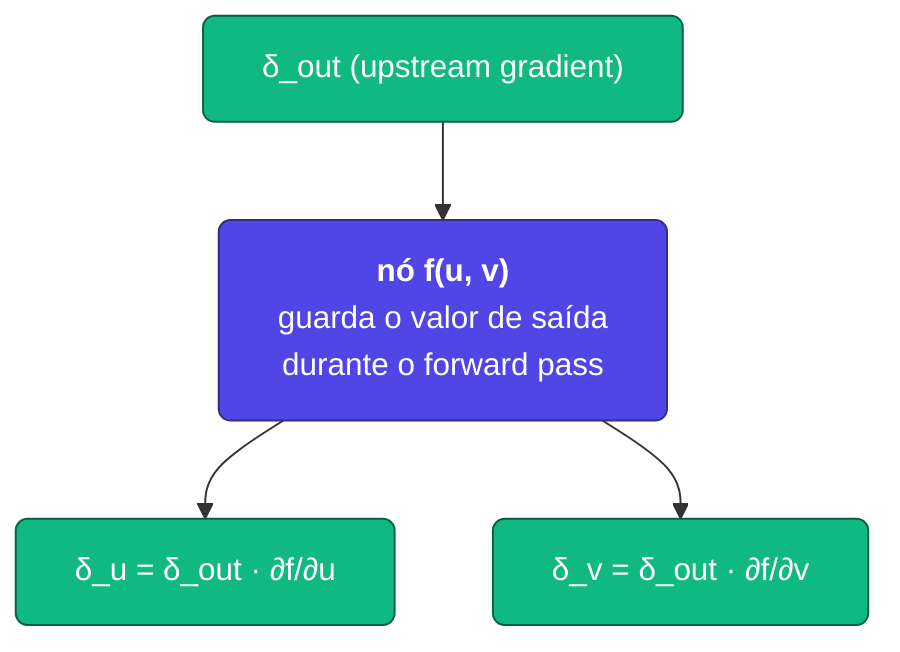
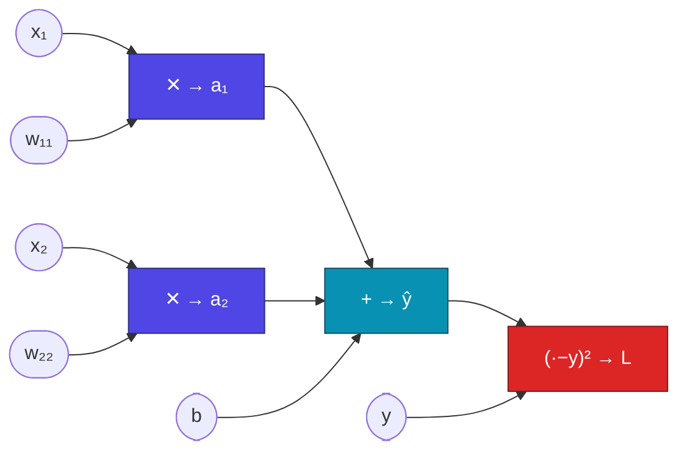
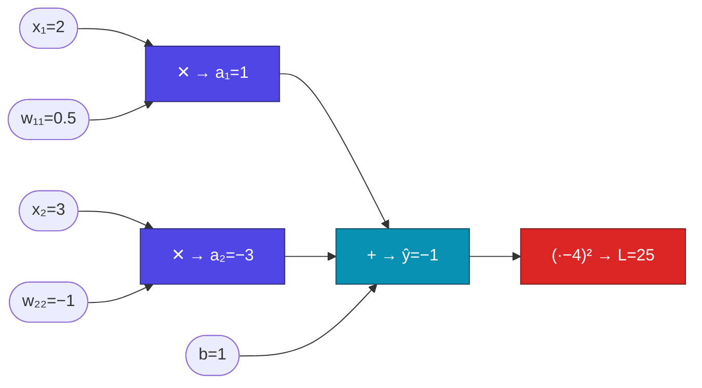
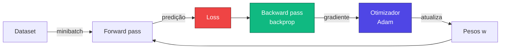
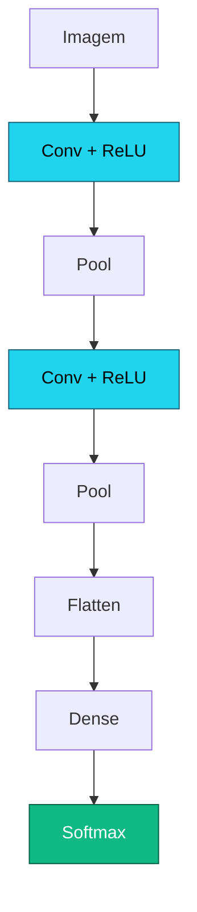

# Aula 2

## Treinando Redes Neurais Profundas

<div class="pt-12">
  <span class="px-2 py-1 rounded cursor-pointer" hover:bg="white op-10">
    Tópicos Avançados em Inteligência Artificial · UFABC
  </span>
</div>

<div class="abs-br m-6 text-sm opacity-60">
  Adaptado de MIT 15.773 (Farias, Ramakrishnan) — OCW
</div>

---
layout: section
---

# Parte 1 — Aplicação

Um problema real como fio condutor: prever **doença cardíaca**.

---

# Aplicação: previsão de doença cardíaca

<div class="grid grid-cols-2 gap-8 mt-2">

<div>

<v-clicks>

- Dataset **Cleveland Clinic Heart Disease** (~300 pacientes)
- 13 atributos clínicos (idade, sexo, colesterol, ECG, …)
  → após *one-hot encoding*: **29 entradas**
- Saída binária: paciente foi diagnosticado?
- **Rede**: 1 camada oculta (16 ReLU) + saída sigmoide

</v-clicks>

</div>

<div class="text-sm">

| paciente | idade | sexo | colest. | ... | doença |
|---:|---:|:---:|---:|:---:|:---:|
| 1 | 63 | M | 233 | ... | 0 |
| 2 | 67 | M | 286 | ... | 1 |
| 3 | 67 | M | 229 | ... | 1 |
| 4 | 37 | M | 250 | ... | 0 |
| 5 | 41 | F | 204 | ... | 0 |

</div>

</div>

<div class="mt-4 text-center" v-click>

$$
\underbrace{29 \times 16}_{W^{(1)}} + \underbrace{16}_{b^{(1)}} + \underbrace{16 \times 1}_{W^{(2)}} + \underbrace{1}_{b^{(2)}} = \mathbf{497\ \text{parâmetros}}
$$

</div>

---

# Em código — Keras vs PyTorch

<div class="grid grid-cols-2 gap-4 mt-2">

<div>

**Keras / TensorFlow**

```python
from tensorflow import keras

inp = keras.Input(shape=(29,))
h   = keras.layers.Dense(16, 'relu')(inp)
out = keras.layers.Dense(1, 'sigmoid')(h)
model = keras.Model(inp, out)

model.compile(
  loss='binary_crossentropy',
  optimizer='adam',
)
model.summary()
```

</div>

<div>

**PyTorch**

```python
import torch.nn as nn
import torch.optim as optim

model = nn.Sequential(
    nn.Linear(29, 16),
    nn.ReLU(),
    nn.Linear(16, 1),
    nn.Sigmoid(),
)

criterion = nn.BCELoss()
optimizer = optim.Adam(model.parameters())
print(model)
```

</div>

</div>

<div class="mt-3 grid grid-cols-2 gap-4 text-xs opacity-80">
<div>Keras: declara arquitetura + <code>compile</code> configura loss e otimizador.</div>
<div>PyTorch: declara arquitetura + instancia loss e otimizador separadamente.</div>
</div>

---
layout: section
---

# Parte 2 — Treinar = Minimizar a *loss*

Encontrar pesos que façam a rede prever bem é um problema de **otimização**.

---

# Função de perda (loss)

<v-clicks>

- Mede o **erro** entre predição e valor real
- Predições boas → loss **pequena**; modelo perfeito → loss **zero**
- A loss deve **casar com o tipo de saída**:

</v-clicks>

<div class="mt-6 grid grid-cols-3 gap-4 max-w-4xl mx-auto" v-click>

<div class="p-4 rounded bg-slate-800/40 text-center">
  <div class="font-bold text-indigo-300">Saída contínua</div>
  <div class="mt-2 text-2xl">→ MSE</div>
</div>

<div class="p-4 rounded bg-slate-800/40 text-center">
  <div class="font-bold text-indigo-300">Prob. binária</div>
  <div class="mt-2 text-2xl">→ BCE</div>
</div>

<div class="p-4 rounded bg-slate-800/40 text-center">
  <div class="font-bold text-indigo-300">Multiclasse</div>
  <div class="mt-2 text-2xl">→ Cross-Entropy</div>
</div>

</div>

---

# MSE e Binary Cross-Entropy

<div class="grid grid-cols-2 gap-8 mt-2">

<div>

**MSE** — saídas numéricas:

$$
\mathcal{L}_{\text{MSE}} = \frac{1}{n}\sum_{i=1}^{n}(y_i - \hat y_i)^2
$$

<div class="mt-2">
  <LossPlot kind="mse" />
</div>

</div>

<div>

**BCE** — probabilidade binária:

$$
\ell_i = -y_i \log\hat p_i - (1-y_i)\log(1-\hat p_i)
$$

<div class="mt-2">
  <BCECurves />
</div>

</div>

</div>

<div class="mt-4 text-center text-sm" v-click>

Quando $y=1$: penaliza $\hat p$ baixo ($-\log \hat p \to \infty$). Quando $y=0$: penaliza $\hat p$ alto.

</div>

---
layout: section
---

# Parte 3 — Gradiente Descendente

Como minimizar uma função com milhares de variáveis?

---

# Algoritmo do gradiente descendente

<div class="mt-4 grid grid-cols-2 gap-8">

<div>

A derivada $g'(w)$ indica a **inclinação local** — para onde $g$ cresce.
Caminhar na direção oposta nos leva ao mínimo:

$$
w \;\leftarrow\; w \,-\, \alpha \cdot g'(w)
$$

<v-click>

| sinal de $g'(w)$ | ação |
|:---:|:---|
| $> 0$ | diminuir $w$ |
| $< 0$ | aumentar $w$ |
| $\approx 0$ | possível mínimo |

</v-click>

<div class="mt-4 text-sm opacity-80" v-click>

$\alpha$ = **taxa de aprendizado** (tipicamente $10^{-3}$ a $10^{-1}$). Ideia de Cauchy, 1847 — o mesmo algoritmo que treina o GPT.

</div>

</div>

<div>
  <GradientDescent1D />
</div>

</div>

---

# Caso multivariável e mínimos locais

<div class="grid grid-cols-2 gap-8 mt-4">

<div>

Para $\mathbf{w} \in \mathbb{R}^p$, a derivada vira o **gradiente**:

$$
\nabla \mathcal{L}(\mathbf{w}) = \left[\frac{\partial \mathcal{L}}{\partial w_1}, \ldots, \frac{\partial \mathcal{L}}{\partial w_p}\right]
$$

$$
\mathbf{w} \;\leftarrow\; \mathbf{w} \,-\, \alpha\,\nabla \mathcal{L}(\mathbf{w})
$$

<v-click>

Em paisagens não convexas, o GD pode parar em **mínimos locais** ou **pontos de sela**. Na prática, redes grandes têm tantos parâmetros que mínimos "ruins" são raros.

</v-click>

</div>

<div>
  <GradientDescent2D />
</div>

</div>

---
layout: section
---

# Parte 4 — Backpropagation

Como calcular $\nabla \mathcal{L}$ de forma eficiente para **milhões** de parâmetros?

---

# O problema

<v-clicks>

- Para GD, precisamos de $\nabla \mathcal{L}(\mathbf{w})$ — **uma derivada parcial por parâmetro**
- Calcular cada derivada isoladamente repete cálculos — **inviável** para redes grandes
- Ideia central: organizar as operações da rede como um **grafo computacional**
  e aplicar a **regra da cadeia** de trás para frente

</v-clicks>

<div class="mt-8 text-center text-xl" v-click>

**Backpropagation** = regra da cadeia + reaproveitamento de resultados intermediários.

</div>

---

# Grafo computacional — anatomia de um nó

<div class="mt-2 grid grid-cols-2 gap-8">

<div>

<v-clicks>

- Cada **operação** da rede (soma, produto, ativação) é um **nó** do grafo
- Durante o **forward pass**, cada nó armazena seu valor de saída
- Durante o **backward pass**, cada nó precisa calcular dois tipos de gradiente:
  - **gradiente local**: $\partial(\text{saída do nó})/\partial(\text{entrada do nó})$
  - **gradiente global**: repassa o gradiente vindo do nó seguinte

</v-clicks>

</div>

<div class="mt-2" v-click>



<div class="text-center text-sm mt-2 opacity-80">

Cada nó multiplica o gradiente que chega ($\delta_\text{out}$) pelo seu **gradiente local** ($\partial f/\partial u$, $\partial f/\partial v$) e propaga para trás.

</div>

</div>

</div>

---

# Grafo da nossa rede-brinquedo

<div class="mt-2 max-w-4xl mx-auto">

Rede: 2 entradas, 1 camada oculta linear, 1 saída, loss MSE:

$$a_1 = w_{11}\,x_1 \qquad a_2 = w_{22}\,x_2 \qquad \hat y = b + a_1 + a_2 \qquad \mathcal{L} = (\hat y - y)^2$$

</div>

<div class="mt-4">



</div>

<div class="mt-4 text-center text-sm opacity-80">

Parâmetros treináveis: $w_{11}$, $w_{22}$, $b$. Entradas $x_1, x_2$ e rótulo $y$ são **fixos** nos dados.

</div>

---

# Forward pass — exemplo numérico

<div class="mt-2 max-w-4xl mx-auto">

Valores para um exemplo: $x_1 = 2,\; x_2 = 3,\; w_{11} = 0.5,\; w_{22} = -1,\; b = 1,\; y = 4$.

</div>

<div class="mt-4 grid grid-cols-2 gap-8">

<div>

**Percurso da esquerda para a direita:**

$$
\begin{aligned}
a_1 &= w_{11} \cdot x_1 = 0.5 \times 2 = \mathbf{1}\\
a_2 &= w_{22} \cdot x_2 = -1 \times 3 = \mathbf{-3}\\
\hat y &= b + a_1 + a_2 = 1 + 1 + (-3) = \mathbf{-1}\\
\mathcal{L} &= (\hat y - y)^2 = (-1 - 4)^2 = \mathbf{25}
\end{aligned}
$$

</div>

<div>



</div>

</div>

---

# Gradientes locais em cada nó

<div class="mt-2 max-w-4xl mx-auto text-sm">

Para cada nó, calculamos a derivada da **sua saída** em relação a **cada uma de suas entradas**:

</div>

<div class="mt-4 max-w-4xl mx-auto">

| Nó | Operação | Gradiente local |
|:---|:---:|:---|
| `mul1` | $a_1 = w_{11} \cdot x_1$ | $\partial a_1/\partial w_{11} = x_1 = 2$ &nbsp;&nbsp; $\partial a_1/\partial x_1 = w_{11} = 0.5$ |
| `mul2` | $a_2 = w_{22} \cdot x_2$ | $\partial a_2/\partial w_{22} = x_2 = 3$ &nbsp;&nbsp; $\partial a_2/\partial x_2 = w_{22} = -1$ |
| `add` | $\hat y = b + a_1 + a_2$ | $\partial\hat y/\partial b = 1$ &nbsp;&nbsp; $\partial\hat y/\partial a_1 = 1$ &nbsp;&nbsp; $\partial\hat y/\partial a_2 = 1$ |
| `sq` | $\mathcal{L} = (\hat y - y)^2$ | $\partial\mathcal{L}/\partial\hat y = 2(\hat y - y) = 2(-1-4) = -10$ |

</div>

<div class="mt-6 text-center text-sm opacity-80" v-click>

Cada gradiente local depende apenas dos **valores armazenados no forward pass** — por isso guardamos tudo.

</div>

---

# Backward pass — propagando os gradientes

Multiplicamos o **gradiente upstream** pelo **gradiente local**, da direita para a esquerda:

<div class="mt-3 grid grid-cols-2 gap-6 text-sm">

<div>

| Nó | Gradiente acumulado |
|:---|:---:|
| `sq` → $\hat y$ | $2(\hat y - y) = -10$ |
| `add` → $b$ | $-10 \times 1 = -10$ |
| `add` → $a_1$ | $-10 \times 1 = -10$ |
| `add` → $a_2$ | $-10 \times 1 = -10$ |
| `mul1` → $w_{11}$ | $-10 \times 2 = -20$ |
| `mul2` → $w_{22}$ | $-10 \times 3 = -30$ |

</div>

<div class="flex flex-col gap-3 justify-center">

<div v-click class="p-3 rounded bg-emerald-900/30 border border-emerald-500/30 text-center">

$$\frac{\partial\mathcal{L}}{\partial w_{11}} = -20$$

</div>

<div v-click class="p-3 rounded bg-emerald-900/30 border border-emerald-500/30 text-center">

$$\frac{\partial\mathcal{L}}{\partial w_{22}} = -30$$

</div>

<div v-click class="p-3 rounded bg-emerald-900/30 border border-emerald-500/30 text-center">

$$\frac{\partial\mathcal{L}}{\partial b} = -10$$

</div>

</div>

</div>

---

# Verificação: regra da cadeia "à mão"

<div class="mt-2 max-w-3xl mx-auto">

Podemos confirmar com a fórmula expandida:

$$\mathcal{L} = (b + w_{11}x_1 + w_{22}x_2 - y)^2$$

$$\frac{\partial\mathcal{L}}{\partial w_{11}} = 2(\hat y - y)\cdot x_1 = 2(-5)\cdot 2 = \mathbf{-20}\ ✓$$

</div>

<div class="mt-6 max-w-3xl mx-auto" v-click>

O backprop dá **a mesma resposta**, mas com uma vantagem crucial:

- **Não expandimos** a expressão completa
- Cada nó contribui com **uma multiplicação simples**
- Os gradientes locais são **reaproveitados** por todos os caminhos do grafo
- Em redes profundas, isso economiza **bilhões de operações**

</div>

<div class="mt-4 text-center text-emerald-300 text-sm" v-click>

Na prática, o TensorFlow/PyTorch constroem e percorrem esse grafo automaticamente — você só escreve o forward pass.

</div>

---

# Forward + backward pass — visualização

<div class="mt-2">
  <BackpropExample />
</div>

<div class="mt-2 text-center text-sm opacity-80">
Forward (azul) calcula e armazena valores. Backward (laranja) multiplica gradientes locais × upstream, camada por camada.
</div>

---

# Diferenciação automática (*autograd*)

<div class="grid grid-cols-2 gap-6 mt-4">

<div>

<v-clicks>

- Implementar backprop à mão é inviável para redes reais
- Os frameworks constroem o **grafo computacional durante o forward pass** e calculam todos os gradientes automaticamente
- Basta escrever o forward — o backward é gratuito
- No **PyTorch**: `loss.backward()` dispara o autograd
- No **Keras**: `model.fit()` chama `tf.GradientTape` internamente

</v-clicks>

</div>

<div>

```python
import torch

# mesmos valores do exemplo anterior
x = torch.tensor([2.0], requires_grad=True)
w = torch.tensor([0.5], requires_grad=True)
b = torch.tensor([1.0], requires_grad=True)
y_real = torch.tensor([4.0])

# forward — grafo é construído aqui
a  = w * x
yh = b + a
loss = (yh - y_real) ** 2

# backward — percorre o grafo automaticamente
loss.backward()

print(w.grad)   # ∂loss/∂w → tensor([-20.])
print(b.grad)   # ∂loss/∂b → tensor([-10.])
```

<div class="text-xs opacity-70 mt-2">

Os gradientes batem com o que calculamos no papel. ✓

</div>

</div>

</div>

---

# Atualizando os pesos

<div class="mt-4 max-w-3xl mx-auto text-center">

Com os gradientes em mãos, GD atualiza **todos os parâmetros** simultaneamente:

$$
\begin{aligned}
w_{11} &\leftarrow 0.5 - \alpha \cdot (-20) = 0.5 + 20\alpha \\
w_{22} &\leftarrow -1 - \alpha \cdot (-30) = -1 + 30\alpha \\
b &\leftarrow 1 - \alpha \cdot (-10) = 1 + 10\alpha
\end{aligned}
$$

</div>

<div class="mt-6 max-w-3xl mx-auto" v-click>

Os gradientes negativos fazem os pesos **aumentar** — faz sentido, pois $\hat y = -1$ está muito abaixo de $y = 4$. Em uma rede real, repetimos esse ciclo para **milhões de pesos**, **por minibatch**, **por época**.

</div>

---

# Por que GPUs?

<div class="grid grid-cols-2 gap-10 mt-4">

<div>

<v-clicks>

- O passo central do backprop é **multiplicar matrizes** (gradiente de uma camada Dense)
- GPUs foram criadas para jogos: excelentes em **operações matriciais paralelas**
- Backprop + GPU = gradiente de uma rede enorme em **segundos**
- Hoje TPUs e aceleradores dedicados (Google, Apple, NVIDIA) levam a ideia ainda mais longe

</v-clicks>

</div>

<div class="text-center">

<div class="text-8xl">🎮</div>
<div class="mt-2 text-sm opacity-70">GPU para jogos…</div>
<div class="mt-4 text-5xl">→</div>
<div class="mt-4 text-8xl">🧠</div>
<div class="mt-2 text-sm opacity-70">…motor do deep learning</div>

</div>

</div>

---
layout: section
---

# Parte 5 — SGD e Otimizadores

E quando o dataset tem milhões de exemplos?

---

# Mini-batches e SGD

<div class="grid grid-cols-2 gap-8 mt-4">

<div>

<v-clicks>

- A loss é uma **soma** sobre todos os $n$ exemplos — calcular o gradiente exato exige percorrer tudo
- Solução: a cada iteração escolhe-se **aleatoriamente** um subconjunto de ~32–256 exemplos (**minibatch**)
- O gradiente estimado no minibatch é uma **aproximação** válida — e funciona muito bem
- O ruído introduzido pode até **ajudar** a escapar de mínimos ruins
- Isso é o **SGD** (Stochastic Gradient Descent)

</v-clicks>

</div>

<div>
  <MiniBatch />
</div>

</div>

---

# Épocas, batches e otimizadores

<div class="grid grid-cols-2 gap-8 mt-4">

<div>

**Época** = 1 passada completa pelo treino.

$$\text{batches/época} = \left\lceil\frac{n}{\text{batch size}}\right\rceil$$

<div class="text-sm mt-2 opacity-80">

*Exemplo — doença cardíaca:* 194 exemplos, batch 32 → 7 batches por época (6×32 + 2 = 194).

</div>

</div>

<div>

**Adam** — o otimizador padrão em DL:

<v-clicks>

- Adiciona **momento** (inércia nas direções consistentes)
- Taxas de aprendizado **adaptativas por parâmetro**
- Correção de viés nos primeiros passos
- Em Keras: `optimizer='adam'` e pronto

</v-clicks>

</div>

</div>

---

# Fluxo de treinamento completo



<div class="mt-6 text-center text-lg" v-click>

Cada volta no laço = um **passo de otimização**.
Várias passadas pelo dataset = **épocas**.

</div>

---
layout: section
---

# Parte 6 — Treinamento na Prática

*Overfitting*, regularização e o checklist completo.

---

# Underfitting × Overfitting

<div class="grid grid-cols-2 gap-8 mt-4">

<div>
  <OverfittingCurve />
</div>

<div class="flex flex-col gap-4 justify-center text-sm">

<div class="p-4 rounded bg-amber-500/10 border border-amber-500/30">
<strong class="text-amber-300">Underfitting</strong><br/>
Capacidade insuficiente. Erro alto em treino <em>e</em> validação.
</div>

<div class="p-4 rounded bg-rose-500/10 border border-rose-500/30">
<strong class="text-rose-300">Overfitting</strong><br/>
Decora o treino (incluindo ruído). Erro baixo em treino, alto em validação.
</div>

</div>

</div>

---

# Regularização: Early Stopping e Dropout

<div class="grid grid-cols-2 gap-8 mt-2">

<div>

**Early Stopping**

<v-clicks>

- Monitore a loss de **validação** a cada época
- Pare quando ela parar de cair (mesmo que a de treino continue)
- Salve os pesos do **melhor** momento

</v-clicks>

<div class="mt-4 text-xs opacity-80" v-click>

```python
es = keras.callbacks.EarlyStopping(
  patience=10,
  restore_best_weights=True
)
```

</div>

</div>

<div>

**Dropout**

<v-clicks>

- A cada passo de treino, "desliga" aleatoriamente uma fração $p$ dos neurônios
- Força a rede a **distribuir** o aprendizado
- Desativado em inferência (validação/teste)

</v-clicks>

<div class="mt-4 text-xs opacity-80" v-click>

```python
keras.layers.Dropout(0.5)  # desliga 50% por passo
```

</div>

</div>

</div>


---

# Treino completo — Keras

```python {all|1-6|8-12|14-21|all}
# arquitetura
inp = keras.Input(shape=(29,))
h   = keras.layers.Dense(16, activation='relu')(inp)
h   = keras.layers.Dropout(0.3)(h)
out = keras.layers.Dense(1,  activation='sigmoid')(h)
model = keras.Model(inp, out)

# compilar
model.compile(
  loss='binary_crossentropy',
  optimizer='adam',
  metrics=['accuracy'],
)

# treinar
es = keras.callbacks.EarlyStopping(patience=10, restore_best_weights=True)
hist = model.fit(
  X_train, y_train,
  validation_data=(X_val, y_val),
  epochs=200, batch_size=32,
  callbacks=[es],
)
```

---

# Treino completo — PyTorch

```python {all|1-3|5-10|12-15|all}
# mesma arquitetura (nn.Sequential equivalente ao slide anterior)
criterion = nn.BCELoss()
optimizer = optim.Adam(model.parameters())

best_val, patience, wait, best_w = float('inf'), 10, 0, None
for epoch in range(200):
    model.train()
    optimizer.zero_grad()
    criterion(model(X_train), y_train).backward()
    optimizer.step()
    model.eval()
    with torch.no_grad():
        val = criterion(model(X_val), y_val).item()
    if val < best_val: best_val, wait, best_w = val, 0, model.state_dict().copy()
    elif (wait := wait + 1) >= patience: break
model.load_state_dict(best_w)
```

<div class="mt-2 text-xs opacity-70">

Laço explícito: <code>zero_grad → forward → backward → step</code>. Mais verboso que <code>model.fit()</code>, mas deixa cada operação visível.

</div>

---

# Checklist para treinar uma DNN

<v-clicks>

1. **Preparar dados** — encoding, normalização, split treino/val/teste
2. **Projetar a rede** — número de camadas, neurônios, ativações
3. **Escolher a saída** adequada ao problema (sigmoide, softmax, linear)
4. **Escolher a loss** que casa com a saída
5. **Otimizador** (Adam) + taxa de aprendizado
6. **Regularização** (early stopping + dropout)
7. **Compilar e treinar** com Keras ou escrever o laço em PyTorch
8. **Avaliar** em validação e, no final, em teste

</v-clicks>

---
layout: center
class: text-center
---

# Recapitulando

<div class="mt-4 grid grid-cols-2 gap-3 max-w-4xl mx-auto text-left text-sm">

<div class="p-3 rounded bg-slate-800/40">
<strong class="text-indigo-300">Loss</strong> — MSE (regressão), BCE (binário), Cross-Entropy (multiclasse)
</div>

<div class="p-3 rounded bg-slate-800/40">
<strong class="text-indigo-300">Gradient Descent</strong> — caminha oposto ao gradiente, passo α (learning rate)
</div>

<div class="p-3 rounded bg-slate-800/40">
<strong class="text-indigo-300">Grafo computacional</strong> — cada nó armazena valor + gradiente local
</div>

<div class="p-3 rounded bg-slate-800/40">
<strong class="text-indigo-300">Backprop</strong> — multiplica gradiente upstream × local, da direita para esquerda
</div>

<div class="p-3 rounded bg-slate-800/40">
<strong class="text-indigo-300">SGD / Adam</strong> — minibatch + momento + learning rate adaptativo
</div>

<div class="p-3 rounded bg-slate-800/40">
<strong class="text-indigo-300">Early stopping + Dropout</strong> — regularização essencial contra overfitting
</div>

</div>

---

# Próxima aula

<div class="mt-6 grid grid-cols-2 gap-8 max-w-4xl mx-auto">

<div>

<v-clicks>

- **Tensores e imagens** — como representar pixels em arrays N-dimensionais
- **Por que camadas densas não bastam** — parâmetros demais, sem estrutura espacial
- **Filtros convolucionais** — detecção de bordas, texturas e padrões visuais
- **Pooling** — redução de dimensão com preservação de informação
- **CNNs** — blocos Conv + Pool + FC
- **Transfer Learning** — reutilizar modelos pré-treinados (ResNet, ImageNet)

</v-clicks>

</div>

<div>



</div>

</div>

---
layout: center
class: text-center
---

# Obrigado! Perguntas?

<div class="mt-6 text-sm opacity-70">

Adaptado livremente de *15.773 Hands-on Deep Learning — Lectures 02 & 03*
(MIT OpenCourseWare, 2024) — material original em inglês de Vivek Farias e
Rama Ramakrishnan, distribuído sob os termos do MIT OCW.

</div>

<div class="mt-2 text-xs opacity-60">
Para mais informações: https://ocw.mit.edu/terms
</div>

