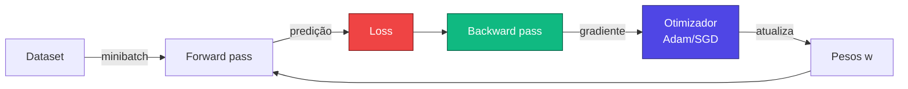
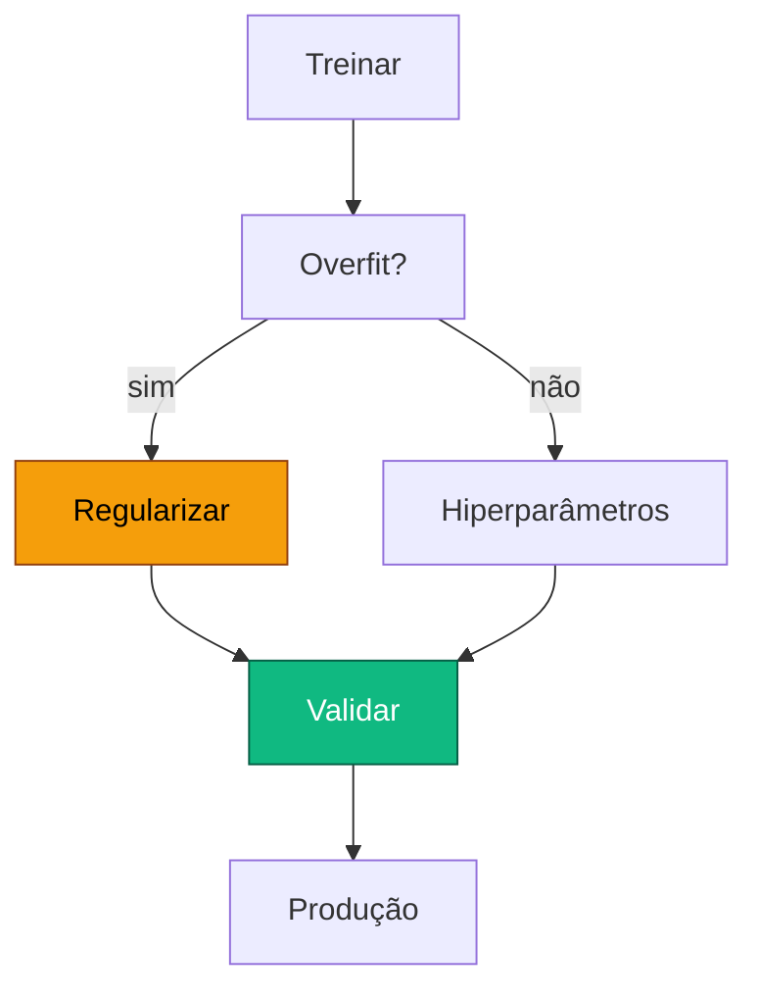

# Aula 2

## Treinando Redes Neurais Profundas

<div class="pt-12">
  <span class="px-2 py-1 rounded cursor-pointer" hover:bg="white op-10">
    Tópicos Avançados em Inteligência Artificial · UFABC
  </span>
</div>

<div class="abs-br m-6 text-sm opacity-60">
  Adaptado de MIT 15.773 (Farias, Ramakrishnan) — OCW
</div>

---

# Recapitulando: o projeto de uma DNN

<v-clicks>

- Camada de entrada: variáveis $x_1, \ldots, x_k$
- Várias **camadas ocultas** com ativações não lineares (ReLU, etc.)
- Camada de saída adequada à tarefa (sigmoide, softmax, linear)
- Conexões densas entre camadas, cada uma com um **peso**
- Cada neurônio tem ainda um **bias**

</v-clicks>

<div class="mt-6" v-click>
  <NeuralNetwork :layers="[4, 6, 6, 1]" :labels="['Entrada', 'Oculta 1', 'Oculta 2', 'Saída']" animate />
</div>

---
layout: section
---

# Parte 1 — Aplicação

Vamos motivar com um problema real: prever **doença cardíaca**.

---

# Aplicação: previsão de doença cardíaca

<div class="grid grid-cols-2 gap-8 mt-2">

<div>

<v-clicks>

- Dataset clássico do **Cleveland Clinic Heart Disease**
- ~300 pacientes, 13 atributos clínicos:
  - idade, sexo, tipo de dor torácica, pressão em repouso, colesterol, glicemia, ECG, frequência máxima, angina por exercício, ST, …
- Saída binária: paciente foi diagnosticado com doença cardíaca?
- **Construímos a primeira rede neural totalmente treinada da disciplina**

</v-clicks>

</div>

<div class="text-sm">

| paciente | idade | sexo | colest. | ... | doença |
|---:|---:|:---:|---:|:---:|:---:|
| 1 | 63 | M | 233 | ... | 0 |
| 2 | 67 | M | 286 | ... | 1 |
| 3 | 67 | M | 229 | ... | 1 |
| 4 | 37 | M | 250 | ... | 0 |
| 5 | 41 | F | 204 | ... | 0 |
| ... | ... | ... | ... | ... | ... |

</div>

</div>

---

# Projetando a rede

<v-clicks>

- **13 variáveis brutas**, mas algumas são categóricas
  → after **one-hot encoding** ficamos com **29 entradas**
- **1 camada oculta** com **16 neurônios ReLU** (uma escolha razoável de partida)
- **Saída**: 1 neurônio com **sigmoide** — devolve probabilidade $\in (0, 1)$

</v-clicks>

<div class="mt-6" v-click>
  <NeuralNetwork
    :layers="[29, 16, 1]"
    :labels="['Entrada (29)', 'Oculta (16, ReLU)', 'Saída (σ)']"
  />
</div>

---

# Quantos parâmetros?

<div class="mt-4 max-w-3xl mx-auto text-center">

$$
\underbrace{29 \times 16}_{\text{pesos } W^{(1)}} \;+\; \underbrace{16}_{\text{bias } b^{(1)}} \;+\; \underbrace{16 \times 1}_{\text{pesos } W^{(2)}} \;+\; \underbrace{1}_{\text{bias } b^{(2)}} \;=\; \mathbf{497}
$$

</div>

<div class="mt-8 grid grid-cols-3 gap-4 max-w-3xl mx-auto text-center" v-click>

<div class="p-4 rounded bg-slate-800/40">
  <div class="text-2xl font-bold text-indigo-300">497</div>
  <div class="text-sm opacity-70 mt-1">parâmetros</div>
</div>

<div class="p-4 rounded bg-slate-800/40">
  <div class="text-2xl font-bold text-cyan-300">~300</div>
  <div class="text-sm opacity-70 mt-1">exemplos de treino</div>
</div>

<div class="p-4 rounded bg-slate-800/40">
  <div class="text-2xl font-bold text-emerald-300">1</div>
  <div class="text-sm opacity-70 mt-1">probabilidade de saída</div>
</div>

</div>

<div class="mt-6 text-sm opacity-80 text-center" v-click>

Mais parâmetros que pacientes! É comum em DL — daí a importância de regularização e validação.

</div>

---

# Em código (Keras / TensorFlow)

```python {all|1-2|4-5|6|7|all}
import tensorflow as tf
from tensorflow import keras

# definimos a rede da esquerda para a direita
inputs   = keras.Input(shape=(29,))
hidden   = keras.layers.Dense(16, activation='relu')(inputs)
outputs  = keras.layers.Dense(1,  activation='sigmoid')(hidden)
model    = keras.Model(inputs=inputs, outputs=outputs)

model.summary()
```

<div class="mt-6 text-sm opacity-80" v-click>

Cada `Dense(n, activation=...)` adiciona uma camada totalmente conectada
de `n` neurônios com a ativação dada. O `model.summary()` confirma os 497
parâmetros que calculamos no slide anterior.

</div>

---
layout: section
---

# Parte 2 — Treinar = Minimizar a *loss*

Encontrar pesos que façam a rede prever bem é, no fundo, um problema
de **otimização**.

---

# O que significa "treinar"?

<v-clicks>

- Encontrar valores para os **pesos e biases** que façam a saída do modelo
  ficar tão próxima quanto possível dos valores reais
- Em regressão linear (`lm`) e logística (`glm`), isso já era feito
  por baixo dos panos por algoritmos de otimização
- Em DL, a coisa funciona igual — a função é só **muito mais complexa**
  e tem **muito mais parâmetros**

</v-clicks>

<div class="mt-6 text-center text-lg" v-click>

Para isso precisamos de uma **função de perda** (*loss function*).

</div>

---

# Função de perda (loss)

<v-clicks>

- Mede o **erro** entre a predição do modelo e o valor real
- Predições próximas dos valores reais → loss **pequena**
- Modelo perfeito → loss **zero**
- A função de perda escolhida deve **casar com o tipo de saída**:
  - saída numérica contínua → MSE
  - probabilidade binária → BCE
  - vetor de classes (multiclasse) → cross-entropy categórica

</v-clicks>

---

# MSE — *Mean Squared Error*

Para saídas numéricas contínuas, a escolha clássica:

<div class="mt-4 text-center">

$$
\mathrm{MSE} \;=\; \frac{1}{n}\sum_{i=1}^{n}\big(y_i - \hat y_i\big)^2
$$

</div>

<div class="mt-6 grid grid-cols-2 gap-8 max-w-4xl mx-auto">

<div>

<v-clicks>

- $y_i$ — valor real do $i$-ésimo exemplo
- $\hat y_i$ — predição do modelo para o $i$-ésimo exemplo
- Penaliza erros **quadraticamente** — desvios grandes pesam muito mais
- Mesma ideia da regressão linear (soma de quadrados)

</v-clicks>

</div>

<div>
  <LossPlot kind="mse" />
</div>

</div>

---

# E para classificação binária?

<div class="mt-2 max-w-4xl mx-auto">

A saída do modelo é uma **probabilidade** $\hat p \in (0,1)$
e o rótulo real é $y \in \{0, 1\}$. O que seria uma boa loss?

</div>

<div class="mt-8 grid grid-cols-2 gap-6">

<div v-click class="p-4 rounded bg-slate-800/40">

**Para $y = 1$** (classe positiva):

quanto **menor** $\hat p$, **maior** deve ser a loss
— o modelo previu errado.

</div>

<div v-click class="p-4 rounded bg-slate-800/40">

**Para $y = 0$** (classe negativa):

quanto **maior** $\hat p$, **maior** deve ser a loss
— o modelo previu errado.

</div>

</div>

---

# Capturando isso com $-\log$

<div class="mt-2">
  <BCECurves />
</div>

<div class="mt-2 text-center text-sm">

$$
\text{Loss}(y=1) = -\log(\hat p) \qquad\qquad \text{Loss}(y=0) = -\log(1 - \hat p)
$$

</div>

---

# Combinando em uma única expressão

<div class="mt-6 text-center text-lg max-w-4xl mx-auto">

$$
\ell_i \;=\; -\,y_i \log(\hat p_i) \;-\; (1 - y_i)\log(1 - \hat p_i)
$$

</div>

<div class="mt-6 max-w-3xl mx-auto" v-click>

- Quando $y_i = 1$: o segundo termo zera, sobra $-\log(\hat p_i)$
- Quando $y_i = 0$: o primeiro termo zera, sobra $-\log(1 - \hat p_i)$

</div>

<div class="mt-8 text-center text-lg" v-click>

Média sobre todos os $n$ exemplos:

$$
\mathcal{L} \;=\; \frac{1}{n}\sum_{i=1}^{n} \Big[ -y_i \log(\hat p_i) - (1 - y_i)\log(1 - \hat p_i) \Big]
$$

</div>

<div class="mt-6 text-center" v-click>
<span class="px-3 py-1 rounded bg-indigo-500/20 text-indigo-200">
Esta é a <strong>Binary Cross-Entropy</strong> (BCE).
</span>
</div>

---
layout: section
---

# Parte 3 — Gradiente descendente

Como minimizar uma função quando ela tem milhares (ou milhões) de variáveis?

---

# Minimizar uma função arbitrária

<div class="grid grid-cols-2 gap-8 mt-4">

<div>

<v-clicks>

- A loss é um caso particular de função a minimizar
- Vamos atacar primeiro o **caso geral**: minimizar uma função qualquer
  $g(w)$
- Depois aplicamos a mesma ideia à loss
- Ferramenta-chave: a **derivada** (no caso multivariado, o **gradiente**)

</v-clicks>

</div>

<div>
  <SimplePolynomial />
</div>

</div>

---

# O que a derivada nos diz?

<div class="mt-4 max-w-3xl mx-auto">

A derivada $g'(w)$ em um ponto mede a **inclinação** local da função.

</div>

<div class="mt-6">

| sinal de $g'(w)$ | significado |
|:---:|:---|
| $> 0$ | aumentar $w$ um pouco **aumenta** $g(w)$ |
| $< 0$ | aumentar $w$ um pouco **diminui** $g(w)$ |
| $\approx 0$ | mexer $w$ pouco quase **não muda** $g(w)$ — possível mínimo |

</div>

<div class="mt-6 text-center text-lg" v-click>

Isso sugere um **algoritmo**: caminhe na direção em que $g$ diminui.

</div>

---

# Algoritmo do gradiente descendente

<div class="mt-4 grid grid-cols-2 gap-8">

<div>

1. Comece em algum $w$
2. Calcule a derivada $g'(w)$
3. Atualize:

$$
w \;\leftarrow\; w \,-\, \alpha \cdot g'(w)
$$

4. Repita até convergir (ou acabar o orçamento)

<v-click>

$\alpha$ é a **taxa de aprendizado** (*learning rate*).
Tipicamente $0{,}1$, $0{,}01$, $10^{-3}$ — escolhida por tentativa e erro.

</v-click>

</div>

<div>
  <GradientDescent1D />
</div>

</div>

---

# Curiosidade histórica

<div class="mt-12 grid grid-cols-2 gap-8 items-center">

<div class="text-center">

<div class="text-7xl">📜</div>

<div class="mt-4 text-2xl font-bold text-amber-300">1847</div>

<div class="mt-2 text-sm opacity-80">

Augustin-Louis **Cauchy** propõe o método em
*Méthode générale pour la résolution des systèmes d'équations simultanées*

</div>

</div>

<div>

<v-clicks>

- O algoritmo que treina ChatGPT, Stable Diffusion e
  praticamente todo modelo moderno de DL é uma ideia de
  **180 anos atrás**
- O que mudou foi a **escala** (parâmetros, dados, hardware) e
  alguns truques de otimização modernos
- Cauchy não tinha redes neurais — usava o método para
  resolver sistemas de equações em mecânica celeste

</v-clicks>

</div>

</div>

---

# Caso multivariável

<div class="mt-4 max-w-3xl mx-auto">

Para uma função de várias variáveis — por exemplo, $g(w_1, w_2) = w_1^2 + w_2^2 + 2$:

</div>

<div class="mt-6 text-center text-lg">

$$
\nabla g \;=\; \left[ \frac{\partial g}{\partial w_1},\; \frac{\partial g}{\partial w_2} \right]
\;=\; [\,2 w_1,\; 2 w_2\,]
$$

</div>

<div class="mt-6 max-w-3xl mx-auto" v-click>

- Cada **derivada parcial** mede a variação de $g$ ao mexer **uma** variável,
  mantendo as outras fixas
- Empilhar tudo num vetor → o **gradiente** $\nabla g$
- A regra de atualização vira:

</div>

<div class="mt-4 text-center text-lg" v-click>

$$
\mathbf{w} \;\leftarrow\; \mathbf{w} \,-\, \alpha \, \nabla g(\mathbf{w})
$$

</div>

---

# Gradiente descendente em 2D

<div class="mt-2">
  <GradientDescent2D />
</div>

<div class="mt-2 text-center text-sm opacity-80">
A cada passo, andamos no sentido <em>oposto</em> ao gradiente — descendo a colina.
</div>

---

# Pode parar em mínimos locais

<div class="grid grid-cols-2 gap-8 mt-4">

<div>

<v-clicks>

- Em paisagens não convexas (regra para DL!) o GD pode estacionar:
  - num **mínimo local** (não o global)
  - num **ponto de sela** — derivadas zero mas não é mínimo
- Na prática, **não nos preocupamos muito** com isso: redes
  profundas têm tantos parâmetros que mínimos "ruins" são raros
- A estocasticidade do SGD ajuda a escapar de armadilhas

</v-clicks>

</div>

<div>
  <LocalMinima />
</div>

</div>

---

# Aplicando à loss

<div class="mt-4 max-w-4xl mx-auto">

A loss é uma função **dos pesos** $\mathbf{w}$ (com os dados $\mathbf{x}, \mathbf{y}$ fixados):

</div>

<div class="mt-4 text-center">

$$
\mathcal{L}(\mathbf{w}) \;=\; \frac{1}{n}\sum_{i=1}^{n} \Big[\,-y_i \log\big(\text{modelo}(\mathbf{x}_i; \mathbf{w})\big) - (1-y_i)\log\big(1 - \text{modelo}(\mathbf{x}_i; \mathbf{w})\big)\,\Big]
$$

</div>

<div class="mt-6 max-w-3xl mx-auto" v-click>

- $\mathbf{x}_i, y_i$ são apenas **dados** — fixos
- O que muda durante o treino são os **pesos $\mathbf{w}$**
- Substituindo o modelo pela sua expressão (camada por camada),
  a loss vira uma função "comum" de muitas variáveis
- Aplicamos GD do mesmo jeito

</div>

---
layout: section
---

# Parte 4 — Backpropagation

Como calcular o gradiente de uma rede com **milhões** de parâmetros sem morrer no processo?

---

# O problema

<v-clicks>

- Para fazer GD, precisamos de $\nabla \mathcal{L}(\mathbf{w})$ — uma derivada parcial **por parâmetro**
- Em uma rede pequena, são centenas de derivadas
- Em GPT-4 ou Llama, são **bilhões**
- Calcular cada uma "à força bruta" (diferenciando símbolicamente toda a expressão) é
  inviável e cheio de cálculos repetidos

</v-clicks>

<div class="mt-8 text-center text-xl" v-click>

A solução: **retropropagação** — calcular tudo de forma **organizada e reaproveitando contas**.

</div>

---

# Retropropagação — a ideia

<div class="grid grid-cols-2 gap-8 mt-4">

<div>

<v-clicks>

- A rede é organizada em **camadas**, com fluxo
  da entrada para a saída — o **forward pass**
- Para calcular gradientes, organizamos as operações
  como um **grafo computacional** (nós = operações)
- Aplicamos a **regra da cadeia** caminhando do **fim para o início** —
  daí o nome *back*-propagation
- Reaproveitamos resultados intermediários:
  cada peso vê só **uma multiplicação de matriz** a mais

</v-clicks>

</div>

<div>
  <ComputationalGraph />
</div>

</div>

---

# Por que GPUs?

<div class="grid grid-cols-2 gap-10 mt-4">

<div>

<v-clicks>

- O passo central da retropropagação é **multiplicar matrizes**
- GPUs foram inventadas para acelerar **vídeo-games**
  (cálculos vetoriais paralelos para rasterização 3D)
- Acontece que multiplicação matricial é **exatamente** o que GPUs fazem bem
- Backprop + GPU = cálculo do gradiente em segundos para redes gigantes
- Hoje TPUs e aceleradores dedicados levam a ideia ainda mais longe

</v-clicks>

</div>

<div class="text-center">

<div class="text-8xl">🎮</div>

<div class="mt-2 text-sm opacity-70">GPU para jogos…</div>

<div class="mt-6 text-5xl">→</div>

<div class="mt-6 text-8xl">🧠</div>

<div class="mt-2 text-sm opacity-70">…motor do deep learning</div>

</div>

</div>

---
layout: section
---

# Parte 5 — Gradiente Descendente Estocástico

E quando o dataset tem milhões de exemplos?

---

# Problema: datasets grandes

<v-clicks>

- A loss é uma **soma sobre todos os exemplos**:

$$
\mathcal{L}(\mathbf{w}) = \frac{1}{n} \sum_{i=1}^{n} \ell_i(\mathbf{w})
$$

- Calcular o gradiente exato exige passar por **todos** os $n$ exemplos
- Para $n$ na casa dos **milhões ou bilhões**, isso é proibitivamente caro
  por iteração
- Pior: precisamos de **milhares** de iterações para convergir

</v-clicks>

---

# Solução: mini-batches

<div class="grid grid-cols-2 gap-8 mt-4">

<div>

<v-clicks>

- Em cada iteração, escolha **aleatoriamente** um pequeno subconjunto
  (~32, 64, 128, 256 exemplos) — o **minibatch**
- Estime o gradiente apenas nesse subconjunto
- O gradiente estimado é uma **aproximação**, mas funciona muito bem na prática
- O ruído introduzido pode até **ajudar** a escapar de mínimos ruins
- Esse algoritmo é o **Stochastic Gradient Descent (SGD)**

</v-clicks>

</div>

<div>
  <MiniBatch />
</div>

</div>

---

# Variantes modernas — Adam & cia.

<v-clicks>

- O SGD básico funciona, mas converge lentamente
- Otimizadores modernos adicionam:
  - **momento** — uma "inércia" que acelera direções consistentes
  - **taxas de aprendizado por parâmetro** — adapta $\alpha$ a cada peso
  - **correção de bias** nos primeiros passos
- O **Adam** (Adaptive Moment Estimation, 2014) combina tudo isso
  e virou o **default** em DL
- Outras variantes populares: **AdamW**, **RMSprop**, **Adagrad**, **Lion**…

</v-clicks>

<div class="mt-6 text-center text-sm opacity-80" v-click>

Em Keras: <code>optimizer='adam'</code> e pronto. Os detalhes ficam por conta da biblioteca.

</div>

---

# Paisagem de loss real

<div class="mt-4">
  <LossLandscape />
</div>

<div class="mt-2 text-center text-sm opacity-80 max-w-3xl mx-auto">

Loss landscapes de redes profundas são <strong>muito</strong> não convexas, mas com
muitas regiões "boas". É aí que o SGD (com seu ruído) brilha — e por que
treinos de DL "simplesmente funcionam" tão bem.

</div>

---

# Fluxo geral de treinamento

<div class="mt-4">



</div>

<div class="mt-6 text-center text-lg" v-click>

Cada volta no laço é um <strong>passo de otimização</strong>.<br/>
Várias passadas pelo dataset inteiro = <strong>épocas</strong> (epochs).

</div>

---
layout: section
---

# Parte 6 — Backprop passo a passo

Vamos derivar a retropropagação em uma rede minúscula, no braço.

---

# A rede do exemplo

<div class="grid grid-cols-2 gap-8 mt-4">

<div>

<v-clicks>

- 2 entradas: $x_1, x_2$
- 1 camada oculta com **2 neurônios lineares** (sem ativação,
  para simplificar a álgebra)
- 1 saída linear $\hat y$
- Saída numérica → vamos usar **MSE** como loss

</v-clicks>

</div>

<div>
  <NeuralNetwork :layers="[2, 2, 1]" :labels="['Entrada', 'Oculta (linear)', 'Saída (linear)']" />
</div>

</div>

---

# Equações da rede

<div class="mt-6 text-center text-lg max-w-3xl mx-auto">

$$
\begin{aligned}
a_1 &= w_{11}\, x_1 \\
a_2 &= w_{22}\, x_2 \\
\hat y &= b + a_1 + a_2 \\[6pt]
\text{loss} &= (\hat y - y)^2
\end{aligned}
$$

</div>

<div class="mt-6 max-w-3xl mx-auto" v-click>

Parâmetros a aprender: $w_{11}, w_{22}, b$. Vamos calcular as derivadas
$\dfrac{\partial\,\text{loss}}{\partial w_{11}}$, $\dfrac{\partial\,\text{loss}}{\partial w_{22}}$,
$\dfrac{\partial\,\text{loss}}{\partial b}$.

</div>

---

# À moda antiga: substituir tudo

<div class="mt-2 max-w-4xl mx-auto">

Substituindo $a_1, a_2$ em $\hat y$ e expandindo a loss:

$$
\text{loss} \;=\; \big(b + w_{11} x_1 + w_{22} x_2 - y\big)^2
$$

</div>

<div class="mt-6 max-w-4xl mx-auto" v-click>

Derivando diretamente:

$$
\begin{aligned}
\frac{\partial\,\text{loss}}{\partial b}     &= 2(\hat y - y)\\
\frac{\partial\,\text{loss}}{\partial w_{11}} &= 2(\hat y - y)\, x_1\\
\frac{\partial\,\text{loss}}{\partial w_{22}} &= 2(\hat y - y)\, x_2
\end{aligned}
$$

</div>

<div class="mt-6 text-center text-amber-300" v-click>

Funciona em uma rede de brinquedo. Em uma rede com milhões de pesos? <strong>Inviável.</strong>

</div>

---

# Reorganizando como grafo computacional

<div class="mt-4">
  <ComputationalGraph variant="full" />
</div>

<div class="mt-4 text-sm opacity-80 text-center max-w-3xl mx-auto">

Cada nó é uma operação simples (multiplicação ou soma).
A loss é o nó final. Vamos caminhar do <strong>fim para o começo</strong>.

</div>

---

# Regra da cadeia

<div class="mt-2 max-w-3xl mx-auto">

Para chegar de $\dfrac{\partial\,\text{loss}}{\partial w_{11}}$, encadeamos:

$$
\frac{\partial\,\text{loss}}{\partial w_{11}}
\;=\;
\underbrace{\frac{\partial\,\text{loss}}{\partial \hat y}}_{\text{passo 1}}
\;\cdot\;
\underbrace{\frac{\partial \hat y}{\partial a_1}}_{\text{passo 2}}
\;\cdot\;
\underbrace{\frac{\partial a_1}{\partial w_{11}}}_{\text{passo 3}}
$$

</div>

<div class="mt-6 max-w-3xl mx-auto" v-click>

Cada fator é **trivial**:

$$
\frac{\partial\,\text{loss}}{\partial \hat y} = 2(\hat y - y), \quad
\frac{\partial \hat y}{\partial a_1} = 1, \quad
\frac{\partial a_1}{\partial w_{11}} = x_1
$$

Multiplicando: $2(\hat y - y) \cdot 1 \cdot x_1 = 2(\hat y - y)\,x_1$ ✓

</div>

<div class="mt-4 text-center text-emerald-300" v-click>

Mesma resposta da "moda antiga", mas obtida por <strong>fatores locais</strong> reaproveitáveis.

</div>

---

# Forward + backward pass

<div class="mt-2">
  <BackpropExample />
</div>

<div class="mt-2 text-center text-sm opacity-80">
Forward (azul) calcula valores. Backward (laranja) calcula gradientes propagando $\partial\text{loss}/\partial\cdot$ camada por camada.
</div>

---

# Atualizando os pesos

<div class="mt-6 max-w-3xl mx-auto text-center text-lg">

Com os gradientes em mãos, aplicamos a regra do GD em **cada parâmetro**:

$$
w_{11} \leftarrow w_{11} - \alpha \cdot \frac{\partial\,\text{loss}}{\partial w_{11}}
$$

$$
w_{22} \leftarrow w_{22} - \alpha \cdot \frac{\partial\,\text{loss}}{\partial w_{22}}
$$

$$
b \leftarrow b - \alpha \cdot \frac{\partial\,\text{loss}}{\partial b}
$$

</div>

<div class="mt-8 max-w-3xl mx-auto" v-click>

Em uma rede real, repetimos isso para **milhões** de pesos por minibatch,
**várias vezes** por época, **dezenas a milhares** de épocas. A mecânica é
exatamente esta — só a escala muda.

</div>

---
layout: center
class: text-center
---

# Recapitulando

<div class="mt-4 grid grid-cols-2 gap-4 max-w-4xl mx-auto text-left text-sm">

<div class="p-3 rounded bg-slate-800/40">
<strong class="text-indigo-300">Treinar</strong> = encontrar pesos que minimizem a loss
</div>

<div class="p-3 rounded bg-slate-800/40">
<strong class="text-indigo-300">Loss</strong> mede o quão erradas estão as predições
</div>

<div class="p-3 rounded bg-slate-800/40">
<strong class="text-indigo-300">MSE</strong> para saídas numéricas, <strong>BCE</strong> para classificação binária
</div>

<div class="p-3 rounded bg-slate-800/40">
<strong class="text-indigo-300">Gradient Descent</strong> caminha contra o gradiente
</div>

<div class="p-3 rounded bg-slate-800/40">
<strong class="text-indigo-300">Backprop</strong> usa regra da cadeia + grafo computacional
</div>

<div class="p-3 rounded bg-slate-800/40">
<strong class="text-indigo-300">SGD/Adam</strong> escala GD para datasets enormes
</div>

<div class="p-3 rounded bg-slate-800/40">
<strong class="text-indigo-300">GPUs</strong> aceleram a multiplicação de matrizes do backprop
</div>

<div class="p-3 rounded bg-slate-800/40">
<strong class="text-indigo-300">Loss landscapes</strong> são feias mas o ruído do SGD ajuda
</div>

</div>

---

# Próximas aulas

<div class="mt-8 grid grid-cols-2 gap-8 max-w-4xl mx-auto">

<div>

<v-clicks>

- **Hiperparâmetros** e **regularização** (dropout, weight decay)
- **Treinamento na prática**: épocas, batch size, schedules de learning rate
- **Boas práticas**: normalização de entradas, inicialização, validação cruzada
- **Diagnóstico**: detectar overfitting, ler curvas de loss

</v-clicks>

</div>

<div>



</div>

</div>

---
layout: center
class: text-center
---

# Obrigado! Perguntas?

<div class="mt-6 text-sm opacity-70">

Adaptado livremente de <em>15.773 Hands-on Deep Learning — Lecture 02:
Training Deep Neural Networks</em> (MIT OpenCourseWare, 2024) — material original em
inglês de Vivek Farias e Rama Ramakrishnan, distribuído sob os termos do MIT OCW.

</div>

<div class="mt-2 text-xs opacity-60">
Para mais informações: https://ocw.mit.edu/terms
</div>
