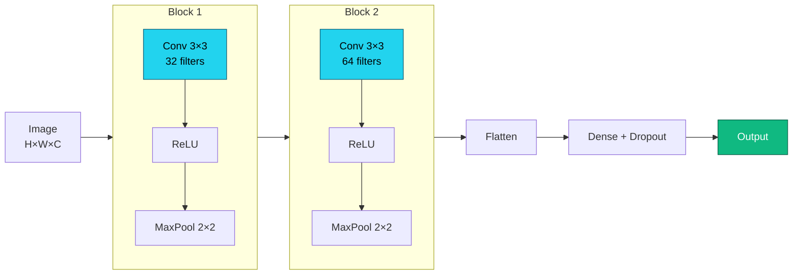
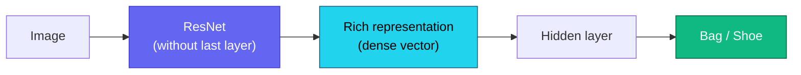

# Lecture 3

## Convolutional Networks and Transfer Learning

<div class="pt-12">
  <span class="px-2 py-1 rounded cursor-pointer" hover:bg="white op-10">
    Advanced Topics in Artificial Intelligence · UFABC
  </span>
</div>

<div class="abs-br m-6 text-sm opacity-60">
  Adapted from MIT 15.773 (Farias, Ramakrishnan) — OCW
</div>

---
layout: section
---

# Part 1 — Computer Vision

How to represent images and what tasks to solve with DL.

---

# Tensors and images

<div class="grid grid-cols-2 gap-8 mt-4">

<div>

**Tensor** = N-dimensional array of numbers:

<div class="mt-2">
  <TensorRanks />
</div>

</div>

<div class="flex flex-col gap-4 justify-center text-sm">

<div class="p-4 rounded bg-slate-800/40">

**Grayscale image**<br/>
Matrix $H \times W$ — each pixel: 0–255

</div>

<div class="p-4 rounded bg-slate-800/40">

**Color image (RGB)**<br/>
Tensor $H \times W \times 3$ — 3 channels (R, G, B)

</div>

<div class="p-4 rounded bg-slate-800/40">

**Batch of images**<br/>
Tensor $N \times H \times W \times 3$

</div>

</div>

</div>

---

# Computer vision tasks

<div class="mt-4">
  <CVTasks />
</div>

<div class="mt-2 grid grid-cols-3 gap-3 max-w-4xl mx-auto text-xs">

<div class="p-2 rounded bg-slate-800/40">
<strong class="text-indigo-300">Classification</strong><br/>One class per image
</div>

<div class="p-2 rounded bg-slate-800/40">
<strong class="text-indigo-300">Detection</strong><br/>Multiple bounding boxes + classes
</div>

<div class="p-2 rounded bg-slate-800/40">
<strong class="text-indigo-300">Segmentation</strong><br/>Class per pixel
</div>

</div>

---

# Multiclass classification — softmax

<div class="mt-2 grid grid-cols-2 gap-8">

<div>

**Fashion-MNIST**: 70k images 28×28, 10 categories.

<div class="mt-4">
  <FashionMnist />
</div>

</div>

<div>

For $N$ classes, the output layer uses **softmax**:

$$\mathrm{softmax}(z)_i = \frac{e^{z_i}}{\displaystyle\sum_{j=1}^N e^{z_j}}$$

<div class="mt-4">
  <SoftmaxViz />
</div>

<div class="text-sm opacity-80 mt-2">

Outputs $\in (0,1)$ summing to exactly $1$.

</div>

</div>

</div>

---

# Matching output to loss

<div class="mt-4 max-w-5xl mx-auto">

| Output variable | Output layer | Loss (Keras) |
|:---|:---:|:---:|
| Real number | linear (1 neuron) | `mse` |
| Binary probability | sigmoid (1 neuron) | `binary_crossentropy` |
| Probability vector | **softmax** (N neurons) | `categorical_crossentropy` |
| Same, labels as integers | **softmax** (N neurons) | `sparse_categorical_crossentropy` |

</div>

<div class="mt-4 text-center text-amber-300 text-sm" v-click>

⚠ Using the wrong loss for the label type is one of the most common sources of bugs.

</div>

---

# Baseline: dense network on Fashion-MNIST

<div class="grid grid-cols-2 gap-4 mt-2">

<div>

**Keras**

```python
inp  = keras.Input(shape=(28, 28))
x    = keras.layers.Flatten()(inp)
x    = keras.layers.Dense(128, 'relu')(x)
x    = keras.layers.Dropout(0.3)(x)
x    = keras.layers.Dense(64,  'relu')(x)
out  = keras.layers.Dense(10, 'softmax')(x)
model = keras.Model(inp, out)
model.compile(
  loss='sparse_categorical_crossentropy',
  optimizer='adam', metrics=['accuracy'])
```

</div>

<div>

**PyTorch**

```python
model = nn.Sequential(
    nn.Flatten(),
    nn.Linear(784, 128), nn.ReLU(),
    nn.Dropout(0.3),
    nn.Linear(128, 64),  nn.ReLU(),
    nn.Linear(64, 10),
)
criterion = nn.CrossEntropyLoss()
optimizer = optim.Adam(model.parameters())
# CrossEntropyLoss already includes softmax!
```

</div>

</div>

<div class="mt-2 text-xs opacity-70 text-center" v-click>

Baseline of ~88% with dense layers. Can we do better?

</div>

---
layout: section
---

# Part 2 — Why dense layers are not enough

The problem of flattening images.

---

# The problem with Flatten

<div class="mt-4 max-w-3xl mx-auto">

<v-clicks>

- Color image from a smartphone: **3024 × 3024 × 3 pixels**
- Flatten and connect to a layer of 100 neurons → **≈ 2.7 billion parameters**
- Computationally infeasible, requires enormous amounts of data, prone to overfitting

</v-clicks>

<v-click>

<div class="mt-5 p-4 rounded bg-amber-900/30 border border-amber-500/40">

By flattening, we lose the **spatial structure** — neighboring pixels carry local information that the dense layer ignores.

</div>

</v-click>

<v-click>

<div class="mt-4 p-4 rounded bg-slate-800/40">

If a pattern appears at different positions in the image, the dense network needs to **re-learn it** for each position. Convolutional filters **learn once and reuse** at any position.

</div>

</v-click>

</div>

---
layout: section
---

# Part 3 — Convolutional Filters

How to detect visual patterns efficiently.

---

# The convolutional filter

<div class="grid grid-cols-2 gap-8 mt-4">

<div>

<v-clicks>

- A **filter** is a small matrix of numbers (e.g.: 3×3)
- Sliding over the image, it detects a type of visual pattern
- A **convolutional layer** has multiple filters; each one learns a different pattern

</v-clicks>

<div class="mt-6 text-sm font-mono bg-slate-900/60 p-3 rounded" v-click>

Vertical edge:&nbsp;&nbsp;&nbsp;&nbsp;Horizontal edge:<br/>
&nbsp;1&nbsp;&nbsp;0&nbsp;-1&nbsp;&nbsp;&nbsp;&nbsp;&nbsp;&nbsp;&nbsp;&nbsp;&nbsp;&nbsp;1&nbsp;&nbsp;1&nbsp;&nbsp;1<br/>
&nbsp;1&nbsp;&nbsp;0&nbsp;-1&nbsp;&nbsp;&nbsp;&nbsp;&nbsp;&nbsp;&nbsp;&nbsp;&nbsp;&nbsp;0&nbsp;&nbsp;0&nbsp;&nbsp;0<br/>
&nbsp;1&nbsp;&nbsp;0&nbsp;-1&nbsp;&nbsp;&nbsp;&nbsp;&nbsp;&nbsp;&nbsp;&nbsp;-1&nbsp;-1&nbsp;-1

</div>

</div>

<div>

<v-click>

<div class="p-4 rounded bg-slate-800/40 text-sm">

**Analogy with dense neuron:**
- Dense neuron → connected to **all** pixels
- Convolutional filter → connected to a **local window** and slides with the **same weights**

</div>

</v-click>

<v-click>

<div class="mt-4 p-4 rounded bg-indigo-900/30 border border-indigo-500/40 text-sm">

Benefits:
- **Far fewer parameters**
- Preserves **spatial adjacency**
- **Translation invariance** — detects the same pattern at any position

</div>

</v-click>

</div>

</div>

---

# The convolution operation

<div class="grid grid-cols-2 gap-8 mt-2">

<div>

**Steps:**

<v-clicks>

1. Position the filter over a window of the image
2. Multiply element-wise and sum → a scalar
3. Slide (stride) and repeat
4. Result: a **feature map**
5. Apply ReLU for non-linearity

</v-clicks>

</div>

<div class="text-sm font-mono">

<div class="bg-slate-900/60 p-3 rounded text-xs mt-2">

```
3×3 window:   Filter (vertical edge):
1  2  3        1   0  -1
4  5  6   ×    1   0  -1   =  (1+4+7)−(3+6+9) = −6
7  8  9        1   0  -1
```

</div>

<div class="mt-4 p-3 rounded bg-slate-800/40 text-xs" v-click>

High value in the feature map = filter **detected** the pattern in that region.

By stacking layers:
- Layer 1 → edges and simple textures
- Layer 2 → corners, curves
- Layer 3+ → object parts, complete objects

</div>

</div>

</div>

---

# Parameters of a convolutional layer

<div class="mt-6 max-w-3xl mx-auto">

<v-clicks>

- **Filter size**: 3×3 or 5×5 (3×3 preferred)
- **Number of filters**: 32, 64, 128… per layer
- **Stride**: sliding step (1 or 2)
- **Padding**: add zeros at the borders to preserve resolution

</v-clicks>

<div class="mt-6 grid grid-cols-2 gap-6" v-click>

<div class="p-4 rounded bg-slate-800/40 text-sm">

**Parameters of 32 filters 3×3 with 3 channels:**

$$32 \times (3 \times 3 \times 3 + 1) = 896$$

</div>

<div class="p-4 rounded bg-amber-900/30 border border-amber-500/40 text-sm">

Equivalent dense layer ($224{\times}224{\times}3 \to 32$):

$$\approx 4{.}8 \text{ million parameters}$$

</div>

</div>

</div>

---
layout: section
---

# Part 4 — Pooling

Reducing dimensions without losing the essentials.

---

# Max Pooling

<div class="grid grid-cols-2 gap-8 mt-4">

<div>

<v-clicks>

- Divides the feature map into windows (e.g.: 2×2)
- Retains only the **maximum value** of each window
- Reduces spatial resolution by half
- Fewer parameters in subsequent layers

</v-clicks>

<div class="mt-4 p-3 rounded bg-slate-800/40 text-sm" v-click>

**Intuition:** if a feature exists **anywhere** in the window, max pooling preserves it. Provides robustness to small shifts.

</div>

</div>

<div class="text-sm font-mono">

<div class="bg-slate-900/60 p-3 rounded text-xs mt-4">

```
Feature map (4×4):    MaxPool 2×2:

 1   3  | 2   4         3   4
 5   6  | 1   2   →     6   5
---------+--------
 7   2  | 3   1         7   5
 4   1  | 5   2
```

</div>

</div>

</div>

---
layout: section
---

# Part 5 — CNN Architecture

Combining convolutions, pooling and dense layers.

---

# Convolutional blocks

<div class="mt-3 max-w-3xl mx-auto text-sm mb-4">

A CNN is built from stacked **convolutional blocks** — each block has **greater depth** and **lower resolution** than the previous one — followed by dense layers:

</div>



---

# CNN for Fashion-MNIST

<div class="grid grid-cols-2 gap-4 mt-2">

<div>

**Keras**

```python
inp = keras.Input(shape=(28, 28, 1))
x = keras.layers.Conv2D(
      32, 3, activation='relu', padding='same')(inp)
x = keras.layers.MaxPooling2D()(x)
x = keras.layers.Conv2D(
      64, 3, activation='relu', padding='same')(x)
x = keras.layers.MaxPooling2D()(x)
x = keras.layers.Flatten()(x)
x = keras.layers.Dense(128, activation='relu')(x)
x = keras.layers.Dropout(0.3)(x)
out = keras.layers.Dense(10, activation='softmax')(x)
model = keras.Model(inp, out)
model.compile(
  loss='sparse_categorical_crossentropy',
  optimizer='adam', metrics=['accuracy'])
```

</div>

<div>

**PyTorch**

```python
model = nn.Sequential(
    nn.Conv2d(1, 32, 3, padding=1), nn.ReLU(),
    nn.MaxPool2d(2),
    nn.Conv2d(32, 64, 3, padding=1), nn.ReLU(),
    nn.MaxPool2d(2),
    nn.Flatten(),
    nn.Linear(64 * 7 * 7, 128), nn.ReLU(),
    nn.Dropout(0.3),
    nn.Linear(128, 10),
)
criterion = nn.CrossEntropyLoss()
optimizer = optim.Adam(model.parameters())
```

</div>

</div>

<div class="mt-2 text-xs opacity-70 text-center" v-click>

CNN achieves **~92%** on Fashion-MNIST, versus ~88% for the dense network.

</div>

---
layout: section
---

# Part 6 — Transfer Learning

Reusing what was learned from millions of images.

---

# Two trends that enabled transfer learning

<div class="mt-4 max-w-3xl mx-auto">

<v-click>

**Trend 1 — Specialized architectures:**

| Data type | Architecture |
|:---|:---:|
| Any | Residual connections (ResNet) |
| Images | Convolutional layers |
| Sequences (text, audio, genes) | Transformers |

</v-click>

<v-click>

<div class="mt-5 p-4 rounded bg-slate-800/40">

**Trend 2 — Publicly available pre-trained models:**  
Using these architectures, researchers trained high-performance networks on large real-world datasets. Countless models are publicly available.

</div>

</v-click>

</div>

---

# The core idea of transfer learning

<div class="grid grid-cols-2 gap-8 mt-4">

<div>

<v-clicks>

- **ImageNet**: millions of images from 1000 everyday categories
- A network trained on ImageNet develops a **hierarchical** representation of visual objects:
  - Early layers → edges and textures
  - Middle layers → object parts
  - Final layers → complete objects

</v-clicks>

</div>

<div>

<v-click>

<div class="p-4 rounded bg-amber-900/30 border border-amber-500/40 text-sm">

**Problem:** we only have ~100 images of bags and shoes. A CNN trained from scratch will not generalize.

</div>

</v-click>

<v-click>

<div class="mt-4 p-4 rounded bg-indigo-900/30 border border-indigo-500/40 text-sm">

**Solution:** take a ResNet trained on ImageNet and **reuse** what it already learned about everyday images.

Transfer learning = **customizing** a pre-trained network for a new problem.

</div>

</v-click>

</div>

</div>

---

# "Headless" ResNet as a feature extractor

<div class="mt-2 max-w-3xl mx-auto text-sm mb-4">

<v-clicks>

1. The original ResNet classifies 1000 categories — the last layer is not useful to us
2. We remove the last layer (**"headless" ResNet**)
3. We pass our images → the output is a rich, dense representation
4. We train a small network on top of that representation

</v-clicks>

</div>



<div class="mt-2 text-center text-xs opacity-70" v-click>

With only ~100 images, this approach already yields high accuracy.

</div>

---

# Feature extraction vs. Fine-tuning

<div class="mt-4 grid grid-cols-2 gap-6 max-w-4xl mx-auto">

<div class="p-4 rounded bg-slate-800/40">

**Feature extraction**

- Pre-trained base weights remain **frozen**
- Only the new head is trained
- Faster, works with little data
- Recommended when the target dataset is small and similar to ImageNet

</div>

<div class="p-4 rounded bg-slate-800/40">

**Fine-tuning**

- Connect base + head and train **everything end-to-end**
- Must start from pre-trained weights (not from scratch)
- Uses a smaller learning rate to avoid "forgetting"
- Better when there is sufficient data

</div>

</div>

---

# Transfer learning in code

<div class="grid grid-cols-2 gap-4 mt-2">

<div>

**Keras**

```python
base = keras.applications.ResNet50(
    weights='imagenet',
    include_top=False,
    input_shape=(224, 224, 3),
)
base.trainable = False   # freeze

inp = keras.Input(shape=(224, 224, 3))
x   = base(inp, training=False)
x   = keras.layers.GlobalAveragePooling2D()(x)
x   = keras.layers.Dense(64, activation='relu')(x)
out = keras.layers.Dense(2,  activation='softmax')(x)

model = keras.Model(inp, out)
model.compile(
  loss='sparse_categorical_crossentropy',
  optimizer='adam', metrics=['accuracy'])
```

</div>

<div>

**PyTorch**

```python
import torchvision.models as models

base = models.resnet50(weights='IMAGENET1K_V2')

# Freeze all weights
for p in base.parameters():
    p.requires_grad = False

# Replace the classification head
n_feat = base.fc.in_features
base.fc = nn.Sequential(
    nn.Linear(n_feat, 64),
    nn.ReLU(),
    nn.Linear(64, 2),
)

optimizer = optim.Adam(base.fc.parameters())
criterion = nn.CrossEntropyLoss()
```

</div>

</div>

---

# Where to find pre-trained models

<div class="mt-6 grid grid-cols-3 gap-6 max-w-4xl mx-auto">

<div class="p-4 rounded bg-slate-800/40 text-center">
<div class="text-3xl mb-2">🔵</div>
<strong>TensorFlow Hub</strong>
<div class="text-xs opacity-70 mt-1">tensorflow.org/hub</div>
<div class="text-xs mt-2">Ready-to-use Keras models</div>
</div>

<div class="p-4 rounded bg-slate-800/40 text-center">
<div class="text-3xl mb-2">🟠</div>
<strong>PyTorch Hub</strong>
<div class="text-xs opacity-70 mt-1">pytorch.org/hub</div>
<div class="text-xs mt-2">ResNet, EfficientNet, BERT…</div>
</div>

<div class="p-4 rounded bg-slate-800/40 text-center">
<div class="text-3xl mb-2">🤗</div>
<strong>Hugging Face Hub</strong>
<div class="text-xs opacity-70 mt-1">huggingface.co/models</div>
<div class="text-xs mt-2">+500k models: vision, NLP, audio</div>
</div>

</div>

---
layout: center
class: text-center
---

# Summary

<div class="mt-4 grid grid-cols-2 gap-3 max-w-4xl mx-auto text-left text-sm">

<div class="p-3 rounded bg-slate-800/40">
<strong class="text-indigo-300">Tensor H×W×3</strong> — representation of color images; batch: N×H×W×3
</div>

<div class="p-3 rounded bg-slate-800/40">
<strong class="text-indigo-300">Softmax + Cross-Entropy</strong> — multiclass output; correct loss for N categories
</div>

<div class="p-3 rounded bg-slate-800/40">
<strong class="text-indigo-300">Flatten + Dense</strong> — simple baseline, but explodes in parameters and loses spatial structure
</div>

<div class="p-3 rounded bg-slate-800/40">
<strong class="text-indigo-300">Convolutional filter</strong> — local window with shared weights; learns once, applies across the entire image
</div>

<div class="p-3 rounded bg-slate-800/40">
<strong class="text-indigo-300">Max Pooling</strong> — downsampling that preserves feature presence; robustness to shifts
</div>

<div class="p-3 rounded bg-slate-800/40">
<strong class="text-indigo-300">CNN</strong> — Conv+ReLU+Pool blocks; depth grows, resolution shrinks
</div>

<div class="p-3 rounded bg-slate-800/40">
<strong class="text-indigo-300">Feature extraction</strong> — frozen base + new head; works with little data
</div>

<div class="p-3 rounded bg-slate-800/40">
<strong class="text-indigo-300">Fine-tuning</strong> — trains everything end-to-end starting from pre-trained weights
</div>

</div>

---

# Next lecture

<div class="mt-6 max-w-3xl mx-auto">

<v-clicks>

- **Sequences and language** — how to represent text for neural networks
- **Embeddings** — dense vectors for words and tokens
- **RNNs and LSTMs** — networks that process sequences step by step
- **Attention and Transformers** — the mechanism that dominates modern NLP
- **BERT and GPT** — pre-training and fine-tuning for language tasks

</v-clicks>

</div>

---
layout: center
class: text-center
---

# Thank you! Questions?

<div class="mt-6 text-sm opacity-70">

Freely adapted from *15.773 Hands-on Deep Learning — Lecture 04*
(MIT OpenCourseWare, 2024) — original material in English by Vivek Farias and
Rama Ramakrishnan, distributed under the terms of MIT OCW.

</div>

<div class="mt-2 text-xs opacity-60">
For more information: https://ocw.mit.edu/terms
</div>
