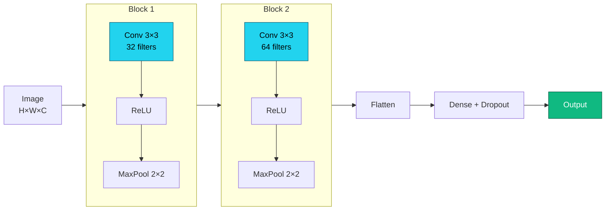
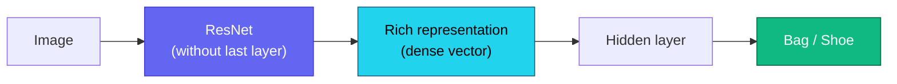

# Lecture 3

## Convolutional Networks and Transfer Learning

<div class="pt-12">
  <span class="px-2 py-1 rounded cursor-pointer" hover:bg="white op-10">
    Advanced Topics in Artificial Intelligence · UFABC
  </span>
</div>

<div class="abs-br m-6 text-sm opacity-60">
  Adapted from MIT 15.773 (Farias, Ramakrishnan) — OCW
</div>

---
layout: section
---

# Part 1 — Computer Vision

How to represent images and what tasks to solve with DL.

---

# Tensors and images

<div class="grid grid-cols-2 gap-8 mt-4">

<div>

**Tensor** = N-dimensional array of numbers:

<div class="mt-2">
  <TensorRanks />
</div>

</div>

<div class="flex flex-col gap-4 justify-center text-sm">

<div class="p-4 rounded bg-slate-800/40">

**Grayscale image**<br/>
Matrix $H \times W$ — each pixel: 0–255

</div>

<div class="p-4 rounded bg-slate-800/40">

**Color image (RGB)**<br/>
Tensor $H \times W \times 3$ — 3 channels (R, G, B)

</div>

<div class="p-4 rounded bg-slate-800/40">

**Batch of images**<br/>
Tensor $N \times H \times W \times 3$

</div>

</div>

</div>

---

# Computer vision tasks

<div class="mt-4">
  <CVTasks />
</div>

<div class="mt-2 grid grid-cols-3 gap-3 max-w-4xl mx-auto text-xs">

<div class="p-2 rounded bg-slate-800/40">
<strong class="text-indigo-300">Classification</strong><br/>One class per image
</div>

<div class="p-2 rounded bg-slate-800/40">
<strong class="text-indigo-300">Detection</strong><br/>Multiple bounding boxes + classes
</div>

<div class="p-2 rounded bg-slate-800/40">
<strong class="text-indigo-300">Segmentation</strong><br/>Class per pixel
</div>

</div>

---

# Multiclass classification — softmax

<div class="mt-2 grid grid-cols-2 gap-8">

<div>

**Fashion-MNIST**: 70k images 28×28, 10 categories.

<div class="mt-4">
  <FashionMnist />
</div>

</div>

<div>

For $N$ classes, the output layer uses **softmax**:

$$\mathrm{softmax}(z)_i = \frac{e^{z_i}}{\displaystyle\sum_{j=1}^N e^{z_j}}$$

<div class="mt-4">
  <SoftmaxViz />
</div>

<div class="text-sm opacity-80 mt-2">

Outputs $\in (0,1)$ summing to exactly $1$.

</div>

</div>

</div>

---

# Matching output to loss

<div class="mt-4 max-w-5xl mx-auto">

| Output variable | Output layer | Loss (Keras) |
|:---|:---:|:---:|
| Real number | linear (1 neuron) | `mse` |
| Binary probability | sigmoid (1 neuron) | `binary_crossentropy` |
| Probability vector | **softmax** (N neurons) | `categorical_crossentropy` |
| Same, labels as integers | **softmax** (N neurons) | `sparse_categorical_crossentropy` |

</div>

<div class="mt-4 text-center text-amber-300 text-sm" v-click>

⚠ Using the wrong loss for the label type is one of the most common sources of bugs.

</div>

---

# Baseline: dense network on Fashion-MNIST

<div class="grid grid-cols-2 gap-4 mt-2">

<div>

**Keras**

```python
inp  = keras.Input(shape=(28, 28))
x    = keras.layers.Flatten()(inp)
x    = keras.layers.Dense(128, 'relu')(x)
x    = keras.layers.Dropout(0.3)(x)
x    = keras.layers.Dense(64,  'relu')(x)
out  = keras.layers.Dense(10, 'softmax')(x)
model = keras.Model(inp, out)
model.compile(
  loss='sparse_categorical_crossentropy',
  optimizer='adam', metrics=['accuracy'])
```

</div>

<div>

**PyTorch**

```python
model = nn.Sequential(
    nn.Flatten(),
    nn.Linear(784, 128), nn.ReLU(),
    nn.Dropout(0.3),
    nn.Linear(128, 64),  nn.ReLU(),
    nn.Linear(64, 10),
)
criterion = nn.CrossEntropyLoss()
optimizer = optim.Adam(model.parameters())
# CrossEntropyLoss already includes softmax!
```

</div>

</div>

<div class="mt-2 text-xs opacity-70 text-center" v-click>

Baseline of ~88% with dense layers. Can we do better?

</div>

---
layout: section
---

# Part 2 — Why dense layers are not enough

The problem of flattening images.

---

# The problem with Flatten

<div class="mt-4 max-w-3xl mx-auto">

<v-clicks>

- Color image from a smartphone: **3024 × 3024 × 3 pixels**
- Flatten and connect to a layer of 100 neurons → **≈ 2.7 billion parameters**
- Computationally infeasible, requires enormous amounts of data, prone to overfitting

</v-clicks>

<v-click>

<div class="mt-5 p-4 rounded bg-amber-900/30 border border-amber-500/40">

By flattening, we lose the **spatial structure** — neighboring pixels carry local information that the dense layer ignores.

</div>

</v-click>

<v-click>

<div class="mt-4 p-4 rounded bg-slate-800/40">

If a pattern appears at different positions in the image, the dense network needs to **re-learn it** for each position. Convolutional filters **learn once and reuse** at any position.

</div>

</v-click>

</div>

---

# Flatten: what is lost

<div class="grid grid-cols-3 gap-4 mt-4 items-center text-xs">

<div class="text-center">
<div class="opacity-60 mb-2">4×4 image (original)</div>
<div class="inline-grid grid-cols-4 font-mono" style="border:1px solid #475569">
<div class="px-2 py-1 text-center" style="background:#1e3a5f;color:#67e8f9;border-right:2px solid #64748b;border-bottom:2px solid #64748b">A</div>
<div class="px-2 py-1 text-center" style="background:#1e3a5f;color:#67e8f9;border-bottom:2px solid #64748b">B</div>
<div class="px-2 py-1 text-center opacity-40" style="border-bottom:2px solid #64748b">·</div>
<div class="px-2 py-1 text-center opacity-40" style="border-bottom:2px solid #64748b">·</div>
<div class="px-2 py-1 text-center" style="background:#1a3a2f;color:#6ee7b7;border-right:2px solid #64748b">C</div>
<div class="px-2 py-1 text-center" style="background:#1a3a2f;color:#6ee7b7">·</div>
<div class="px-2 py-1 text-center opacity-40">·</div>
<div class="px-2 py-1 text-center opacity-40">·</div>
<div class="px-2 py-1 text-center opacity-30" style="border-right:2px solid #64748b">·</div>
<div class="px-2 py-1 text-center opacity-30">·</div>
<div class="px-2 py-1 text-center opacity-30">·</div>
<div class="px-2 py-1 text-center opacity-30">·</div>
<div class="px-2 py-1 text-center opacity-30" style="border-right:2px solid #64748b">·</div>
<div class="px-2 py-1 text-center opacity-30">·</div>
<div class="px-2 py-1 text-center opacity-30">·</div>
<div class="px-2 py-1 text-center opacity-30">·</div>
</div>
<div class="mt-2">A–B: neighbors → <span class="text-cyan-300">✓</span><br/>A–C: neighbors ↓</div>
</div>

<div class="text-center text-xl opacity-40">→<br/>Flatten</div>

<div class="text-center">
<div class="opacity-60 mb-2">1×16 vector (after Flatten)</div>
<div class="flex font-mono" style="border:1px solid #475569; width:fit-content; margin:auto">
<div class="px-1 py-1" style="background:#1e3a5f;color:#67e8f9;border-right:1px solid #475569">A</div>
<div class="px-1 py-1" style="background:#1e3a5f;color:#67e8f9;border-right:2px solid #f97316">B</div>
<div class="px-1 py-1 opacity-40" style="border-right:1px solid #475569">·</div>
<div class="px-1 py-1 opacity-40" style="border-right:2px solid #ef4444">·</div>
<div class="px-1 py-1" style="background:#1a3a2f;color:#6ee7b7;border-right:1px solid #475569">C</div>
<div class="px-1 py-1 opacity-30" style="border-right:1px solid #475569">·</div>
<div class="px-1 py-1 opacity-30" style="border-right:1px solid #475569">·</div>
<div class="px-1 py-1 opacity-30" style="border-right:1px solid #475569">·</div>
<div class="px-1 py-1 opacity-30" style="border-right:1px solid #475569">·</div>
<div class="px-1 py-1 opacity-30" style="border-right:1px solid #475569">·</div>
<div class="px-1 py-1 opacity-30" style="border-right:1px solid #475569">·</div>
<div class="px-1 py-1 opacity-30" style="border-right:1px solid #475569">·</div>
<div class="px-1 py-1 opacity-30" style="border-right:1px solid #475569">·</div>
<div class="px-1 py-1 opacity-30" style="border-right:1px solid #475569">·</div>
<div class="px-1 py-1 opacity-30" style="border-right:1px solid #475569">·</div>
<div class="px-1 py-1 opacity-30">·</div>
</div>
<div class="mt-2">A–B: still <span class="text-orange-400">neighbors ✓</span><br/>A–C: now <span class="text-red-400">4 positions apart ✗</span></div>
</div>

</div>

<div class="mt-4 grid grid-cols-3 gap-3 text-xs" v-click>

<div class="p-2 rounded bg-amber-900/30 border border-amber-500/30">
<strong class="text-amber-300">Parameter explosion</strong><br/>
224×224×3 → 128 neurons = <strong>19M params</strong> in that layer alone
</div>

<div class="p-2 rounded bg-amber-900/30 border border-amber-500/30">
<strong class="text-amber-300">Loses invariance</strong><br/>
Cat in the corner ≠ cat in the center — the network treats them as distinct inputs
</div>

<div class="p-2 rounded bg-amber-900/30 border border-amber-500/30">
<strong class="text-amber-300">Loses 2D adjacency</strong><br/>
Vertical neighbors end up <em>width</em> positions apart in the vector
</div>

</div>

---
layout: section
---

# Part 3 — Convolutional Filters

How to detect visual patterns efficiently.

---

# The convolutional filter

<div class="grid grid-cols-2 gap-8 mt-4">

<div>

<v-clicks>

- A **filter** is a small matrix of numbers (e.g.: 3×3)
- Sliding over the image, it detects a type of visual pattern
- A **convolutional layer** has multiple filters; each one learns a different pattern

</v-clicks>

<div class="mt-6 text-sm font-mono bg-slate-900/60 p-3 rounded" v-click>

Vertical edge:&nbsp;&nbsp;&nbsp;&nbsp;Horizontal edge:<br/>
&nbsp;1&nbsp;&nbsp;0&nbsp;-1&nbsp;&nbsp;&nbsp;&nbsp;&nbsp;&nbsp;&nbsp;&nbsp;&nbsp;&nbsp;1&nbsp;&nbsp;1&nbsp;&nbsp;1<br/>
&nbsp;1&nbsp;&nbsp;0&nbsp;-1&nbsp;&nbsp;&nbsp;&nbsp;&nbsp;&nbsp;&nbsp;&nbsp;&nbsp;&nbsp;0&nbsp;&nbsp;0&nbsp;&nbsp;0<br/>
&nbsp;1&nbsp;&nbsp;0&nbsp;-1&nbsp;&nbsp;&nbsp;&nbsp;&nbsp;&nbsp;&nbsp;&nbsp;-1&nbsp;-1&nbsp;-1

</div>

</div>

<div>

<v-click>

<div class="p-4 rounded bg-slate-800/40 text-sm">

**Analogy with dense neuron:**
- Dense neuron → connected to **all** pixels
- Convolutional filter → connected to a **local window** and slides with the **same weights**

</div>

</v-click>

<v-click>

<div class="mt-4 p-4 rounded bg-indigo-900/30 border border-indigo-500/40 text-sm">

Benefits:
- **Far fewer parameters**
- Preserves **spatial adjacency**
- **Translation invariance** — detects the same pattern at any position

</div>

</v-click>

</div>

</div>

---

# The convolution operation

<div class="grid grid-cols-2 gap-8 mt-2">

<div>

**Steps:**

<v-clicks>

1. Position the filter over a window of the image
2. Multiply element-wise and sum → a scalar
3. Slide (stride) and repeat
4. Result: a **feature map**
5. Apply ReLU for non-linearity

</v-clicks>

</div>

<div class="text-sm font-mono">

<div class="bg-slate-900/60 p-3 rounded text-xs mt-2">

```
3×3 window:   Filter (vertical edge):
1  2  3        1   0  -1
4  5  6   ×    1   0  -1   =  (1+4+7)−(3+6+9) = −6
7  8  9        1   0  -1
```

</div>

<div class="mt-4 p-3 rounded bg-slate-800/40 text-xs" v-click>

High value in the feature map = filter **detected** the pattern in that region.

By stacking layers:
- Layer 1 → edges and simple textures
- Layer 2 → corners, curves
- Layer 3+ → object parts, complete objects

</div>

</div>

</div>

---

# Convolution step by step

<div class="grid grid-cols-2 gap-6 mt-2">

<div class="text-xs">

**6×6 input (excerpt)** — 3×3 filter slides with stride 1:

<div class="font-mono bg-slate-900/70 p-3 rounded mt-2 leading-6">

<span class="text-cyan-400">┌───┬───┬───┐</span> · · ·<br/>
<span class="text-cyan-400">│ 1 │ 2 │ 3 │</span> 0   1<br/>
<span class="text-cyan-400">│ 4 │ 5 │ 6 │</span> 1   0    → position (0,0) → <strong class="text-emerald-400">−6</strong><br/>
<span class="text-cyan-400">│ 7 │ 8 │ 9 │</span> 0   1<br/>
<span class="text-cyan-400">└───┴───┴───┘</span> · · ·<br/>
<br/>
· <span class="text-amber-400">┌───┬───┬───┐</span> · ·<br/>
· <span class="text-amber-400">│ 2 │ 3 │ 0 │</span>          → position (0,1) → <strong class="text-emerald-400"> 3</strong><br/>
· <span class="text-amber-400">│ 5 │ 6 │ 1 │</span><br/>
· <span class="text-amber-400">│ 8 │ 9 │ 0 │</span><br/>
· <span class="text-amber-400">└───┴───┴───┘</span> · ·

</div>

</div>

<div>

<div class="text-xs font-mono bg-slate-900/70 p-3 rounded">

**Filter (vertical edge):**<br/>
&nbsp; 1 &nbsp; 0 &nbsp;-1<br/>
&nbsp; 1 &nbsp; 0 &nbsp;-1<br/>
&nbsp; 1 &nbsp; 0 &nbsp;-1

</div>

<div class="mt-3 text-xs font-mono bg-slate-900/70 p-3 rounded">

**Resulting feature map (4×4):**<br/>
<span class="text-emerald-400">-6 &nbsp; 3 &nbsp;...</span><br/>
<span class="text-emerald-400"> ... &nbsp;&nbsp;...</span>

</div>

<div class="mt-3 p-3 rounded bg-indigo-900/30 border border-indigo-500/30 text-xs" v-click>

Output size: $(H - F + 1) \times (W - F + 1)$<br/>
6×6 input, 3×3 filter → **4×4** output<br/>
With **padding=1** → **6×6** output (same resolution)

</div>

</div>

</div>

---

# What filters detect

<div class="grid grid-cols-3 gap-4 mt-3">

<div class="p-3 rounded bg-slate-800/40 text-xs text-center">

**Vertical edge**

<div class="font-mono bg-slate-900/60 p-2 rounded mt-2 leading-5">
&nbsp;1 &nbsp;0 -1<br/>
&nbsp;1 &nbsp;0 -1<br/>
&nbsp;1 &nbsp;0 -1
</div>

<div class="mt-2 opacity-70">High response where intensity changes from left to right</div>

</div>

<div class="p-3 rounded bg-slate-800/40 text-xs text-center">

**Horizontal edge**

<div class="font-mono bg-slate-900/60 p-2 rounded mt-2 leading-5">
&nbsp;1 &nbsp;1 &nbsp;1<br/>
&nbsp;0 &nbsp;0 &nbsp;0<br/>
-1 -1 -1
</div>

<div class="mt-2 opacity-70">High response where intensity changes from top to bottom</div>

</div>

<div class="p-3 rounded bg-slate-800/40 text-xs text-center">

**Blur (smoothing)**

<div class="font-mono bg-slate-900/60 p-2 rounded mt-2 leading-5">
1/9 1/9 1/9<br/>
1/9 1/9 1/9<br/>
1/9 1/9 1/9
</div>

<div class="mt-2 opacity-70">Average of neighbors → smooths noise and details</div>

</div>

</div>

<div class="mt-4 p-3 rounded bg-amber-900/30 border border-amber-500/40 text-sm" v-click>

In CNNs, **filter values are not hand-crafted** — they are **learned by backprop**. The network discovers on its own which patterns are useful for the task.
Deep layers combine edges → corners → parts → objects.

</div>

---

# Parameters of a convolutional layer

<div class="mt-6 max-w-3xl mx-auto">

<v-clicks>

- **Filter size**: 3×3 or 5×5 (3×3 preferred)
- **Number of filters**: 32, 64, 128… per layer
- **Stride**: sliding step (1 or 2)
- **Padding**: add zeros at the borders to preserve resolution

</v-clicks>

<div class="mt-6 grid grid-cols-2 gap-6" v-click>

<div class="p-4 rounded bg-slate-800/40 text-sm">

**Parameters of 32 filters 3×3 with 3 channels:**

$$32 \times (3 \times 3 \times 3 + 1) = 896$$

</div>

<div class="p-4 rounded bg-amber-900/30 border border-amber-500/40 text-sm">

Equivalent dense layer ($224{\times}224{\times}3 \to 32$):

$$\approx 4{.}8 \text{ million parameters}$$

</div>

</div>

</div>

---
layout: section
---

# Part 4 — Pooling

Reducing dimensions without losing the essentials.

---

# Max Pooling

<div class="grid grid-cols-2 gap-8 mt-4">

<div>

<v-clicks>

- Divides the feature map into windows (e.g.: 2×2)
- Retains only the **maximum value** of each window
- Reduces spatial resolution by half
- Fewer parameters in subsequent layers

</v-clicks>

<div class="mt-4 p-3 rounded bg-slate-800/40 text-sm" v-click>

**Intuition:** if a feature exists **anywhere** in the window, max pooling preserves it. Provides robustness to small shifts.

</div>

</div>

<div class="text-sm font-mono">

<div class="bg-slate-900/60 p-3 rounded text-xs mt-4">

```
Feature map (4×4):    MaxPool 2×2:

 1   3  | 2   4         3   4
 5   6  | 1   2   →     6   5
---------+--------
 7   2  | 3   1         7   5
 4   1  | 5   2
```

</div>

</div>

</div>

---

# Max Pooling vs Average Pooling

<div class="grid grid-cols-2 gap-6 mt-3">

<div>

**Max Pooling** — preserves the *presence* of the feature

<div class="font-mono text-xs bg-slate-900/70 p-3 rounded mt-2 leading-6">

Feature map (4×4):<br/>
<span class="text-cyan-300"> 1 &nbsp; 3 </span><span class="opacity-30">│</span><span class="text-amber-300"> 2 &nbsp; 4</span><br/>
<span class="text-cyan-300"> 5 &nbsp; 6 </span><span class="opacity-30">│</span><span class="text-amber-300"> 1 &nbsp; 2</span><br/>
<span class="opacity-30">─────┼─────</span><br/>
<span class="text-emerald-300"> 7 &nbsp; 2 </span><span class="opacity-30">│</span><span class="text-purple-300"> 3 &nbsp; 1</span><br/>
<span class="text-emerald-300"> 4 &nbsp; 1 </span><span class="opacity-30">│</span><span class="text-purple-300"> 5 &nbsp; 2</span><br/>
<br/>
→ MaxPool 2×2:<br/>
<span class="text-cyan-300">6</span> &nbsp;<span class="text-amber-300">4</span><br/>
<span class="text-emerald-300">7</span> &nbsp;<span class="text-purple-300">5</span>

</div>

<div class="text-xs mt-2 opacity-70">Maximum of each window: "does this pattern <strong>exist</strong> here?"</div>

</div>

<div>

**Average Pooling** — preserves the *average intensity*

<div class="font-mono text-xs bg-slate-900/70 p-3 rounded mt-2 leading-6">

Feature map (4×4):<br/>
<span class="text-cyan-300"> 1 &nbsp; 3 </span><span class="opacity-30">│</span><span class="text-amber-300"> 2 &nbsp; 4</span><br/>
<span class="text-cyan-300"> 5 &nbsp; 6 </span><span class="opacity-30">│</span><span class="text-amber-300"> 1 &nbsp; 2</span><br/>
<span class="opacity-30">─────┼─────</span><br/>
<span class="text-emerald-300"> 7 &nbsp; 2 </span><span class="opacity-30">│</span><span class="text-purple-300"> 3 &nbsp; 1</span><br/>
<span class="text-emerald-300"> 4 &nbsp; 1 </span><span class="opacity-30">│</span><span class="text-purple-300"> 5 &nbsp; 2</span><br/>
<br/>
→ AvgPool 2×2:<br/>
<span class="text-cyan-300">3.75</span> &nbsp;<span class="text-amber-300">2.25</span><br/>
<span class="text-emerald-300">3.5</span> &nbsp;&nbsp;<span class="text-purple-300">2.75</span>

</div>

<div class="text-xs mt-2 opacity-70">Average of each window: "what is the <strong>typical</strong> intensity of this region?"</div>

</div>

</div>

<div class="mt-3 grid grid-cols-2 gap-4 text-xs" v-click>

<div class="p-2 rounded bg-slate-800/40">
<strong class="text-indigo-300">MaxPool</strong> — standard in vision CNNs; detects feature presence
</div>

<div class="p-2 rounded bg-slate-800/40">
<strong class="text-indigo-300">GlobalAvgPool</strong> — used before the classification head in modern networks (e.g.: ResNet); produces one vector per channel without Flatten
</div>

</div>

---
layout: section
---

# Part 5 — CNN Architecture

Combining convolutions, pooling and dense layers.

---

# Convolutional blocks

<div class="mt-3 max-w-3xl mx-auto text-sm mb-4">

A CNN is built from stacked **convolutional blocks** — each block has **greater depth** and **lower resolution** than the previous one — followed by dense layers:

</div>



---

# Stacking layers — hierarchy of patterns

<div class="grid grid-cols-2 gap-5 mt-3">

<div class="text-sm">

**Why stack convolutional blocks?**

<v-clicks>

- Each layer sees a **local window** of the previous layer's output
- Deeper layers have a **larger receptive field** — they see more of the image
- The network learns a **hierarchy of representations**, from simple to complex

</v-clicks>

<div class="mt-4 p-3 rounded bg-indigo-900/30 border border-indigo-500/30 text-xs" v-click>

**Empirical visualization** (Zeiler & Fergus, 2014): filters of trained networks show a clear progression — early layers detect edges and gradients, middle layers detect textures and parts, deep layers detect complete objects.

</div>

</div>

<div v-click>

<div class="font-mono text-xs bg-slate-900/70 p-4 rounded leading-relaxed">

```
Layer 1  →  edges and gradients
             ╱  ╲  ─  │  ╱
Layer 2  →  textures and corners
             ⬡  ▦  ◈  ▨
Layer 3  →  object parts
             👁  👃  🦴
Layer 4  →  objects / concepts
             🐱  🚗  🌸
```

</div>

<div class="mt-3 text-xs opacity-70">

Depth → increasing abstraction.<br>
Transfer learning works because these representations **generalize** to new domains.

</div>

</div>

</div>

---

# CNN for Fashion-MNIST

<div class="grid grid-cols-2 gap-4 mt-2">

<div>

**Keras**

```python
inp = keras.Input(shape=(28, 28, 1))
x = keras.layers.Conv2D(
      32, 3, activation='relu', padding='same')(inp)
x = keras.layers.MaxPooling2D()(x)
x = keras.layers.Conv2D(
      64, 3, activation='relu', padding='same')(x)
x = keras.layers.MaxPooling2D()(x)
x = keras.layers.Flatten()(x)
x = keras.layers.Dense(128, activation='relu')(x)
x = keras.layers.Dropout(0.3)(x)
out = keras.layers.Dense(10, activation='softmax')(x)
model = keras.Model(inp, out)
model.compile(
  loss='sparse_categorical_crossentropy',
  optimizer='adam', metrics=['accuracy'])
```

</div>

<div>

**PyTorch**

```python
model = nn.Sequential(
    nn.Conv2d(1, 32, 3, padding=1), nn.ReLU(),
    nn.MaxPool2d(2),
    nn.Conv2d(32, 64, 3, padding=1), nn.ReLU(),
    nn.MaxPool2d(2),
    nn.Flatten(),
    nn.Linear(64 * 7 * 7, 128), nn.ReLU(),
    nn.Dropout(0.3),
    nn.Linear(128, 10),
)
criterion = nn.CrossEntropyLoss()
optimizer = optim.Adam(model.parameters())
```

</div>

</div>

<div class="mt-2 text-xs opacity-70 text-center" v-click>

CNN achieves **~92%** on Fashion-MNIST, versus ~88% for the dense network.

</div>

---

# Residual Connections (*Skip Connections*)

<div class="grid grid-cols-2 gap-6 mt-3">

<div class="text-sm">

**The problem with very deep networks**

<v-clicks>

- Gradient dissipates layer by layer (*vanishing gradient*)
- Networks with >20 layers converged worse than shallow ones

</v-clicks>

<div class="mt-4 p-3 rounded bg-indigo-900/30 border border-indigo-500/30" v-click>

**Idea** (He et al., ResNet 2015): allow the signal to flow directly by skipping layers.

$$\mathbf{y} = \mathcal{F}(\mathbf{x},\, W) + \mathbf{x}$$

Instead of learning $\mathbf{y}$, the block learns the **residual** $\mathcal{F} = \mathbf{y} - \mathbf{x}$.

</div>

<div class="mt-4 text-xs opacity-70" v-click>

If $\mathcal{F} \approx 0$, the block acts as an **identity** — never makes the previous result worse.

</div>

</div>

<div v-click>

<div class="font-mono text-xs bg-slate-900/70 p-4 rounded">

```
x ──────────────────────────┐
│                           │ (skip)
↓                           │
Conv → BN → ReLU            │
↓                           │
Conv → BN                   │
↓                           │
(+) ←───────────────────────┘
↓
ReLU → y
```

</div>

<div class="text-xs mt-2 opacity-60">
BN = <em>Batch Normalization</em>: normalizes the activations of each layer (mean 0, variance 1 per batch), speeding up convergence and stabilizing training.
</div>

<div class="mt-2 text-xs p-2 rounded bg-slate-800/40">

$$y = \mathcal{F}(\mathbf{x}, W) + \mathbf{x}$$

Gradient flows through the skip without depending on $\mathcal{F}$ → ResNet-152 trains successfully.

</div>

</div>

</div>

---
layout: section
---

# Part 6 — Transfer Learning

Reusing what was learned from millions of images.

---

# Two trends that enabled transfer learning

<div class="mt-4 max-w-3xl mx-auto">

<v-click>

**Trend 1 — Specialized architectures:**

| Data type | Architecture |
|:---|:---:|
| Any | Residual connections (ResNet) |
| Images | Convolutional layers |
| Sequences (text, audio, genes) | Transformers |

</v-click>

<v-click>

<div class="mt-5 p-4 rounded bg-slate-800/40">

**Trend 2 — Publicly available pre-trained models:**  
Using these architectures, researchers trained high-performance networks on large real-world datasets. Countless models are publicly available.

</div>

</v-click>

</div>

---

# The core idea of transfer learning

<div class="grid grid-cols-2 gap-8 mt-4">

<div>

<v-clicks>

- **ImageNet**: millions of images from 1000 everyday categories
- A network trained on ImageNet develops a **hierarchical** representation of visual objects:
  - Early layers → edges and textures
  - Middle layers → object parts
  - Final layers → complete objects

</v-clicks>

</div>

<div>

<v-click>

<div class="p-4 rounded bg-amber-900/30 border border-amber-500/40 text-sm">

**Problem:** we only have ~100 images of bags and shoes. A CNN trained from scratch will not generalize.

</div>

</v-click>

<v-click>

<div class="mt-4 p-4 rounded bg-indigo-900/30 border border-indigo-500/40 text-sm">

**Solution:** take a ResNet trained on ImageNet and **reuse** what it already learned about everyday images.

Transfer learning = **customizing** a pre-trained network for a new problem.

</div>

</v-click>

</div>

</div>

---

# "Headless" ResNet as a feature extractor

<div class="mt-2 max-w-3xl mx-auto text-sm mb-4">

<v-clicks>

1. The original ResNet classifies 1000 categories — the last layer is not useful to us
2. We remove the last layer (**"headless" ResNet**)
3. We pass our images → the output is a rich, dense representation
4. We train a small network on top of that representation

</v-clicks>

</div>



<div class="mt-2 text-center text-xs opacity-70" v-click>

With only ~100 images, this approach already yields high accuracy.

</div>

---

# Feature extraction vs. Fine-tuning

<div class="mt-4 grid grid-cols-2 gap-6 max-w-4xl mx-auto">

<div class="p-4 rounded bg-slate-800/40">

**Feature extraction**

- Pre-trained base weights remain **frozen**
- Only the new head is trained
- Faster, works with little data
- Recommended when the target dataset is small and similar to ImageNet

</div>

<div class="p-4 rounded bg-slate-800/40">

**Fine-tuning**

- Connect base + head and train **everything end-to-end**
- Must start from pre-trained weights (not from scratch)
- Uses a smaller learning rate to avoid "forgetting"
- Better when there is sufficient data

</div>

</div>

---

# Catastrophic Forgetting

<div class="grid grid-cols-2 gap-5 mt-3">

<div class="text-sm">

**The problem**

<v-clicks>

- During fine-tuning, gradients from the new task **overwrite** weights important for the original task
- The network "forgets" what it learned during pre-training — loses the generic feature representation
- The higher the learning rate and the more layers unfrozen, the more severe the forgetting

</v-clicks>

<div class="mt-3 p-2 rounded bg-red-900/20 border border-red-500/30 text-xs" v-click>

**Symptom:** accuracy on the target dataset rises quickly, but the model loses generalization capacity — especially with limited data.

</div>

</div>

<div class="text-sm" v-click>

**Mitigation strategies**

<div class="mt-2 space-y-2 text-xs">

<div class="p-2 rounded bg-slate-800/40">
<strong class="text-amber-300">Low learning rate</strong><br/>
Fine-tune with LR 10–100× smaller than original pre-training (e.g. 1e-4 instead of 1e-2)
</div>

<div class="p-2 rounded bg-slate-800/40">
<strong class="text-emerald-300">Gradual unfreezing</strong><br/>
Unfreeze layers top-to-bottom, one at a time, over the course of training
</div>

<div class="p-2 rounded bg-slate-800/40">
<strong class="text-indigo-300">Discriminative learning rates</strong><br/>
Layers near the input get a smaller LR; layers in the head get a larger LR
</div>

<div class="p-2 rounded bg-slate-800/40">
<strong class="text-cyan-300">Feature extraction first</strong><br/>
Train only the head until convergence; then unfreeze for fine-tuning
</div>

</div>

</div>

</div>

---

# Transfer learning in code

<div class="grid grid-cols-2 gap-4 mt-2">

<div>

**Keras**

```python
base = keras.applications.ResNet50(
    weights='imagenet',
    include_top=False,
    input_shape=(224, 224, 3),
)
base.trainable = False   # freeze

inp = keras.Input(shape=(224, 224, 3))
x   = base(inp, training=False)
x   = keras.layers.GlobalAveragePooling2D()(x)
x   = keras.layers.Dense(64, activation='relu')(x)
out = keras.layers.Dense(2,  activation='softmax')(x)

model = keras.Model(inp, out)
model.compile(
  loss='sparse_categorical_crossentropy',
  optimizer='adam', metrics=['accuracy'])
```

</div>

<div>

**PyTorch**

```python
import torchvision.models as models

base = models.resnet50(weights='IMAGENET1K_V2')

# Freeze all weights
for p in base.parameters():
    p.requires_grad = False

# Replace the classification head
n_feat = base.fc.in_features
base.fc = nn.Sequential(
    nn.Linear(n_feat, 64),
    nn.ReLU(),
    nn.Linear(64, 2),
)

optimizer = optim.Adam(base.fc.parameters())
criterion = nn.CrossEntropyLoss()
```

</div>

</div>

---

# Where to find pre-trained models

<div class="mt-6 grid grid-cols-3 gap-6 max-w-4xl mx-auto">

<div class="p-4 rounded bg-slate-800/40 text-center">
<div class="text-3xl mb-2">🔵</div>
<strong>TensorFlow Hub</strong>
<div class="text-xs opacity-70 mt-1">tensorflow.org/hub</div>
<div class="text-xs mt-2">Ready-to-use Keras models</div>
</div>

<div class="p-4 rounded bg-slate-800/40 text-center">
<div class="text-3xl mb-2">🟠</div>
<strong>PyTorch Hub</strong>
<div class="text-xs opacity-70 mt-1">pytorch.org/hub</div>
<div class="text-xs mt-2">ResNet, EfficientNet, BERT…</div>
</div>

<div class="p-4 rounded bg-slate-800/40 text-center">
<div class="text-3xl mb-2">🤗</div>
<strong>Hugging Face Hub</strong>
<div class="text-xs opacity-70 mt-1">huggingface.co/models</div>
<div class="text-xs mt-2">+500k models: vision, NLP, audio</div>
</div>

</div>

---
layout: section
---

# Part 7 — Self-Supervised Learning

---

# Why pre-train without labels?

<div class="grid grid-cols-2 gap-6 mt-4">

<div>

**The problem**

<v-clicks>

- Labeling data is **expensive and slow**
- Annotated datasets: ImageNet (1.2 M), CIFAR-10 (60 K)
- Unlabeled data: **the entire internet**

</v-clicks>

</div>

<div>

**The idea**

<v-clicks>

- Train the backbone on an **auxiliary task** created from the data itself
- No human; the label is generated automatically
- The learned backbone is reused (feature extraction / fine-tuning) with few labeled examples

</v-clicks>

</div>

</div>

<div class="mt-5 p-3 rounded bg-indigo-900/30 border border-indigo-500/30 text-sm" v-click>

**Self-Supervised Learning (SSL)** = supervision comes from the data itself, not from human annotators.

The auxiliary task is called a **pretext task**.

</div>

---

# Pretext Tasks

<div class="mt-2 text-sm">

A pretext task automatically creates **(input, label)** pairs, forcing the backbone to learn useful representations.

</div>

<div class="grid grid-cols-3 gap-3 mt-3 text-xs">

<div class="p-2 rounded bg-slate-800/40" v-click>
<div class="text-amber-300 font-semibold mb-1">🔄 Rotation Prediction</div>
Rotates the image by 0°/90°/180°/270°. Predicts which rotation was applied.<br/>
<span class="opacity-50">Gidaris et al., 2018 — RotNet</span>
</div>

<div class="p-2 rounded bg-slate-800/40" v-click>
<div class="text-emerald-300 font-semibold mb-1">🧩 Shuffled Patches</div>
Divides into 9 patches and shuffles them. Predicts the original permutation.<br/>
<span class="opacity-50">Noroozi & Favaro, 2016 — Jigsaw</span>
</div>

<div class="p-2 rounded bg-slate-800/40" v-click>
<div class="text-cyan-300 font-semibold mb-1">🎭 Masked Reconstruction</div>
Masks ~75% of patches. Reconstructs the masked pixels.<br/>
<span class="opacity-50">He et al., 2022 — MAE</span>
</div>

<div class="p-2 rounded bg-slate-800/40" v-click>
<div class="text-purple-300 font-semibold mb-1">🔀 Contrastive Learning</div>
Maximizes similarity between views of the same image; minimizes between different ones.<br/>
<span class="opacity-50">Chen et al., 2020 — SimCLR</span>
</div>

<div class="p-2 rounded bg-slate-800/40" v-click>
<div class="text-rose-300 font-semibold mb-1">🎨 Colorization</div>
Receives a grayscale image. Predicts the colors (channels a and b of Lab color space).<br/>
<span class="opacity-50">Zhang et al., 2016</span>
</div>

<div class="p-2 rounded bg-slate-800/40" v-click>
<div class="text-sky-300 font-semibold mb-1">📍 Context Prediction</div>
Extracts two random patches. Predicts the relative position between them (8 directions).<br/>
<span class="opacity-50">Doersch et al., 2015</span>
</div>

<div class="p-2 rounded bg-slate-800/40" v-click>
<div class="text-orange-300 font-semibold mb-1">🔊 Denoising Autoencoder</div>
Corrupts the input with noise. Reconstructs the original clean image.<br/>
<span class="opacity-50">Vincent et al., 2008 — DAE</span>
</div>

</div>

---

# Rotation Prediction (RotNet)

<div class="grid grid-cols-2 gap-4 mt-2">

<div>

**How it works**

<v-clicks>

1. Takes any image (without label)
2. Applies one of 4 rotations: 0°, 90°, 180°, 270°
3. Backbone extracts features; classification head predicts which rotation (4 classes)
4. Loss: standard Cross-Entropy

</v-clicks>

</div>

<div class="text-xs bg-slate-900/70 p-3 rounded" v-click>

<div class="text-center opacity-60 mb-2">original image</div>

<div class="grid grid-cols-2 gap-2 text-center font-mono mb-2">
  <div class="border border-slate-600 rounded p-2">
    <div class="text-2xl mb-1">🐱</div>
    <div class="text-xs opacity-60">0°</div>
  </div>
  <div class="border border-slate-600 rounded p-2">
    <div class="text-2xl mb-1" style="transform:rotate(90deg);display:inline-block">🐱</div>
    <div class="text-xs opacity-60">90°</div>
  </div>
  <div class="border border-slate-600 rounded p-2">
    <div class="text-2xl mb-1" style="transform:rotate(180deg);display:inline-block">🐱</div>
    <div class="text-xs opacity-60">180°</div>
  </div>
  <div class="border border-slate-600 rounded p-2">
    <div class="text-2xl mb-1" style="transform:rotate(270deg);display:inline-block">🐱</div>
    <div class="text-xs opacity-60">270°</div>
  </div>
</div>

<div class="text-center font-mono opacity-70">backbone → softmax(4) → predicts: 90° ✓</div>

</div>

</div>

<div class="mt-2 text-sm p-2 rounded bg-slate-800/40" v-click>

**Why does it work?** To get the rotation right, the model must understand *what is in the image* — the natural orientation of objects. This forces the backbone to learn semantic features.

</div>

---

# Shuffled Patches (Jigsaw)

<div class="grid grid-cols-2 gap-6 mt-4">

<div class="text-sm">

**Procedure**

<v-clicks>

1. Divides the image into a 3×3 grid (9 patches)
2. Shuffles the patches with a random permutation $\pi$
3. Backbone processes each patch; head predicts $\pi$ from a pre-defined set
4. Backbone learns spatial relationships and semantic context

</v-clicks>

</div>

<div class="font-mono text-xs bg-slate-900/70 p-3 rounded" v-click>

```
Original:          Shuffled:
┌───┬───┬───┐     ┌───┬───┬───┐
│ 1 │ 2 │ 3 │     │ 7 │ 4 │ 2 │
├───┼───┼───┤  →  ├───┼───┼───┤
│ 4 │ 5 │ 6 │     │ 1 │ 9 │ 5 │
├───┼───┼───┤     ├───┼───┼───┤
│ 7 │ 8 │ 9 │     │ 3 │ 6 │ 8 │
└───┴───┴───┘     └───┴───┴───┘

model must predict: π = [7,4,2,1,9,5,3,6,8]
```

</div>

</div>

<div class="mt-3 text-sm p-3 rounded bg-slate-800/40" v-click>

**Intuition**: To reassemble the image, the model must understand **what belongs together** — a key concept for object recognition.

</div>

---

# Colorization

<div class="grid grid-cols-2 gap-6 mt-4">

<div class="text-sm">

**Procedure**

<v-clicks>

1. Converts the image to the **Lab** color space
   - Channel **L** = luminosity (grayscale)
   - Channels **a, b** = chromaticity (color)
2. Provides only the **L** channel to the backbone
3. Backbone predicts the **a** and **b** channels
4. Loss: mean squared error on the color channels

</v-clicks>

<div class="mt-3 p-2 rounded bg-slate-800/40 text-xs" v-click>

**Why does it work?** To colorize correctly, the model must identify *what* each object is — grass is green, sky is blue, skin has specific tones. This forces semantic learning.

</div>

</div>

<div class="text-xs bg-slate-900/70 p-4 rounded space-y-3" v-click>

<div class="text-center opacity-60">Original image (RGB)</div>
<div class="flex justify-center gap-1">
  <div class="px-3 py-2 rounded text-center" style="background:linear-gradient(135deg,#166534,#15803d)">green</div>
  <div class="px-3 py-2 rounded text-center" style="background:linear-gradient(135deg,#1d4ed8,#93c5fd)">blue</div>
  <div class="px-3 py-2 rounded text-center" style="background:linear-gradient(135deg,#92400e,#d97706)">ochre</div>
</div>

<div class="text-center opacity-50">↓ convert to Lab</div>

<div class="flex justify-center gap-4">
  <div class="text-center">
    <div class="px-4 py-2 rounded font-mono" style="background:#1e293b;border:1px solid #475569">L</div>
    <div class="mt-1 opacity-60">input<br/>(gray)</div>
  </div>
  <div class="text-center opacity-40 self-center">+</div>
  <div class="text-center">
    <div class="px-3 py-2 rounded font-mono" style="background:linear-gradient(135deg,#7f1d1d,#14532d);border:1px solid #475569">a, b</div>
    <div class="mt-1 opacity-60">target<br/>(color)</div>
  </div>
</div>

<div class="font-mono text-center opacity-70">backbone(L) → predicts(a, b)<br/>loss = MSE(pred_ab, true_ab)</div>

</div>

</div>

<div class="mt-3 grid grid-cols-2 gap-3 text-xs" v-click>

<div class="p-2 rounded bg-slate-800/40">
<strong class="text-rose-300">Advantage</strong>: label comes from the original image — no human annotation needed. Any color photo can serve as training data.
</div>

<div class="p-2 rounded bg-slate-800/40">
<strong class="text-rose-300">Limitation</strong>: color ambiguity (cars can be any color). Models learn to predict "safe" average colors; recent versions use probabilistic distributions.
</div>

</div>

---

# Context Prediction (*Relative Patch Position*)

<div class="grid grid-cols-2 gap-6 mt-4">

<div class="text-sm">

**Procedure** (Doersch et al., 2015)

<v-clicks>

1. Extracts the **central** patch of the image
2. Extracts a **neighboring** patch from one of the 8 surrounding positions
3. Backbone processes both patches
4. Head predicts which of the **8 directions** the neighbor occupies
5. Loss: Cross-Entropy (8 classes)

</v-clicks>

<div class="mt-3 p-2 rounded bg-slate-800/40 text-xs" v-click>

**Why does it work?** To get the relative position right, the model must understand object parts and their spatial relations — e.g., eyes are above the nose, wheels are below the car.

</div>

</div>

<div class="text-xs bg-slate-900/70 p-4 rounded" v-click>

<div class="font-mono text-center mb-3 opacity-60">Possible positions (8 directions)</div>

<div class="grid grid-cols-3 gap-1 font-mono text-center mx-auto" style="width:fit-content">
  <div class="px-3 py-2 border border-slate-600 rounded text-sky-300">↖ 1</div>
  <div class="px-3 py-2 border border-slate-600 rounded text-sky-300">↑ 2</div>
  <div class="px-3 py-2 border border-slate-600 rounded text-sky-300">↗ 3</div>
  <div class="px-3 py-2 border border-slate-600 rounded text-sky-300">← 4</div>
  <div class="px-3 py-2 border border-amber-500/60 rounded bg-amber-900/30 text-amber-300">ref</div>
  <div class="px-3 py-2 border border-slate-600 rounded text-sky-300">→ 5</div>
  <div class="px-3 py-2 border border-slate-600 rounded text-sky-300">↙ 6</div>
  <div class="px-3 py-2 border border-slate-600 rounded text-sky-300">↓ 7</div>
  <div class="px-3 py-2 border border-slate-600 rounded text-sky-300">↘ 8</div>
</div>

<div class="mt-4 font-mono">
backbone(patch_ref, patch_neighbor) → softmax(8)
<br/>predicts: position 2 (above) ✓
</div>

</div>

</div>

---

# Masked Autoencoders (MAE)

<div class="grid grid-cols-2 gap-5 mt-3">

<div class="text-sm">

**Idea** (He et al., 2022)

<v-clicks>

- Divides the image into 16×16 patches
- Masks ~75% of patches randomly
- **Encoder** (ViT) processes only visible patches
- Lightweight **decoder** reconstructs the masked pixels
- Loss: MSE on masked pixels

</v-clicks>

</div>

<div class="font-mono text-xs bg-slate-900/70 p-3 rounded" v-click>

```
input image (patches):
■ ■ ■ ■ ■ ■ ■ ■
■ ■ ■ ■ ■ ■ ■ ■  (64 patches)

masking (75%):
░ ■ ░ ░ ■ ░ ■ ░
░ ░ ■ ░ ░ ■ ░ ░  ░ = masked

Encoder → processes only ■
Decoder → reconstructs ░

→ backbone learns dense representation
  of the visible parts
```

</div>

</div>

<div class="mt-3 text-xs grid grid-cols-2 gap-3" v-click>

<div class="p-2 rounded bg-slate-800/40">
<strong>Why 75%?</strong> Small masks allow trivial interpolation. 75% forces global scene understanding.
</div>

<div class="p-2 rounded bg-slate-800/40">
<strong>Result:</strong> MAE pre-trains ViT-L on ImageNet in ~31 h (8 A100 GPUs) and achieves SOTA in classification with fine-tuning.
</div>

</div>

---

# Contrastive Learning (SimCLR)

<div class="grid grid-cols-2 gap-4 mt-2">

<div class="text-sm">

**Principle**

<v-clicks>

- Creates 2 **augmented views** of the same image (crop, flip, color jitter...)
- Maximizes similarity between views of the **same** image
- Minimizes similarity with **other images** in the batch

</v-clicks>

<div class="mt-2 p-2 rounded bg-slate-800/40 text-xs" v-click>

**NT-Xent Loss (InfoNCE)**:

$$\mathcal{L} = -\log \frac{\exp(\text{sim}(z_i, z_j)/\tau)}{\sum_{k \neq i} \exp(\text{sim}(z_i, z_k)/\tau)}$$

$\tau$ = temperature; $z$ = projected embedding

</div>

<div class="mt-2 text-xs p-2 rounded bg-indigo-900/30 border border-indigo-500/30" v-click>
Large batch → more negatives → better signal. SimCLR uses batch size 4096.
</div>

</div>

<div class="font-mono text-xs bg-slate-900/70 p-3 rounded" v-click>

```
image x
  ├─ aug1 ─→ encoder ─→ g(·) ─→ z₁ ┐
  └─ aug2 ─→ encoder ─→ g(·) ─→ z₂ ┘→ max sim(z₁,z₂)

other images in batch:
  x' ─→ encoder ─→ g(·) ─→ z'
                             → min sim(z₁, z')

encoder: shared weights
g(·): projector, discarded
      after pre-training
```

</div>

</div>

---

# Denoising Autoencoder (DAE)

<div class="grid grid-cols-2 gap-6 mt-3">

<div class="text-sm">

**Core idea** (Vincent et al., 2008)

<v-clicks>

- Corrupts the input: Gaussian noise, *salt-and-pepper*, region masking
- The model learns to map the corrupted version $\tilde{x}$ back to the original $x$
- The encoder is forced to capture semantic structure — it cannot memorize noise

</v-clicks>

<div class="mt-3 p-2 rounded bg-slate-800/40 text-xs" v-click>

**Reconstruction loss:**

$$\mathcal{L} = \|x - \text{dec}(\text{enc}(\tilde{x}))\|^2$$

</div>

<div class="mt-2 text-xs p-2 rounded bg-orange-900/20 border border-orange-500/30" v-click>

**Difference from MAE:** DAE uses continuous noise on pixels; MAE masks entire patches. MAE scales better for ViTs.

</div>

</div>

<div class="font-mono text-xs bg-slate-900/70 p-3 rounded" v-click>

```
     x (clean image)
     │
     ▼  corruption
    x̃  ──→  encoder  ──→  z  ──→  decoder
                                      │
                                      ▼
                                  x̂ ≈ x

noise types:
  · gaussian:  x̃ = x + ε,  ε ~ N(0, σ²)
  · masking:  pixels → 0 with prob. p
  · salt-pepper:  pixels → 0 or 255
```

</div>

</div>

---

# SSL Methods Comparison

<div class="mt-2 overflow-x-auto text-xs">

| Method | Signal type | Architecture | Strengths |
|--------|-------------|-------------|-----------|
| **RotNet** | Classification (4 classes) | CNN | Simple; good for quick pretraining |
| **Jigsaw** | Permutation classification | CNN | Learns spatial relationships |
| **Colorization** | Regression (Lab colors) | CNN encoder-decoder | Learns semantics of natural objects |
| **Context Pred.** | Classification (8 directions) | CNN | Learns spatial scene layout |
| **DAE** | Reconstruction (noise → clean) | CNN encoder-decoder | Robust to corruptions; historical pioneer |
| **MAE** | Pixel reconstruction | ViT + decoder | SOTA on ViTs; efficient |
| **SimCLR** | Contrastive (similarity) | CNN/ViT | Label-free; very flexible |
| **DINO** | Self-distillation | ViT | Emergent segmentation features |

</div>

<div class="grid grid-cols-2 gap-2 mt-2 text-xs" v-click>

<div class="p-2 rounded bg-slate-800/40">
<strong class="text-amber-300">Generative methods</strong> (MAE, Jigsaw): the model reconstructs/reorders data; learns detailed geometry and texture.
</div>

<div class="p-2 rounded bg-slate-800/40">
<strong class="text-emerald-300">Contrastive methods</strong> (SimCLR, DINO): the model learns invariances; learns high-level semantics.
</div>

</div>

---
layout: center
class: text-center
---

# Summary

<div class="mt-4 grid grid-cols-2 gap-3 max-w-4xl mx-auto text-left text-sm">

<div class="p-3 rounded bg-slate-800/40">
<strong class="text-indigo-300">Tensor H×W×3</strong> — representation of color images; batch: N×H×W×3
</div>

<div class="p-3 rounded bg-slate-800/40">
<strong class="text-indigo-300">Softmax + Cross-Entropy</strong> — multiclass output; correct loss for N categories
</div>

<div class="p-3 rounded bg-slate-800/40">
<strong class="text-indigo-300">Flatten + Dense</strong> — simple baseline, but explodes in parameters and loses spatial structure
</div>

<div class="p-3 rounded bg-slate-800/40">
<strong class="text-indigo-300">Convolutional filter</strong> — local window with shared weights; learns once, applies across the entire image
</div>

<div class="p-3 rounded bg-slate-800/40">
<strong class="text-indigo-300">Max Pooling</strong> — downsampling that preserves feature presence; robustness to shifts
</div>

<div class="p-3 rounded bg-slate-800/40">
<strong class="text-indigo-300">CNN</strong> — Conv+ReLU+Pool blocks; depth grows, resolution shrinks
</div>

<div class="p-3 rounded bg-slate-800/40">
<strong class="text-indigo-300">Feature extraction</strong> — frozen base + new head; works with little data
</div>

<div class="p-3 rounded bg-slate-800/40">
<strong class="text-indigo-300">Fine-tuning</strong> — trains everything end-to-end starting from pre-trained weights
</div>

<div class="p-3 rounded bg-slate-800/40">
<strong class="text-indigo-300">Pretext task</strong> — automatically generated label from the data; forces the backbone to learn useful representations
</div>

<div class="p-3 rounded bg-slate-800/40">
<strong class="text-indigo-300">SSL</strong> — RotNet, Jigsaw, MAE, SimCLR; pre-training without human annotations
</div>

</div>

---

# Next lecture

<div class="mt-6 max-w-3xl mx-auto">

<v-clicks>

- **Sequences and language** — how to represent text for neural networks
- **Embeddings** — dense vectors for words and tokens
- **RNNs and LSTMs** — networks that process sequences step by step
- **Attention and Transformers** — the mechanism that dominates modern NLP
- **BERT and GPT** — pre-training and fine-tuning for language tasks

</v-clicks>

</div>

---
layout: center
class: text-center
---

# Thank you! Questions?

<div class="mt-6 text-sm opacity-70">

Freely adapted from *15.773 Hands-on Deep Learning — Lecture 04*
(MIT OpenCourseWare, 2024) — original material in English by Vivek Farias and
Rama Ramakrishnan, distributed under the terms of MIT OCW.

</div>

<div class="mt-2 text-xs opacity-60">
For more information: https://ocw.mit.edu/terms
</div>
