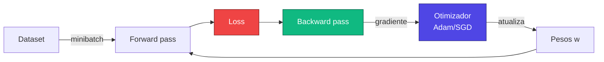
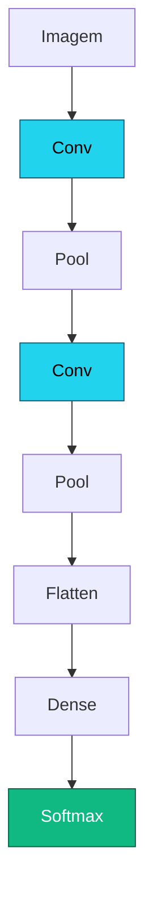

# Aula 3

## Keras/TensorFlow na prática
## Introdução a Visão Computacional

<div class="pt-12">
  <span class="px-2 py-1 rounded cursor-pointer" hover:bg="white op-10">
    Tópicos Avançados em Inteligência Artificial · UFABC
  </span>
</div>

<div class="abs-br m-6 text-sm opacity-60">
  Adaptado de MIT 15.773 (Farias, Ramakrishnan) — OCW
</div>

---

# Recapitulando: o fluxo de treinamento



<div class="mt-6 max-w-3xl mx-auto" v-click>

Hoje: como **rodar isso de verdade**, em código, e como tratar
**imagens** (entrada não estruturada).

</div>

---
layout: section
---

# Parte 1 — Treinamento na prática

Épocas, batches, regularização — e como tudo isso vira código em Keras.

---

# Épocas e batches

<div class="grid grid-cols-2 gap-8 mt-2">

<div>

<v-clicks>

- **Época** (*epoch*): uma passada completa pelo conjunto de treinamento
- No **GD puro**: 1 época = 1 atualização (calculamos gradiente em todos os exemplos)
- No **SGD/minibatch**: 1 época = **vários** updates, um por batch
- Tipicamente treinamos por **dezenas a milhares** de épocas

</v-clicks>

</div>

<div>
  <EpochBatch />
</div>

</div>

---

# Quantos batches por época?

<div class="mt-4 max-w-3xl mx-auto text-center">

$$
\text{batches por época} \;=\; \left\lceil \frac{\text{tamanho do treino}}{\text{tamanho do batch}} \right\rceil
$$

</div>

<div class="mt-8 max-w-3xl mx-auto" v-click>

**Exemplo (doença cardíaca):**

- Treino: 194 exemplos
- Batch size: 32
- Batches por época: $\lceil 194 / 32 \rceil = 7$

Os 6 primeiros batches têm 32 exemplos cada; o último tem só 2 ($6 \times 32 + 2 = 194$).

</div>

<div class="mt-6 text-center text-sm opacity-80" v-click>

O <em>batch size</em> é um <strong>hiperparâmetro</strong> — afeta velocidade e qualidade do treino.

</div>

---
layout: section
---

# *Overfitting* e regularização

Modelos com muita capacidade **decoram** os dados de treino. Como evitar?

---

# Underfitting × Overfitting

<div class="mt-2">
  <OverfittingCurve />
</div>

<div class="mt-4 grid grid-cols-2 gap-6 max-w-4xl mx-auto text-sm">

<div class="p-3 rounded bg-amber-500/10 border border-amber-500/30">
<strong class="text-amber-300">Underfitting</strong> — o modelo não tem capacidade
para capturar a riqueza dos dados. Erro alto em treino e validação.
</div>

<div class="p-3 rounded bg-rose-500/10 border border-rose-500/30">
<strong class="text-rose-300">Overfitting</strong> — o modelo decora os dados de
treino, incluindo ruído. Erro baixíssimo em treino, alto em validação.
</div>

</div>

---

# Em redes neurais

<v-clicks>

- Para aprender representações inteligentes de dados ricos
  (imagens, texto, áudio), uma rede precisa de **muita capacidade** —
  muitas camadas, muitos neurônios
- Mais capacidade → maior risco de **overfitting**
- Solução: **regularização**, várias técnicas que controlam essa capacidade
- As principais que vamos usar:
  - **Early stopping**
  - **Dropout**
  - **Weight decay** (também conhecido como L2 / $\ell_2$)
  - **Data augmentation** (visto na próxima aula)

</v-clicks>

---

# Estratégia 1 — Early stopping

<div class="grid grid-cols-2 gap-8 mt-2">

<div>

<v-clicks>

- Monitore a **loss de validação** durante o treino
- Pare assim que ela parar de cair
  (mesmo que a de treino ainda esteja diminuindo)
- Na prática: salvar os pesos do **melhor** modelo até agora,
  com tolerância (paciência) de algumas épocas

</v-clicks>

</div>

<div>
  <EarlyStopping />
</div>

</div>

<div class="mt-4 text-center text-sm opacity-80" v-click>

Em Keras: <code>callbacks.EarlyStopping(patience=10, restore_best_weights=True)</code>

</div>

---

# Estratégia 2 — Dropout

<div class="grid grid-cols-2 gap-8 mt-2">

<div>

<v-clicks>

- Em **cada passo** de treino, "desliga" aleatoriamente uma fração
  $p$ dos neurônios de uma camada (tipicamente $p = 0{,}5$)
- A rede é forçada a **distribuir** o aprendizado e não depender de
  nenhum neurônio específico
- Em **inferência** (validação/teste) o dropout é desativado
- Implementado como uma "camada de dropout" no Keras

</v-clicks>

</div>

<div>
  <DropoutViz />
</div>

</div>

<div class="mt-4 text-center text-sm opacity-80" v-click>

Em Keras: <code>keras.layers.Dropout(0.5)</code>

</div>

---

# Checklist completo para treinar uma DNN

<v-clicks>

1. **Preparar os dados** — encoding, normalização, split treino/val/teste
2. **Projetar a rede** — escolher número de camadas, neurônios e ativações
3. **Escolher a saída** apropriada ao problema (sigmoide, softmax, linear)
4. **Escolher a loss** que case com a saída
5. **Escolher o otimizador** (Adam) e a taxa de aprendizado
6. **Escolher a estratégia de regularização** (early stopping + dropout)
7. **Compilar e treinar** com Keras/TF
8. **Avaliar** em validação e teste

</v-clicks>

---
layout: section
---

# Parte 2 — TensorFlow & Keras

A pilha que usamos para escrever modelos de DL.

---

# O que é um *tensor*?

<div class="mt-4">
  <TensorRanks />
</div>

<div class="mt-4 text-center text-sm opacity-80 max-w-3xl mx-auto" v-click>

Um <strong>tensor</strong> é apenas um array multidimensional de números.<br/>
Imagens são tensores rank-3, vídeos rank-4, batches deles rank-5…

</div>

---

# TensorFlow — o que ele oferece

<div class="grid grid-cols-2 gap-6 mt-4">

<div v-click class="p-4 rounded bg-slate-800/40">

🧮 **Diferenciação automática**

Calcula $\nabla \mathcal{L}(\mathbf{w})$ de funções complicadíssimas
sem você ter que derivar nada à mão.

</div>

<div v-click class="p-4 rounded bg-slate-800/40">

⚙️ **Biblioteca de otimizadores**

Adam, RMSprop, AdamW, SGD com momento, Lion… todos prontos.

</div>

<div v-click class="p-4 rounded bg-slate-800/40">

🔀 **Distribuição automática**

Pode rodar em vários servidores e/ou GPUs com pouca mudança no código.

</div>

<div v-click class="p-4 rounded bg-slate-800/40">

⚡ **Adaptação a hardware paralelo**

Mesmo código roda em CPU, GPU (NVIDIA) e TPU (Google).

</div>

</div>

---

# Keras — a interface amigável

<div class="grid grid-cols-2 gap-8 mt-4">

<div>

<v-clicks>

- Camada de abstração que **roda em cima** do TensorFlow
- API limpa e legível, ótima para didática e prototipação
- Vem com:
  - **camadas pré-definidas** (Dense, Conv2D, LSTM…)
  - formas flexíveis de **descrever arquiteturas**
  - utilidades de **pré-processamento** e **carregamento** de dados
  - métricas, callbacks e exportação de modelos
  - **modelos pré-treinados** prontos para *fine-tuning*

</v-clicks>

</div>

<div>
  <KerasStack />
</div>

</div>

---

# Três jeitos de construir modelos no Keras

<div class="grid grid-cols-3 gap-4 mt-6">

<div v-click class="p-4 rounded bg-slate-800/40">

**Sequential**

```python
model = keras.Sequential([
  keras.layers.Dense(16, 'relu'),
  keras.layers.Dense(1,  'sigmoid'),
])
```

Pilha linear de camadas. Simples.

</div>

<div v-click class="p-4 rounded bg-slate-800/40 ring-1 ring-indigo-400">

**Functional API ⭐**

```python
inp = keras.Input(shape=(29,))
h   = keras.layers.Dense(16, 'relu')(inp)
out = keras.layers.Dense(1, 'sigmoid')(h)
model = keras.Model(inp, out)
```

Grafo. Permite *skip connections*, múltiplas saídas. Nosso default.

</div>

<div v-click class="p-4 rounded bg-slate-800/40">

**Subclassing**

```python
class MyModel(keras.Model):
  def call(self, x):
    ...
```

Para arquiteturas dinâmicas/exóticas.

</div>

</div>

---

# Treinando o modelo de doença cardíaca

```python {all|1-4|6-9|11|13-19|all}
# arquitetura (já vimos na aula 2)
inp = keras.Input(shape=(29,))
h   = keras.layers.Dense(16, activation='relu')(inp)
out = keras.layers.Dense(1,  activation='sigmoid')(h)
model = keras.Model(inp, out)

# compilar: loss + otimizador + métricas
model.compile(
  loss='binary_crossentropy',
  optimizer='adam',
  metrics=['accuracy'],
)

# treinar com early stopping
es = keras.callbacks.EarlyStopping(patience=10, restore_best_weights=True)
hist = model.fit(
  X_train, y_train,
  validation_data=(X_val, y_val),
  epochs=200, batch_size=32,
  callbacks=[es],
)
```

---
layout: section
---

# Parte 3 — Visão Computacional

Como representar imagens digitalmente e quais tarefas resolvemos com DL.

---

# Imagens em escala de cinza

<div class="mt-4">
  <GrayscaleImage />
</div>

<div class="mt-4 max-w-3xl mx-auto text-sm">

<v-clicks>

- Uma imagem em escala de cinza é um **array retangular** de pixels
- Cada pixel guarda um número de **0 a 255** (intensidade luminosa)
- 0 = preto, 255 = branco, valores intermediários = cinza
- Internamente: matriz **altura × largura** de inteiros

</v-clicks>

</div>

---

# Imagens coloridas (RGB)

<div class="mt-2">
  <RGBImage />
</div>

<div class="mt-4 max-w-3xl mx-auto text-sm">

<v-clicks>

- Cada pixel é representado por **3 intensidades**: vermelho, verde, azul
- Cada uma de 0 a 255
- A imagem vira **3 matrizes empilhadas** — chamamos cada uma de **canal**
- Tensor resultante: $H \times W \times 3$

</v-clicks>

</div>

---

# Tarefas-chave em visão computacional

<div class="mt-4 grid grid-cols-2 gap-6 max-w-5xl mx-auto">

<div v-click class="p-4 rounded bg-slate-800/40">
<div class="font-bold text-indigo-300 mb-1">Classificação</div>
<div class="text-sm opacity-80">Que <em>uma</em> classe está nessa imagem? Ex: "gato", "ovelha".</div>
</div>

<div v-click class="p-4 rounded bg-slate-800/40">
<div class="font-bold text-indigo-300 mb-1">Classificação + Localização</div>
<div class="text-sm opacity-80">Classe + caixa delimitando <em>onde</em> está o objeto na imagem.</div>
</div>

<div v-click class="p-4 rounded bg-slate-800/40">
<div class="font-bold text-indigo-300 mb-1">Detecção de objetos</div>
<div class="text-sm opacity-80">Várias caixas + várias classes em uma única imagem (ex: várias ovelhas).</div>
</div>

<div v-click class="p-4 rounded bg-slate-800/40">
<div class="font-bold text-indigo-300 mb-1">Segmentação semântica</div>
<div class="text-sm opacity-80">Classificar <em>cada pixel</em> em uma das N categorias.</div>
</div>

<div v-click class="col-span-2 p-4 rounded bg-slate-800/40">
<div class="font-bold text-indigo-300 mb-1">Segmentação de instâncias</div>
<div class="text-sm opacity-80">Como segmentação semântica, <em>e</em> distinguindo
indivíduos (ovelha 1, ovelha 2, ovelha 3…).</div>
</div>

</div>

---

# Visualização das tarefas

<div class="mt-4">
  <CVTasks />
</div>

---
layout: section
---

# Parte 4 — Classificação multiclasse

Como uma rede neural prevê uma de **N** classes possíveis.

---

# Aplicação motivadora: Fashion-MNIST

<div class="grid grid-cols-2 gap-8 mt-2">

<div>

<v-clicks>

- 70.000 imagens 28×28 em escala de cinza
- 10 categorias: camiseta, calça, pulôver, vestido,
  casaco, sandália, camisa, tênis, bolsa, bota
- Versão "moderna" do MNIST (que era de dígitos)
- Vamos treinar uma rede do zero e atingir
  **mais de 90 % de acurácia**

</v-clicks>

</div>

<div>
  <FashionMnist />
</div>

</div>

---

# Como representar uma saída de **10 classes**?

<v-clicks>

- Se fosse um número: 1 neurônio linear na saída ✅
- Se fosse uma probabilidade binária: 1 neurônio sigmoide ✅
- Mas **10 probabilidades** que somam 1?

</v-clicks>

<div class="mt-8 text-center text-2xl" v-click>

Precisamos de uma camada que <strong>normalize</strong> 10 números
arbitrários em uma <strong>distribuição de probabilidade</strong>.

</div>

---

# A camada *softmax*

<div class="mt-2">
  <SoftmaxViz />
</div>

<div class="mt-4 text-center max-w-3xl mx-auto">

$$
\mathrm{softmax}(z)_i \;=\; \frac{e^{z_i}}{\sum_{j=1}^{N} e^{z_j}}
$$

</div>

<div class="mt-2 text-center text-sm opacity-80" v-click>

Cada saída fica em $(0, 1)$ e a soma é exatamente $1$.

</div>

---

# Casando saída ↔ loss

<div class="mt-2 max-w-5xl mx-auto">

| Variável de saída | Camada de saída | Função de perda |
|:---|:---:|:---:|
| Único número (regressão) | linear (1 neurônio) | **MSE** |
| Probabilidade binária | sigmoide (1 neurônio) | **binary_crossentropy** |
| Vetor de números (regressão multi-saída) | linear (n neurônios) | **MSE** |
| Vetor de probabilidades que somam 1 (multiclasse) | **softmax** | **categorical_crossentropy** |

</div>

<div class="mt-6 text-center text-sm opacity-80" v-click>

Existe ainda <code>sparse_categorical_crossentropy</code> — mesma loss, mas aceita
rótulos como inteiros (0, 1, …, N−1) em vez de one-hot.

</div>

---

# Codificação dos rótulos × loss

<div class="grid grid-cols-3 gap-4 mt-4">

<div v-click class="p-4 rounded bg-slate-800/40">
<strong class="text-indigo-300">Binário (0/1)</strong>
<div class="text-xs opacity-70 mt-1">y ∈ {0, 1}</div>
<div class="font-mono text-xs mt-2 text-amber-300">binary_crossentropy</div>
</div>

<div v-click class="p-4 rounded bg-slate-800/40">
<strong class="text-indigo-300">Inteiro (0, 1, …, N−1)</strong>
<div class="text-xs opacity-70 mt-1">y ∈ {0, 1, ..., 9}</div>
<div class="font-mono text-xs mt-2 text-amber-300">sparse_categorical_crossentropy</div>
</div>

<div v-click class="p-4 rounded bg-slate-800/40">
<strong class="text-indigo-300">One-hot</strong>
<div class="text-xs opacity-70 mt-1">y = [0,…,1,…,0]</div>
<div class="font-mono text-xs mt-2 text-amber-300">categorical_crossentropy</div>
</div>

</div>

<div class="mt-6 text-center text-amber-300" v-click>

⚠ Loss errada para o tipo de rótulo é uma das fontes mais comuns de bug.

</div>

---

# Modelo simples para Fashion-MNIST

```python {all|1|3-7|9-12|all}
inp  = keras.Input(shape=(28, 28))         # imagem 28×28

x    = keras.layers.Flatten()(inp)         # achata para vetor de 784
x    = keras.layers.Dense(128, 'relu')(x)
x    = keras.layers.Dropout(0.3)(x)
x    = keras.layers.Dense(64,  'relu')(x)
out  = keras.layers.Dense(10,  'softmax')(x)

model = keras.Model(inp, out)
model.compile(loss='sparse_categorical_crossentropy',
              optimizer='adam',
              metrics=['accuracy'])
```

<div class="mt-4 text-sm opacity-80" v-click>

Esta é uma <strong>baseline</strong>: rede totalmente conectada operando sobre pixels
achatados. Funciona razoavelmente em Fashion-MNIST, mas para imagens maiores
precisamos de algo melhor — <strong>convoluções</strong>, na próxima aula.

</div>

---
layout: center
class: text-center
---

# Recapitulando

<div class="mt-4 grid grid-cols-2 gap-3 max-w-4xl mx-auto text-left text-sm">

<div class="p-3 rounded bg-slate-800/40">
<strong class="text-indigo-300">Época × batch</strong> — passar todos os exemplos vs. processar mini-grupos
</div>

<div class="p-3 rounded bg-slate-800/40">
<strong class="text-indigo-300">Overfitting</strong> — modelo decora o treino e falha em validação
</div>

<div class="p-3 rounded bg-slate-800/40">
<strong class="text-indigo-300">Early stopping & Dropout</strong> — duas regularizações essenciais
</div>

<div class="p-3 rounded bg-slate-800/40">
<strong class="text-indigo-300">Tensor</strong> — array N-D, a moeda do TF/Keras
</div>

<div class="p-3 rounded bg-slate-800/40">
<strong class="text-indigo-300">Functional API</strong> — nosso default em Keras
</div>

<div class="p-3 rounded bg-slate-800/40">
<strong class="text-indigo-300">Imagens</strong> — tensor H×W×3, valores 0..255
</div>

<div class="p-3 rounded bg-slate-800/40">
<strong class="text-indigo-300">Tarefas de CV</strong> — classificação → segmentação de instâncias
</div>

<div class="p-3 rounded bg-slate-800/40">
<strong class="text-indigo-300">Softmax + Cross-Entropy</strong> — par padrão para multiclasse
</div>

</div>

---

# Próximas aulas

<div class="mt-4 grid grid-cols-2 gap-8 max-w-4xl mx-auto">

<div>

<v-clicks>

- **Convoluções** e **CNNs** (camada que aprende filtros visuais)
- **Pooling** (reduz dimensão preservando informação)
- Arquiteturas clássicas: LeNet, AlexNet, VGG, ResNet
- **Transferência de aprendizado** com modelos pré-treinados
- **Data augmentation** para imagens

</v-clicks>

</div>

<div>



</div>

</div>

---
layout: center
class: text-center
---

# Obrigado! Perguntas?

<div class="mt-6 text-sm opacity-70">

Adaptado livremente de <em>15.773 Hands-on Deep Learning — Lecture 03A & 03B</em>
(MIT OpenCourseWare, 2024) — material original em inglês de Vivek Farias e Rama
Ramakrishnan, distribuído sob os termos do MIT OCW.

</div>

<div class="mt-2 text-xs opacity-60">
Para mais informações: https://ocw.mit.edu/terms
</div>
