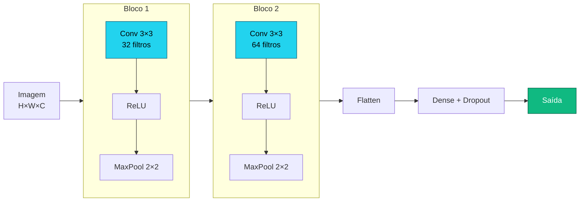
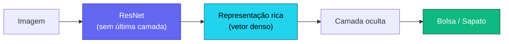

# Aula 3

## Redes Convolucionais e Transfer Learning

<div class="pt-12">
  <span class="px-2 py-1 rounded cursor-pointer" hover:bg="white op-10">
    Tópicos Avançados em Inteligência Artificial · UFABC
  </span>
</div>

<div class="abs-br m-6 text-sm opacity-60">
  Adaptado de MIT 15.773 (Farias, Ramakrishnan) — OCW
</div>

---
layout: section
---

# Parte 1 — Visão Computacional

Como representar imagens e que tarefas resolver com DL.

---

# Tensores e imagens

<div class="grid grid-cols-2 gap-8 mt-4">

<div>

**Tensor** = array N-dimensional de números:

<div class="mt-2">
  <TensorRanks />
</div>

</div>

<div class="flex flex-col gap-4 justify-center text-sm">

<div class="p-4 rounded bg-slate-800/40">

**Imagem em escala de cinza**<br/>
Matriz $H \times W$ — cada pixel: 0–255

</div>

<div class="p-4 rounded bg-slate-800/40">

**Imagem colorida (RGB)**<br/>
Tensor $H \times W \times 3$ — 3 canais (R, G, B)

</div>

<div class="p-4 rounded bg-slate-800/40">

**Batch de imagens**<br/>
Tensor $N \times H \times W \times 3$

</div>

</div>

</div>

---

# Tarefas de visão computacional

<div class="mt-4">
  <CVTasks />
</div>

<div class="mt-2 grid grid-cols-3 gap-3 max-w-4xl mx-auto text-xs">

<div class="p-2 rounded bg-slate-800/40">
<strong class="text-indigo-300">Classificação</strong><br/>Uma classe por imagem
</div>

<div class="p-2 rounded bg-slate-800/40">
<strong class="text-indigo-300">Detecção</strong><br/>Várias caixas + classes
</div>

<div class="p-2 rounded bg-slate-800/40">
<strong class="text-indigo-300">Segmentação</strong><br/>Classe por pixel
</div>

</div>

---

# Classificação multiclasse — softmax

<div class="mt-2 grid grid-cols-2 gap-8">

<div>

**Fashion-MNIST**: 70k imagens 28×28, 10 categorias.

<div class="mt-4">
  <FashionMnist />
</div>

</div>

<div>

Para $N$ classes, a camada de saída usa **softmax**:

$$\mathrm{softmax}(z)_i = \frac{e^{z_i}}{\displaystyle\sum_{j=1}^N e^{z_j}}$$

<div class="mt-4">
  <SoftmaxViz />
</div>

<div class="text-sm opacity-80 mt-2">

Saídas $\in (0,1)$ com soma exatamente $1$.

</div>

</div>

</div>

---

# Casando saída com loss

<div class="mt-4 max-w-5xl mx-auto">

| Variável de saída | Camada de saída | Keras / TF | PyTorch |
|:---|:---:|:---:|:---:|
| Número real | linear (1 neurônio) | `mse` | `nn.MSELoss` |
| Probabilidade binária | sigmoide (1 neurônio) | `binary_crossentropy` | `nn.BCELoss`* |
| Vetor de probabilidades | **softmax** (N neur.) | `categorical_crossentropy` | `nn.CrossEntropyLoss`† |
| Idem, rótulos inteiros | **softmax** (N neur.) | `sparse_categorical_crossentropy` | `nn.CrossEntropyLoss` |

<div class="text-xs opacity-60 mt-1">* preferir `nn.BCEWithLogitsLoss` (mais estável numericamente) &nbsp;&nbsp; † inclui log-softmax: não adicione `nn.Softmax` à saída</div>

</div>

<div class="mt-4 text-center text-amber-300 text-sm" v-click>

⚠ Loss errada para o tipo de rótulo é uma das fontes mais comuns de bug.

</div>

---

# Baseline: rede densa no Fashion-MNIST

<div class="grid grid-cols-2 gap-4 mt-2">

<div>

**Keras**

```python
inp  = keras.Input(shape=(28, 28))
x    = keras.layers.Flatten()(inp)
x    = keras.layers.Dense(128, 'relu')(x)
x    = keras.layers.Dropout(0.3)(x)
x    = keras.layers.Dense(64,  'relu')(x)
out  = keras.layers.Dense(10, 'softmax')(x)
model = keras.Model(inp, out)
model.compile(
  loss='sparse_categorical_crossentropy',
  optimizer='adam', metrics=['accuracy'])
```

</div>

<div>

**PyTorch**

```python
model = nn.Sequential(
    nn.Flatten(),
    nn.Linear(784, 128), nn.ReLU(),
    nn.Dropout(0.3),
    nn.Linear(128, 64),  nn.ReLU(),
    nn.Linear(64, 10),
)
criterion = nn.CrossEntropyLoss()
optimizer = optim.Adam(model.parameters())
# CrossEntropyLoss já inclui softmax!
```

</div>

</div>

<div class="mt-2 text-xs opacity-70 text-center" v-click>

Baseline de ~88 % com camadas densas. Podemos fazer melhor?

</div>

---
layout: section
---

# Parte 2 — Por que camadas densas não bastam

O problema de achatar imagens.

---

# O problema com Flatten

<div class="mt-4 max-w-3xl mx-auto">

<v-clicks>

- Imagem colorida de celular: **3024 × 3024 × 3 pixels**
- Achatar e conectar a uma camada de 100 neurônios → **≈ 2,7 bilhões de parâmetros**
- Computacionalmente inviável, precisa de enormes volumes de dados, propicia overfitting

</v-clicks>

<v-click>

<div class="mt-5 p-4 rounded bg-amber-900/30 border border-amber-500/40">

Ao achatar, perdemos a **estrutura espacial** — pixels vizinhos carregam informação local que a camada densa ignora.

</div>

</v-click>

<v-click>

<div class="mt-4 p-4 rounded bg-slate-800/40">

Se um padrão aparece em posições diferentes da imagem, a rede densa precisa **aprendê-lo de novo** para cada posição. Filtros convolucionais **aprendem uma vez e reutilizam** em qualquer posição.

</div>

</v-click>

</div>

---

# Flatten: o que se perde

<div class="grid grid-cols-3 gap-4 mt-4 items-center text-xs">

<div class="text-center">
<div class="opacity-60 mb-2">Imagem 4×4 (original)</div>
<div class="inline-grid grid-cols-4 font-mono" style="border:1px solid #475569">
<div class="px-2 py-1 text-center" style="background:#1e3a5f;color:#67e8f9;border-right:2px solid #64748b;border-bottom:2px solid #64748b">A</div>
<div class="px-2 py-1 text-center" style="background:#1e3a5f;color:#67e8f9;border-bottom:2px solid #64748b">B</div>
<div class="px-2 py-1 text-center opacity-40" style="border-bottom:2px solid #64748b">·</div>
<div class="px-2 py-1 text-center opacity-40" style="border-bottom:2px solid #64748b">·</div>
<div class="px-2 py-1 text-center" style="background:#1a3a2f;color:#6ee7b7;border-right:2px solid #64748b">C</div>
<div class="px-2 py-1 text-center" style="background:#1a3a2f;color:#6ee7b7">·</div>
<div class="px-2 py-1 text-center opacity-40">·</div>
<div class="px-2 py-1 text-center opacity-40">·</div>
<div class="px-2 py-1 text-center opacity-30" style="border-right:2px solid #64748b">·</div>
<div class="px-2 py-1 text-center opacity-30">·</div>
<div class="px-2 py-1 text-center opacity-30">·</div>
<div class="px-2 py-1 text-center opacity-30">·</div>
<div class="px-2 py-1 text-center opacity-30" style="border-right:2px solid #64748b">·</div>
<div class="px-2 py-1 text-center opacity-30">·</div>
<div class="px-2 py-1 text-center opacity-30">·</div>
<div class="px-2 py-1 text-center opacity-30">·</div>
</div>
<div class="mt-2">A–B: vizinhos → <span class="text-cyan-300">✓</span><br/>A–C: vizinhos ↓</div>
</div>

<div class="text-center text-xl opacity-40">→<br/>Flatten</div>

<div class="text-center">
<div class="opacity-60 mb-2">Vetor 1×16 (após Flatten)</div>
<div class="flex font-mono" style="border:1px solid #475569; width:fit-content; margin:auto">
<div class="px-1 py-1" style="background:#1e3a5f;color:#67e8f9;border-right:1px solid #475569">A</div>
<div class="px-1 py-1" style="background:#1e3a5f;color:#67e8f9;border-right:2px solid #f97316">B</div>
<div class="px-1 py-1 opacity-40" style="border-right:1px solid #475569">·</div>
<div class="px-1 py-1 opacity-40" style="border-right:2px solid #ef4444">·</div>
<div class="px-1 py-1" style="background:#1a3a2f;color:#6ee7b7;border-right:1px solid #475569">C</div>
<div class="px-1 py-1 opacity-30" style="border-right:1px solid #475569">·</div>
<div class="px-1 py-1 opacity-30" style="border-right:1px solid #475569">·</div>
<div class="px-1 py-1 opacity-30" style="border-right:1px solid #475569">·</div>
<div class="px-1 py-1 opacity-30" style="border-right:1px solid #475569">·</div>
<div class="px-1 py-1 opacity-30" style="border-right:1px solid #475569">·</div>
<div class="px-1 py-1 opacity-30" style="border-right:1px solid #475569">·</div>
<div class="px-1 py-1 opacity-30" style="border-right:1px solid #475569">·</div>
<div class="px-1 py-1 opacity-30" style="border-right:1px solid #475569">·</div>
<div class="px-1 py-1 opacity-30" style="border-right:1px solid #475569">·</div>
<div class="px-1 py-1 opacity-30" style="border-right:1px solid #475569">·</div>
<div class="px-1 py-1 opacity-30">·</div>
</div>
<div class="mt-2">A–B: ainda <span class="text-orange-400">vizinhos ✓</span><br/>A–C: agora <span class="text-red-400">4 posições apart ✗</span></div>
</div>

</div>

<div class="mt-4 grid grid-cols-3 gap-3 text-xs" v-click>

<div class="p-2 rounded bg-amber-900/30 border border-amber-500/30">
<strong class="text-amber-300">Explosão de parâmetros</strong><br/>
224×224×3 → 128 neurônios = <strong>19M params</strong> só nessa camada
</div>

<div class="p-2 rounded bg-amber-900/30 border border-amber-500/30">
<strong class="text-amber-300">Perde invariância</strong><br/>
Gato no canto ≠ gato no centro — a rede trata como entradas distintas
</div>

<div class="p-2 rounded bg-amber-900/30 border border-amber-500/30">
<strong class="text-amber-300">Perde adjacência 2D</strong><br/>
Vizinhos verticais ficam <em>largura</em> posições de distância no vetor
</div>

</div>

---
layout: section
---

# Parte 3 — Filtros Convolucionais

Como detectar padrões visuais de forma eficiente.

---

# O filtro convolucional

<div class="grid grid-cols-2 gap-8 mt-4">

<div>

<v-clicks>

- Um **filtro** é uma pequena matriz de números (ex.: 3×3)
- Deslizando sobre a imagem, detecta um tipo de padrão visual
- Uma **camada convolucional** tem múltiplos filtros; cada um aprende um padrão diferente

</v-clicks>

<div class="mt-6 font-mono text-sm bg-slate-900/60 p-3 rounded flex gap-10" v-click>

<div><span class="opacity-50">Borda vertical:</span><br/>&nbsp;1&nbsp;&nbsp;0&nbsp;-1<br/>&nbsp;1&nbsp;&nbsp;0&nbsp;-1<br/>&nbsp;1&nbsp;&nbsp;0&nbsp;-1</div>

<div><span class="opacity-50">Borda horizontal:</span><br/>&nbsp;1&nbsp;&nbsp;1&nbsp;&nbsp;1<br/>&nbsp;0&nbsp;&nbsp;0&nbsp;&nbsp;0<br/>-1&nbsp;-1&nbsp;-1</div>

</div>

</div>

<div>

<v-click>

<div class="p-4 rounded bg-slate-800/40 text-sm">

**Analogia com neurônio denso:**
- Neurônio denso → conectado a **todos** os pixels
- Filtro convolucional → conectado a uma **janela local** e desliza com os **mesmos pesos**

</div>

</v-click>

<v-click>

<div class="mt-4 p-4 rounded bg-indigo-900/30 border border-indigo-500/40 text-sm">

Benefícios:
- **Muito menos parâmetros**
- Preserva **adjacência espacial**
- **Invariância à translação** — detecta o mesmo padrão em qualquer posição

</div>

</v-click>

</div>

</div>

---

# A operação de convolução

<div class="grid grid-cols-2 gap-8 mt-2">

<div>

**Passos:**

<v-clicks>

1. Posiciona o filtro sobre uma janela da imagem
2. Multiplica elemento a elemento e soma → um escalar
3. Desliza (stride) e repete
4. Resultado: um **feature map**
5. Aplica ReLU para não-linearidade

</v-clicks>

</div>

<div class="text-sm font-mono">

<div class="bg-slate-900/60 p-3 rounded text-xs mt-2">

```
Janela 3×3:   Filtro (borda vertical):
1  2  3        1   0  -1
4  5  6   ×    1   0  -1   =  (1+4+7)−(3+6+9) = −6
7  8  9        1   0  -1
```

</div>

<div class="mt-4 p-3 rounded bg-slate-800/40 text-xs" v-click>

Valor alto no feature map = filtro **detectou** o padrão naquela região.

Ao empilhar camadas:
- Cam. 1 → bordas e texturas simples
- Cam. 2 → cantos, curvas
- Cam. 3+ → partes de objetos, objetos completos

</div>

</div>

</div>

---

# Convolução passo a passo

<div class="grid grid-cols-2 gap-6 mt-2">

<div class="text-xs">

**Entrada 6×6 (trecho)** — filtro 3×3 desliza com stride 1:

<div class="font-mono bg-slate-900/70 p-3 rounded mt-2 leading-6">

<span class="text-cyan-400">┌───┬───┬───┐</span> · · ·<br/>
<span class="text-cyan-400">│ 1 │ 2 │ 3 │</span> 0   1<br/>
<span class="text-cyan-400">│ 4 │ 5 │ 6 │</span> 1   0    → posição (0,0) → <strong class="text-emerald-400">−6</strong><br/>
<span class="text-cyan-400">│ 7 │ 8 │ 9 │</span> 0   1<br/>
<span class="text-cyan-400">└───┴───┴───┘</span> · · ·<br/>
<br/>
· <span class="text-amber-400">┌───┬───┬───┐</span> · ·<br/>
· <span class="text-amber-400">│ 2 │ 3 │ 0 │</span>          → posição (0,1) → <strong class="text-emerald-400"> 3</strong><br/>
· <span class="text-amber-400">│ 5 │ 6 │ 1 │</span><br/>
· <span class="text-amber-400">│ 8 │ 9 │ 0 │</span><br/>
· <span class="text-amber-400">└───┴───┴───┘</span> · ·

</div>

</div>

<div>

<div class="text-xs font-mono bg-slate-900/70 p-3 rounded">

**Filtro (borda vertical):**<br/>
&nbsp; 1 &nbsp; 0 &nbsp;-1<br/>
&nbsp; 1 &nbsp; 0 &nbsp;-1<br/>
&nbsp; 1 &nbsp; 0 &nbsp;-1

</div>

<div class="mt-3 text-xs font-mono bg-slate-900/70 p-3 rounded">

**Feature map resultante (4×4):**<br/>
<span class="text-emerald-400">-6 &nbsp; 3 &nbsp;...</span><br/>
<span class="text-emerald-400"> ... &nbsp;&nbsp;...</span>

</div>

<div class="mt-3 p-3 rounded bg-indigo-900/30 border border-indigo-500/30 text-xs" v-click>

Tamanho do output: $(H - F + 1) \times (W - F + 1)$<br/>
Entrada 6×6, filtro 3×3 → output **4×4**<br/>
Com **padding=1** → output **6×6** (mesma resolução)

</div>

</div>

</div>

---

# O que os filtros detectam

<div class="grid grid-cols-3 gap-4 mt-3">

<div class="p-3 rounded bg-slate-800/40 text-xs text-center">

**Borda vertical**

<div class="font-mono bg-slate-900/60 p-2 rounded mt-2 leading-5">
&nbsp;1 &nbsp;0 -1<br/>
&nbsp;1 &nbsp;0 -1<br/>
&nbsp;1 &nbsp;0 -1
</div>

<div class="mt-2 opacity-70">Alta resposta onde intensidade muda da esquerda para direita</div>

</div>

<div class="p-3 rounded bg-slate-800/40 text-xs text-center">

**Borda horizontal**

<div class="font-mono bg-slate-900/60 p-2 rounded mt-2 leading-5">
&nbsp;1 &nbsp;1 &nbsp;1<br/>
&nbsp;0 &nbsp;0 &nbsp;0<br/>
-1 -1 -1
</div>

<div class="mt-2 opacity-70">Alta resposta onde intensidade muda de cima para baixo</div>

</div>

<div class="p-3 rounded bg-slate-800/40 text-xs text-center">

**Blur (suavização)**

<div class="font-mono bg-slate-900/60 p-2 rounded mt-2 leading-5">
1/9 1/9 1/9<br/>
1/9 1/9 1/9<br/>
1/9 1/9 1/9
</div>

<div class="mt-2 opacity-70">Média dos vizinhos → suaviza ruído e detalhes</div>

</div>

</div>

<div class="mt-4 p-3 rounded bg-amber-900/30 border border-amber-500/40 text-sm" v-click>

Em CNNs, **os valores do filtro não são definidos à mão** — são **aprendidos pelo backprop**. A rede descobre sozinha quais padrões são úteis para a tarefa.
Camadas profundas combinam bordas → cantos → partes → objetos.

</div>

---

# Parâmetros de uma camada convolucional

<div class="mt-3 grid grid-cols-2 gap-3 text-xs">

<div class="p-3 rounded bg-slate-800/40">
<strong class="text-amber-300">Tamanho do filtro</strong>
<div class="flex gap-5 mt-2 items-end">
  <div class="text-center">
    <div class="font-mono leading-4"><span class="bg-amber-500/40 px-1">■ ■ ■</span><br/><span class="bg-amber-500/40 px-1">■ ■ ■</span><br/><span class="bg-amber-500/40 px-1">■ ■ ■</span></div>
    <div class="mt-1 opacity-60">3×3</div>
  </div>
  <div class="text-center">
    <div class="font-mono leading-4"><span class="bg-blue-500/30 px-1">■ ■ ■ ■ ■</span><br/><span class="bg-blue-500/30 px-1">■ ■ ■ ■ ■</span><br/><span class="bg-blue-500/30 px-1">■ ■ ■ ■ ■</span><br/><span class="bg-blue-500/30 px-1">■ ■ ■ ■ ■</span><br/><span class="bg-blue-500/30 px-1">■ ■ ■ ■ ■</span></div>
    <div class="mt-1 opacity-60">5×5</div>
  </div>
</div>
<div class="mt-2 opacity-60">3×3 preferido — bom custo-benefício</div>
</div>

<div class="p-3 rounded bg-slate-800/40">
<strong class="text-emerald-300">Número de filtros (K)</strong>
<div class="flex gap-3 mt-2 items-center">
  <div>
    <div class="font-mono leading-4 space-y-px"><div class="bg-emerald-500/20 border border-emerald-500/40 px-2 text-center">F₁</div><div class="bg-emerald-500/20 border border-emerald-500/40 px-2 text-center">F₂</div><div class="bg-emerald-500/20 border border-emerald-500/40 px-2 text-center">F₃</div></div>
    <div class="mt-1 opacity-60 text-center">K filtros</div>
  </div>
  <div class="opacity-50">→</div>
  <div>
    <div class="font-mono leading-4 space-y-px"><div class="bg-emerald-500/20 border border-emerald-500/40 px-2 text-center">map₁</div><div class="bg-emerald-500/20 border border-emerald-500/40 px-2 text-center">map₂</div><div class="bg-emerald-500/20 border border-emerald-500/40 px-2 text-center">map₃</div></div>
    <div class="mt-1 opacity-60 text-center">K feature maps</div>
  </div>
</div>
<div class="mt-2 opacity-60">K=32, 64, 128… (hiperparâmetro)</div>
</div>

<div class="p-3 rounded bg-slate-800/40">
<strong class="text-cyan-300">Stride</strong>
<div class="font-mono mt-2 leading-5">
  <div>stride=1:&nbsp; <span class="bg-cyan-500/40 px-px">■</span>□□□□ &nbsp;→&nbsp; □<span class="bg-cyan-500/40 px-px">■</span>□□□ &nbsp;→&nbsp; □□<span class="bg-cyan-500/40 px-px">■</span>□□</div>
  <div>stride=2:&nbsp; <span class="bg-cyan-500/40 px-px">■</span>□□□□ &nbsp;→&nbsp; □□<span class="bg-cyan-500/40 px-px">■</span>□□ &nbsp;→&nbsp; □□□□<span class="bg-cyan-500/40 px-px">■</span></div>
</div>
<div class="mt-2 opacity-60">stride&gt;1 reduz dimensão sem pooling</div>
</div>

<div class="p-3 rounded bg-slate-800/40">
<strong class="text-purple-300">Padding</strong>
<div class="flex gap-5 mt-2 text-center">
  <div>
    <div class="font-mono leading-4"><div class="border border-slate-500/50 px-1 inline-block">□ □ □<br/>□ □ □<br/>□ □ □</div></div>
    <div class="mt-1 opacity-60">sem padding<br/>saída menor</div>
  </div>
  <div>
    <div class="font-mono leading-4 opacity-50">0 0 0 0 0</div>
    <div class="font-mono leading-4"><span class="opacity-50">0</span> <span class="border border-slate-500/50 px-1 inline-block">□ □ □</span> <span class="opacity-50">0</span></div>
    <div class="font-mono leading-4"><span class="opacity-50">0</span> <span class="border border-slate-500/50 px-1 inline-block">□ □ □</span> <span class="opacity-50">0</span></div>
    <div class="font-mono leading-4"><span class="opacity-50">0</span> <span class="border border-slate-500/50 px-1 inline-block">□ □ □</span> <span class="opacity-50">0</span></div>
    <div class="font-mono leading-4 opacity-50">0 0 0 0 0</div>
    <div class="mt-1 opacity-60">"same" padding<br/>saída = entrada</div>
  </div>
</div>
</div>

</div>

<div class="mt-3 grid grid-cols-2 gap-3 text-xs" v-click>

<div class="p-3 rounded bg-slate-800/40">

**32 filtros 3×3 × 3 canais:**&nbsp; $32 \times (3{\times}3{\times}3 + 1) = 896$ params

</div>

<div class="p-3 rounded bg-amber-900/30 border border-amber-500/40">

Densa equivalente ($224{\times}224{\times}3 \to 32$): $\approx$ **4,8 M params**

</div>

</div>

---
layout: section
---

# Parte 4 — Pooling

Reduzindo dimensões sem perder o essencial.

---

# Max Pooling

<div class="grid grid-cols-2 gap-8 mt-4">

<div>

<v-clicks>

- Divide o feature map em janelas (ex.: 2×2)
- Retém apenas o **valor máximo** de cada janela
- Reduz a resolução espacial pela metade
- Menos parâmetros nas camadas seguintes

</v-clicks>

<div class="mt-4 p-3 rounded bg-slate-800/40 text-sm" v-click>

**Intuição:** se uma feature existe **em qualquer lugar** da janela, o max pooling a preserva. Confere robustez a pequenos deslocamentos.

</div>

</div>

<div class="text-sm font-mono">

<div class="bg-slate-900/60 p-3 rounded text-xs mt-4">

```
Feature map (4×4):    MaxPool 2×2:

 1   3  | 2   4         6   4
 5   6  | 1   2   →     7   5
---------+--------
 7   2  | 3   1
 4   1  | 5   2
```

</div>

</div>

</div>

---

# Max Pooling vs Average Pooling

<div class="grid grid-cols-2 gap-6 mt-3">

<div>

**Max Pooling** — preserva a *presença* da feature

<div class="font-mono text-xs bg-slate-900/70 p-3 rounded mt-2 leading-6">

Feature map (4×4):<br/>
<span class="text-cyan-300"> 1 &nbsp; 3 </span><span class="opacity-30">│</span><span class="text-amber-300"> 2 &nbsp; 4</span><br/>
<span class="text-cyan-300"> 5 &nbsp; 6 </span><span class="opacity-30">│</span><span class="text-amber-300"> 1 &nbsp; 2</span><br/>
<span class="opacity-30">─────┼─────</span><br/>
<span class="text-emerald-300"> 7 &nbsp; 2 </span><span class="opacity-30">│</span><span class="text-purple-300"> 3 &nbsp; 1</span><br/>
<span class="text-emerald-300"> 4 &nbsp; 1 </span><span class="opacity-30">│</span><span class="text-purple-300"> 5 &nbsp; 2</span><br/>
<br/>
→ MaxPool 2×2:<br/>
<span class="text-cyan-300">6</span> &nbsp;<span class="text-amber-300">4</span><br/>
<span class="text-emerald-300">7</span> &nbsp;<span class="text-purple-300">5</span>

</div>

<div class="text-xs mt-2 opacity-70">Máximo de cada janela: "este padrão <strong>existe</strong> aqui?"</div>

</div>

<div>

**Average Pooling** — preserva a *intensidade média*

<div class="font-mono text-xs bg-slate-900/70 p-3 rounded mt-2 leading-6">

Feature map (4×4):<br/>
<span class="text-cyan-300"> 1 &nbsp; 3 </span><span class="opacity-30">│</span><span class="text-amber-300"> 2 &nbsp; 4</span><br/>
<span class="text-cyan-300"> 5 &nbsp; 6 </span><span class="opacity-30">│</span><span class="text-amber-300"> 1 &nbsp; 2</span><br/>
<span class="opacity-30">─────┼─────</span><br/>
<span class="text-emerald-300"> 7 &nbsp; 2 </span><span class="opacity-30">│</span><span class="text-purple-300"> 3 &nbsp; 1</span><br/>
<span class="text-emerald-300"> 4 &nbsp; 1 </span><span class="opacity-30">│</span><span class="text-purple-300"> 5 &nbsp; 2</span><br/>
<br/>
→ AvgPool 2×2:<br/>
<span class="text-cyan-300">3.75</span> &nbsp;<span class="text-amber-300">2.25</span><br/>
<span class="text-emerald-300">3.5</span> &nbsp;&nbsp;<span class="text-purple-300">2.75</span>

</div>

<div class="text-xs mt-2 opacity-70">Média de cada janela: "qual a intensidade <strong>típica</strong> desta região?"</div>

</div>

</div>

<div class="mt-3 grid grid-cols-2 gap-4 text-xs" v-click>

<div class="p-2 rounded bg-slate-800/40">
<strong class="text-indigo-300">MaxPool</strong> — padrão em CNNs para visão; detecta a presença de features
</div>

<div class="p-2 rounded bg-slate-800/40">
<strong class="text-indigo-300">GlobalAvgPool</strong> — usado antes da cabeça de classificação em redes modernas (ex.: ResNet); produz um vetor por canal sem Flatten
</div>

</div>

---
layout: section
---

# Parte 5 — Arquitetura CNN

Combinando convoluções, pooling e camadas densas.

---

# Blocos convolucionais

<div class="mt-3 max-w-3xl mx-auto text-sm mb-4">

Uma CNN é construída por **blocos convolucionais** empilhados — cada bloco tem **mais profundidade** e **menor resolução** que o anterior — seguidos de camadas densas:

</div>



---

# CNN para Fashion-MNIST

<div class="grid grid-cols-2 gap-4 mt-2">

<div>

**Keras**

```python
inp = keras.Input(shape=(28, 28, 1))
x = keras.layers.Conv2D(
      32, 3, activation='relu', padding='same')(inp)
x = keras.layers.MaxPooling2D()(x)
x = keras.layers.Conv2D(
      64, 3, activation='relu', padding='same')(x)
x = keras.layers.MaxPooling2D()(x)
x = keras.layers.Flatten()(x)
x = keras.layers.Dense(128, activation='relu')(x)
x = keras.layers.Dropout(0.3)(x)
out = keras.layers.Dense(10, activation='softmax')(x)
model = keras.Model(inp, out)
model.compile(
  loss='sparse_categorical_crossentropy',
  optimizer='adam', metrics=['accuracy'])
```

</div>

<div>

**PyTorch**

```python
model = nn.Sequential(
    nn.Conv2d(1, 32, 3, padding=1), nn.ReLU(),
    nn.MaxPool2d(2),
    nn.Conv2d(32, 64, 3, padding=1), nn.ReLU(),
    nn.MaxPool2d(2),
    nn.Flatten(),
    nn.Linear(64 * 7 * 7, 128), nn.ReLU(),
    nn.Dropout(0.3),
    nn.Linear(128, 10),
)
criterion = nn.CrossEntropyLoss()
optimizer = optim.Adam(model.parameters())
```

</div>

</div>

<div class="mt-2 text-xs opacity-70 text-center" v-click>

CNN atinge **~92 %** no Fashion-MNIST, contra ~88 % da rede densa.

</div>

---

# Conexões Residuais (*Skip Connections*)

<div class="grid grid-cols-2 gap-6 mt-3">

<div class="text-sm">

**O problema de redes muito profundas**

<v-clicks>

- Gradiente se dissipa camada a camada (*vanishing gradient*)
- Redes com >20 camadas convergiam pior do que redes rasas

</v-clicks>

<div class="mt-4 p-3 rounded bg-indigo-900/30 border border-indigo-500/30" v-click>

**Ideia** (He et al., ResNet 2015): permitir que o sinal flua diretamente pulando camadas.

$$\mathbf{y} = \mathcal{F}(\mathbf{x},\, W) + \mathbf{x}$$

Em vez de aprender $\mathbf{y}$, o bloco aprende o **resíduo** $\mathcal{F} = \mathbf{y} - \mathbf{x}$.

</div>

<div class="mt-4 text-xs opacity-70" v-click>

Se $\mathcal{F} \approx 0$, o bloco age como **identidade** — nunca piora o resultado anterior.

</div>

</div>

<div v-click>

<div class="font-mono text-xs bg-slate-900/70 p-4 rounded">

```
x ──────────────────────────┐
│                           │ (skip)
↓                           │
Conv → BN → ReLU            │
↓                           │
Conv → BN                   │
↓                           │
(+) ←───────────────────────┘
↓
ReLU
↓
y = F(x,W) + x
```

</div>

<div class="mt-3 text-xs p-2 rounded bg-slate-800/40">
Gradiente flui pelo skip sem depender de $\mathcal{F}$ → redes de **100+ camadas** treinaram com sucesso (ResNet-152).
</div>

</div>

</div>

---
layout: section
---

# Parte 6 — Transfer Learning

Reutilizando o que foi aprendido em milhões de imagens.

---

# Duas tendências que viabilizaram o transfer learning

<div class="mt-4 max-w-3xl mx-auto">

<v-click>

**Tendência 1 — Arquiteturas especializadas:**

| Tipo de dado | Arquitetura |
|:---|:---:|
| Qualquer | Conexões residuais (ResNet) |
| Imagens | Camadas convolucionais |
| Sequências (texto, áudio, genes) | Transformers |

</v-click>

<v-click>

<div class="mt-5 p-4 rounded bg-slate-800/40">

**Tendência 2 — Modelos pré-treinados disponíveis:**  
Usando essas arquiteturas, pesquisadores treinaram redes de alto desempenho em grandes datasets reais. Inúmeros modelos estão publicamente disponíveis.

</div>

</v-click>

</div>

---

# A ideia central do transfer learning

<div class="grid grid-cols-2 gap-8 mt-4">

<div>

<v-clicks>

- **ImageNet**: milhões de imagens de 1000 categorias do cotidiano
- Uma rede treinada no ImageNet desenvolve representação **hierárquica** de objetos visuais:
  - Camadas iniciais → bordas e texturas
  - Camadas intermediárias → partes de objetos
  - Camadas finais → objetos completos

</v-clicks>

</div>

<div>

<v-click>

<div class="p-4 rounded bg-amber-900/30 border border-amber-500/40 text-sm">

**Problema:** temos apenas ~100 imagens de bolsas e sapatos. Uma CNN do zero não vai generalizar.

</div>

</v-click>

<v-click>

<div class="mt-4 p-4 rounded bg-indigo-900/30 border border-indigo-500/40 text-sm">

**Solução:** pegar uma ResNet treinada no ImageNet e **reutilizar** o que ela já aprendeu sobre imagens do cotidiano.

Transfer learning = **personalizar** uma rede pré-treinada para um novo problema.

</div>

</v-click>

</div>

</div>

---

# ResNet "decapitada" como extrator de features

<div class="mt-2 max-w-3xl mx-auto text-sm mb-4">

<v-clicks>

1. ResNet original classifica 1000 categorias — a última camada não nos serve
2. Removemos a última camada (**"headless" ResNet**)
3. Passamos nossas imagens → saída é uma representação densa e rica
4. Treinamos uma rede pequena em cima dessa representação

</v-clicks>

</div>



<div class="mt-2 text-center text-xs opacity-70" v-click>

Com apenas ~100 imagens, essa abordagem já produz alta acurácia.

</div>

---

# Feature extraction vs. Fine-tuning

<div class="mt-4 grid grid-cols-2 gap-6 max-w-4xl mx-auto">

<div class="p-4 rounded bg-slate-800/40">

**Feature extraction**

- Pesos da base pré-treinada ficam **congelados**
- Treina apenas a cabeça nova
- Mais rápido, funciona com poucos dados
- Indicado quando o dataset-alvo é pequeno e similar ao ImageNet

</div>

<div class="p-4 rounded bg-slate-800/40">

**Fine-tuning**

- Conecta base + cabeça e treina **tudo end-to-end**
- Deve partir dos pesos pré-treinados (não do zero)
- Usa learning rate menor para não "esquecer"
- Melhor quando há dados suficientes

</div>

</div>

---

# Transfer learning em código

<div class="grid grid-cols-2 gap-4 mt-2">

<div>

**Keras**

```python
base = keras.applications.ResNet50(
    weights='imagenet',
    include_top=False,
    input_shape=(224, 224, 3),
)
base.trainable = False   # congela

inp = keras.Input(shape=(224, 224, 3))
x   = base(inp, training=False)
x   = keras.layers.GlobalAveragePooling2D()(x)
x   = keras.layers.Dense(64, activation='relu')(x)
out = keras.layers.Dense(2,  activation='softmax')(x)

model = keras.Model(inp, out)
model.compile(
  loss='sparse_categorical_crossentropy',
  optimizer='adam', metrics=['accuracy'])
```

</div>

<div>

**PyTorch**

```python
import torchvision.models as models

base = models.resnet50(weights='IMAGENET1K_V2')

# Congela todos os pesos
for p in base.parameters():
    p.requires_grad = False

# Substitui a cabeça de classificação
n_feat = base.fc.in_features
base.fc = nn.Sequential(
    nn.Linear(n_feat, 64),
    nn.ReLU(),
    nn.Linear(64, 2),
)

optimizer = optim.Adam(base.fc.parameters())
criterion = nn.CrossEntropyLoss()
```

</div>

</div>

---

# Onde encontrar modelos pré-treinados

<div class="mt-6 grid grid-cols-3 gap-6 max-w-4xl mx-auto">

<div class="p-4 rounded bg-slate-800/40 text-center">
<div class="text-3xl mb-2">🔵</div>
<strong>TensorFlow Hub</strong>
<div class="text-xs opacity-70 mt-1">tensorflow.org/hub</div>
<div class="text-xs mt-2">Modelos Keras prontos para uso</div>
</div>

<div class="p-4 rounded bg-slate-800/40 text-center">
<div class="text-3xl mb-2">🟠</div>
<strong>PyTorch Hub</strong>
<div class="text-xs opacity-70 mt-1">pytorch.org/hub</div>
<div class="text-xs mt-2">ResNet, EfficientNet, BERT…</div>
</div>

<div class="p-4 rounded bg-slate-800/40 text-center">
<div class="text-3xl mb-2">🤗</div>
<strong>Hugging Face Hub</strong>
<div class="text-xs opacity-70 mt-1">huggingface.co/models</div>
<div class="text-xs mt-2">+500k modelos: visão, NLP, áudio</div>
</div>

</div>

---
layout: section
---

# Parte 7 — Aprendizado Auto-Supervisionado

---

# Por que pré-treinar sem rótulos?

<div class="grid grid-cols-2 gap-6 mt-4">

<div>

**O problema**

<v-clicks>

- Rotular dados é **caro e lento**
- Datasets anotados: ImageNet (1.2 M), CIFAR-10 (60 K)
- Dados não rotulados: **internet inteira**

</v-clicks>

</div>

<div>

**A ideia**

<v-clicks>

- Treinar o backbone em uma **tarefa auxiliar** criada a partir dos próprios dados
- Sem humano; o rótulo é gerado automaticamente
- Backbone aprendido é reutilizado (feature extraction / fine-tuning) com poucos exemplos rotulados

</v-clicks>

</div>

</div>

<div class="mt-5 p-3 rounded bg-indigo-900/30 border border-indigo-500/30 text-sm" v-click>

**Aprendizado Auto-Supervisionado (SSL)** = supervisão vem do próprio dado, não de anotadores humanos.

A tarefa auxiliar é chamada de **tarefa pretexto** (*pretext task*).

</div>

---

# Tarefas Pretexto

<div class="mt-2 text-sm">

Uma tarefa pretexto cria pares **(entrada, rótulo)** automaticamente, forçando o backbone a aprender representações úteis.

</div>

<div class="grid grid-cols-3 gap-3 mt-3 text-xs">

<div class="p-2 rounded bg-slate-800/40" v-click>
<div class="text-amber-300 font-semibold mb-1">🔄 Previsão de Rotação</div>
Rotaciona a imagem em 0°/90°/180°/270°. Prevê qual rotação foi aplicada.<br/>
<span class="opacity-50">Gidaris et al., 2018 — RotNet</span>
</div>

<div class="p-2 rounded bg-slate-800/40" v-click>
<div class="text-emerald-300 font-semibold mb-1">🧩 Patches Embaralhados</div>
Divide em 9 patches e embaralha. Prevê a permutação original.<br/>
<span class="opacity-50">Noroozi & Favaro, 2016 — Jigsaw</span>
</div>

<div class="p-2 rounded bg-slate-800/40" v-click>
<div class="text-cyan-300 font-semibold mb-1">🎭 Reconstrução Mascarada</div>
Mascara ~75% dos patches. Reconstrói os pixels mascarados.<br/>
<span class="opacity-50">He et al., 2022 — MAE</span>
</div>

<div class="p-2 rounded bg-slate-800/40" v-click>
<div class="text-purple-300 font-semibold mb-1">🔀 Aprendizado Contrastivo</div>
Maximiza similaridade entre visões da mesma imagem; minimiza entre diferentes.<br/>
<span class="opacity-50">Chen et al., 2020 — SimCLR</span>
</div>

<div class="p-2 rounded bg-slate-800/40" v-click>
<div class="text-rose-300 font-semibold mb-1">🎨 Colorização</div>
Recebe imagem em escala de cinza. Prevê as cores (canais a e b do espaço Lab).<br/>
<span class="opacity-50">Zhang et al., 2016</span>
</div>

<div class="p-2 rounded bg-slate-800/40" v-click>
<div class="text-sky-300 font-semibold mb-1">📍 Predição de Contexto</div>
Extrai dois patches aleatórios. Prevê a posição relativa entre eles (8 direções).<br/>
<span class="opacity-50">Doersch et al., 2015</span>
</div>

</div>

---

# Previsão de Rotação (RotNet)

<div class="grid grid-cols-2 gap-6 mt-4">

<div>

**Como funciona**

<v-clicks>

1. Pega uma imagem qualquer (sem rótulo)
2. Aplica uma das 4 rotações: 0°, 90°, 180°, 270°
3. Backbone extrai features; cabeça de classificação prevê qual rotação (4 classes)
4. Loss: Cross-Entropy padrão

</v-clicks>

</div>

<div class="text-xs bg-slate-900/70 p-3 rounded" v-click>

<div class="text-center opacity-60 mb-2">imagem original</div>

<div class="grid grid-cols-2 gap-2 text-center font-mono mb-2">
  <div class="border border-slate-600 rounded p-2">
    <div class="text-2xl mb-1">🐱</div>
    <div class="text-xs opacity-60">0°</div>
  </div>
  <div class="border border-slate-600 rounded p-2">
    <div class="text-2xl mb-1" style="transform:rotate(90deg);display:inline-block">🐱</div>
    <div class="text-xs opacity-60">90°</div>
  </div>
  <div class="border border-slate-600 rounded p-2">
    <div class="text-2xl mb-1" style="transform:rotate(180deg);display:inline-block">🐱</div>
    <div class="text-xs opacity-60">180°</div>
  </div>
  <div class="border border-slate-600 rounded p-2">
    <div class="text-2xl mb-1" style="transform:rotate(270deg);display:inline-block">🐱</div>
    <div class="text-xs opacity-60">270°</div>
  </div>
</div>

<div class="text-center font-mono opacity-70">backbone → softmax(4) → prevê: 90° ✓</div>

</div>

</div>

<div class="mt-4 text-sm p-3 rounded bg-slate-800/40" v-click>

**Por que funciona?** Para acertar a rotação, o modelo precisa entender *o que está na imagem* — a orientação natural de objetos. Isso força o backbone a aprender features semânticas.

</div>

---

# Patches Embaralhados (Jigsaw)

<div class="grid grid-cols-2 gap-6 mt-4">

<div class="text-sm">

**Procedimento**

<v-clicks>

1. Divide a imagem em uma grade 3×3 (9 patches)
2. Embaralha os patches com uma permutação aleatória $\pi$
3. Backbone processa cada patch; cabeça prevê $\pi$ de um conjunto pré-definido
4. Backbone aprende relações espaciais e contexto semântico

</v-clicks>

</div>

<div class="font-mono text-xs bg-slate-900/70 p-3 rounded" v-click>

```
Original:          Embaralhado:
┌───┬───┬───┐     ┌───┬───┬───┐
│ 1 │ 2 │ 3 │     │ 7 │ 4 │ 2 │
├───┼───┼───┤  →  ├───┼───┼───┤
│ 4 │ 5 │ 6 │     │ 1 │ 9 │ 5 │
├───┼───┼───┤     ├───┼───┼───┤
│ 7 │ 8 │ 9 │     │ 3 │ 6 │ 8 │
└───┴───┴───┘     └───┴───┴───┘

modelo deve prever: π = [7,4,2,1,9,5,3,6,8]
```

</div>

</div>

<div class="mt-3 text-sm p-3 rounded bg-slate-800/40" v-click>

**Intuição**: Para remontar a imagem, o modelo deve entender **o que pertence junto** — conceito-chave para reconhecimento de objetos.

</div>

---

# Colorização

<div class="grid grid-cols-2 gap-6 mt-4">

<div class="text-sm">

**Procedimento**

<v-clicks>

1. Converte a imagem para o espaço de cores **Lab**
   - Canal **L** = luminosidade (escala de cinza)
   - Canais **a, b** = cromaticidade (cor)
2. Fornece apenas o canal **L** ao backbone
3. Backbone prevê os canais **a** e **b**
4. Loss: erro quadrático médio nos canais de cor

</v-clicks>

<div class="mt-3 p-2 rounded bg-slate-800/40 text-xs" v-click>

**Por que funciona?** Para colorir corretamente, o modelo precisa identificar o *que* é cada objeto — grama é verde, céu é azul, pele tem tons específicos. Isso força aprendizado semântico.

</div>

</div>

<div class="text-xs bg-slate-900/70 p-4 rounded space-y-3" v-click>

<div class="text-center opacity-60">Imagem original (RGB)</div>
<div class="flex justify-center gap-1">
  <div class="px-3 py-2 rounded text-center" style="background:linear-gradient(135deg,#166534,#15803d)">verde</div>
  <div class="px-3 py-2 rounded text-center" style="background:linear-gradient(135deg,#1d4ed8,#93c5fd)">azul</div>
  <div class="px-3 py-2 rounded text-center" style="background:linear-gradient(135deg,#92400e,#d97706)">ocre</div>
</div>

<div class="text-center opacity-50">↓ converte para Lab</div>

<div class="flex justify-center gap-4">
  <div class="text-center">
    <div class="px-4 py-2 rounded font-mono" style="background:#1e293b;border:1px solid #475569">L</div>
    <div class="mt-1 opacity-60">entrada<br/>(cinza)</div>
  </div>
  <div class="text-center opacity-40 self-center">+</div>
  <div class="text-center">
    <div class="px-3 py-2 rounded font-mono" style="background:linear-gradient(135deg,#7f1d1d,#14532d);border:1px solid #475569">a, b</div>
    <div class="mt-1 opacity-60">target<br/>(cor)</div>
  </div>
</div>

<div class="font-mono text-center opacity-70">backbone(L) → prediz(a, b)<br/>loss = MSE(pred_ab, true_ab)</div>

</div>

</div>

<div class="mt-3 grid grid-cols-2 gap-3 text-xs" v-click>

<div class="p-2 rounded bg-slate-800/40">
<strong class="text-rose-300">Vantagem</strong>: rótulo vem da imagem original — nenhuma anotação humana necessária. Qualquer foto colorida serve como dado de treino.
</div>

<div class="p-2 rounded bg-slate-800/40">
<strong class="text-rose-300">Limitação</strong>: ambiguidade de cores (carros podem ser de qualquer cor). Modelos aprendem a prever cores "seguras" médias; versões recentes usam distribuições probabilísticas.
</div>

</div>

---

# Predição de Contexto (*Relative Patch Position*)

<div class="grid grid-cols-2 gap-6 mt-4">

<div class="text-sm">

**Procedimento** (Doersch et al., 2015)

<v-clicks>

1. Extrai o patch **central** da imagem
2. Extrai um patch **vizinho** em uma das 8 posições ao redor
3. Backbone processa ambos os patches
4. Cabeça prevê qual das **8 direções** o vizinho ocupa
5. Loss: Cross-Entropy (8 classes)

</v-clicks>

<div class="mt-3 p-2 rounded bg-slate-800/40 text-xs" v-click>

**Por que funciona?** Para acertar a posição relativa, o modelo precisa entender partes de objetos e suas relações espaciais — ex.: olhos ficam acima do nariz, rodas ficam abaixo do carro.

</div>

</div>

<div class="text-xs bg-slate-900/70 p-4 rounded" v-click>

<div class="font-mono text-center mb-3 opacity-60">Posições possíveis (8 direções)</div>

<div class="grid grid-cols-3 gap-1 font-mono text-center mx-auto" style="width:fit-content">
  <div class="px-3 py-2 border border-slate-600 rounded text-sky-300">↖ 1</div>
  <div class="px-3 py-2 border border-slate-600 rounded text-sky-300">↑ 2</div>
  <div class="px-3 py-2 border border-slate-600 rounded text-sky-300">↗ 3</div>
  <div class="px-3 py-2 border border-slate-600 rounded text-sky-300">← 4</div>
  <div class="px-3 py-2 border border-amber-500/60 rounded bg-amber-900/30 text-amber-300">ref</div>
  <div class="px-3 py-2 border border-slate-600 rounded text-sky-300">→ 5</div>
  <div class="px-3 py-2 border border-slate-600 rounded text-sky-300">↙ 6</div>
  <div class="px-3 py-2 border border-slate-600 rounded text-sky-300">↓ 7</div>
  <div class="px-3 py-2 border border-slate-600 rounded text-sky-300">↘ 8</div>
</div>

<div class="mt-4 font-mono">
backbone(patch_ref, patch_viz) → softmax(8)
<br/>prevê: posição 2 (acima) ✓
</div>

</div>

</div>

---

# Masked Autoencoders (MAE)

<div class="grid grid-cols-2 gap-5 mt-3">

<div class="text-sm">

**Ideia** (He et al., 2022)

<v-clicks>

- Divide a imagem em patches de 16×16
- Mascara ~75% dos patches aleatoriamente
- **Encoder** (ViT) processa apenas patches visíveis
- **Decoder** leve reconstrói os pixels mascarados
- Loss: MSE nos pixels mascarados

</v-clicks>

</div>

<div class="font-mono text-xs bg-slate-900/70 p-3 rounded" v-click>

```
imagem de entrada (patches):
■ ■ ■ ■ ■ ■ ■ ■
■ ■ ■ ■ ■ ■ ■ ■  (64 patches)

mascaramento (75%):
░ ■ ░ ░ ■ ░ ■ ░
░ ░ ■ ░ ░ ■ ░ ░  ░ = mascarado

Encoder → processa apenas ■
Decoder → reconstrói ░

→ backbone aprende representação
  densa das partes visíveis
```

</div>

</div>

<div class="mt-3 text-xs grid grid-cols-2 gap-3" v-click>

<div class="p-2 rounded bg-slate-800/40">
<strong>Por que 75%?</strong> Máscaras muito pequenas permitem interpolação trivial. 75% força compreensão global da cena.
</div>

<div class="p-2 rounded bg-slate-800/40">
<strong>Resultado:</strong> MAE pré-treina ViT-L em ImageNet em ~31 h (8 GPUs A100) e atinge SOTA em classificação com fine-tuning.
</div>

</div>

---

# Aprendizado Contrastivo (SimCLR)

<div class="grid grid-cols-2 gap-4 mt-2">

<div class="text-sm">

**Princípio**

<v-clicks>

- Cria 2 **visões aumentadas** da mesma imagem (crop, flip, jitter de cor...)
- Maximiza similaridade entre visões da **mesma** imagem
- Minimiza similaridade com **outras imagens** no batch

</v-clicks>

<div class="mt-2 p-2 rounded bg-slate-800/40 text-xs" v-click>

**NT-Xent Loss (InfoNCE)**:

$$\mathcal{L} = -\log \frac{\exp(\text{sim}(z_i, z_j)/\tau)}{\sum_{k \neq i} \exp(\text{sim}(z_i, z_k)/\tau)}$$

$\tau$ = temperatura; $z$ = embedding projetado

</div>

<div class="mt-2 text-xs p-2 rounded bg-indigo-900/30 border border-indigo-500/30" v-click>
Batch grande → mais negativos → melhor sinal. SimCLR usa batch 4096.
</div>

</div>

<div class="font-mono text-xs bg-slate-900/70 p-3 rounded" v-click>

```
imagem x
  ├─ aug1 ─→ encoder ─→ g(·) ─→ z₁ ┐
  └─ aug2 ─→ encoder ─→ g(·) ─→ z₂ ┘→ max sim(z₁,z₂)

outras imagens no batch:
  x' ─→ encoder ─→ g(·) ─→ z'
                             → min sim(z₁, z')

encoder: pesos compartilhados
g(·): projector, descartado
      após pré-treino
```

</div>

</div>

---

# Comparação dos Métodos SSL

<div class="mt-4 overflow-x-auto text-sm">

| Método | Tipo de sinal | Arquitetura | Pontos fortes |
|--------|---------------|-------------|---------------|
| **RotNet** | Classificação (4 classes) | CNN | Simples; boa para pretraining rápido |
| **Jigsaw** | Classificação de permutação | CNN | Aprende relações espaciais |
| **Colorização** | Regressão (cores Lab) | CNN encoder-decoder | Aprende semântica de objetos naturais |
| **Pred. Contexto** | Classificação (8 direções) | CNN | Aprende layout espacial da cena |
| **MAE** | Reconstrução de pixels | ViT + decoder | SOTA em ViTs; eficiente |
| **SimCLR** | Contrastivo (similaridade) | CNN/ViT | Independe de rótulos; muito flexível |
| **DINO** | Auto-distilação | ViT | Features emergentes de segmentação |

</div>

<div class="grid grid-cols-2 gap-3 mt-4 text-xs" v-click>

<div class="p-3 rounded bg-slate-800/40">
<strong class="text-amber-300">Métodos geradores</strong> (MAE, Jigsaw): o modelo reconstrói/ordena dados; aprendem geometria e textura detalhada.
</div>

<div class="p-3 rounded bg-slate-800/40">
<strong class="text-emerald-300">Métodos contrastivos</strong> (SimCLR, DINO): o modelo aprende invariâncias; aprendem semântica de alto nível.
</div>

</div>

---
layout: center
class: text-center
---

# Recapitulando

<div class="mt-4 grid grid-cols-2 gap-3 max-w-4xl mx-auto text-left text-sm">

<div class="p-3 rounded bg-slate-800/40">
<strong class="text-indigo-300">Tensor H×W×3</strong> — representação de imagens coloridas; batch: N×H×W×3
</div>

<div class="p-3 rounded bg-slate-800/40">
<strong class="text-indigo-300">Softmax + Cross-Entropy</strong> — saída multiclasse; loss correta para N categorias
</div>

<div class="p-3 rounded bg-slate-800/40">
<strong class="text-indigo-300">Flatten + Dense</strong> — baseline simples, mas explode em parâmetros e perde estrutura espacial
</div>

<div class="p-3 rounded bg-slate-800/40">
<strong class="text-indigo-300">Filtro convolucional</strong> — janela local com pesos compartilhados; aprende uma vez, aplica em toda a imagem
</div>

<div class="p-3 rounded bg-slate-800/40">
<strong class="text-indigo-300">Max Pooling</strong> — downsampling que preserva presença de features; robustez a deslocamentos
</div>

<div class="p-3 rounded bg-slate-800/40">
<strong class="text-indigo-300">CNN</strong> — blocos Conv+ReLU+Pool; profundidade cresce, resolução decresce
</div>

<div class="p-3 rounded bg-slate-800/40">
<strong class="text-indigo-300">Feature extraction</strong> — base congelada + nova cabeça; funciona com poucos dados
</div>

<div class="p-3 rounded bg-slate-800/40">
<strong class="text-indigo-300">Fine-tuning</strong> — treina tudo end-to-end partindo dos pesos pré-treinados
</div>

<div class="p-3 rounded bg-slate-800/40">
<strong class="text-indigo-300">Tarefa pretexto</strong> — rótulo gerado automaticamente do dado; força backbone a aprender representações úteis
</div>

<div class="p-3 rounded bg-slate-800/40">
<strong class="text-indigo-300">SSL</strong> — RotNet, Jigsaw, MAE, SimCLR; pré-treino sem anotações humanas
</div>

</div>

---

# Próxima aula

<div class="mt-6 max-w-3xl mx-auto">

<v-clicks>

- **Sequências e linguagem** — como representar texto para redes neurais
- **Embeddings** — vetores densos para palavras e tokens
- **RNNs e LSTMs** — redes que processam sequências passo a passo
- **Attention e Transformers** — o mecanismo que domina NLP moderno
- **BERT e GPT** — pré-treinamento e fine-tuning para tarefas de linguagem

</v-clicks>

</div>

---
layout: center
class: text-center
---

# Obrigado! Perguntas?

<div class="mt-6 text-sm opacity-70">

Adaptado livremente de *15.773 Hands-on Deep Learning — Lecture 04*
(MIT OpenCourseWare, 2024) — material original em inglês de Vivek Farias e
Rama Ramakrishnan, distribuído sob os termos do MIT OCW.

</div>

<div class="mt-2 text-xs opacity-60">
Para mais informações: https://ocw.mit.edu/terms
</div>
