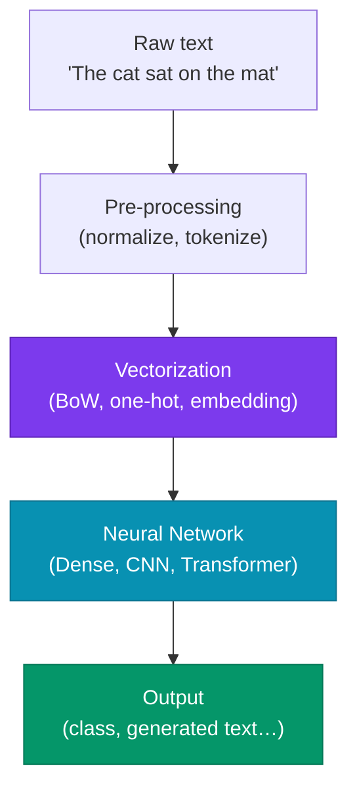
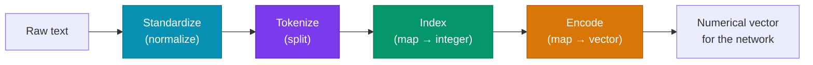
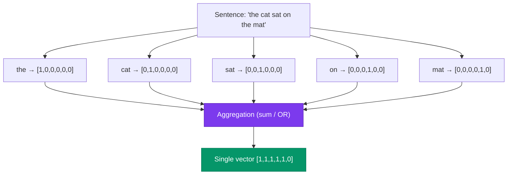
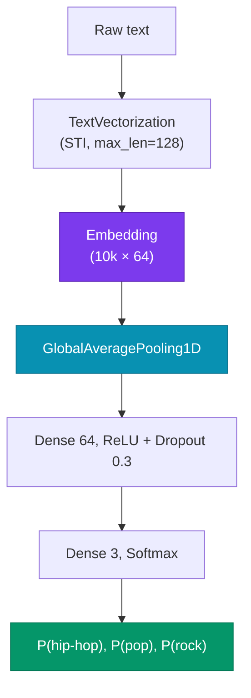

# Lecture 4

## NLP: Text Vectorization and Word Embeddings

<div class="pt-12">
  <span class="px-2 py-1 rounded cursor-pointer" hover:bg="white op-10">
    Advanced Topics in Artificial Intelligence · UFABC
  </span>
</div>

<div class="abs-br m-6 text-sm opacity-60">
  Adapted from MIT 15.773 (Farias, Ramakrishnan) — OCW
</div>

---
layout: section
---

# Part 1 — Why NLP?

---

# Lecture roadmap

<div class="grid grid-cols-2 gap-8 mt-6 text-sm">

<div class="space-y-3">

<div class="p-3 rounded bg-blue-900/30 border border-blue-500/40">

**Part 1 — Why NLP?**
Motivation, applications and historical arc

</div>

<div class="p-3 rounded bg-cyan-900/30 border border-cyan-500/40">

**Part 2 — Text Pre-processing**
Pipeline Standardize → Tokenize → Index → Encode

</div>

<div class="p-3 rounded bg-emerald-900/30 border border-emerald-500/40">

**Part 3 — Bag of Words**
Count encoding, multi-hot, limitations

</div>

</div>

<div class="space-y-3">

<div class="p-3 rounded bg-violet-900/30 border border-violet-500/40">

**Part 4 — Word Embeddings**
One-hot problems, Word2Vec, GloVe

</div>

<div class="p-3 rounded bg-amber-900/30 border border-amber-500/40">

**Part 5 — Embeddings in Code**
`nn.Embedding` (PyTorch), `Embedding` (Keras)

</div>

<div class="p-3 rounded bg-rose-900/30 border border-rose-500/40">

**Part 6 — Application**
Text classification with embeddings

</div>

</div>

</div>

---

# Why NLP?

<div class="grid grid-cols-2 gap-6 mt-4 text-sm">

<div>

**Human knowledge lives in natural language**

<v-clicks>

- The Internet is, for the most part, **text**
- Human communication and cultural production are **text**
- Corporate documents, contracts, medical records are **text**

</v-clicks>

<div class="mt-4 p-3 rounded bg-blue-900/30 border border-blue-500/30 text-xs" v-click>

**Imagine** a system that could automatically read and "understand" all of this — extracting patterns, classifying, answering questions, generating content.

</div>

</div>

<div v-click>

<strong>Applications in production</strong>

<div class="grid grid-cols-2 gap-2 mt-2 text-xs">

<div class="p-2 rounded bg-slate-800/60 border border-slate-600/30">
<div class="font-bold">🏷️ Classification</div>
<div>Sentiment, intent, routing</div>
</div>

<div class="p-2 rounded bg-slate-800/60 border border-slate-600/30">
<div class="font-bold">📋 Extraction</div>
<div>Financials, form data</div>
</div>

<div class="p-2 rounded bg-slate-800/60 border border-slate-600/30">
<div class="font-bold">📝 Summarization</div>
<div>Abstracts, bullet points, titles</div>
</div>

<div class="p-2 rounded bg-slate-800/60 border border-slate-600/30">
<div class="font-bold">✍️ Generation</div>
<div>Emails, reports, code</div>
</div>

<div class="p-2 rounded bg-slate-800/60 border border-slate-600/30">
<div class="font-bold">💬 Q&A / RAG</div>
<div>Chatbots, semantic search</div>
</div>

<div class="p-2 rounded bg-slate-800/60 border border-slate-600/30">
<div class="font-bold">🌐 Translation</div>
<div>Multilingual, code-switching</div>
</div>

</div>

</div>

</div>

---

# Historical arc of NLP

<div class="grid grid-cols-4 gap-3 mt-5 text-xs">

<div class="p-3 rounded bg-slate-800/60 border border-slate-600/40">

<div class="text-base mb-1">📜</div>
<div class="font-bold text-slate-300 mb-1">Rules</div>
<div class="text-slate-500 text-[10px] mb-2">up to 1990</div>

- Formal grammars
- Manual syntax parsers
- Performance limited by rule scale

</div>

<div class="p-3 rounded bg-cyan-900/30 border border-cyan-700/40">

<div class="text-base mb-1">📊</div>
<div class="font-bold text-cyan-300 mb-1">Statistical / ML</div>
<div class="text-slate-500 text-[10px] mb-2">1990 – 2013</div>

- Bag of Words + SVM
- Hidden Markov Models
- Logistic regression over n-grams

</div>

<div class="p-3 rounded bg-violet-900/30 border border-violet-700/40">

<div class="text-base mb-1">🧠</div>
<div class="font-bold text-violet-300 mb-1">Neural Networks</div>
<div class="text-slate-500 text-[10px] mb-2">2014 – 2017</div>

- RNNs and LSTMs
- Word2Vec, GloVe
- Seq2seq with attention

</div>

<div class="p-3 rounded bg-amber-900/30 border border-amber-700/40">

<div class="text-base mb-1">⚡</div>
<div class="font-bold text-amber-300 mb-1">Transformers</div>
<div class="text-slate-500 text-[10px] mb-2">2017 – today</div>

- "Attention is All You Need"
- BERT, GPT, T5, LLaMA
- General-purpose LLMs

</div>

</div>

<div class="mt-3 text-xs opacity-70 text-center" v-click>

*"Every time I fire a linguist, the performance of the speech recognizer goes up."*  — Frederick Jelinek, IBM

</div>

---

# Big picture: NLP as regression

<div class="grid grid-cols-2 gap-6 mt-4 text-sm">

<div>

**At its core, it's fancy regression**

$$\hat{y} = f(\mathbf{x}, \theta)$$

<v-clicks>

- $\mathbf{x}$ = input text (token sequence)
- $\hat{y}$ = text, label, number, …
- $\theta$ = neural network weights
- $f$ = deep architecture (CNN, RNN, Transformer…)

</v-clicks>

<div class="mt-4 p-3 rounded bg-indigo-900/30 border border-indigo-500/30 text-xs" v-click>

**Central question of this lecture:**  
How do we represent $\mathbf{x}$ (text) as a numerical vector so the network can learn?

</div>

</div>

<div v-click>



</div>

</div>

---
layout: section
---

# Part 2 — Text Pre-processing

---

# Pre-processing pipeline

<div class="mt-4">



</div>

<div class="grid grid-cols-4 gap-3 mt-4 text-xs">

<div class="p-3 rounded bg-cyan-900/30 border border-cyan-500/30" v-click>

**Standardize**
- Lowercase
- Remove punctuation/accents
- *Stop words* (sometimes)
- Stemming/lemmatization (sometimes)

</div>

<div class="p-3 rounded bg-violet-900/30 border border-violet-500/30" v-click>

**Tokenize**
- Split into tokens
- Default: whitespace
- Alternative: subwords (BPE)
- N-grams (bigram, trigram…)

</div>

<div class="p-3 rounded bg-emerald-900/30 border border-emerald-500/30" v-click>

**Index**
- Assign unique integer to each token
- Builds the **vocabulary** $\mathcal{V}$
- Special token `<UNK>` for out-of-vocabulary words

</div>

<div class="p-3 rounded bg-amber-900/30 border border-amber-500/30" v-click>

**Encode**
- Map integer → vector
- Simplest: one-hot
- Better: word embedding

</div>

</div>

---

# Pre-processing example

<div class="mt-3 text-xs">

**Original text:**

<div class="font-mono text-[11px] bg-slate-900/70 px-3 py-1 rounded mb-3">
"Hola! What do you picture when you think of traveling to Mexico? Sipping a real margarita while soaking up the sun on a laid-back beach in Puerto Vallarta?"
</div>

<div class="grid grid-cols-2 gap-x-6 gap-y-2">

<div v-click>

**After standardize** (lowercase, remove punctuation, stop words, stemming):

<div class="font-mono text-[10px] bg-slate-900/70 px-2 py-1 rounded mt-1">
`hola picture think travel mexico sip real margarita soak sun laidback beach puerto vallarta`
</div>

</div>

<div v-click>

**After tokenize** (by whitespace):

<div class="font-mono text-[10px] bg-slate-900/70 px-2 py-1 rounded mt-1">
`["hola", "picture", "think", "travel", "mexico", "sip", "real", "margarita", "soak", "sun", "laidback", "beach", "puerto", "vallarta"]`
</div>

</div>

<div v-click class="col-span-2">

**After index** (vocabulary with 50 k tokens):

<div class="font-mono text-[10px] bg-slate-900/70 px-2 py-1 rounded mt-1">
`[4231, 1807, 2943, 8821, 9012, 3344, 771, 18432, 6621, 488, 22301, 993, 19034, 19035]`
</div>

</div>

</div>

</div>

---

# One-hot encoding

<div class="grid grid-cols-2 gap-6 mt-3 text-sm">

<div>

**Idea:** each vocabulary token gets a vector with 1 at its position and 0 everywhere else.

<div class="mt-3 font-mono text-xs bg-slate-900/70 p-4 rounded">

```
Vocabulary (|V| = 5):  cat, dog, fish, bird, mouse

cat   → [1, 0, 0, 0, 0]
dog   → [0, 1, 0, 0, 0]
fish  → [0, 0, 1, 0, 0]
bird  → [0, 0, 0, 1, 0]
mouse → [0, 0, 0, 0, 1]
```

</div>

<div class="mt-3 p-3 rounded bg-slate-800/50 border border-slate-600/30 text-xs" v-click>

- Vector dimension = $|\mathcal{V}|$ (vocabulary size)
- Special token `<UNK>` (index 0) for out-of-vocabulary words
- **Sparse** representation — only one non-zero element

</div>

</div>

<div v-click>

**Problem:** for $|\mathcal{V}| = 50{,}000$, each token becomes a 50 k-dimensional vector.

<div class="mt-4 p-3 rounded bg-red-900/30 border border-red-500/30 text-xs">

❌ **Very high dimensionality** → many parameters, overfitting  
❌ **No semantic similarity** — distance between any two one-hot vectors is always $\sqrt{2}$, regardless of meaning

</div>

<div class="mt-3 p-3 rounded bg-slate-800/40 border border-slate-600/30 text-xs">

```python
from sklearn.preprocessing import LabelBinarizer

vocab = ["cat", "dog", "fish", "bird", "mouse"]
lb = LabelBinarizer()
lb.fit(vocab)
print(lb.transform(["cat", "fish"]))
# [[1 0 0 0 0]
#  [0 0 1 0 0]]
```

</div>

</div>

</div>

---
layout: section
---

# Part 3 — Bag of Words

---

# From per-token to per-document vectors

<div class="grid grid-cols-2 gap-6 mt-4 text-sm">

<div>

**The problem:** sentences have different lengths.

A 5-token sentence gives a $5 \times |\mathcal{V}|$ matrix.  
A 20-token sentence gives $20 \times |\mathcal{V}|$.

Dense networks need **fixed-size input**.

<div class="mt-4 p-3 rounded bg-indigo-900/30 border border-indigo-500/30 text-xs" v-click>

**Solution:** aggregate (*pool*) all token one-hot vectors into a single vector of size $|\mathcal{V}|$.

</div>

</div>

<div v-click>



</div>

</div>

---

# Bag of Words — two variants

<div class="grid grid-cols-2 gap-6 mt-4 text-sm">

<div>

**Count encoding** (sum of one-hot vectors)

Counts how many times each token appears.

<div class="font-mono text-xs bg-slate-900/70 p-3 rounded mt-2">

```
"the cat sat on the mat"
"the mat belonged to the cat"

vocab = [the, cat, sat, on, mat, belonged, to]

Sentence 1: [2, 1, 1, 1, 1, 0, 0]
Sentence 2: [2, 1, 0, 0, 1, 1, 1]
```

</div>

<div class="mt-2 text-xs opacity-70">

If "cat" appears 3×: that component = 3.

</div>

</div>

<div>

**Multi-hot encoding** (OR of one-hot vectors)

Indicates only whether the token is present (0 or 1).

<div class="font-mono text-xs bg-slate-900/70 p-3 rounded mt-2">

```
"the cat cat cat sat"

Count:     [1, 3, 1, 0, 0, 0, 0]
Multi-hot: [1, 1, 1, 0, 0, 0, 0]
```

</div>

<div class="mt-2 text-xs opacity-70">

Multi-hot ignores frequency; useful when presence matters more than count.

</div>

<div class="mt-3 p-2 rounded bg-violet-900/30 border border-violet-500/30 text-xs" v-click>

Both are forms of **Bag of Words** — the name comes from treating text as a "bag" of words without order.

</div>

</div>

</div>

---

# N-grams — capturing local context

<div class="grid grid-cols-2 gap-6 mt-4 text-sm">

<div>

**Unigram:** 1 token at a time (standard BoW)

**Bigram:** consecutive pairs of tokens

**Trigram:** consecutive triples of tokens

<div class="font-mono text-xs bg-slate-900/70 p-3 rounded mt-2">

```
Sentence: "the cat sat on the mat"

Unigrams:  ["the", "cat", "sat", "on", "the", "mat"]

Bigrams:   ["the cat", "cat sat",
            "sat on", "on the", "the mat"]

Trigrams:  ["the cat sat",
            "cat sat on",
            "sat on the",
            "on the mat"]
```

</div>

</div>

<div v-click>

**Why use n-grams?**

<div class="p-3 rounded bg-emerald-900/30 border border-emerald-500/30 text-xs mt-2">

✅ Preserves some local context  
✅ "not good" ≠ "good" (bigram captures negation)  
✅ Simple, works well for text classification

</div>

<div class="p-3 rounded bg-red-900/30 border border-red-500/30 text-xs mt-2" v-click>

❌ Vocabulary grows explosively: $|\mathcal{V}|^n$  
❌ Still ignores long-range dependencies  
❌ "good but not great" would need a 4-gram

</div>

<div class="text-xs opacity-60 mt-3">

```python
from sklearn.feature_extraction.text import CountVectorizer
cv = CountVectorizer(ngram_range=(1, 2))
X = cv.fit_transform(["the cat sat on the mat"])
```

</div>

</div>

</div>

---

# Bag of Words limitations

<div class="mt-4 text-sm">

<div class="grid grid-cols-3 gap-4">

<div class="p-4 rounded bg-red-900/20 border border-red-500/30" v-click>

**❌ Loses word order**

"The dog bit the man"  
and  
"The man bit the dog"

have the **same** BoW vector.

</div>

<div class="p-4 rounded bg-red-900/20 border border-red-500/30" v-click>

**❌ High dimensionality**

$|\mathcal{V}|$ can be 50 k–500 k.

Every input has that dimension regardless of sentence length.

Many parameters → overfitting, slow.

</div>

<div class="p-4 rounded bg-red-900/20 border border-red-500/30" v-click>

**❌ No semantics**

"movie" and "film" are equidistant from each other and from "banana".

BoW does not capture that they are related words.

</div>

</div>

<div class="mt-5 p-3 rounded bg-indigo-900/30 border border-indigo-500/30 text-xs" v-click>

**Summary:** BoW is a useful, simple baseline, but for tasks requiring semantic understanding or long-range dependencies we need something better — **Word Embeddings**.

</div>

</div>

---
layout: section
---

# Part 4 — Word Embeddings

---

# The problem with one-hot representations

<div class="grid grid-cols-2 gap-6 mt-4 text-sm">

<div>

**Problem 1: High dimensionality**

Vocabulary of 50 k words → 50 k-dimensional vector.  
Most elements are zero (**sparse**).

**Problem 2: No semantic distance**

<div class="mt-2 font-mono text-xs bg-slate-900/70 p-3 rounded">

```
"movie"  → [1, 0, 0, 0, 0, ...]
"film"   → [0, 1, 0, 0, 0, ...]
"banana" → [0, 0, 1, 0, 0, ...]

cosine("movie",  "film")   = 0
cosine("movie",  "banana") = 0
# All words are equally "distant"!
```

</div>

</div>

<div v-click>

**The ideal solution**

<div class="p-3 rounded bg-violet-900/30 border border-violet-500/30 text-xs">

**Dense** and **compact** vectors (dimension 50–300) where **geometric distance** reflects **semantic distance**.

</div>

<div class="mt-3 p-3 rounded bg-emerald-900/30 border border-emerald-500/30 text-xs">

```
"movie"  ≈ [0.2,  0.8, -0.3, ...]  # compact
"film"   ≈ [0.19, 0.79, -0.28, ...] # close to "movie"
"banana" ≈ [-0.6, 0.1,  0.9, ...]  # far from both

cosine("movie", "film")   ≈ 0.97  ✅
cosine("movie", "banana") ≈ 0.12  ✅
```

</div>

</div>

</div>

---

# The intuition: "you shall know a word by the company it keeps"

<div class="mt-4 text-sm">

<div class="text-center text-lg italic opacity-80 mb-4">

*"You shall know a word by the company it keeps."*

<span class="text-sm opacity-60">— John Firth, linguist (1957)</span>

</div>

<div class="grid grid-cols-2 gap-6">

<div v-click>

**Similar contexts → related words**

<div class="font-mono text-xs bg-slate-900/70 p-3 rounded mt-2">

```
"The acting in the ______ was superb."

→ movie      ✅
→ film       ✅
→ musical    ✅
→ truck      ❌
→ banana     ❌
```

</div>

Since "movie", "film" and "musical" appear in the **same contexts**, we infer they are semantically related.

</div>

<div v-click>

**Key insight**

<div class="p-3 rounded bg-indigo-900/30 border border-indigo-500/30 text-xs mt-2">

Count how often two tokens co-occur in the same contexts and learn vectors that **approximate** that co-occurrence matrix.

</div>

<div class="mt-3 text-xs opacity-70">

This is the foundation of two highly influential algorithms:

- **Word2Vec** (Mikolov et al., 2013) — local prediction
- **GloVe** (Pennington et al., 2014) — global co-occurrence

</div>

</div>

</div>

</div>

---

# Word2Vec — two models

<div class="grid grid-cols-2 gap-6 mt-3 text-sm">

<div>

**CBOW** (*Continuous Bag of Words*)

Given the context, predict the center word.

<div class="font-mono text-xs bg-slate-900/70 p-2 rounded mt-1">

```
Context → Center word
["The", "acting", "was", "superb"]  →  "in the ___"
```

</div>

**Skip-gram**

Given the center word, predict the context words.

<div class="font-mono text-xs bg-slate-900/70 p-2 rounded mt-1">

```
Center word → Context
"movie"  →  ["The", "acting", "was", "superb"]
```

</div>

</div>

<div v-click>

**Skip-gram objective**

Maximize the log-joint probability of contexts:

$$\mathcal{L} = \frac{1}{T} \sum_{t=1}^{T} \sum_{\substack{-c \le j \le c \\ j \neq 0}} \log P(w_{t+j} \mid w_t)$$

with

$$P(w_O \mid w_I) = \frac{\exp(\mathbf{v}_{w_O}^\top \mathbf{v}_{w_I})}{\sum_{w=1}^{|\mathcal{V}|} \exp(\mathbf{v}_w^\top \mathbf{v}_{w_I})}$$

<div class="mt-1 text-xs opacity-70">

The softmax over $|\mathcal{V}|$ is expensive — **negative sampling** is used: distinguish the real context from $k$ random negative samples.

</div>

</div>

</div>

---

# Word2Vec — Negative Sampling

<div class="grid grid-cols-2 gap-6 mt-4 text-sm">

<div>

**Problem:** softmax over 50 k tokens at every step is costly — $O(|\mathcal{V}|)$.

**Solution — Negative Sampling:**  
Instead of normalizing over the whole vocabulary, train a **binary classifier**:

$$P(D{=}1 \mid w, c) = \sigma(\mathbf{v}_c^\top \mathbf{v}_w)$$

*"Did this (word, context) pair come from the real corpus?"*

<div class="mt-3 font-mono text-xs bg-slate-900/70 p-3 rounded">

```
Positive pair: ("movie", "acting")  → label 1
Negative pairs (k random samples):
  ("movie", "table")    → label 0
  ("movie", "cloud")    → label 0
  ...
```

</div>

</div>

<div v-click>

**Objective with negative sampling:**

$$\mathcal{L} = \log \sigma(\mathbf{v}_c^\top \mathbf{v}_w) + \sum_{i=1}^k \mathbb{E}_{w_i \sim P_n}\!\left[\log \sigma(-\mathbf{v}_{w_i}^\top \mathbf{v}_w)\right]$$

<div class="mt-3 p-3 rounded bg-emerald-900/30 border border-emerald-500/30 text-xs">

✅ Per-step complexity: $O(k)$ with $k \ll |\mathcal{V}|$ (typically $k = 5$–$20$)  
✅ Empirically produces embeddings of similar quality to full softmax

</div>

<div class="mt-3 text-xs opacity-70">

More frequent words have a higher probability of being sampled as negatives (distribution $P_n(w) \propto f(w)^{3/4}$).

</div>

</div>

</div>

---

# GloVe — Global Vectors

<div class="grid grid-cols-2 gap-6 mt-4 text-sm">

<div>

**Intuition:** Word2Vec uses local windows. GloVe uses **global co-occurrences** of the corpus.

**Step 1:** Count $X_{ij}$ = how many times word $j$ appears in the context of word $i$ across the entire corpus.

<div class="font-mono text-xs bg-slate-900/70 p-3 rounded mt-2">

```
           movie  film  banana  ...
movie    [  ―,   8432,    12,  ... ]
film     [ 8432,  ―,       9,  ... ]
banana   [   12,   9,     ―,   ... ]
```

</div>

<div class="mt-2 text-xs opacity-70">

"movie" and "film" co-occur a lot; both rarely co-occur with "banana".

</div>

</div>

<div v-click>

**Step 2:** Learn vectors that approximate the co-occurrence matrix.

**Log-bilinear model:**

$$\log X_{ij} = \mathbf{w}_i^\top \mathbf{w}_j + b_i + b_j$$

**Objective** (weighted least squares):

$$\mathcal{L} = \sum_{i,j} f(X_{ij})\!\left(\mathbf{w}_i^\top \mathbf{w}_j + b_i + b_j - \log X_{ij}\right)^2$$

where $f(X_{ij})$ is a weighting function that prevents very frequent pairs from dominating training.

<div class="mt-2 text-xs opacity-70">

At the end, biases $b$ are discarded and only $\mathbf{w}$ is used.

</div>

</div>

</div>

---

# Geometric properties of embeddings

<div class="grid grid-cols-2 gap-6 mt-2">

<div>

<svg viewBox="0 0 300 195" xmlns="http://www.w3.org/2000/svg" class="w-full">
  <defs>
    <marker id="ag" markerWidth="7" markerHeight="7" refX="5" refY="3" orient="auto"><path d="M0,0 L0,6 L7,3 z" fill="#a78bfa"/></marker>
    <marker id="ab" markerWidth="7" markerHeight="7" refX="5" refY="3" orient="auto"><path d="M0,0 L0,6 L7,3 z" fill="#38bdf8"/></marker>
  </defs>
  <rect width="300" height="195" fill="#0f172a" rx="8"/>
  <!-- horizontal arrows: royalty -->
  <line x1="88" y1="148" x2="188" y2="148" stroke="#38bdf8" stroke-width="1.5" stroke-dasharray="5,2" marker-end="url(#ab)"/>
  <line x1="88" y1="58" x2="188" y2="58" stroke="#38bdf8" stroke-width="1.5" stroke-dasharray="5,2" marker-end="url(#ab)"/>
  <!-- vertical arrows: gender -->
  <line x1="68" y1="133" x2="68" y2="73" stroke="#a78bfa" stroke-width="1.5" marker-end="url(#ag)"/>
  <line x1="210" y1="133" x2="210" y2="73" stroke="#a78bfa" stroke-width="1.5" marker-end="url(#ag)"/>
  <!-- axis labels -->
  <text x="130" y="165" fill="#38bdf8" font-size="8" font-family="monospace" text-anchor="middle">+ royalty</text>
  <text x="130" y="47" fill="#38bdf8" font-size="8" font-family="monospace" text-anchor="middle">+ royalty</text>
  <text x="34" y="103" fill="#a78bfa" font-size="8" font-family="monospace" text-anchor="middle">gender</text>
  <text x="248" y="103" fill="#a78bfa" font-size="8" font-family="monospace" text-anchor="middle">gender</text>
  <!-- nodes -->
  <circle cx="68" cy="148" r="5" fill="#64748b"/>
  <text x="68" y="168" fill="#94a3b8" font-size="11" font-family="sans-serif" text-anchor="middle">man</text>
  <circle cx="68" cy="58" r="5" fill="#64748b"/>
  <text x="68" y="44" fill="#94a3b8" font-size="11" font-family="sans-serif" text-anchor="middle">woman</text>
  <circle cx="210" cy="148" r="6" fill="#f59e0b"/>
  <text x="210" y="168" fill="#fcd34d" font-size="11" font-family="sans-serif" text-anchor="middle">king</text>
  <circle cx="210" cy="58" r="6" fill="#f59e0b"/>
  <text x="210" y="44" fill="#fcd34d" font-size="11" font-family="sans-serif" text-anchor="middle">queen</text>
  <text x="150" y="186" fill="#475569" font-size="8" font-family="monospace" text-anchor="middle">king − man + woman ≈ queen</text>
</svg>

<div class="text-xs opacity-60 mt-1">
2D projection — each dimension captures a latent concept that emerges from training.
</div>

</div>

<div class="text-xs" v-click>

<div class="font-bold text-sm mb-2">Types of relations that emerge</div>

<div class="space-y-1">

<div class="p-2 rounded bg-violet-900/30 border border-violet-700/40">
<span class="font-bold text-violet-300">Gender</span><br>
king → queen · actor → actress · man → woman
</div>

<div class="p-2 rounded bg-cyan-900/30 border border-cyan-700/40">
<span class="font-bold text-cyan-300">Country → Capital</span><br>
France → Paris · Brazil → Brasília · Japan → Tokyo
</div>

<div class="p-2 rounded bg-amber-900/30 border border-amber-700/40">
<span class="font-bold text-amber-300">Superlative / Degree</span><br>
good → better → best · big → bigger → biggest
</div>

<div class="p-2 rounded bg-emerald-900/30 border border-emerald-700/40">
<span class="font-bold text-emerald-300">Verb tense</span><br>
run → ran · sing → sang · go → went
</div>

<div class="p-2 rounded bg-rose-900/30 border border-rose-700/40">
<span class="font-bold text-rose-300">Antonyms</span><br>
hot ↔ cold · fast ↔ slow · big ↔ small
</div>

</div>

<div class="mt-2 p-2 rounded bg-amber-900/20 border border-amber-700/30 text-[10px]">
⚠️ These patterns emerge from the corpus — and also reflect its <span class="font-bold">biases</span> (Wikipedia, Common Crawl…).
</div>

</div>

</div>

---

# Static vs contextual embeddings

<div class="mt-4 text-sm">

<div class="grid grid-cols-2 gap-6">

<div class="p-4 rounded bg-slate-800/40 border border-slate-600/30">

**Static embeddings**  
(Word2Vec, GloVe, FastText)

<v-clicks>

- One fixed vector per word, independent of context
- Fast to compute, low memory footprint
- Good for simple classification tasks

</v-clicks>

<div class="mt-3 p-2 rounded bg-red-900/20 border border-red-500/30 text-xs" v-click>

❌ "bank" (financial) has the same vector as "bank" (riverbank)

</div>

</div>

<div class="p-4 rounded bg-slate-800/40 border border-slate-600/30">

**Contextual embeddings**  
(ELMo, BERT, GPT)

<v-clicks>

- Vector depends on all other tokens in the sentence
- Captures polysemy and long-range dependencies
- Foundation of modern LLMs

</v-clicks>

<div class="mt-3 p-2 rounded bg-emerald-900/20 border border-emerald-500/30 text-xs" v-click>

✅ "bank" generates different vectors in each context — computed by a **Transformer** (Lecture 6!)

</div>

</div>

</div>

<div class="mt-4 p-3 rounded bg-indigo-900/30 border border-indigo-500/30 text-xs" v-click>

**This lecture** covers static embeddings. **Lecture 5** covers RNNs/LSTMs and **Lecture 6** covers Transformers and contextual embeddings.

</div>

</div>

---
layout: section
---

# Part 5 — Embeddings in Code

---

# `nn.Embedding` — PyTorch

<div class="grid grid-cols-2 gap-4 mt-3 text-sm">

<div>

**What it is:** a lookup table — maps integer indices to dense vectors.

```python
import torch
import torch.nn as nn

# vocab_size = vocabulary size
# embed_dim  = embedding dimension
embed = nn.Embedding(
    num_embeddings=10_000,  # |V|
    embedding_dim=128        # d
)

# Token indices for a batch of 2 sentences
# (zero-padded to max_len=5)
tokens = torch.tensor([
    [42, 871, 3, 0, 0],
    [7, 1024, 55, 810, 2]
])  # (batch=2, seq_len=5)

out = embed(tokens)  # (2, 5, 128)
print(out.shape)     # torch.Size([2, 5, 128])
```

</div>

<div v-click>

**Loading pre-trained weights (GloVe)**

```python
import numpy as np

# Assumes glove_matrix: (|V|, d) pre-loaded
embed = nn.Embedding(
    num_embeddings=vocab_size,
    embedding_dim=100
)
embed.weight = nn.Parameter(
    torch.tensor(glove_matrix, dtype=torch.float32)
)

# Optional: freeze weights during fine-tuning
embed.weight.requires_grad = False
```

<div class="mt-3 p-2 rounded bg-slate-800/40 border border-slate-600/30 text-xs">

`nn.Embedding` is equivalent to an `nn.Linear` layer without bias, but with O(1) lookup — it does not perform a full matrix multiplication over all sentences.

</div>

</div>

</div>

---

# `Embedding` layer — Keras

<div class="grid grid-cols-2 gap-4 mt-3 text-sm">

<div>

**Full pipeline with Keras**

```python
import tensorflow as tf
from tensorflow import keras

# 1. Vectorization (STI)
vectorizer = keras.layers.TextVectorization(
    max_tokens=10_000,   # |V|
    output_mode='int',   # returns indices
    output_sequence_length=64  # max_len
)
vectorizer.adapt(train_texts)  # learns vocabulary

# 2. Embedding
embed = keras.layers.Embedding(
    input_dim=10_000,    # |V|
    output_dim=128,      # d
    mask_zero=True       # ignore padding
)
```

</div>

<div v-click>

**Full model**

```python
inp  = keras.Input(shape=(1,), dtype='string')
x    = vectorizer(inp)          # (batch, 64)
x    = embed(x)                 # (batch, 64, 128)
x    = keras.layers.GlobalAveragePooling1D()(x)
      # mean over seq_len → (batch, 128)
x    = keras.layers.Dense(64, activation='relu')(x)
out  = keras.layers.Dense(num_classes,
                          activation='softmax')(x)

model = keras.Model(inp, out)
model.compile(
    loss='sparse_categorical_crossentropy',
    optimizer='adam',
    metrics=['accuracy']
)
```

</div>

</div>

---

# Global Average Pooling — why it works

<div class="grid grid-cols-2 gap-6 mt-3 text-sm">

<div>

After `Embedding`, each sentence is a **matrix** $(T \times d)$. We need a **fixed vector** for the dense layer.

<div class="mt-2 font-mono text-xs bg-slate-900/70 px-3 py-2 rounded">

```
"the cat sat"  →  Embedding
[[0.2, -0.1, 0.8, ...],  ← "the"
 [0.7,  0.3, 0.1, ...],  ← "cat"
 [0.4, -0.2, 0.6, ...]]  ← "sat"   shape: (3,d)

GAP → mean over T
→ [0.43, 0.0, 0.5, ...]            shape: (d,)
```

</div>

</div>

<div v-click class="text-xs">

<div class="font-bold mb-2">Alternatives to GlobalAveragePooling</div>

<div class="space-y-1">

<div class="p-2 rounded bg-slate-800/40 border border-slate-600/30">
<span class="font-bold">Flatten</span> — concatenates all vectors into $(T \times d)$, requires fixed length.
</div>

<div class="p-2 rounded bg-slate-800/40 border border-slate-600/30">
<span class="font-bold">GlobalMaxPooling1D</span> — maximum per dimension, preserves strongest activations.
</div>

<div class="p-2 rounded bg-emerald-900/30 border border-emerald-500/30">
<span class="font-bold">[CLS] token / attention</span> — Transformer strategies (Lecture 6). BERT uses <code>[CLS]</code>.
</div>

</div>

<div class="mt-2 p-2 rounded bg-indigo-900/30 border border-indigo-500/30">
GAP is equivalent to a BoW weighted by embeddings — simple yet surprisingly effective.
</div>

</div>

</div>

---
layout: section
---

# Part 6 — Application: Text Classification

---

# Musical genre classification

<div class="grid grid-cols-2 gap-6 mt-3 text-sm">

<div>

**Task:** given a song lyric excerpt, classify it as hip-hop, pop or rock.

<div class="font-mono text-xs bg-slate-900/70 px-3 py-2 rounded mt-2 border-l-4 border-blue-500 leading-5">
*"I grew up on the crime side, the New York Times side…
Had secondhands, Mom's bounced on old man…"*
→ <b>hip-hop</b> 🎤
</div>

<div class="font-mono text-xs bg-slate-900/70 px-3 py-2 rounded mt-2 border-l-4 border-rose-500 leading-5">
*"I walked through the door with you
But something about it felt like home somehow…"*
→ <b>pop</b> 🎵
</div>

</div>

<div v-click>

<div class="font-bold text-xs mb-1">BoW + Embedding architecture</div>



</div>

</div>

---

# Full code — PyTorch

<div class="text-xs leading-tight mt-2">

```python
import torch, torch.nn as nn, torch.optim as optim

class TextClassifier(nn.Module):
    def __init__(self, vocab_size, embed_dim, num_classes):
        super().__init__()
        self.embed   = nn.Embedding(vocab_size, embed_dim, padding_idx=0)
        self.dropout = nn.Dropout(0.3)
        self.fc1     = nn.Linear(embed_dim, 64)
        self.fc2     = nn.Linear(64, num_classes)

    def forward(self, x):          # x: (batch, seq_len)
        x = self.embed(x)          # (batch, seq_len, embed_dim)
        x = x.mean(dim=1)          # GAP: (batch, embed_dim)
        x = self.dropout(x)
        x = torch.relu(self.fc1(x))
        return self.fc2(x)         # (batch, num_classes)

model     = TextClassifier(vocab_size=10_000, embed_dim=64, num_classes=3)
criterion = nn.CrossEntropyLoss()
optimizer = optim.Adam(model.parameters(), lr=1e-3)

for epoch in range(10):
    for tokens, labels in train_loader:
        logits = model(tokens)
        loss   = criterion(logits, labels)
        optimizer.zero_grad(); loss.backward(); optimizer.step()
```

</div>

---

# Comparison: BoW vs Embeddings

<div class="mt-3 text-sm">

| | **BoW (count/multi-hot)** | **Embedding + GAP** |
|---|---|---|
| Representation | Sparse (\|V\|-dimensional) | Dense (d-dim, d ≪ \|V\|) |
| Semantics | ❌ No semantic distance | ✅ Similar words are close |
| Word order | ❌ Ignored | ❌ Ignored (with GAP) |
| Parameters | None (engineered) | \|V\| × d (learned) |
| Transfer | Only with external embeddings | ✅ Pre-train on large corpus |
| Cost | Low | Moderate |

<div class="mt-3 p-3 rounded bg-indigo-900/30 border border-indigo-500/30 text-sm" v-click>

**To capture word order and long-range dependencies** → sequential architectures: RNNs and LSTMs **(Lecture 5)**, and ultimately Transformers **(Lecture 6)**.

</div>

</div>

---
layout: center
class: text-center
---

# Summary

<div class="grid grid-cols-3 gap-4 mt-6 text-xs text-left">

<div class="p-3 rounded bg-cyan-900/30 border border-cyan-500/30">

**Pre-processing**
- S→T→I→E pipeline
- Standardization, tokenization, vocabulary
- One-hot encoding: sparse, no semantics

</div>

<div class="p-3 rounded bg-violet-900/30 border border-violet-500/30">

**Bag of Words**
- Count and multi-hot encoding
- N-grams for local context
- Limitations: order lost, high dimensionality

</div>

<div class="p-3 rounded bg-amber-900/30 border border-amber-500/30">

**Word Embeddings**
- Word2Vec (skip-gram, negative sampling)
- GloVe (global co-occurrence, least squares)
- Dense vectors with semantic distance

</div>

<div class="p-3 rounded bg-emerald-900/30 border border-emerald-500/30">

**In code**
- `nn.Embedding` (PyTorch)
- `Embedding` + `TextVectorization` (Keras)
- GlobalAveragePooling1D as weighted BoW

</div>

<div class="p-3 rounded bg-rose-900/30 border border-rose-500/30">

**Remaining limitations**
- No order with GAP
- Static embeddings: polysemy
- → We need Transformers!

</div>

<div class="p-3 rounded bg-indigo-900/30 border border-indigo-500/30">

**Lecture 5 — RNNs and LSTMs**
- Hidden state and sequential processing
- BPTT and the vanishing gradient problem
- LSTMs and GRUs as solutions

</div>

</div>

---

# Next lecture

<div class="mt-6 grid grid-cols-2 gap-6 text-sm">

<div class="p-4 rounded bg-slate-800/50 border border-slate-600/30">

**Lecture 5 — RNNs and LSTMs**

- Hidden state and sequential processing
- BPTT and the vanishing gradient problem
- LSTM: memory cells and gates
- GRU: more efficient variant
- Applications: classification and seq2seq

</div>

<div class="p-4 rounded bg-indigo-900/30 border border-indigo-500/30">

**For this week**

- Notebook `lec04-embeddings.ipynb`:
  - Pre-processing pipeline with Keras/PyTorch
  - Train embeddings from scratch vs pre-trained GloVe
  - Musical genre classification
  - Embedding visualization with t-SNE

</div>

</div>

---
layout: center
---

# Thank you! Questions?

<div class="text-sm opacity-60 mt-4">

CCM-109 · Deep Learning · UFABC

Adapted from MIT 15.773 Hands-on Deep Learning (Farias & Ramakrishnan, 2024)

</div>
