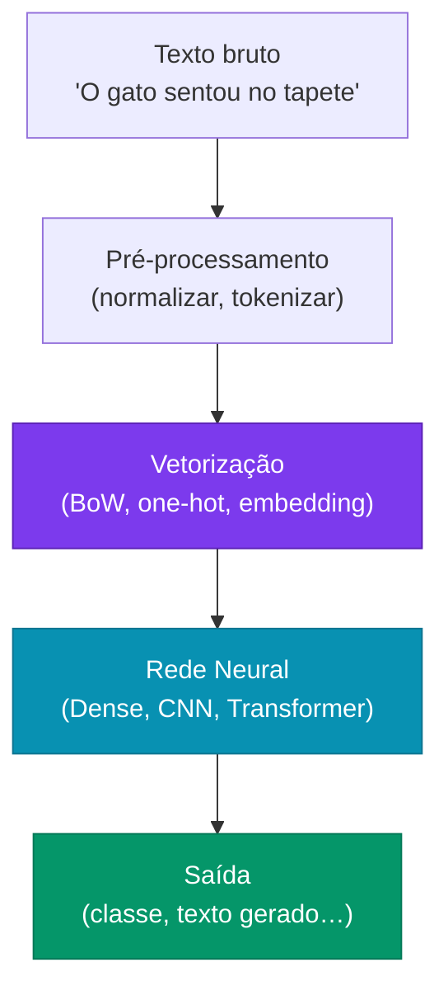
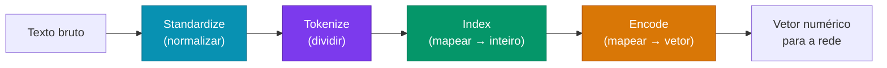
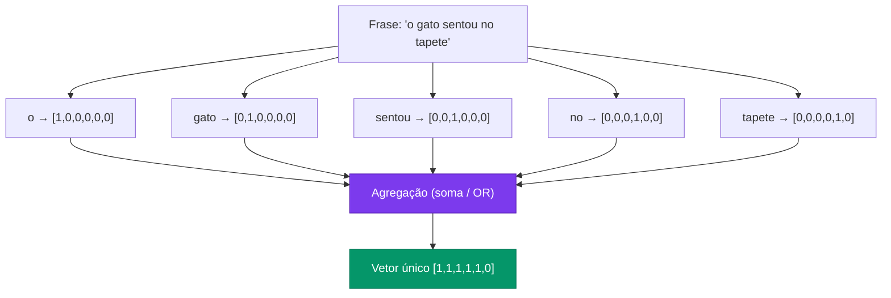
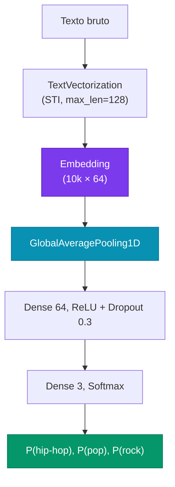

# Aula 4

## NLP: Vetorização de Texto e Word Embeddings

<div class="pt-12">
  <span class="px-2 py-1 rounded cursor-pointer" hover:bg="white op-10">
    Tópicos Avançados em Inteligência Artificial · UFABC
  </span>
</div>

<div class="abs-br m-6 text-sm opacity-60">
  Adaptado de MIT 15.773 (Farias, Ramakrishnan) — OCW
</div>

---
layout: section
---

# Parte 1 — Por que NLP?

---

# Roteiro da aula

<div class="grid grid-cols-2 gap-8 mt-6 text-sm">

<div class="space-y-3">

<div class="p-3 rounded bg-blue-900/30 border border-blue-500/40">

**Parte 1 — Por que NLP?**
Motivação, aplicações e arco histórico

</div>

<div class="p-3 rounded bg-cyan-900/30 border border-cyan-500/40">

**Parte 2 — Pré-processamento de Texto**
Pipeline Standardize → Tokenize → Index → Encode

</div>

<div class="p-3 rounded bg-emerald-900/30 border border-emerald-500/40">

**Parte 3 — Bag of Words**
Count encoding, multi-hot, limitações

</div>

</div>

<div class="space-y-3">

<div class="p-3 rounded bg-violet-900/30 border border-violet-500/40">

**Parte 4 — Word Embeddings**
Problema das one-hot, Word2Vec, GloVe

</div>

<div class="p-3 rounded bg-amber-900/30 border border-amber-500/40">

**Parte 5 — Embeddings em Código**
`nn.Embedding` (PyTorch), `Embedding` (Keras)

</div>

<div class="p-3 rounded bg-rose-900/30 border border-rose-500/40">

**Parte 6 — Aplicação**
Classificação de texto com embeddings

</div>

</div>

</div>

---

# Por que NLP?

<div class="grid grid-cols-2 gap-6 mt-4 text-sm">

<div>

**O conhecimento humano está em linguagem natural**

<v-clicks>

- A Internet é, em sua maioria, **texto**
- Comunicação humana e produção cultural são **texto**
- Documentos corporativos, contratos, registros médicos são **texto**

</v-clicks>

<div class="mt-4 p-3 rounded bg-blue-900/30 border border-blue-500/30 text-xs" v-click>

**Imagine** um sistema que pudesse ler e "compreender" tudo isso automaticamente — extraindo padrões, classificando, respondendo perguntas, gerando conteúdo.

</div>

</div>

<div v-click>

<strong>Aplicações em produção</strong>

<div class="grid grid-cols-2 gap-2 mt-2 text-xs">

<div class="p-2 rounded bg-slate-800/60 border border-slate-600/30">
<div class="font-bold">🏷️ Classificação</div>
<div>Sentimento, intenção, roteamento</div>
</div>

<div class="p-2 rounded bg-slate-800/60 border border-slate-600/30">
<div class="font-bold">📋 Extração</div>
<div>Financeiros, dados de formulários</div>
</div>

<div class="p-2 rounded bg-slate-800/60 border border-slate-600/30">
<div class="font-bold">📝 Sumarização</div>
<div>Abstracts, bullet points, títulos</div>
</div>

<div class="p-2 rounded bg-slate-800/60 border border-slate-600/30">
<div class="font-bold">✍️ Geração</div>
<div>Emails, relatórios, código</div>
</div>

<div class="p-2 rounded bg-slate-800/60 border border-slate-600/30">
<div class="font-bold">💬 Q&A / RAG</div>
<div>Chatbots, busca semântica</div>
</div>

<div class="p-2 rounded bg-slate-800/60 border border-slate-600/30">
<div class="font-bold">🌐 Tradução</div>
<div>Multilingual, code-switching</div>
</div>

</div>

</div>

</div>

---

# Arco histórico do NLP

<div class="grid grid-cols-4 gap-3 mt-5 text-xs">

<div class="p-3 rounded bg-slate-800/60 border border-slate-600/40">

<div class="text-base mb-1">📜</div>
<div class="font-bold text-slate-300 mb-1">Regras</div>
<div class="text-slate-500 text-[10px] mb-2">até 1990</div>

- Gramáticas formais
- Analisadores sintáticos manuais
- Desempenho limitado à escala das regras

</div>

<div class="p-3 rounded bg-cyan-900/30 border border-cyan-700/40">

<div class="text-base mb-1">📊</div>
<div class="font-bold text-cyan-300 mb-1">Estatístico / ML</div>
<div class="text-slate-500 text-[10px] mb-2">1990 – 2013</div>

- Bag of Words + SVM
- Modelos de Markov ocultos
- Regressão logística sobre n-gramas

</div>

<div class="p-3 rounded bg-violet-900/30 border border-violet-700/40">

<div class="text-base mb-1">🧠</div>
<div class="font-bold text-violet-300 mb-1">Redes Neurais</div>
<div class="text-slate-500 text-[10px] mb-2">2014 – 2017</div>

- RNNs e LSTMs
- Word2Vec, GloVe
- Seq2seq com atenção

</div>

<div class="p-3 rounded bg-amber-900/30 border border-amber-700/40">

<div class="text-base mb-1">⚡</div>
<div class="font-bold text-amber-300 mb-1">Transformers</div>
<div class="text-slate-500 text-[10px] mb-2">2017 – hoje</div>

- "Attention is All You Need"
- BERT, GPT, T5, LLaMA
- LLMs de propósito geral

</div>

</div>

<div class="mt-3 text-xs opacity-70 text-center" v-click>

*"Every time I fire a linguist, the performance of the speech recognizer goes up."*  — Frederick Jelinek, IBM

</div>

---

# Visão geral: NLP como regressão

<div class="grid grid-cols-2 gap-6 mt-4 text-sm">

<div>

**No fundo, é uma regressão sofisticada**

$$\hat{y} = f(\mathbf{x}, \theta)$$

<v-clicks>

- $\mathbf{x}$ = texto de entrada (sequência de tokens)
- $\hat{y}$ = texto, rótulo, número, …
- $\theta$ = pesos da rede neural
- $f$ = arquitetura profunda (CNN, RNN, Transformer…)

</v-clicks>

<div class="mt-4 p-3 rounded bg-indigo-900/30 border border-indigo-500/30 text-xs" v-click>

**Questão central desta aula:**  
Como representar $\mathbf{x}$ (texto) como vetor numérico de forma que a rede possa aprender?

</div>

</div>

<div v-click>



</div>

</div>

---
layout: section
---

# Parte 2 — Pré-processamento de Texto

---

# Pipeline de pré-processamento

<div class="mt-4">



</div>

<div class="grid grid-cols-4 gap-3 mt-4 text-xs">

<div class="p-3 rounded bg-cyan-900/30 border border-cyan-500/30" v-click>

**Standardize**
- Minúsculas
- Remove pontuação/acentos
- *Stop words* (às vezes)
- Stemming/lemmatização (às vezes)

</div>

<div class="p-3 rounded bg-violet-900/30 border border-violet-500/30" v-click>

**Tokenize**
- Divide em tokens
- Padrão: por espaço em branco
- Alternativa: subpalavras (BPE)
- N-gramas (bigrama, trigrama…)

</div>

<div class="p-3 rounded bg-emerald-900/30 border border-emerald-500/30" v-click>

**Index**
- Atribui inteiro único a cada token
- Forma o **vocabulário** $\mathcal{V}$
- Token especial `<UNK>` para palavras fora do vocabulário

</div>

<div class="p-3 rounded bg-amber-900/30 border border-amber-500/30" v-click>

**Encode**
- Mapeia inteiro → vetor
- Mais simples: one-hot
- Melhor: word embedding

</div>

</div>

---

# Exemplo de pré-processamento

<div class="mt-3 text-xs">

**Texto original:**

<div class="font-mono text-[11px] bg-slate-900/70 px-3 py-1 rounded mb-3">
"Hola! What do you picture when you think of traveling to Mexico? Sipping a real margarita while soaking up the sun on a laid-back beach in Puerto Vallarta?"
</div>

<div class="grid grid-cols-2 gap-x-6 gap-y-2">

<div v-click>

**Após standardize** (minúsculas, remove pontuação, stop words, stemma):

<div class="font-mono text-[10px] bg-slate-900/70 px-2 py-1 rounded mt-1">
`hola picture think travel mexico sip real margarita soak sun laidback beach puerto vallarta`
</div>

</div>

<div v-click>

**Após tokenize** (por espaço):

<div class="font-mono text-[10px] bg-slate-900/70 px-2 py-1 rounded mt-1">
`["hola", "picture", "think", "travel", "mexico", "sip", "real", "margarita", "soak", "sun", "laidback", "beach", "puerto", "vallarta"]`
</div>

</div>

<div v-click class="col-span-2">

**Após index** (vocabulário com 50 k tokens):

<div class="font-mono text-[10px] bg-slate-900/70 px-2 py-1 rounded mt-1">
`[4231, 1807, 2943, 8821, 9012, 3344, 771, 18432, 6621, 488, 22301, 993, 19034, 19035]`
</div>

</div>

</div>

</div>

---

# One-hot encoding

<div class="grid grid-cols-2 gap-6 mt-3 text-sm">

<div>

**Ideia:** cada token do vocabulário recebe um vetor com 1 na sua posição e 0 em todas as outras.

<div class="mt-3 font-mono text-xs bg-slate-900/70 p-4 rounded">

```
Vocabulário (|V| = 5):  gato, cão, peixe, pássaro, rato

gato    → [1, 0, 0, 0, 0]
cão     → [0, 1, 0, 0, 0]
peixe   → [0, 0, 1, 0, 0]
pássaro → [0, 0, 0, 1, 0]
rato    → [0, 0, 0, 0, 1]
```

</div>

<div class="mt-3 p-3 rounded bg-slate-800/50 border border-slate-600/30 text-xs" v-click>

- Dimensão do vetor = $|\mathcal{V}|$ (tamanho do vocabulário)
- Token especial `<UNK>` (índice 0) para palavras fora do vocabulário
- Representação **esparsa** — apenas um elemento não-nulo

</div>

</div>

<div v-click>

**Problema:** para $|\mathcal{V}| = 50{,}000$, cada token vira um vetor de 50 mil dimensões.

<div class="mt-4 p-3 rounded bg-red-900/30 border border-red-500/30 text-xs">

❌ **Dimensionalidade** altíssima → muitos parâmetros, overfitting  
❌ **Sem noção de similaridade** — distância entre quaisquer dois vetores one-hot é sempre $\sqrt{2}$, independentemente do significado

</div>

<div class="mt-3 p-3 rounded bg-slate-800/40 border border-slate-600/30 text-xs">

```python
from sklearn.preprocessing import LabelBinarizer

vocab = ["gato", "cão", "peixe", "pássaro", "rato"]
lb = LabelBinarizer()
lb.fit(vocab)
print(lb.transform(["gato", "peixe"]))
# [[1 0 0 0 0]
#  [0 0 1 0 0]]
```

</div>

</div>

</div>

---
layout: section
---

# Parte 3 — Bag of Words

---

# Do vetor por token ao vetor por documento

<div class="grid grid-cols-2 gap-6 mt-4 text-sm">

<div>

**O problema:** frases têm comprimentos diferentes.

Uma frase com 5 tokens gera uma matriz $5 \times |\mathcal{V}|$.  
Uma frase com 20 tokens gera $20 \times |\mathcal{V}|$.

Redes densas precisam de **entrada de tamanho fixo**.

<div class="mt-4 p-3 rounded bg-indigo-900/30 border border-indigo-500/30 text-xs" v-click>

**Solução:** agregar (*pooling*) os vetores one-hot de todos os tokens em um único vetor de tamanho $|\mathcal{V}|$.

</div>

</div>

<div v-click>



</div>

</div>

---

# Bag of Words — duas variantes

<div class="grid grid-cols-2 gap-6 mt-4 text-sm">

<div>

**Count encoding** (soma dos vetores one-hot)

Conta quantas vezes cada token aparece.

<div class="font-mono text-xs bg-slate-900/70 p-3 rounded mt-2">

```
"o gato sentou no tapete"
"o tapete era do gato"

vocab = [o, gato, sentou, no, tapete, era, do]

Frase 1: [1, 1, 1, 1, 1, 0, 0]
Frase 2: [1, 1, 0, 0, 1, 1, 1]
```

</div>

<div class="mt-2 text-xs opacity-70">

Se "gato" aparecer 3×: componente = 3.

</div>

</div>

<div>

**Multi-hot encoding** (OR dos vetores one-hot)

Indica apenas se o token está presente (0 ou 1).

<div class="font-mono text-xs bg-slate-900/70 p-3 rounded mt-2">

```
"o gato gato gato sentou"

Count:     [1, 3, 1, 0, 0, 0, 0]
Multi-hot: [1, 1, 1, 0, 0, 0, 0]
```

</div>

<div class="mt-2 text-xs opacity-70">

Multi-hot ignora frequência; útil quando presença é mais relevante que contagem.

</div>

<div class="mt-3 p-2 rounded bg-violet-900/30 border border-violet-500/30 text-xs" v-click>

Ambas são formas de **Bag of Words** — o nome vem do fato de se tratar o texto como um "saco" de palavras sem ordem.

</div>

</div>

</div>

---

# N-gramas — capturando contexto local

<div class="grid grid-cols-2 gap-6 mt-4 text-sm">

<div>

**Unigrama:** 1 token por vez (BoW padrão)

**Bigrama:** pares de tokens consecutivos

**Trigrama:** trios de tokens consecutivos

<div class="font-mono text-xs bg-slate-900/70 p-3 rounded mt-2">

```
Frase: "o gato sentou no tapete"

Unigramas: ["o", "gato", "sentou", "no", "tapete"]

Bigramas:  ["o gato", "gato sentou",
            "sentou no", "no tapete"]

Trigramas: ["o gato sentou",
            "gato sentou no",
            "sentou no tapete"]
```

</div>

</div>

<div v-click>

**Por que usar n-gramas?**

<div class="p-3 rounded bg-emerald-900/30 border border-emerald-500/30 text-xs mt-2">

✅ Preserva algum contexto local  
✅ "não bom" ≠ "bom" (bigrama captura a negação)  
✅ Simples, funciona bem em classificação de texto

</div>

<div class="p-3 rounded bg-red-900/30 border border-red-500/30 text-xs mt-2" v-click>

❌ Vocabulário cresce explosivamente: $|\mathcal{V}|^n$  
❌ Ainda ignora dependências de longo alcance  
❌ "bom mas não ótimo" exigiria um 4-grama

</div>

<div class="text-xs opacity-60 mt-3">

```python
from sklearn.feature_extraction.text import CountVectorizer
cv = CountVectorizer(ngram_range=(1, 2))
X = cv.fit_transform(["o gato sentou no tapete"])
```

</div>

</div>

</div>

---

# Limitações do Bag of Words

<div class="mt-4 text-sm">

<div class="grid grid-cols-3 gap-4">

<div class="p-4 rounded bg-red-900/20 border border-red-500/30" v-click>

**❌ Perde a ordem**

"O cão mordeu o homem"  
e  
"O homem mordeu o cão"

têm o **mesmo** vetor BoW.

</div>

<div class="p-4 rounded bg-red-900/20 border border-red-500/30" v-click>

**❌ Alta dimensionalidade**

$|\mathcal{V}|$ pode ser 50 k–500 k.

Cada entrada tem essa dimensão, independente do tamanho da frase.

Muitos parâmetros → overfitting, lento.

</div>

<div class="p-4 rounded bg-red-900/20 border border-red-500/30" v-click>

**❌ Sem semântica**

"filme" e "cinema" são equidistantes entre si e de "banana".

BoW não captura que são palavras relacionadas.

</div>

</div>

<div class="mt-5 p-3 rounded bg-indigo-900/30 border border-indigo-500/30 text-xs" v-click>

**Resumo:** BoW é uma linha de base útil e simples, mas para tarefas que exigem compreensão semântica ou dependências de longo alcance precisamos de algo melhor — **Word Embeddings**.

</div>

</div>

---
layout: section
---

# Parte 4 — Word Embeddings

---

# O problema das representações one-hot

<div class="grid grid-cols-2 gap-6 mt-4 text-sm">

<div>

**Problema 1: Alta dimensionalidade**

Vocabulário de 50 k palavras → vetor de 50 k dimensões.  
Maioria dos elementos é zero (**esparso**).

**Problema 2: Sem distância semântica**

<div class="mt-2 font-mono text-xs bg-slate-900/70 p-3 rounded">

```
"filme"  → [1, 0, 0, 0, 0, ...]
"cinema" → [0, 1, 0, 0, 0, ...]
"banana" → [0, 0, 1, 0, 0, ...]

cosine("filme",  "cinema") = 0
cosine("filme",  "banana") = 0
# Todas as palavras são igualmente "distantes"!
```

</div>

</div>

<div v-click>

**A solução ideal**

<div class="p-3 rounded bg-violet-900/30 border border-violet-500/30 text-xs">

Vetores **densos** e **compactos** (dimensão 50–300) onde a **distância geométrica** reflita a **distância semântica**.

</div>

<div class="mt-3 p-3 rounded bg-emerald-900/30 border border-emerald-500/30 text-xs">

```
"filme"  ≈ [0.2,  0.8, -0.3, ...]  # compacto
"cinema" ≈ [0.19, 0.79, -0.28, ...] # próximo de "filme"
"banana" ≈ [-0.6, 0.1,  0.9, ...]  # longe de ambos

cosine("filme", "cinema") ≈ 0.97  ✅
cosine("filme", "banana") ≈ 0.12  ✅
```

</div>

</div>

</div>

---

# A intuição: "você conhece uma palavra pela companhia que ela faz"

<div class="mt-4 text-sm">

<div class="text-center text-lg italic opacity-80 mb-4">

*"You shall know a word by the company it keeps."*

<span class="text-sm opacity-60">— John Firth, linguista (1957)</span>

</div>

<div class="grid grid-cols-2 gap-6">

<div v-click>

**Contextos similares → palavras relacionadas**

<div class="font-mono text-xs bg-slate-900/70 p-3 rounded mt-2">

```
"A atuação no ______ foi incrível."

→ filme       ✅
→ cinema      ✅
→ musical     ✅
→ caminhão    ❌
→ banana      ❌
```

</div>

Como "filme", "cinema" e "musical" aparecem nos **mesmos contextos**, inferimos que são semanticamente relacionados.

</div>

<div v-click>

**Ideia chave**

<div class="p-3 rounded bg-indigo-900/30 border border-indigo-500/30 text-xs mt-2">

Contar com que frequência dois tokens co-ocorrem nos mesmos contextos e aprender vetores que **aproximem** essa matriz de co-ocorrência.

</div>

<div class="mt-3 text-xs opacity-70">

Essa é a base de dois algoritmos muito influentes:

- **Word2Vec** (Mikolov et al., 2013) — predição local
- **GloVe** (Pennington et al., 2014) — co-ocorrência global

</div>

</div>

</div>

</div>

---

# Word2Vec — dois modelos

<div class="grid grid-cols-2 gap-6 mt-3 text-sm">

<div>

**CBOW** (*Continuous Bag of Words*)

Dado o contexto, prediz a palavra central.

<div class="font-mono text-xs bg-slate-900/70 p-2 rounded mt-1">

```
Contexto → Palavra central
["A", "atuação", "foi", "incrível"]  →  "no ___"
```

</div>

**Skip-gram**

Dada a palavra central, prediz as palavras de contexto.

<div class="font-mono text-xs bg-slate-900/70 p-2 rounded mt-1">

```
Palavra central → Contexto
"filme"  →  ["A", "atuação", "foi", "incrível"]
```

</div>

</div>

<div v-click>

<svg viewBox="0 0 300 265" xmlns="http://www.w3.org/2000/svg" class="w-full mt-1">
<defs>
<marker id="arr" markerWidth="5" markerHeight="5" refX="4" refY="2.5" orient="auto">
<path d="M0,0 L5,2.5 L0,5 Z" fill="#475569"/>
</marker>
</defs>
<!-- CBOW -->
<text x="150" y="12" text-anchor="middle" fill="#94a3b8" font-size="9" font-weight="bold" font-family="sans-serif">CBOW</text>
<rect x="4" y="18" width="56" height="15" rx="3" fill="#1e3a5f" stroke="#3b82f6" stroke-width="0.7"/>
<text x="32" y="29" text-anchor="middle" fill="#93c5fd" font-size="8" font-family="monospace">w_{t-2}</text>
<rect x="4" y="36" width="56" height="15" rx="3" fill="#1e3a5f" stroke="#3b82f6" stroke-width="0.7"/>
<text x="32" y="47" text-anchor="middle" fill="#93c5fd" font-size="8" font-family="monospace">w_{t-1}</text>
<rect x="4" y="54" width="56" height="15" rx="3" fill="#1e3a5f" stroke="#3b82f6" stroke-width="0.7"/>
<text x="32" y="65" text-anchor="middle" fill="#93c5fd" font-size="8" font-family="monospace">w_{t+1}</text>
<rect x="4" y="72" width="56" height="15" rx="3" fill="#1e3a5f" stroke="#3b82f6" stroke-width="0.7"/>
<text x="32" y="83" text-anchor="middle" fill="#93c5fd" font-size="8" font-family="monospace">w_{t+2}</text>
<line x1="60" y1="26" x2="112" y2="55" stroke="#475569" stroke-width="0.8" marker-end="url(#arr)"/>
<line x1="60" y1="44" x2="112" y2="57" stroke="#475569" stroke-width="0.8" marker-end="url(#arr)"/>
<line x1="60" y1="62" x2="112" y2="59" stroke="#475569" stroke-width="0.8" marker-end="url(#arr)"/>
<line x1="60" y1="80" x2="112" y2="61" stroke="#475569" stroke-width="0.8" marker-end="url(#arr)"/>
<rect x="114" y="46" width="62" height="28" rx="4" fill="#3b0764" stroke="#8b5cf6" stroke-width="1"/>
<text x="145" y="57" text-anchor="middle" fill="#c4b5fd" font-size="7" font-family="sans-serif">Embedding</text>
<text x="145" y="67" text-anchor="middle" fill="#c4b5fd" font-size="7" font-family="sans-serif">W (V×d)</text>
<line x1="176" y1="60" x2="222" y2="60" stroke="#475569" stroke-width="0.8" marker-end="url(#arr)"/>
<rect x="224" y="48" width="68" height="24" rx="3" fill="#134e4a" stroke="#10b981" stroke-width="0.7"/>
<text x="258" y="58" text-anchor="middle" fill="#6ee7b7" font-size="8" font-family="monospace">w_t</text>
<text x="258" y="68" text-anchor="middle" fill="#6ee7b7" font-size="7" font-family="sans-serif">softmax</text>
<text x="32" y="98" text-anchor="middle" fill="#475569" font-size="7" font-family="sans-serif">contexto</text>
<text x="145" y="98" text-anchor="middle" fill="#475569" font-size="7" font-family="sans-serif">hidden</text>
<text x="258" y="98" text-anchor="middle" fill="#475569" font-size="7" font-family="sans-serif">predição</text>
<!-- Divider -->
<line x1="4" y1="106" x2="296" y2="106" stroke="#1e293b" stroke-width="1"/>
<!-- Skip-gram -->
<text x="150" y="119" text-anchor="middle" fill="#94a3b8" font-size="9" font-weight="bold" font-family="sans-serif">Skip-gram</text>
<rect x="4" y="128" width="60" height="24" rx="3" fill="#1e3a5f" stroke="#3b82f6" stroke-width="0.7"/>
<text x="34" y="138" text-anchor="middle" fill="#93c5fd" font-size="8" font-family="monospace">w_t</text>
<text x="34" y="148" text-anchor="middle" fill="#93c5fd" font-size="7" font-family="sans-serif">central</text>
<line x1="64" y1="140" x2="112" y2="140" stroke="#475569" stroke-width="0.8" marker-end="url(#arr)"/>
<rect x="114" y="128" width="62" height="28" rx="4" fill="#3b0764" stroke="#8b5cf6" stroke-width="1"/>
<text x="145" y="139" text-anchor="middle" fill="#c4b5fd" font-size="7" font-family="sans-serif">Embedding</text>
<text x="145" y="149" text-anchor="middle" fill="#c4b5fd" font-size="7" font-family="sans-serif">W (V×d)</text>
<line x1="176" y1="136" x2="222" y2="125" stroke="#475569" stroke-width="0.8" marker-end="url(#arr)"/>
<line x1="176" y1="139" x2="222" y2="139" stroke="#475569" stroke-width="0.8" marker-end="url(#arr)"/>
<line x1="176" y1="142" x2="222" y2="153" stroke="#475569" stroke-width="0.8" marker-end="url(#arr)"/>
<line x1="176" y1="145" x2="222" y2="167" stroke="#475569" stroke-width="0.8" marker-end="url(#arr)"/>
<rect x="224" y="117" width="68" height="15" rx="3" fill="#134e4a" stroke="#10b981" stroke-width="0.7"/>
<text x="258" y="127" text-anchor="middle" fill="#6ee7b7" font-size="8" font-family="monospace">w_{t-2}</text>
<rect x="224" y="135" width="68" height="15" rx="3" fill="#134e4a" stroke="#10b981" stroke-width="0.7"/>
<text x="258" y="145" text-anchor="middle" fill="#6ee7b7" font-size="8" font-family="monospace">w_{t-1}</text>
<rect x="224" y="153" width="68" height="15" rx="3" fill="#134e4a" stroke="#10b981" stroke-width="0.7"/>
<text x="258" y="163" text-anchor="middle" fill="#6ee7b7" font-size="8" font-family="monospace">w_{t+1}</text>
<rect x="224" y="171" width="68" height="15" rx="3" fill="#134e4a" stroke="#10b981" stroke-width="0.7"/>
<text x="258" y="181" text-anchor="middle" fill="#6ee7b7" font-size="8" font-family="monospace">w_{t+2}</text>
<text x="34" y="200" text-anchor="middle" fill="#475569" font-size="7" font-family="sans-serif">central</text>
<text x="145" y="200" text-anchor="middle" fill="#475569" font-size="7" font-family="sans-serif">hidden</text>
<text x="258" y="200" text-anchor="middle" fill="#475569" font-size="7" font-family="sans-serif">predição</text>
<!-- Note -->
<rect x="4" y="208" width="292" height="48" rx="4" fill="#1e293b" stroke="#334155" stroke-width="0.5"/>
<text x="150" y="220" text-anchor="middle" fill="#94a3b8" font-size="7.5" font-weight="bold" font-family="sans-serif">💡 Negative Sampling — evita softmax sobre |V|</text>
<text x="150" y="233" text-anchor="middle" fill="#64748b" font-size="7" font-family="sans-serif">par (w, contexto) é real ou aleatório? → classificador binário</text>
<text x="150" y="247" text-anchor="middle" fill="#64748b" font-size="7" font-family="sans-serif">k ≈ 5–20 negativos por passo → O(k) em vez de O(|V|)</text>
</svg>

</div>

</div>

---

# Word2Vec — Negative Sampling

<div class="grid grid-cols-2 gap-6 mt-4 text-sm">

<div>

**Problema:** softmax sobre 50 k tokens a cada passo é custoso — $O(|\mathcal{V}|)$.

**Solução — Negative Sampling:**  
Em vez de normalizar sobre todo o vocabulário, treina um **classificador binário**:

$$P(D{=}1 \mid w, c) = \sigma(\mathbf{v}_c^\top \mathbf{v}_w)$$

*"Este par (palavra, contexto) veio do corpus real?"*

<div class="mt-3 font-mono text-xs bg-slate-900/70 p-3 rounded">

```
Par positivo: ("filme", "atuação")  → label 1
Pares negativos (k amostras aleatórias):
  ("filme", "mesa")    → label 0
  ("filme", "nuvem")   → label 0
  ...
```

</div>

</div>

<div v-click>

**Objetivo com negative sampling:**

$$\mathcal{L} = \log \sigma(\mathbf{v}_c^\top \mathbf{v}_w) + \sum_{i=1}^k \mathbb{E}_{w_i \sim P_n}\!\left[\log \sigma(-\mathbf{v}_{w_i}^\top \mathbf{v}_w)\right]$$

<div class="mt-3 p-3 rounded bg-emerald-900/30 border border-emerald-500/30 text-xs">

✅ Complexidade por passo: $O(k)$ com $k \ll |\mathcal{V}|$ (tipicamente $k = 5$–$20$)  
✅ Empiricamente produz embeddings de qualidade similar ao softmax completo

</div>

<div class="mt-3 text-xs opacity-70">

Palavras mais frequentes têm maior probabilidade de serem amostradas como negativas (distribuição $P_n(w) \propto f(w)^{3/4}$).

</div>

</div>

</div>

---

# GloVe — Global Vectors

<div class="grid grid-cols-2 gap-6 mt-4 text-sm">

<div>

**Intuição:** Word2Vec usa janelas locais. GloVe usa **co-ocorrências globais** do corpus.

**Passo 1:** Contar $X_{ij}$ = quantas vezes a palavra $j$ aparece no contexto da palavra $i$ em todo o corpus.

<div class="font-mono text-xs bg-slate-900/70 p-3 rounded mt-2">

```
           filme  cinema  banana  ...
filme    [  ―,    8432,    12,   ... ]
cinema   [ 8432,   ―,      9,   ... ]
banana   [   12,    9,     ―,   ... ]
```

</div>

<div class="mt-2 text-xs opacity-70">

"filme" e "cinema" co-ocorrem muito; ambos pouco com "banana".

</div>

</div>

<div v-click>

**Passo 2:** Aprender vetores que aproximem a matriz de co-ocorrência.

**Modelo log-bilinear:**

$$\log X_{ij} = \mathbf{w}_i^\top \mathbf{w}_j + b_i + b_j$$

**Objetivo** (mínimos quadrados ponderados):

$$\mathcal{L} = \sum_{i,j} f(X_{ij})\!\left(\mathbf{w}_i^\top \mathbf{w}_j + b_i + b_j - \log X_{ij}\right)^2$$

onde $f(X_{ij})$ é uma função de ponderação que evita que pares muito frequentes dominem o treinamento.

<div class="mt-2 text-xs opacity-70">

Ao final, descartam-se os biases $b$ e usa-se apenas $\mathbf{w}$.

</div>

</div>

</div>

---

# Propriedades geométricas dos embeddings

<div class="grid grid-cols-2 gap-6 mt-2">

<div>

<svg viewBox="0 0 300 195" xmlns="http://www.w3.org/2000/svg" class="w-full">
  <defs>
    <marker id="ag" markerWidth="7" markerHeight="7" refX="5" refY="3" orient="auto"><path d="M0,0 L0,6 L7,3 z" fill="#a78bfa"/></marker>
    <marker id="ab" markerWidth="7" markerHeight="7" refX="5" refY="3" orient="auto"><path d="M0,0 L0,6 L7,3 z" fill="#38bdf8"/></marker>
    <marker id="ar" markerWidth="7" markerHeight="7" refX="5" refY="3" orient="auto"><path d="M0,0 L0,6 L7,3 z" fill="#fb923c"/></marker>
  </defs>
  <rect width="300" height="195" fill="#0f172a" rx="8"/>
  <!-- horizontal arrows: realeza -->
  <line x1="88" y1="148" x2="188" y2="148" stroke="#38bdf8" stroke-width="1.5" stroke-dasharray="5,2" marker-end="url(#ab)"/>
  <line x1="88" y1="58" x2="188" y2="58" stroke="#38bdf8" stroke-width="1.5" stroke-dasharray="5,2" marker-end="url(#ab)"/>
  <!-- vertical arrows: gênero -->
  <line x1="68" y1="133" x2="68" y2="73" stroke="#a78bfa" stroke-width="1.5" marker-end="url(#ag)"/>
  <line x1="210" y1="133" x2="210" y2="73" stroke="#a78bfa" stroke-width="1.5" marker-end="url(#ag)"/>
  <!-- diagonal analogy arrow rei→rainha -->
  <line x1="215" y1="143" x2="215" y2="68" stroke="#fb923c" stroke-width="0" />
  <!-- axis labels -->
  <text x="130" y="165" fill="#38bdf8" font-size="8" font-family="monospace" text-anchor="middle">+ realeza</text>
  <text x="130" y="47" fill="#38bdf8" font-size="8" font-family="monospace" text-anchor="middle">+ realeza</text>
  <text x="34" y="103" fill="#a78bfa" font-size="8" font-family="monospace" text-anchor="middle">gênero</text>
  <text x="248" y="103" fill="#a78bfa" font-size="8" font-family="monospace" text-anchor="middle">gênero</text>
  <!-- nodes -->
  <circle cx="68" cy="148" r="5" fill="#64748b"/>
  <text x="68" y="168" fill="#94a3b8" font-size="11" font-family="sans-serif" text-anchor="middle">homem</text>
  <circle cx="68" cy="58" r="5" fill="#64748b"/>
  <text x="68" y="44" fill="#94a3b8" font-size="11" font-family="sans-serif" text-anchor="middle">mulher</text>
  <circle cx="210" cy="148" r="6" fill="#f59e0b"/>
  <text x="210" y="168" fill="#fcd34d" font-size="11" font-family="sans-serif" text-anchor="middle">rei</text>
  <circle cx="210" cy="58" r="6" fill="#f59e0b"/>
  <text x="210" y="44" fill="#fcd34d" font-size="11" font-family="sans-serif" text-anchor="middle">rainha</text>
  <!-- formula hint -->
  <text x="150" y="186" fill="#475569" font-size="8" font-family="monospace" text-anchor="middle">rei − homem + mulher ≈ rainha</text>
</svg>

<div class="text-xs opacity-60 mt-1">
Projeção 2D — cada dimensão captura um conceito latente que emerge do treinamento.
</div>

</div>

<div class="text-xs" v-click>

<div class="font-bold text-sm mb-2">Tipos de relações que emergem</div>

<div class="space-y-1">

<div class="p-2 rounded bg-violet-900/30 border border-violet-700/40">
<span class="font-bold text-violet-300">Gênero</span><br>
rei → rainha · ator → atriz · homem → mulher
</div>

<div class="p-2 rounded bg-cyan-900/30 border border-cyan-700/40">
<span class="font-bold text-cyan-300">País → Capital</span><br>
França → Paris · Brasil → Brasília · Japão → Tóquio
</div>

<div class="p-2 rounded bg-amber-900/30 border border-amber-700/40">
<span class="font-bold text-amber-300">Superlativo / Grau</span><br>
bom → melhor → ótimo · grande → maior → máximo
</div>

<div class="p-2 rounded bg-emerald-900/30 border border-emerald-700/40">
<span class="font-bold text-emerald-300">Tempo verbal</span><br>
correr → correu · cantar → cantou · ir → foi
</div>

<div class="p-2 rounded bg-rose-900/30 border border-rose-700/40">
<span class="font-bold text-rose-300">Antônimos</span><br>
quente ↔ frio · rápido ↔ lento · grande ↔ pequeno
</div>

</div>

<div class="mt-2 p-2 rounded bg-amber-900/20 border border-amber-700/30 text-[10px]">
⚠️ Esses padrões emergem do corpus — e também refletem seus <span class="font-bold">vieses</span> (Wikipedia, Common Crawl…).
</div>

</div>

</div>

---

# Embeddings estáticos vs contextuais

<div class="mt-4 text-sm">

<div class="grid grid-cols-2 gap-6">

<div class="p-4 rounded bg-slate-800/40 border border-slate-600/30">

**Embeddings estáticos**  
(Word2Vec, GloVe, FastText)

<v-clicks>

- Um vetor fixo por palavra, independente do contexto
- Rápidos de computar, baixo custo de memória
- Bons para tarefas de classificação simples

</v-clicks>

<div class="mt-3 p-2 rounded bg-red-900/20 border border-red-500/30 text-xs" v-click>

❌ "banco" (financeiro) tem o mesmo vetor que "banco" (assento)

</div>

</div>

<div class="p-4 rounded bg-slate-800/40 border border-slate-600/30">

**Embeddings contextuais**  
(ELMo, BERT, GPT)

<v-clicks>

- Vetor depende de todos os outros tokens da frase
- Captura polissemia e dependências de longa distância
- Base dos LLMs modernos

</v-clicks>

<div class="mt-3 p-2 rounded bg-emerald-900/20 border border-emerald-500/30 text-xs" v-click>

✅ "banco" gera vetores diferentes em cada contexto — calculados por um **Transformer** (Aula 6!)

</div>

</div>

</div>

<div class="mt-4 p-3 rounded bg-indigo-900/30 border border-indigo-500/30 text-xs" v-click>

**Esta aula** cobre embeddings estáticos. A **Aula 5** cobre RNNs/LSTMs e a **Aula 6** Transformers e embeddings contextuais.

</div>

</div>

---
layout: section
---

# Parte 5 — Embeddings em Código

---

# `nn.Embedding` — PyTorch

<div class="grid grid-cols-2 gap-4 mt-3 text-sm">

<div>

**O que é:** uma tabela de consulta — mapeia índices inteiros para vetores densos.

```python
import torch
import torch.nn as nn

# vocab_size = tamanho do vocabulário
# embed_dim  = dimensão do embedding
embed = nn.Embedding(
    num_embeddings=10_000,  # |V|
    embedding_dim=128        # d
)

# Índices de tokens para um batch de 2 frases
# (padding com zeros até max_len=5)
tokens = torch.tensor([
    [42, 871, 3, 0, 0],
    [7, 1024, 55, 810, 2]
])  # (batch=2, seq_len=5)

out = embed(tokens)  # (2, 5, 128)
print(out.shape)     # torch.Size([2, 5, 128])
```

</div>

<div v-click>

**Carregando pesos pré-treinados (GloVe)**

```python
import numpy as np

# Supõe glove_matrix: (|V|, d) pré-carregada
embed = nn.Embedding(
    num_embeddings=vocab_size,
    embedding_dim=100
)
embed.weight = nn.Parameter(
    torch.tensor(glove_matrix, dtype=torch.float32)
)

# Opcional: congelar pesos durante fine-tuning
embed.weight.requires_grad = False
```

<div class="mt-3 p-2 rounded bg-slate-800/40 border border-slate-600/30 text-xs">

`nn.Embedding` é equivalente a uma camada `nn.Linear` sem bias, mas com lookup O(1) — não faz multiplicação matricial por frases inteiras.

</div>

</div>

</div>

---

# Camada `Embedding` — Keras

<div class="grid grid-cols-2 gap-4 mt-3 text-sm">

<div>

**Pipeline completo com Keras**

```python
import tensorflow as tf
from tensorflow import keras

# 1. Vetorização (STI)
vectorizer = keras.layers.TextVectorization(
    max_tokens=10_000,   # |V|
    output_mode='int',   # retorna índices
    output_sequence_length=64  # max_len
)
vectorizer.adapt(train_texts)  # aprende vocabulário

# 2. Embedding
embed = keras.layers.Embedding(
    input_dim=10_000,    # |V|
    output_dim=128,      # d
    mask_zero=True       # ignora padding
)
```

</div>

<div v-click>

**Modelo completo**

```python
inp  = keras.Input(shape=(1,), dtype='string')
x    = vectorizer(inp)          # (batch, 64)
x    = embed(x)                 # (batch, 64, 128)
x    = keras.layers.GlobalAveragePooling1D()(x)
      # média sobre seq_len → (batch, 128)
x    = keras.layers.Dense(64, activation='relu')(x)
out  = keras.layers.Dense(num_classes,
                          activation='softmax')(x)

model = keras.Model(inp, out)
model.compile(
    loss='sparse_categorical_crossentropy',
    optimizer='adam',
    metrics=['accuracy']
)
```

</div>

</div>

---

# Global Average Pooling — por que funciona?

<div class="grid grid-cols-2 gap-6 mt-3 text-sm">

<div>

Após o `Embedding`, cada frase é uma **matriz** $(T \times d)$. Precisamos de um **vetor fixo** para a camada densa.

<div class="mt-2 font-mono text-xs bg-slate-900/70 px-3 py-2 rounded">

```
"o gato sentou"  →  Embedding
[[0.2, -0.1, 0.8, ...],  ← "o"
 [0.7,  0.3, 0.1, ...],  ← "gato"
 [0.4, -0.2, 0.6, ...]]  ← "sentou"   shape: (3,d)

GAP → média ao longo de T
→ [0.43, 0.0, 0.5, ...]              shape: (d,)
```

</div>

</div>

<div v-click class="text-xs">

<div class="font-bold mb-2">Alternativas ao GlobalAveragePooling</div>

<div class="space-y-1">

<div class="p-2 rounded bg-slate-800/40 border border-slate-600/30">
<span class="font-bold">Flatten</span> — concatena todos os vetores em $(T \times d)$, requer comprimento fixo.
</div>

<div class="p-2 rounded bg-slate-800/40 border border-slate-600/30">
<span class="font-bold">GlobalMaxPooling1D</span> — máximo por dimensão, preserva ativações mais fortes.
</div>

<div class="p-2 rounded bg-emerald-900/30 border border-emerald-500/30">
<span class="font-bold">[CLS] token / atenção</span> — estratégia dos Transformers (Aula 6). BERT usa <code>[CLS]</code>.
</div>

</div>

<div class="mt-2 p-2 rounded bg-indigo-900/30 border border-indigo-500/30">
GAP equivale a um BoW ponderado pelos embeddings — simples mas surpreendentemente eficaz.
</div>

</div>

</div>

---
layout: section
---

# Parte 6 — Aplicação: Classificação de Texto

---

# Classificação de gênero musical

<div class="grid grid-cols-2 gap-6 mt-3 text-sm">

<div>

**Tarefa:** dado um trecho de letra, classificar em hip-hop, pop ou rock.

<div class="font-mono text-xs bg-slate-900/70 px-3 py-2 rounded mt-2 border-l-4 border-blue-500 leading-5">
*"I grew up on the crime side, the New York Times side…
Had secondhands, Mom's bounced on old man…"*
→ <b>hip-hop</b> 🎤
</div>

<div class="font-mono text-xs bg-slate-900/70 px-3 py-2 rounded mt-2 border-l-4 border-rose-500 leading-5">
*"I walked through the door with you
But something about it felt like home somehow…"*
→ <b>pop</b> 🎵
</div>

</div>

<div v-click>

<div class="font-bold text-xs mb-1">Arquitetura BoW + Embedding</div>



</div>

</div>

---

# Código completo — PyTorch

<div class="text-xs leading-tight mt-2">

```python
import torch, torch.nn as nn, torch.optim as optim

class TextClassifier(nn.Module):
    def __init__(self, vocab_size, embed_dim, num_classes):
        super().__init__()
        self.embed   = nn.Embedding(vocab_size, embed_dim, padding_idx=0)
        self.dropout = nn.Dropout(0.3)
        self.fc1     = nn.Linear(embed_dim, 64)
        self.fc2     = nn.Linear(64, num_classes)

    def forward(self, x):          # x: (batch, seq_len)
        x = self.embed(x)          # (batch, seq_len, embed_dim)
        x = x.mean(dim=1)          # GAP: (batch, embed_dim)
        x = self.dropout(x)
        x = torch.relu(self.fc1(x))
        return self.fc2(x)         # (batch, num_classes)

model     = TextClassifier(vocab_size=10_000, embed_dim=64, num_classes=3)
criterion = nn.CrossEntropyLoss()
optimizer = optim.Adam(model.parameters(), lr=1e-3)

for epoch in range(10):
    for tokens, labels in train_loader:
        logits = model(tokens)
        loss   = criterion(logits, labels)
        optimizer.zero_grad(); loss.backward(); optimizer.step()
```

</div>

---

# Comparação: BoW vs Embeddings

<div class="mt-3 text-sm">

| | **BoW (count/multi-hot)** | **Embedding + GAP** |
|---|---|---|
| Representação | Esparsa (\|V\|-dimensional) | Densa (d-dim, d ≪ \|V\|) |
| Semântica | ❌ Sem distância semântica | ✅ Palavras similares são próximas |
| Ordem | ❌ Ignorada | ❌ Ignorada (com GAP) |
| Parâmetros | Nenhum (engenharia) | \|V\| × d (aprendidos) |
| Transferência | Só com embeddings externos | ✅ Pré-treino em corpus grande |
| Custo | Baixo | Moderado |

<div class="mt-3 p-3 rounded bg-indigo-900/30 border border-indigo-500/30 text-sm" v-click>

**Para capturar ordem e dependências longas** → arquiteturas sequenciais: RNNs e LSTMs **(Aula 5)**, e finalmente Transformers **(Aula 6)**.

</div>

</div>

---
layout: center
class: text-center
---

# Recapitulando

<div class="grid grid-cols-3 gap-4 mt-6 text-xs text-left">

<div class="p-3 rounded bg-cyan-900/30 border border-cyan-500/30">

**Pré-processamento**
- Pipeline S→T→I→E
- Standardização, tokenização, vocabulário
- One-hot encoding: esparso, sem semântica

</div>

<div class="p-3 rounded bg-violet-900/30 border border-violet-500/30">

**Bag of Words**
- Count e multi-hot encoding
- N-gramas para contexto local
- Limitações: ordem perdida, alta dimensão

</div>

<div class="p-3 rounded bg-amber-900/30 border border-amber-500/30">

**Word Embeddings**
- Word2Vec (skip-gram, negative sampling)
- GloVe (co-ocorrência global, mínimos quadrados)
- Vetores densos com distância semântica

</div>

<div class="p-3 rounded bg-emerald-900/30 border border-emerald-500/30">

**Em código**
- `nn.Embedding` (PyTorch)
- `Embedding` + `TextVectorization` (Keras)
- GlobalAveragePooling1D como BoW ponderado

</div>

<div class="p-3 rounded bg-rose-900/30 border border-rose-500/30">

**Limitações restantes**
- Sem ordem com GAP
- Embeddings estáticos: polissemia
- → Precisamos de Transformers!

</div>

<div class="p-3 rounded bg-indigo-900/30 border border-indigo-500/30">

**Aula 5 — RNNs e LSTMs**
- RNNs: estado oculto e BPTT
- Problema do gradiente vanishing
- LSTMs e GRUs como solução

</div>

</div>

---

# Próxima aula

<div class="mt-6 grid grid-cols-2 gap-6 text-sm">

<div class="p-4 rounded bg-slate-800/50 border border-slate-600/30">

**Aula 5 — RNNs e LSTMs**

- Estado oculto e processamento sequencial
- BPTT e o problema do gradiente
- LSTM: células de memória e gates
- GRU: variante mais eficiente
- Aplicações: classificação e seq2seq

</div>

<div class="p-4 rounded bg-indigo-900/30 border border-indigo-500/30">

**Para esta semana**

- Notebook `lec04-embeddings.ipynb`:
  - Pipeline de pré-processamento com Keras/PyTorch
  - Treinar embeddings do zero vs GloVe pré-treinado
  - Classificação de gênero musical
  - Visualização de embeddings com t-SNE

</div>

</div>

---
layout: center
---

# Obrigado! Perguntas?

<div class="text-sm opacity-60 mt-4">

CCM-109 · Deep Learning · UFABC

Adaptado de MIT 15.773 Hands-on Deep Learning (Farias & Ramakrishnan, 2024)

</div>
