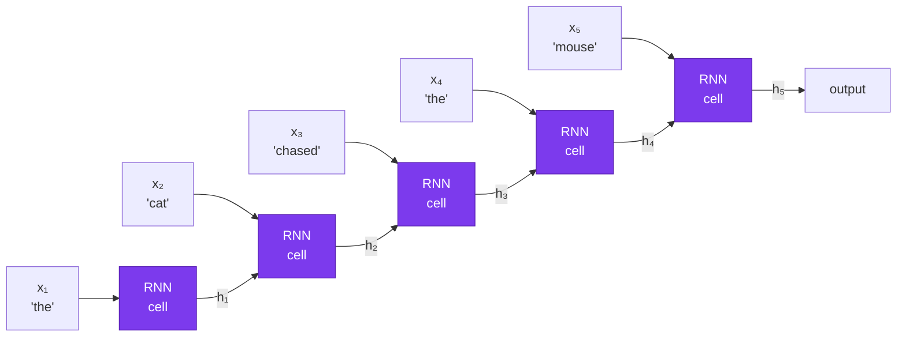
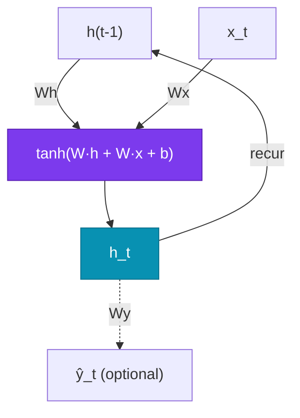
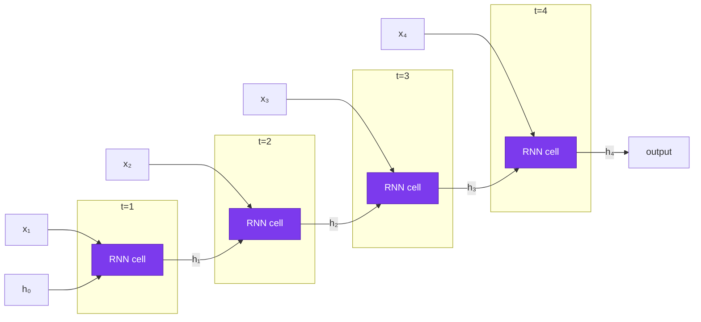
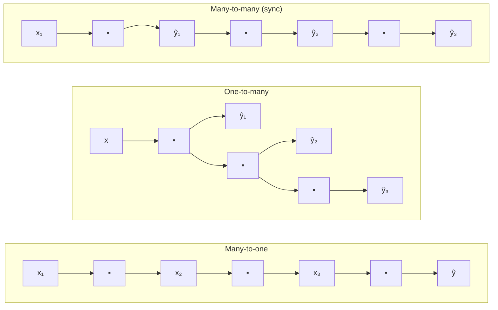
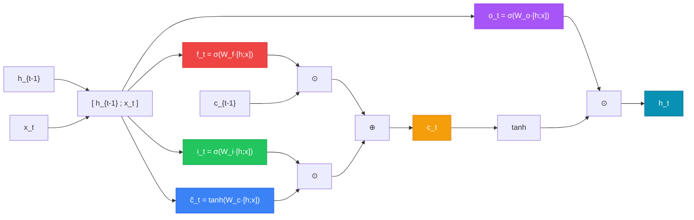
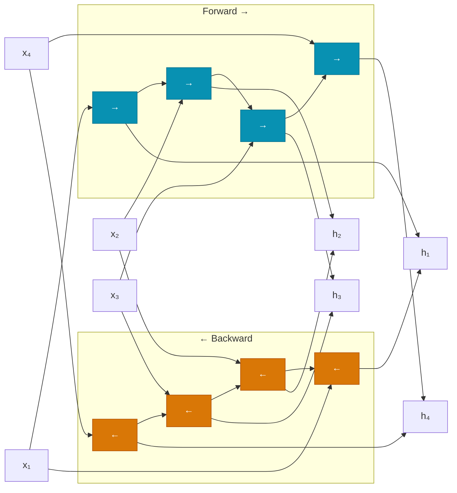
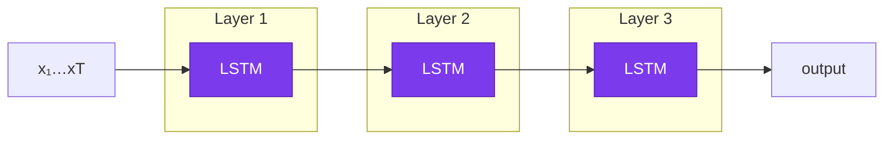
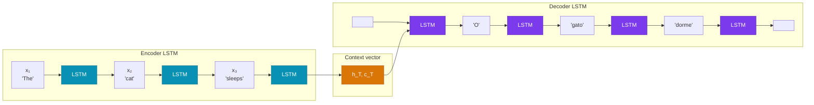

# Lecture 5

## Recurrent Networks: RNNs and LSTMs

<div class="pt-12">
  <span class="px-2 py-1 rounded cursor-pointer" hover:bg="white op-10">
    Advanced Topics in Artificial Intelligence · UFABC
  </span>
</div>

---
layout: section
---

# Part 1 — The Sequence Problem

---

# Lecture roadmap

<div class="grid grid-cols-2 gap-6 mt-5 text-sm">

<div class="space-y-3">

<div class="p-3 rounded bg-blue-900/30 border border-blue-500/40">

**Part 1 — The Sequence Problem**
Why dense networks and CNNs fall short

</div>

<div class="p-3 rounded bg-cyan-900/30 border border-cyan-500/40">

**Part 2 — Recurrent Neural Networks (RNN)**
Hidden state, recurrent equation, unrolling

</div>

<div class="p-3 rounded bg-amber-900/30 border border-amber-500/40">

**Part 3 — Training RNNs**
BPTT, vanishing gradient, gradient clipping

</div>

</div>

<div class="space-y-3">

<div class="p-3 rounded bg-violet-900/30 border border-violet-500/40">

**Part 4 — LSTM**
Memory cell, 4 gates, intuition

</div>

<div class="p-3 rounded bg-emerald-900/30 border border-emerald-500/40">

**Part 5 — GRU and Practical Architectures**
GRU, bidirectional, stacking, dropout

</div>

<div class="p-3 rounded bg-rose-900/30 border border-rose-500/40">

**Part 6 — Code and Applications**
PyTorch and Keras; classification and seq2seq

</div>

</div>

</div>

---

# Sequential data is everywhere

<div class="grid grid-cols-3 gap-4 mt-5 text-sm">

<div class="p-4 rounded bg-slate-800/50 border border-slate-600/30" v-click>

**📝 Text / NLP**

"The **cat** that **chased** the mouse **was sleeping** now."

The word "sleeping" only makes sense after understanding "cat" three tokens back.

</div>

<div class="p-4 rounded bg-slate-800/50 border border-slate-600/30" v-click>

**📈 Time series**

Temperature, stock prices, EEG signals.

The value at $t$ depends on values at $t{-}1, t{-}2, \ldots$

</div>

<div class="p-4 rounded bg-slate-800/50 border border-slate-600/30" v-click>

**🎵 Audio / speech**

The current phoneme depends on the preceding phonetic context.

</div>

</div>

<div class="mt-5 p-4 rounded bg-indigo-900/30 border border-indigo-500/30 text-sm" v-click>

**Key property:** **order matters** and sequence length is **variable**.  
This breaks the assumptions of dense networks (fixed-size input, no positional awareness) and CNNs (fixed local receptive field).

</div>

---

# Why dense networks fail on sequences

<div class="grid grid-cols-2 gap-5 mt-2 text-sm">

<div>

**Naïve approach:** concatenate all tokens and feed to a dense network.

<div class="font-mono text-xs bg-slate-900/70 p-3 rounded mt-2">

```
"the cat chased the mouse"
→ [emb_the ‖ emb_cat ‖ emb_chased ‖ emb_the ‖ emb_mouse]
→ Dense(5 × d → hidden) → Dense(hidden → output)
```

</div>

<v-clicks>

**Problem 1 — Variable length**

Sentences of 3, 10, 100 tokens → inputs of different sizes.

**Problem 2 — No weight sharing**

The "cat" detector at position 2 uses different weights than at position 7. Doesn't generalize.

**Problem 3 — Doesn't scale**

100 tokens × 128 dims = 12,800-dim input → huge first dense block.

</v-clicks>

</div>

<div v-click>

**What we need**

<div class="p-3 rounded bg-violet-900/30 border border-violet-500/30 text-xs mt-2">

✅ Process tokens **one at a time**, in order  
✅ Maintain an **internal state** that accumulates past information  
✅ **Share weights** across all positions  
✅ Work with sequences of **arbitrary length**

</div>

<div class="mt-4">



</div>

</div>

</div>

---
layout: section
---

# Part 2 — Recurrent Neural Networks (RNN)

---

# The RNN cell

<div class="grid grid-cols-2 gap-6 mt-4 text-sm">

<div>

**Core idea:** a cell that processes the current token $\mathbf{x}_t$ and the previous hidden state $\mathbf{h}_{t-1}$, producing a new state $\mathbf{h}_t$.

<div class="mt-4 p-4 rounded bg-violet-900/30 border border-violet-500/30">

$$\mathbf{h}_t = \tanh\!\left(W_h\,\mathbf{h}_{t-1} + W_x\,\mathbf{x}_t + \mathbf{b}\right)$$

</div>

<div class="mt-3 text-xs space-y-1">

<v-clicks>

- $\mathbf{x}_t \in \mathbb{R}^d$ — token embedding at step $t$
- $\mathbf{h}_t \in \mathbb{R}^h$ — hidden state at step $t$ (the "memory")
- $W_x \in \mathbb{R}^{h \times d}$ — projects the input
- $W_h \in \mathbb{R}^{h \times h}$ — projects the previous state
- $\mathbf{b} \in \mathbb{R}^h$ — bias
- $\tanh$ — activates and keeps values in $[-1, 1]$

</v-clicks>

</div>

<div class="mt-3 p-2 rounded bg-amber-900/30 border border-amber-500/30 text-xs" v-click>

The **same weights** $W_h, W_x, \mathbf{b}$ are used at **every** time step — this is weight sharing.

</div>

</div>

<div v-click>



<div class="mt-3 text-xs opacity-70">

The loop arrow ($\mathbf{h}_t$ feeds back as $\mathbf{h}_{t-1}$ in the next step) is what defines recurrence.

</div>

</div>

</div>

---

# Unrolling through time

<div class="mt-1 text-sm">

The same cell repeated for each time step:



<div class="grid grid-cols-3 gap-4 mt-4 text-xs">

<div class="p-3 rounded bg-slate-800/40 border border-slate-600/30" v-click>

**Shared weights**  
$W_h, W_x, \mathbf{b}$ are the **same** at every step.  
The parameter count stays fixed regardless of sequence length.

</div>

<div class="p-3 rounded bg-slate-800/40 border border-slate-600/30" v-click>

**Initial state**  
$\mathbf{h}_0$ is typically initialized to zeros.  
For multi-sequence batches, each sequence has its own $\mathbf{h}_0$.

</div>

<div class="p-3 rounded bg-slate-800/40 border border-slate-600/30" v-click>

**Output**  
Use $\mathbf{h}_T$ (last state) for classification, or all $\mathbf{h}_t$ for token-level tasks (e.g., NER, translation).

</div>

</div>

</div>

---

# Input/output topologies

<div class="mt-2">



</div>

<div class="grid grid-cols-3 gap-4 mt-3 text-xs">

<div class="p-3 rounded bg-cyan-900/30 border border-cyan-500/30">

**Many-to-one**
Sequence → single label

E.g.: sentiment analysis, text classification, spam detection

</div>

<div class="p-3 rounded bg-violet-900/30 border border-violet-500/30">

**One-to-many**
Single vector → sequence

E.g.: image captioning

</div>

<div class="p-3 rounded bg-emerald-900/30 border border-emerald-500/30">

**Many-to-many**
Sequence → sequence

E.g.: NER (same length), translation via seq2seq (different length)

</div>

</div>

---
layout: section
---

# Part 3 — Training RNNs

---

# Backpropagation Through Time (BPTT)

<div class="grid grid-cols-2 gap-5 mt-2 text-sm">

<div>

The loss gradient must flow back through every time step — through each application of $W_h$.

<div class="mt-3 p-3 rounded bg-slate-800/50 border border-slate-600/30 text-xs">

$$\frac{\partial \mathcal{L}}{\partial W_h} = \sum_{t=1}^{T} \frac{\partial \mathcal{L}_t}{\partial W_h}$$

$$\frac{\partial \mathcal{L}_t}{\partial W_h} = \frac{\partial \mathcal{L}_t}{\partial \mathbf{h}_t} \cdot \prod_{k=t}^{T-1} \frac{\partial \mathbf{h}_{k+1}}{\partial \mathbf{h}_k}$$

</div>

<div class="mt-3 text-xs opacity-70">

Each factor in the product involves $W_h^\top \cdot \text{diag}(\tanh')$.

</div>

</div>

<div v-click>

**The problem:**

$$\prod_{k=t}^{T-1} \frac{\partial \mathbf{h}_{k+1}}{\partial \mathbf{h}_k} = \prod_{k=t}^{T-1} W_h^\top \cdot \text{diag}(\tanh'(\cdot))$$

<div class="mt-3 grid grid-cols-2 gap-3 text-xs">

<div class="p-3 rounded bg-red-900/30 border border-red-500/30">

**Vanishing gradient**  
If $\|W_h\| < 1$ or $\tanh'$ derivatives are small, the product shrinks **exponentially** → gradient ≈ 0 for long dependencies

</div>

<div class="p-3 rounded bg-orange-900/30 border border-orange-500/30">

**Exploding gradient**  
If $\|W_h\| > 1$, the product grows **exponentially** → NaN / training divergence

</div>

</div>

</div>

</div>

---

# Vanishing gradient — intuition

<div class="mt-2 text-sm">

<div class="grid grid-cols-2 gap-6">

<div>

Imagine a chain of multiplications with factor $\gamma < 1$ at each step:

<div class="font-mono text-xs bg-slate-900/70 p-3 rounded mt-2">

```
T = 10 steps, γ = 0.9:
gradient ← 0.9^10 ≈ 0.35   (still ok)

T = 50 steps, γ = 0.9:
gradient ← 0.9^50 ≈ 0.005  (nearly zero)

T = 100 steps, γ = 0.9:
gradient ← 0.9^100 ≈ 2×10⁻⁵ (effectively zero)
```

</div>

<div class="mt-3 text-xs opacity-70">

The network "forgets" what happened more than ~10–20 steps back.

</div>

</div>

<div v-click>

**Practical consequence**

<div class="p-3 rounded bg-red-900/20 border border-red-500/30 text-xs mt-2">

❌ Vanilla RNNs cannot learn long-range dependencies  
❌ On tasks like translation or long-document analysis, performance degrades

</div>

**Partial fix: gradient clipping**

```python
# PyTorch — clip gradients before update
torch.nn.utils.clip_grad_norm_(
    model.parameters(), max_norm=1.0
)
```

<div class="p-3 rounded bg-emerald-900/30 border border-emerald-500/30 text-xs mt-2">

✅ Gradient clipping fixes *exploding gradients*  
❌ But it does **not** fix vanishing — we need a different architecture: **LSTM**

</div>

</div>

</div>

</div>

---
layout: section
---

# Part 4 — Long Short-Term Memory (LSTM)

---

# Motivation — explicit memory

<div class="grid grid-cols-2 gap-5 mt-2 text-sm">

<div>

**Hochreiter & Schmidhuber (1997)**

Core idea: separate "long-term memory" from the "working state".

<div class="mt-3 p-4 rounded bg-violet-900/30 border border-violet-500/30 text-xs">

**Vanilla RNN:**  
A single vector $\mathbf{h}_t$ must do everything — accumulate history, filter noise, carry useful information.

</div>

<div class="mt-3 p-4 rounded bg-emerald-900/30 border border-emerald-500/30 text-xs" v-click>

**LSTM:**  
Two distinct vectors:  
- $\mathbf{c}_t$ — **memory cell** (long-term, smooth flow)  
- $\mathbf{h}_t$ — **hidden state** (short-term, filtered output)

And three **gates** that control the flow of information.

</div>

</div>

<div v-click>

**The conveyor belt metaphor**

```
═══════════════════════════════════ c_t (cell)
       ↑            ↑          ↑
  [forget]      [add]       [read]
       ↑            ↑          ↑
    f_t · c_{t-1} + i_t · g_t  → h_t
```

The cell $\mathbf{c}$ is like a **conveyor belt** that carries information through time with minimal perturbation — the gates decide what enters, what exits, and what gets erased.

<div class="text-xs mt-2 space-y-1">

- **f\_t** (*forget gate*) — how much of c\_{t-1} to keep (0 = erase, 1 = preserve)
- **i\_t** (*input gate*) — how much of the candidate g\_t to write into the cell
- **g\_t** (*candidate*) — proposed new content, generated by tanh
- **h\_t** — output filtered by the *output gate* from c\_t

</div>

</div>

</div>

---

# LSTM — Equation 1: Forget Gate

$$\mathbf{f}_t = \sigma\!\bigl(W_f\,[\mathbf{h}_{t-1};\,\mathbf{x}_t] + \mathbf{b}_f\bigr)$$

<div class="grid grid-cols-2 gap-5 mt-3 text-xs">

<div class="p-3 rounded bg-blue-900/30 border border-blue-500/30">

**"The past filter"**

- σ(·) → output in **(0, 1)** per dimension independently
- **f\_t ≈ 0** → erases that dimension from c(t-1)
- **f\_t ≈ 1** → preserves that dimension intact
- Learns what to discard from h(t-1) and x\_t

</div>

<div>

<div class="p-3 rounded bg-slate-800/50 border border-slate-600/30">

**Example:** when processing "Peter" after "John went to the market", f\_t ≈ 0 in the active-subject dimension **erases "John"** to make room for the new referent.

</div>

<div class="mt-2 p-3 rounded bg-amber-900/30 border border-amber-500/30">

**Gradient:** ∂c\_t/∂c(t-1) = f\_t. When f\_t ≈ 1, the gradient flows back **without attenuation** — the core solution to the *vanishing gradient*.

</div>

</div>

</div>

---

# LSTM — Equation 2: Input Gate + Candidate

$$\mathbf{i}_t = \sigma\!\bigl(W_i\,[\mathbf{h}_{t-1};\,\mathbf{x}_t] + \mathbf{b}_i\bigr) \qquad \tilde{\mathbf{c}}_t = \tanh\!\bigl(W_c\,[\mathbf{h}_{t-1};\,\mathbf{x}_t] + \mathbf{b}_c\bigr)$$

<div class="grid grid-cols-2 gap-5 mt-3 text-xs">

<div class="p-3 rounded bg-emerald-900/30 border border-emerald-500/30">

**"What" and "how much" to write**

Two distinct roles working together:

- **ĉ\_t** (tanh) — proposes the *content*: values in (−1, 1), encodes polarity/direction
- **i\_t** (σ) — the *gatekeeper*: decides how much of ĉ\_t actually enters the cell
- Product: i\_t ⊙ ĉ\_t = filtered new information

</div>

<div>

<div class="p-3 rounded bg-slate-800/50 border border-slate-600/30">

**Example:** when processing "Peter", ĉ\_t encodes properties of the new subject; i\_t decides which cell dimensions to write to.

</div>

<div class="mt-2 p-3 rounded bg-violet-900/30 border border-violet-500/30">

**Why tanh for ĉ\_t?** Memory needs to represent *direction* — increment or decrement a feature. σ only gives positive values; tanh allows encoding polarity.

</div>

</div>

</div>

---

# LSTM — Equation 3: Cell Update

$$\mathbf{c}_t = \underbrace{\mathbf{f}_t \odot \mathbf{c}_{t-1}}_{\text{erase the old}} \;+\; \underbrace{\mathbf{i}_t \odot \tilde{\mathbf{c}}_t}_{\text{add the new}}$$

<div class="grid grid-cols-2 gap-5 mt-3 text-xs">

<div class="p-3 rounded bg-violet-900/30 border border-violet-500/30">

**The "memory conveyor belt"**

c\_t is an **additive highway** carrying information over time:

- f\_t ⊙ c(t-1) → keeps what still matters
- i\_t ⊙ ĉ\_t → adds new content
- **⊙** = Hadamard (element-wise) product

Extreme cases: f\_t ≈ 1, i\_t ≈ 0 → cell **frozen** · f\_t ≈ 0, i\_t ≈ 1 → cell **reset**

</div>

<div class="p-3 rounded bg-emerald-900/30 border border-emerald-500/30">

**Why does addition solve the vanishing gradient?**

In a vanilla RNN the gradient flows through W\_h · tanh′(·) and shrinks exponentially at every step.

In the LSTM: ∂c\_t/∂c(t-1) = f\_t. When f\_t ≈ 1, the gradient flows back **directly**, bypassing non-linearities — the addition creates a shortcut in backpropagation.

</div>

</div>

---

# LSTM — Equation 4: Output Gate

$$\mathbf{o}_t = \sigma\!\bigl(W_o\,[\mathbf{h}_{t-1};\,\mathbf{x}_t] + \mathbf{b}_o\bigr) \qquad \mathbf{h}_t = \mathbf{o}_t \odot \tanh(\mathbf{c}_t)$$

<div class="grid grid-cols-2 gap-5 mt-3 text-xs">

<div class="p-3 rounded bg-amber-900/30 border border-amber-500/30">

**"Private memory vs. public output"**

- **c\_t** = internal memory (can store much more than is exposed)
- **o\_t** (σ) = decides which dimensions of c\_t "leak" into h\_t
- **tanh(c\_t)** = normalises the cell to (−1, 1)
- **h\_t** = visible output — goes to the next layer *and* to t+1

</div>

<div>

<div class="p-3 rounded bg-slate-800/50 border border-slate-600/30">

**Example:** in translation, c\_t stores a noun's grammatical gender for several steps. The output gate exposes it only when the model is about to generate an adjective requiring agreement.

</div>

<div class="mt-2 p-2 rounded bg-indigo-900/30 border border-indigo-500/30 text-xs">

**Summary:** forget → erase c(t-1) · input → write to c\_t · output → expose h\_t

</div>

</div>

</div>

---

# Gate intuition — step by step

<div class="mt-4 text-sm">

**Example:** *"Mary went to the market. She bought apples."* — the network needs to know "She" = "Mary".

<div class="grid grid-cols-3 gap-4 mt-3 text-xs">

<div class="p-3 rounded bg-blue-900/30 border border-blue-500/30" v-click>

**🗑️ Forget gate**

When processing "She", the network can use $\mathbf{f}_t \approx 1$ to **retain** "Mary" in the cell, or $\mathbf{f}_t \approx 0$ to **erase** irrelevant information from previous steps.

$\mathbf{c}_t \leftarrow \mathbf{f}_t \odot \mathbf{c}_{t-1}$

</div>

<div class="p-3 rounded bg-emerald-900/30 border border-emerald-500/30" v-click>

**✏️ Input gate**

When seeing "She", $\mathbf{i}_t$ decides how much of the candidate $\tilde{\mathbf{c}}_t$ (encoding the pronoun and its possible referent) should be **written** to the cell.

$\mathbf{c}_t \mathrel{+}= \mathbf{i}_t \odot \tilde{\mathbf{c}}_t$

</div>

<div class="p-3 rounded bg-violet-900/30 border border-violet-500/30" v-click>

**👁️ Output gate**

When generating the next word, $\mathbf{o}_t$ controls **how much** of "Mary"'s memory is passed into $\mathbf{h}_t$ and therefore influences the prediction.

$\mathbf{h}_t = \mathbf{o}_t \odot \tanh(\mathbf{c}_t)$

</div>

</div>

<div class="mt-4 p-3 rounded bg-indigo-900/30 border border-indigo-500/30 text-xs" v-click>

**Why does LSTM solve vanishing gradients?**  
The gradient path through the cell $\mathbf{c}$ is **additive**: $\mathbf{c}_t = \mathbf{f}_t \odot \mathbf{c}_{t-1} + \ldots$  
Addition doesn't multiply the gradient — it can flow back many steps without shrinking exponentially (as long as $\mathbf{f}_t \approx 1$).

</div>

</div>

---

# Full LSTM cell diagram

<div class="mt-3">



</div>

<div class="grid grid-cols-4 gap-2 mt-3 text-xs">
<div class="p-2 rounded bg-red-900/30 border border-red-500/30 text-center">🔴 Forget</div>
<div class="p-2 rounded bg-green-900/30 border border-green-500/30 text-center">🟢 Input</div>
<div class="p-2 rounded bg-blue-900/30 border border-blue-500/30 text-center">🔵 Candidate</div>
<div class="p-2 rounded bg-purple-900/30 border border-purple-500/30 text-center">🟣 Output</div>
</div>

---
layout: section
---

# Part 5 — GRU and Practical Architectures

---

# GRU — Gated Recurrent Unit

<div class="grid grid-cols-2 gap-5 mt-2 text-sm">

<div>

**Cho et al. (2014)** — simplified LSTM with only **2 gates** and **no separate cell**.

**Reset gate**

$$\mathbf{r}_t = \sigma(W_r\,[\mathbf{h}_{t-1}; \mathbf{x}_t])$$

<div class="text-xs opacity-70 mt-1 mb-3">

Controls how much of the previous state influences the candidate.

</div>

**Update gate**

$$\mathbf{z}_t = \sigma(W_z\,[\mathbf{h}_{t-1}; \mathbf{x}_t])$$

**Candidate + final update**

$$\tilde{\mathbf{h}}_t = \tanh(W\,[\mathbf{r}_t \odot \mathbf{h}_{t-1}; \mathbf{x}_t])$$

$$\mathbf{h}_t = (1 - \mathbf{z}_t) \odot \mathbf{h}_{t-1} + \mathbf{z}_t \odot \tilde{\mathbf{h}}_t$$

</div>

<div v-click>

**GRU vs LSTM**

| | **LSTM** | **GRU** |
|---|---|---|
| Gates | 3 (f, i, o) | 2 (r, z) |
| State | $\mathbf{h}_t$ + $\mathbf{c}_t$ | only $\mathbf{h}_t$ |
| Parameters | More | Fewer |
| Training | Slower | Faster |
| Performance | Slightly better for very long sequences | Comparable on most tasks |

<div class="mt-3 p-3 rounded bg-amber-900/30 border border-amber-500/30 text-xs">

**Practical rule:** start with GRU if sequences are not extremely long or the dataset is small. Use LSTM when you need very long-term memory.

</div>

</div>

</div>

---

# Bidirectional RNN

<div class="grid grid-cols-2 gap-5 mt-2 text-sm">

<div>

In many tasks, **future context** is as important as the past.

Example: NER  
*"__Paris__ is a beautiful city."*  
→ "city" after "Paris" confirms it is a location entity.

**Solution:** process the sequence in both directions and concatenate the hidden states.

$$\overrightarrow{\mathbf{h}}_t = \text{RNN}(\mathbf{x}_t, \overrightarrow{\mathbf{h}}_{t-1})$$

$$\overleftarrow{\mathbf{h}}_t = \text{RNN}(\mathbf{x}_t, \overleftarrow{\mathbf{h}}_{t+1})$$

$$\mathbf{h}_t = [\overrightarrow{\mathbf{h}}_t \;;\; \overleftarrow{\mathbf{h}}_t]$$

</div>

<div v-click>



<div class="mt-2 text-xs opacity-70">

⚠️ Bidirectional only works when the entire sequence is available upfront (not suitable for autoregressive generation).

</div>

</div>

</div>

---

# Stacked RNNs and Dropout

<div class="grid grid-cols-2 gap-6 mt-4 text-sm">

<div>

**Stacking**

The output of one RNN layer feeds the next — each layer learns more abstract representations.



<div class="text-xs opacity-70 mt-2">

2–4 layers are common; more than that rarely helps and increases the risk of overfitting.

</div>

</div>

<div v-click>

**Dropout in RNNs**

Standard dropout between layers works, but **not** inside the recurrent cell (it would destroy memory).

**Variational dropout** (Gal & Ghahramani, 2016): applies the **same mask** at all time steps.

```python
# PyTorch — dropout between LSTM layers
nn.LSTM(
    input_size=128,
    hidden_size=256,
    num_layers=3,
    dropout=0.3,      # applied between layers
    bidirectional=False
)
```

<div class="mt-2 p-2 rounded bg-amber-900/30 border border-amber-500/30 text-xs">

The `dropout` argument of `nn.LSTM` is only applied between intermediate layers — the last layer has no automatic dropout.

</div>

</div>

</div>

---
layout: section
---

# Part 6 — Code and Applications

---

# `nn.LSTM` and `nn.GRU` — PyTorch

<div class="grid grid-cols-2 gap-3 mt-1 text-sm">

<div>

```python
import torch
import torch.nn as nn

# Sequence: (batch=2, seq_len=10, input_size=64)
x = torch.randn(2, 10, 64)

# LSTM
lstm = nn.LSTM(
    input_size=64,
    hidden_size=128,
    num_layers=2,
    batch_first=True,   # (batch, seq, feat)
    dropout=0.2,
    bidirectional=False
)

# Forward pass
# h0, c0: (num_layers, batch, hidden)
h0 = torch.zeros(2, 2, 128)
c0 = torch.zeros(2, 2, 128)

output, (hn, cn) = lstm(x, (h0, c0))
# output: (2, 10, 128) — all h_t
# hn:     (2, 2, 128)  — last h per layer
# cn:     (2, 2, 128)  — last c per layer
```

</div>

<div v-click>

```python
# GRU — same interface, no c
gru = nn.GRU(
    input_size=64,
    hidden_size=128,
    num_layers=2,
    batch_first=True,
    bidirectional=True  # hidden_size × 2 in output
)

output, hn = gru(x)
# output: (2, 10, 256) — bidirectional → ×2
# hn:     (4, 2, 128)  — 2 layers × 2 directions

# Classification: use last token
last_hidden = output[:, -1, :]  # (2, 256)

# Or mean over the sequence
mean_hidden = output.mean(dim=1) # (2, 256)
```

<div class="mt-3 p-2 rounded bg-slate-800/40 border border-slate-600/30 text-xs">

With `batch_first=False` (default): format `(seq, batch, feat)`. I recommend always using `batch_first=True` for consistency with Keras.

</div>

</div>

</div>

---

# Sentiment classification — PyTorch

<div class="text-xs">

```python
class SentimentLSTM(nn.Module):
    def __init__(self, vocab_size, embed_dim, hidden_dim, num_layers, num_classes):
        super().__init__()
        self.embed   = nn.Embedding(vocab_size, embed_dim, padding_idx=0)
        self.lstm    = nn.LSTM(embed_dim, hidden_dim, num_layers,
                               batch_first=True, dropout=0.3)
        self.dropout = nn.Dropout(0.3)
        self.fc      = nn.Linear(hidden_dim, num_classes)

    def forward(self, x):                   # x: (batch, seq_len)
        emb = self.embed(x)                 # (batch, seq_len, embed_dim)
        out, (hn, _) = self.lstm(emb)       # out: (batch, seq_len, hidden)
        # Use last hidden state of last layer
        last = hn[-1]                       # (batch, hidden_dim)
        last = self.dropout(last)
        return self.fc(last)                # (batch, num_classes) — logits

model     = SentimentLSTM(10_000, 128, 256, 2, 2)  # binary: pos/neg
criterion = nn.CrossEntropyLoss()
optimizer = torch.optim.Adam(model.parameters(), lr=1e-3)

for epoch in range(10):
    for tokens, labels in train_loader:
        logits = model(tokens)
        loss   = criterion(logits, labels)
        optimizer.zero_grad(); loss.backward()
        torch.nn.utils.clip_grad_norm_(model.parameters(), 1.0)  # clipping!
        optimizer.step()
```

</div>

---

# LSTM in Keras

<div class="grid grid-cols-2 gap-3 mt-1 text-sm">

<div>

```python
import tensorflow as tf
from tensorflow import keras

# Full pipeline
vectorizer = keras.layers.TextVectorization(
    max_tokens=10_000,
    output_sequence_length=128
)
vectorizer.adapt(train_texts)

model = keras.Sequential([
    keras.Input(shape=(1,), dtype='string'),
    vectorizer,
    keras.layers.Embedding(10_000, 128, mask_zero=True),
    # Stacked bidirectional LSTM
    keras.layers.Bidirectional(
        keras.layers.LSTM(128, return_sequences=True,
                          dropout=0.2, recurrent_dropout=0.2)
    ),
    keras.layers.Bidirectional(
        keras.layers.LSTM(64, dropout=0.2)
    ),
    keras.layers.Dense(64, activation='relu'),
    keras.layers.Dropout(0.3),
    keras.layers.Dense(1, activation='sigmoid'),  # binary
])
```

</div>

<div v-click>

```python
model.compile(
    loss='binary_crossentropy',
    optimizer=keras.optimizers.Adam(1e-3),
    metrics=['accuracy']
)
model.summary()

# Model: "sequential"
# ___________________________________________________
# Layer (type)           Output Shape      Param #
# ===================================================
# text_vectorization     (None, 128)             0
# embedding              (None, 128, 128)  1,280,000
# bidirectional          (None, 128, 256)    263,168
# bidirectional_1        (None, 128)          98,816
# dense                  (None, 64)           8,256
# dropout                (None, 64)               0
# dense_1                (None, 1)               65
# ===================================================

model.fit(train_texts, train_labels,
          validation_split=0.2, epochs=10,
          batch_size=64)
```

</div>

</div>

---

# Application: sequence-to-sequence (seq2seq)

<div class="mt-3 text-sm">



<div class="grid grid-cols-2 gap-4 mt-4 text-xs">

<div class="p-3 rounded bg-cyan-900/30 border border-cyan-500/30">

**Encoder**: processes the input sequence, compresses it into a context vector $(h_T, c_T)$.

</div>

<div class="p-3 rounded bg-violet-900/30 border border-violet-500/30">

**Decoder**: initialized with $(h_T, c_T)$, generates the output token by token autoregressively.

</div>

</div>

<div class="mt-3 p-2 rounded bg-indigo-900/30 border border-indigo-500/30 text-xs" v-click>

**Limitation of vanilla seq2seq:** the context vector is a bottleneck — compressing an entire sequence into a single vector loses information. The solution is the **attention mechanism** (→ Lecture 6: Transformers).

</div>

</div>

---

# Comparison: RNN, LSTM, GRU

<div class="mt-2">

| | **Vanilla RNN** | **LSTM** | **GRU** |
|---|---|---|---|
| Memory | State $\mathbf{h}_t$ | $\mathbf{h}_t$ + $\mathbf{c}_t$ | only $\mathbf{h}_t$ |
| Gates | — | 3 (f, i, o) | 2 (r, z) |
| Parameters | Baseline | $4\times$ more than RNN | $3\times$ more than RNN |
| Long dependencies | ❌ Vanishing | ✅ Good | ✅ Good |
| Speed | Fast | Slower | Intermediate |
| Typical use | Quick baseline | NLP standard until 2018 | Efficient alternative |

<div class="mt-3 p-3 rounded bg-indigo-900/30 border border-indigo-500/30 text-xs" v-click>

**In 2017–2018**, LSTMs were the state of the art in translation, summarization and speech recognition. With the arrival of **Transformers** (Vaswani et al., 2017), they were gradually superseded — but RNNs/LSTMs remain useful for low-latency inference, memory-constrained devices and time-series tasks.

</div>

</div>

---
layout: center
class: text-center
---

# Summary

<div class="grid grid-cols-3 gap-4 mt-6 text-xs text-left">

<div class="p-3 rounded bg-blue-900/30 border border-blue-500/30">

**The problem**
- Sequential data has order and variable length
- Dense networks: no order, no weight sharing
- CNNs: limited receptive field

</div>

<div class="p-3 rounded bg-violet-900/30 border border-violet-500/30">

**Vanilla RNN**
- $\mathbf{h}_t = \tanh(W_h\mathbf{h}_{t-1} + W_x\mathbf{x}_t)$
- Weights shared across all steps
- Suffers from vanishing gradient

</div>

<div class="p-3 rounded bg-amber-900/30 border border-amber-500/30">

**BPTT and gradients**
- Gradient flows back through chained multiplications
- Vanishing: $\gamma^T \to 0$ with $\gamma < 1$
- Exploding: gradient clipping

</div>

<div class="p-3 rounded bg-emerald-900/30 border border-emerald-500/30">

**LSTM**
- Cell $\mathbf{c}_t$ + gates f, i, o
- Additive path: solves vanishing
- $\mathbf{c}_t = \mathbf{f}_t \odot \mathbf{c}_{t-1} + \mathbf{i}_t \odot \tilde{\mathbf{c}}_t$

</div>

<div class="p-3 rounded bg-rose-900/30 border border-rose-500/30">

**GRU and practices**
- 2 gates, more efficient than LSTM
- Bidirectional: past + future context
- Stacking + variational dropout

</div>

<div class="p-3 rounded bg-indigo-900/30 border border-indigo-500/30">

**Next lecture**
- Context vector bottleneck
- Attention mechanism
- Full Transformer architecture

</div>

</div>

---

# Next lecture

<div class="mt-6 grid grid-cols-2 gap-6 text-sm">

<div class="p-4 rounded bg-slate-800/50 border border-slate-600/30">

**Lecture 6 — Transformers**

- Seq2seq bottleneck as motivation
- Self-attention mechanism
- Scaled Dot-Product Attention and Multi-Head
- Positional encoding
- Full architecture (encoder + decoder)
- BERT and GPT: fine-tuning and generation

</div>

<div class="p-4 rounded bg-indigo-900/30 border border-indigo-500/30">

**For this week**

- Notebook `lec05-rnn.ipynb`:
  - Sentiment classification with LSTM (IMDB)
  - RNN vs LSTM vs GRU comparison
  - Learning curves and gradient analysis
  - Hidden state visualization with t-SNE

</div>

</div>

---
layout: center
---

# Thank you! Questions?

<div class="text-sm opacity-60 mt-4">

CCM-109 · Deep Learning · UFABC

</div>
