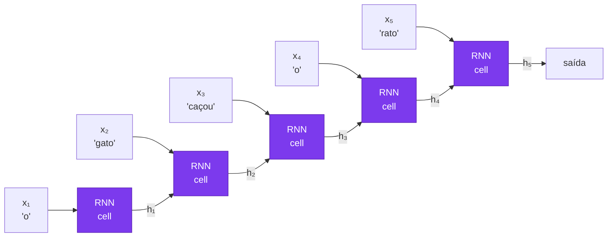
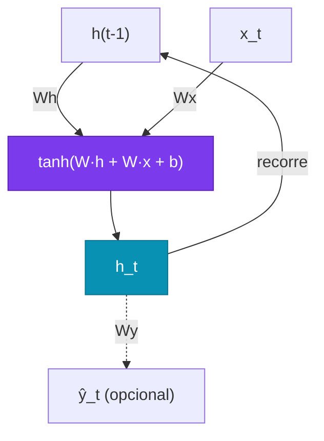
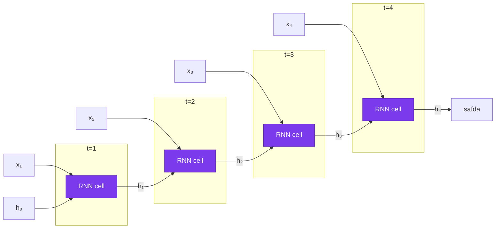
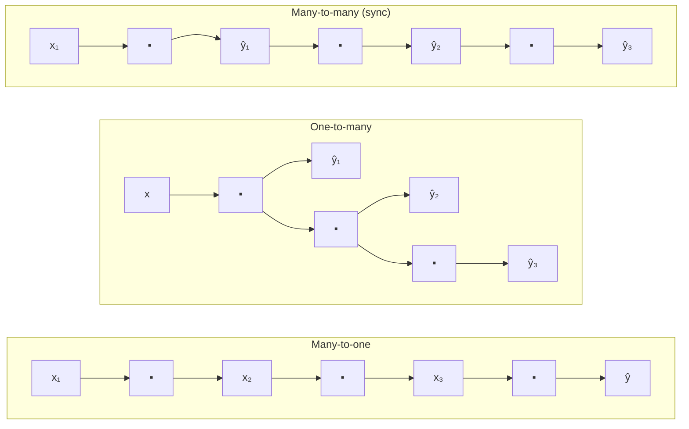
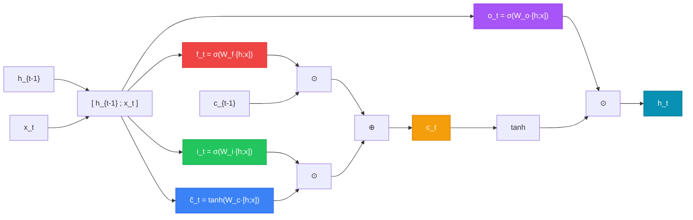
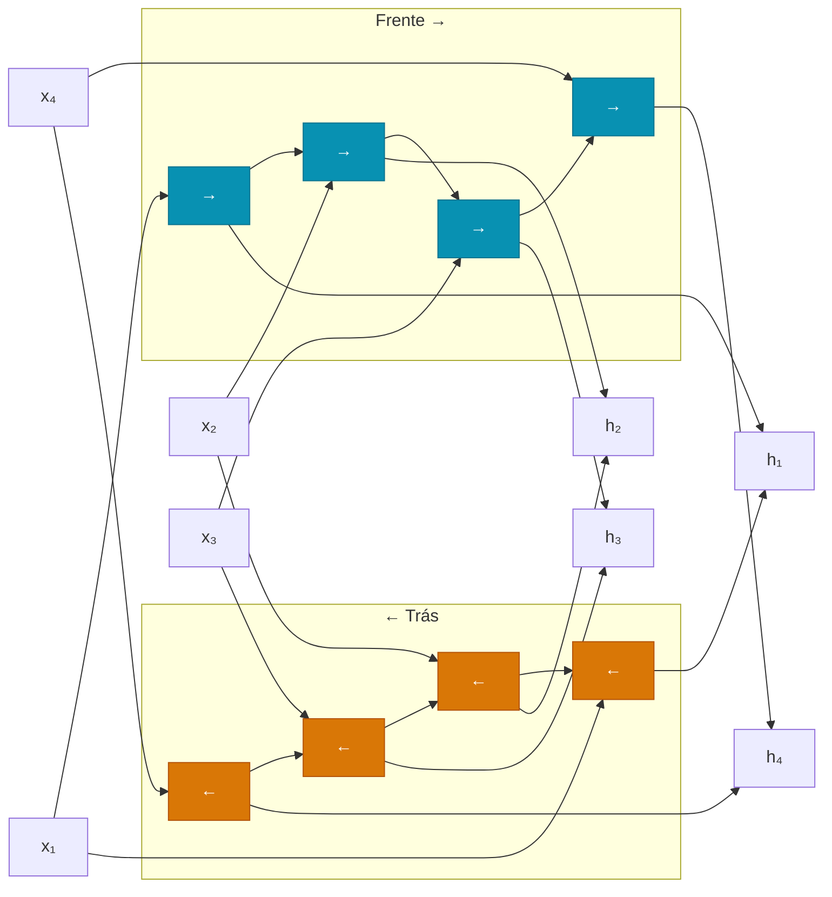
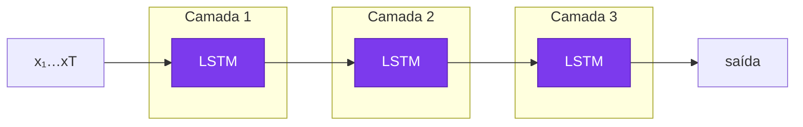
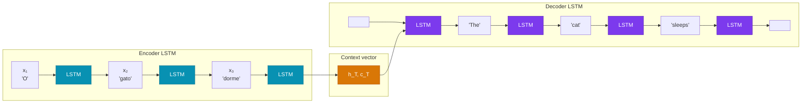

# Aula 5

## Redes Recorrentes: RNNs e LSTMs

<div class="pt-12">
  <span class="px-2 py-1 rounded cursor-pointer" hover:bg="white op-10">
    Tópicos Avançados em Inteligência Artificial · UFABC
  </span>
</div>

---
layout: section
---

# Parte 1 — O Problema das Sequências

---

# Roteiro da aula

<div class="grid grid-cols-2 gap-6 mt-5 text-sm">

<div class="space-y-3">

<div class="p-3 rounded bg-blue-900/30 border border-blue-500/40">

**Parte 1 — O Problema das Sequências**
Por que redes densas e CNNs não bastam

</div>

<div class="p-3 rounded bg-cyan-900/30 border border-cyan-500/40">

**Parte 2 — Redes Recorrentes (RNN)**
Estado oculto, equação recorrente, desenrolamento

</div>

<div class="p-3 rounded bg-amber-900/30 border border-amber-500/40">

**Parte 3 — Treinando RNNs**
BPTT, vanishing gradient, gradient clipping

</div>

</div>

<div class="space-y-3">

<div class="p-3 rounded bg-violet-900/30 border border-violet-500/40">

**Parte 4 — LSTM**
Célula de memória, 4 portas, intuição

</div>

<div class="p-3 rounded bg-emerald-900/30 border border-emerald-500/40">

**Parte 5 — GRU e Arquiteturas Práticas**
GRU, bidirecional, empilhamento, dropout

</div>

<div class="p-3 rounded bg-rose-900/30 border border-rose-500/40">

**Parte 6 — Código e Aplicações**
PyTorch e Keras; classificação e seq2seq

</div>

</div>

</div>

---

# Dados sequenciais estão em todo lugar

<div class="grid grid-cols-3 gap-4 mt-5 text-sm">

<div class="p-4 rounded bg-slate-800/50 border border-slate-600/30" v-click>

**📝 Texto / NLP**

"O **gato** que **caçou** o rato **dormia** agora."

A palavra "dormia" só faz sentido depois de entender "gato" três tokens atrás.

</div>

<div class="p-4 rounded bg-slate-800/50 border border-slate-600/30" v-click>

**📈 Séries temporais**

Temperatura, preço de ações, sinal de EEG.

O valor em $t$ depende dos valores em $t{-}1, t{-}2, \ldots$

</div>

<div class="p-4 rounded bg-slate-800/50 border border-slate-600/30" v-click>

**🎵 Áudio / fala**

O fonema atual depende do contexto fonético anterior.

</div>

</div>

<div class="mt-5 p-4 rounded bg-indigo-900/30 border border-indigo-500/30 text-sm" v-click>

**Propriedade-chave:** a **ordem importa** e o comprimento das sequências é **variável**.  
Isso quebra as premissas de redes densas (entrada de tamanho fixo, sem noção de posição) e CNNs (campo receptivo local fixo).

</div>

---

# Por que redes densas falham em sequências

<div class="grid grid-cols-2 gap-5 mt-2 text-sm">

<div>

**Abordagem ingênua:** concatenar todos os tokens e passar para uma rede densa.

<div class="font-mono text-xs bg-slate-900/70 p-2 rounded mt-1">

```
"o gato caçou o rato"
→ [emb_o ‖ emb_gato ‖ emb_caçou ‖ emb_o ‖ emb_rato]
→ Dense(5 × d → hidden) → Dense(hidden → saída)
```

</div>

<v-clicks>

**Problema 1 — Comprimento variável**

Frases de 3, 10, 100 tokens → entradas de tamanhos diferentes.

**Problema 2 — Sem compartilhamento de pesos**

O detector de "gato" na posição 2 é um conjunto diferente de pesos do que na posição 7. Não generaliza.

**Problema 3 — Não escala**

100 tokens × 128 dims = entrada de 12.800 → primeiro bloco denso enorme.

</v-clicks>

</div>

<div v-click>

**O que precisamos**

<div class="p-3 rounded bg-violet-900/30 border border-violet-500/30 text-xs mt-2">

✅ Processar tokens **um de cada vez**, em ordem  
✅ Manter um **estado interno** que acumula informação do passado  
✅ **Compartilhar pesos** entre todas as posições  
✅ Funcionar com sequências de **tamanho arbitrário**

</div>

<div class="mt-4">



</div>

</div>

</div>

---
layout: section
---

# Parte 2 — Redes Neurais Recorrentes (RNN)

---

# A célula RNN

<div class="grid grid-cols-2 gap-6 mt-4 text-sm">

<div>

**Ideia central:** uma célula que processa o token atual $\mathbf{x}_t$ e o estado oculto anterior $\mathbf{h}_{t-1}$, produzindo um novo estado $\mathbf{h}_t$.

<div class="mt-4 p-4 rounded bg-violet-900/30 border border-violet-500/30">

$$\mathbf{h}_t = \tanh\!\left(W_h\,\mathbf{h}_{t-1} + W_x\,\mathbf{x}_t + \mathbf{b}\right)$$

</div>

<div class="mt-3 text-xs space-y-1">

<v-clicks>

- $\mathbf{x}_t \in \mathbb{R}^d$ — embedding do token $t$
- $\mathbf{h}_t \in \mathbb{R}^h$ — estado oculto no passo $t$ (a "memória")
- $W_x \in \mathbb{R}^{h \times d}$ — projeta a entrada
- $W_h \in \mathbb{R}^{h \times h}$ — projeta o estado anterior
- $\mathbf{b} \in \mathbb{R}^h$ — bias
- $\tanh$ — ativa e mantém valores em $[-1, 1]$

</v-clicks>

</div>

<div class="mt-3 p-2 rounded bg-amber-900/30 border border-amber-500/30 text-xs" v-click>

**Os mesmos pesos** $W_h, W_x, \mathbf{b}$ são usados em **todos** os passos de tempo — isso é o compartilhamento de pesos.

</div>

</div>

<div v-click>



<div class="mt-3 text-xs opacity-70">

A seta de loop ($\mathbf{h}_t$ volta para $\mathbf{h}_{t-1}$ no próximo passo) é o que define a recorrência.

</div>

</div>

</div>

---

# Desenrolando no tempo (*unrolling*)

<div class="mt-1 text-sm">

A mesma célula repetida para cada passo de tempo:



<div class="grid grid-cols-3 gap-3 mt-2 text-xs">

<div class="p-3 rounded bg-slate-800/40 border border-slate-600/30" v-click>

**Pesos compartilhados**  
$W_h, W_x, \mathbf{b}$ são os **mesmos** em todos os passos.  
Isso mantém o número de parâmetros fixo independente do comprimento da sequência.

</div>

<div class="p-3 rounded bg-slate-800/40 border border-slate-600/30" v-click>

**Estado inicial**  
$\mathbf{h}_0$ é tipicamente inicializado com zeros.  
Para batch multi-sequência, cada sequência tem seu próprio $\mathbf{h}_0$.

</div>

<div class="p-3 rounded bg-slate-800/40 border border-slate-600/30" v-click>

**Saída**  
Pode-se usar $\mathbf{h}_T$ (último estado) para classificação, ou todos os $\mathbf{h}_t$ para tarefas token-a-token (ex: NER, tradução).

</div>

</div>

</div>

---

# Topologias de entrada/saída

<div class="mt-2">



</div>

<div class="grid grid-cols-3 gap-3 mt-2 text-xs">

<div class="p-3 rounded bg-cyan-900/30 border border-cyan-500/30">

**Many-to-one**
Sequência → um rótulo

Ex: análise de sentimento, classificação de texto, detecção de spam

</div>

<div class="p-3 rounded bg-violet-900/30 border border-violet-500/30">

**One-to-many**
Um vetor → sequência

Ex: geração de legenda de imagem (*image captioning*)

</div>

<div class="p-3 rounded bg-emerald-900/30 border border-emerald-500/30">

**Many-to-many**
Sequência → sequência

Ex: NER (mesmo comprimento), tradução com seq2seq (comprimento diferente)

</div>

</div>

---
layout: section
---

# Parte 3 — Treinando RNNs

---

# Backpropagation Through Time (BPTT)

<div class="grid grid-cols-2 gap-5 mt-2 text-sm">

<div>

O gradiente da loss precisa fluir de volta por cada passo de tempo — através de cada aplicação de $W_h$.

<div class="mt-3 p-3 rounded bg-slate-800/50 border border-slate-600/30 text-xs">

$$\frac{\partial \mathcal{L}}{\partial W_h} = \sum_{t=1}^{T} \frac{\partial \mathcal{L}_t}{\partial W_h}$$

$$\frac{\partial \mathcal{L}_t}{\partial W_h} = \frac{\partial \mathcal{L}_t}{\partial \mathbf{h}_t} \cdot \prod_{k=t}^{T-1} \frac{\partial \mathbf{h}_{k+1}}{\partial \mathbf{h}_k}$$

</div>

<div class="mt-2 text-xs opacity-70">

$\text{diag}(\tanh'(\cdot))$ é a matriz diagonal das derivadas do tanh no passo $k$ — cada elemento é $1 - h_k^2 \in (0,1)$. Multiplicar por $W_h^\top$ a cada passo encolhe ou explode o gradiente.

</div>

</div>

<div v-click>

**O problema:**

$$\prod_{k=t}^{T-1} \frac{\partial \mathbf{h}_{k+1}}{\partial \mathbf{h}_k} = \prod_{k=t}^{T-1} W_h^\top \cdot \text{diag}(\tanh'(\cdot))$$

<div class="mt-3 grid grid-cols-2 gap-3 text-xs">

<div class="p-3 rounded bg-red-900/30 border border-red-500/30">

**Vanishing gradient**  
Se $\|W_h\| < 1$ ou derivadas de $\tanh$ são pequenas, o produto encolhe **exponencialmente** → gradiente ≈ 0 para dependências longas

</div>

<div class="p-3 rounded bg-orange-900/30 border border-orange-500/30">

**Exploding gradient**  
Se $\|W_h\| > 1$, o produto cresce **exponencialmente** → NaN / divergência no treino

</div>

</div>

</div>

</div>

---

# Vanishing gradient — intuição

<div class="mt-2 text-sm">

<div class="grid grid-cols-2 gap-6">

<div>

Imagine uma cadeia de multiplicações com fator $\gamma < 1$ a cada passo:

<div class="font-mono text-xs bg-slate-900/70 p-2 rounded mt-1">

```
T = 10 passos, γ = 0.9:
gradiente ← 0.9^10 ≈ 0.35   (ainda ok)

T = 50 passos, γ = 0.9:
gradiente ← 0.9^50 ≈ 0.005  (quase zero)

T = 100 passos, γ = 0.9:
gradiente ← 0.9^100 ≈ 2×10⁻⁵ (efetivamente zero)
```

</div>

<div class="mt-3 text-xs opacity-70">

A rede "esquece" o que aconteceu mais de ~10–20 passos atrás.

</div>

</div>

<div v-click>

**Consequência prática**

<div class="p-3 rounded bg-red-900/20 border border-red-500/30 text-xs mt-2">

❌ RNNs vanilla não conseguem aprender dependências de longo alcance  
❌ Em tarefas como tradução ou análise de documentos longos, o desempenho é ruim

</div>

**Solução parcial: gradient clipping**

```python
# PyTorch — clipar gradientes antes do update
torch.nn.utils.clip_grad_norm_(
    model.parameters(), max_norm=1.0
)
```

<div class="p-3 rounded bg-emerald-900/30 border border-emerald-500/30 text-xs mt-2">

✅ Gradient clipping resolve o *exploding gradient*  
❌ Mas **não** resolve o vanishing — precisamos de uma arquitetura diferente: **LSTM**

</div>

</div>

</div>

</div>

---
layout: section
---

# Parte 4 — Long Short-Term Memory (LSTM)

---

# Motivação — uma memória explícita

<div class="grid grid-cols-2 gap-5 mt-2 text-sm">

<div>

**Hochreiter & Schmidhuber (1997)**

A ideia central: separar a "memória de longo prazo" do "estado de trabalho".

<div class="mt-2 p-2 rounded bg-violet-900/30 border border-violet-500/30 text-xs">

**RNN vanilla:**  
Um único vetor $\mathbf{h}_t$ deve fazer tudo — acumular história, filtrar ruído, carregar informação útil.

</div>

<div class="mt-2 p-2 rounded bg-emerald-900/30 border border-emerald-500/30 text-xs" v-click>

**LSTM:**  
Dois vetores distintos:  
- $\mathbf{c}_t$ — **célula de memória** (longo prazo, fluxo suave)  
- $\mathbf{h}_t$ — **estado oculto** (curto prazo, saída filtrada)

E três **portas** (gates) que controlam o fluxo de informação.

</div>

</div>

<div v-click>

**A metáfora da esteira**

```
═══════════════════════════════════ c_t (célula)
       ↑            ↑          ↑
  [esquecer]   [adicionar]  [ler]
       ↑            ↑          ↑
    f_t · c_{t-1} + i_t · g_t  → h_t
```

<div class="text-xs mt-2 space-y-1">

- **f\_t** (*forget gate*) — quanto de c\_{t-1} preservar (0 = apaga, 1 = mantém)
- **i\_t** (*input gate*) — quanto da proposta g\_t deve ser escrita na célula
- **g\_t** (*candidato*) — proposta de novo conteúdo, gerada por tanh
- **h\_t** — saída filtrada pelo *output gate* a partir de c\_t

</div>

</div>

</div>

---

# LSTM — Equação 1: Forget Gate

$$\mathbf{f}_t = \sigma\!\bigl(W_f\,[\mathbf{h}_{t-1};\,\mathbf{x}_t] + \mathbf{b}_f\bigr)$$

<div class="grid grid-cols-2 gap-5 mt-3 text-xs">

<div class="p-3 rounded bg-blue-900/30 border border-blue-500/30">

**"O filtro do passado"**

- σ(·) → saída em **(0, 1)** por dimensão independentemente
- **f\_t ≈ 0** → apaga essa dimensão de c(t-1)
- **f\_t ≈ 1** → preserva essa dimensão intacta
- Aprende o que descartar a partir de h(t-1) e x\_t

</div>

<div>

<div class="p-3 rounded bg-slate-800/50 border border-slate-600/30">

**Exemplo:** ao processar "Pedro" após "João foi ao mercado", f\_t ≈ 0 na dimensão do sujeito ativo **apaga "João"** para dar lugar ao novo referente.

</div>

<div class="mt-2 p-3 rounded bg-amber-900/30 border border-amber-500/30">

**Gradiente:** ∂c\_t/∂c(t-1) = f\_t. Quando f\_t ≈ 1, o gradiente volta **sem atenuação** — solução central para o *vanishing gradient*.

</div>

</div>

</div>

---

# LSTM — Equação 2: Input Gate + Candidato

$$\mathbf{i}_t = \sigma\!\bigl(W_i\,[\mathbf{h}_{t-1};\,\mathbf{x}_t] + \mathbf{b}_i\bigr) \qquad \tilde{\mathbf{c}}_t = \tanh\!\bigl(W_c\,[\mathbf{h}_{t-1};\,\mathbf{x}_t] + \mathbf{b}_c\bigr)$$

<div class="grid grid-cols-2 gap-5 mt-3 text-xs">

<div class="p-3 rounded bg-emerald-900/30 border border-emerald-500/30">

**"O quê" e "quanto" escrever**

Dois papéis distintos que trabalham juntos:

- **ĉ\_t** (tanh) — propõe o *conteúdo*: valores em (−1, 1), codifica direção/polaridade
- **i\_t** (σ) — a *porteira*: decide quanto de ĉ\_t realmente entra na célula
- Produto: i\_t ⊙ ĉ\_t = nova informação filtrada

</div>

<div>

<div class="p-3 rounded bg-slate-800/50 border border-slate-600/30">

**Exemplo:** ao processar "Pedro", ĉ\_t codifica as propriedades do novo sujeito; i\_t decide em quais dimensões da célula gravá-las.

</div>

<div class="mt-2 p-3 rounded bg-violet-900/30 border border-violet-500/30">

**Por que tanh para ĉ\_t?** A memória precisa representar *direção* — incrementar ou decrementar uma feature. σ só dá valores positivos; tanh permite codificar polaridade.

</div>

</div>

</div>

---

# LSTM — Equação 3: Atualização da Célula

$$\mathbf{c}_t = \underbrace{\mathbf{f}_t \odot \mathbf{c}_{t-1}}_{\text{apaga o velho}} \;+\; \underbrace{\mathbf{i}_t \odot \tilde{\mathbf{c}}_t}_{\text{adiciona o novo}}$$

<div class="grid grid-cols-2 gap-5 mt-3 text-xs">

<div class="p-3 rounded bg-violet-900/30 border border-violet-500/30">

**A "esteira de memória"**

A célula c\_t é uma **via aditiva** que transporta informação ao longo do tempo:

- f\_t ⊙ c(t-1) → mantém o que ainda importa
- i\_t ⊙ ĉ\_t → acrescenta o novo conteúdo
- **⊙** = produto de Hadamard (elemento a elemento)

Casos extremos: f\_t ≈ 1, i\_t ≈ 0 → célula **congelada** · f\_t ≈ 0, i\_t ≈ 1 → célula **resetada**

</div>

<div class="p-3 rounded bg-emerald-900/30 border border-emerald-500/30">

**Por que a soma resolve o vanishing gradient?**

Na RNN vanilla o gradiente flui por W\_h · tanh′(·) e encolhe exponencialmente a cada passo.

Na LSTM: ∂c\_t/∂c(t-1) = f\_t. Quando f\_t ≈ 1 o gradiente volta **diretamente**, sem passar por não-linearidades — a adição cria um "atalho" na backpropagation.

</div>

</div>

---

# LSTM — Equação 4: Output Gate

$$\mathbf{o}_t = \sigma\!\bigl(W_o\,[\mathbf{h}_{t-1};\,\mathbf{x}_t] + \mathbf{b}_o\bigr) \qquad \mathbf{h}_t = \mathbf{o}_t \odot \tanh(\mathbf{c}_t)$$

<div class="grid grid-cols-2 gap-5 mt-3 text-xs">

<div class="p-3 rounded bg-amber-900/30 border border-amber-500/30">

**"Memória privada vs. saída pública"**

- **c\_t** = memória interna (pode guardar muito mais do que é exposto)
- **o\_t** (σ) = decide quais dimensões de c\_t "vazam" para h\_t
- **tanh(c\_t)** = normaliza a célula para (−1, 1)
- **h\_t** = saída visível — vai para a próxima camada *e* para t+1

</div>

<div>

<div class="p-3 rounded bg-slate-800/50 border border-slate-600/30">

**Exemplo:** em tradução, c\_t guarda o gênero de um substantivo por vários passos. O output gate o expõe apenas quando o modelo vai gerar um adjetivo que precisa de concordância.

</div>

<div class="mt-2 p-2 rounded bg-indigo-900/30 border border-indigo-500/30 text-xs">

**Síntese:** forget → apagar c(t-1) · input → escrever em c\_t · output → expor h\_t

</div>

</div>

</div>

---

# Intuição dos gates — passo a passo

<div class="mt-4 text-sm">

**Exemplo:** *"Maria foi ao mercado. Ela comprou maçãs."* — a rede precisa saber que "Ela" = "Maria".

<div class="grid grid-cols-3 gap-4 mt-3 text-xs">

<div class="p-3 rounded bg-blue-900/30 border border-blue-500/30" v-click>

**🗑️ Forget gate**

Ao processar "Ela", a rede pode usar $\mathbf{f}_t \approx 1$ para **manter** "Maria" na célula, ou $\mathbf{f}_t \approx 0$ para **apagar** informações irrelevantes de passos anteriores.

$\mathbf{c}_t \leftarrow \mathbf{f}_t \odot \mathbf{c}_{t-1}$

</div>

<div class="p-3 rounded bg-emerald-900/30 border border-emerald-500/30" v-click>

**✏️ Input gate**

Ao ver "Ela", $\mathbf{i}_t$ decide quanto do candidato $\tilde{\mathbf{c}}_t$ (que codifica o pronome e seu possível referente) deve ser **gravado** na célula.

$\mathbf{c}_t \mathrel{+}= \mathbf{i}_t \odot \tilde{\mathbf{c}}_t$

</div>

<div class="p-3 rounded bg-violet-900/30 border border-violet-500/30" v-click>

**👁️ Output gate**

Ao gerar a próxima palavra, $\mathbf{o}_t$ controla **quanta** da memória de "Maria" deve ser passada para $\mathbf{h}_t$ e, portanto, influenciar a predição.

$\mathbf{h}_t = \mathbf{o}_t \odot \tanh(\mathbf{c}_t)$

</div>

</div>

<div class="mt-4 p-3 rounded bg-indigo-900/30 border border-indigo-500/30 text-xs" v-click>

**Por que a LSTM resolve o vanishing gradient?**  
O caminho de gradiente pela célula $\mathbf{c}$ é **aditivo**: $\mathbf{c}_t = \mathbf{f}_t \odot \mathbf{c}_{t-1} + \ldots$  
A adição não multiplica o gradiente — ele pode fluir de volta por muitos passos sem encolher exponencialmente (desde que $\mathbf{f}_t \approx 1$).

</div>

</div>

---

# Diagrama completo da célula LSTM

<div class="mt-3">



</div>

<div class="grid grid-cols-4 gap-2 mt-3 text-xs">
<div class="p-2 rounded bg-red-900/30 border border-red-500/30 text-center">🔴 Forget</div>
<div class="p-2 rounded bg-green-900/30 border border-green-500/30 text-center">🟢 Input</div>
<div class="p-2 rounded bg-blue-900/30 border border-blue-500/30 text-center">🔵 Candidato</div>
<div class="p-2 rounded bg-purple-900/30 border border-purple-500/30 text-center">🟣 Output</div>
</div>

---
layout: section
---

# Parte 5 — GRU e Arquiteturas Práticas

---

# GRU — Gated Recurrent Unit

<div class="grid grid-cols-2 gap-5 mt-2 text-sm">

<div>

**Cho et al. (2014)** — versão simplificada da LSTM com apenas **2 gates** e **sem célula separada**.

**Porta de reset** (*reset gate*)

$$\mathbf{r}_t = \sigma(W_r\,[\mathbf{h}_{t-1}; \mathbf{x}_t])$$

<div class="text-xs opacity-70 mt-1 mb-3">

Controla quanto do estado anterior influencia o candidato.

</div>

**Porta de atualização** (*update gate*)

$$\mathbf{z}_t = \sigma(W_z\,[\mathbf{h}_{t-1}; \mathbf{x}_t])$$

**Candidato + atualização final**

$$\tilde{\mathbf{h}}_t = \tanh(W\,[\mathbf{r}_t \odot \mathbf{h}_{t-1}; \mathbf{x}_t])$$

$$\mathbf{h}_t = (1 - \mathbf{z}_t) \odot \mathbf{h}_{t-1} + \mathbf{z}_t \odot \tilde{\mathbf{h}}_t$$

</div>

<div v-click>

**GRU vs LSTM**

| | **LSTM** | **GRU** |
|---|---|---|
| Gates | 3 (f, i, o) | 2 (r, z) |
| Estado | $\mathbf{h}_t$ + $\mathbf{c}_t$ | só $\mathbf{h}_t$ |
| Parâmetros | Mais | Menos |
| Treinamento | Mais lento | Mais rápido |
| Desempenho | Melhor em seq. muito longas | Comparável na maioria |

<div class="mt-2 p-2 rounded bg-amber-900/30 border border-amber-500/30 text-xs">

**Regra prática:** comece com GRU; use LSTM para sequências muito longas ou quando precisar de memória mais granular.

</div>

</div>

</div>

---

# RNN Bidirecional

<div class="grid grid-cols-2 gap-5 mt-2 text-sm">

<div>

Em muitas tarefas o contexto **futuro** é tão importante quanto o passado.

Exemplo: NER  
*"__Paris__ é uma bela cidade."*  
→ "cidade" depois de "Paris" confirma que é uma entidade local.

**Solução:** processar a sequência em ambas as direções e concatenar os estados ocultos.

$$\overrightarrow{\mathbf{h}}_t = \text{RNN}(\mathbf{x}_t, \overrightarrow{\mathbf{h}}_{t-1})$$

$$\overleftarrow{\mathbf{h}}_t = \text{RNN}(\mathbf{x}_t, \overleftarrow{\mathbf{h}}_{t+1})$$

$$\mathbf{h}_t = [\overrightarrow{\mathbf{h}}_t \;;\; \overleftarrow{\mathbf{h}}_t]$$

</div>

<div v-click>



<div class="mt-2 text-xs opacity-70">

⚠️ Bidirecional só é possível quando toda a sequência está disponível de antemão (não serve para geração autorregressiva).

</div>

</div>

</div>

---

# RNNs empilhadas e Dropout

<div class="grid grid-cols-2 gap-6 mt-4 text-sm">

<div>

**Empilhamento** (*stacking*)

A saída de uma camada RNN alimenta a próxima — cada camada aprende representações mais abstratas.



<div class="text-xs opacity-70 mt-2">

2–4 camadas são comuns; mais do que isso raramente ajuda e aumenta o risco de overfitting.

</div>

</div>

<div v-click>

**Dropout em RNNs**

Dropout padrão entre camadas funciona, mas **não** dentro da célula recorrente (destruiria a memória).

**Dropout variacional** (Gal & Ghahramani, 2016): aplica a **mesma máscara** em todos os passos de tempo.

```python
# PyTorch — dropout entre camadas LSTM
nn.LSTM(
    input_size=128,
    hidden_size=256,
    num_layers=3,
    dropout=0.3,      # aplicado entre camadas
    bidirectional=False
)
```

<div class="mt-2 p-2 rounded bg-amber-900/30 border border-amber-500/30 text-xs">

O argumento `dropout` do `nn.LSTM` só é aplicado entre as camadas intermediárias — a última camada não tem dropout automático.

</div>

</div>

</div>

---
layout: section
---

# Parte 6 — Código e Aplicações

---

# `nn.LSTM` e `nn.GRU` — PyTorch

<div class="grid grid-cols-2 gap-3 mt-1 text-sm">

<div>

```python
import torch
import torch.nn as nn

# Sequência: (batch=2, seq_len=10, input_size=64)
x = torch.randn(2, 10, 64)

# LSTM
lstm = nn.LSTM(
    input_size=64,
    hidden_size=128,
    num_layers=2,
    batch_first=True,   # (batch, seq, feat)
    dropout=0.2,
    bidirectional=False
)

# Forward pass
# h0, c0: (num_layers, batch, hidden)
h0 = torch.zeros(2, 2, 128)
c0 = torch.zeros(2, 2, 128)

output, (hn, cn) = lstm(x, (h0, c0))
# output: (2, 10, 128) — todos os h_t
# hn:     (2, 2, 128)  — último h de cada camada
# cn:     (2, 2, 128)  — último c de cada camada
```

</div>

<div v-click>

```python
# GRU — mesma interface, sem c
gru = nn.GRU(
    input_size=64,
    hidden_size=128,
    num_layers=2,
    batch_first=True,
    bidirectional=True  # hidden_size × 2 na saída
)

output, hn = gru(x)
# output: (2, 10, 256) — bidirecional → ×2
# hn:     (4, 2, 128)  — 2 layers × 2 direções

# Classificação: usar último token
last_hidden = output[:, -1, :]  # (2, 256)

# Ou média sobre a sequência
mean_hidden = output.mean(dim=1) # (2, 256)
```

<div class="mt-3 p-2 rounded bg-slate-800/40 border border-slate-600/30 text-xs">

Com `batch_first=False` (padrão): formato `(seq, batch, feat)`. Recomendo sempre usar `batch_first=True` para consistência com Keras.

</div>

</div>

</div>

---

# Classificação de sentimento — PyTorch

<div class="text-xs">

```python
class SentimentLSTM(nn.Module):
    def __init__(self, vocab_size, embed_dim, hidden_dim, num_layers, num_classes):
        super().__init__()
        self.embed   = nn.Embedding(vocab_size, embed_dim, padding_idx=0)
        self.lstm    = nn.LSTM(embed_dim, hidden_dim, num_layers,
                               batch_first=True, dropout=0.3)
        self.dropout = nn.Dropout(0.3)
        self.fc      = nn.Linear(hidden_dim, num_classes)

    def forward(self, x):                   # x: (batch, seq_len)
        emb = self.embed(x)                 # (batch, seq_len, embed_dim)
        out, (hn, _) = self.lstm(emb)       # out: (batch, seq_len, hidden)
        # Usa o último estado oculto da última camada
        last = hn[-1]                       # (batch, hidden_dim)
        last = self.dropout(last)
        return self.fc(last)                # (batch, num_classes)

model     = SentimentLSTM(10_000, 128, 256, 2, 2)  # binário: pos/neg
criterion = nn.CrossEntropyLoss()
optimizer = torch.optim.Adam(model.parameters(), lr=1e-3)

for epoch in range(10):
    for tokens, labels in train_loader:
        logits = model(tokens)
        loss   = criterion(logits, labels)
        optimizer.zero_grad(); loss.backward()
        torch.nn.utils.clip_grad_norm_(model.parameters(), 1.0)  # clipping!
        optimizer.step()
```

</div>

---

# LSTM em Keras

<div class="grid grid-cols-2 gap-3 mt-1 text-sm">

<div>

```python
import tensorflow as tf
from tensorflow import keras

# Pipeline completo
vectorizer = keras.layers.TextVectorization(
    max_tokens=10_000,
    output_sequence_length=128
)
vectorizer.adapt(train_texts)

model = keras.Sequential([
    keras.Input(shape=(1,), dtype='string'),
    vectorizer,
    keras.layers.Embedding(10_000, 128, mask_zero=True),
    # LSTM bidirecional empilhado
    keras.layers.Bidirectional(
        keras.layers.LSTM(128, return_sequences=True,
                          dropout=0.2, recurrent_dropout=0.2)
    ),
    keras.layers.Bidirectional(
        keras.layers.LSTM(64, dropout=0.2)
    ),
    keras.layers.Dense(64, activation='relu'),
    keras.layers.Dropout(0.3),
    keras.layers.Dense(1, activation='sigmoid'),  # binário
])
```

</div>

<div v-click>

```python
model.compile(
    loss='binary_crossentropy',
    optimizer=keras.optimizers.Adam(1e-3),
    metrics=['accuracy']
)
model.summary()

# Model: "sequential"
# ___________________________________________________
# Layer (type)           Output Shape      Param #
# ===================================================
# text_vectorization     (None, 128)             0
# embedding              (None, 128, 128)  1,280,000
# bidirectional          (None, 128, 256)    263,168
# bidirectional_1        (None, 128)          98,816
# dense                  (None, 64)           8,256
# dropout                (None, 64)               0
# dense_1                (None, 1)               65
# ===================================================

model.fit(train_texts, train_labels,
          validation_split=0.2, epochs=10,
          batch_size=64)
```

</div>

</div>

---

# Aplicação: sequência de texto a tradução (*seq2seq*)

<div class="mt-3 text-sm">



<div class="grid grid-cols-2 gap-4 mt-4 text-xs">

<div class="p-3 rounded bg-cyan-900/30 border border-cyan-500/30">

**Encoder**: processa a sequência de entrada, compressa em vetor de contexto $(h_T, c_T)$.

</div>

<div class="p-3 rounded bg-violet-900/30 border border-violet-500/30">

**Decoder**: inicializado com $(h_T, c_T)$, gera a saída token por token de forma autorregressiva.

</div>

</div>

<div class="mt-3 p-2 rounded bg-indigo-900/30 border border-indigo-500/30 text-xs" v-click>

**Limitação do seq2seq puro:** o vetor de contexto é um gargalo — comprimir uma sequência inteira em um único vetor perde informação. A solução é o **mecanismo de atenção** (→ Aula 6: Transformers).

</div>

</div>

---

# Comparativo: RNN, LSTM, GRU

<div class="mt-2">

| | **RNN vanilla** | **LSTM** | **GRU** |
|---|---|---|---|
| Memória | Estado $\mathbf{h}_t$ | $\mathbf{h}_t$ + $\mathbf{c}_t$ | só $\mathbf{h}_t$ |
| Gates | — | 3 (f, i, o) | 2 (r, z) |
| Parâmetros | $4 \times$ (vanilla) | $4 \times$ mais que RNN | $3 \times$ mais que RNN |
| Dependências longas | ❌ Vanishing | ✅ Bom | ✅ Bom |
| Velocidade | Rápido | Mais lento | Intermediário |
| Uso típico | Baseline rápido | Padrão em NLP até 2018 | Alternativa eficiente |

<div class="mt-3 p-3 rounded bg-indigo-900/30 border border-indigo-500/30 text-xs" v-click>

**Em 2017–2018**, LSTMs eram o estado da arte em tradução, sumarização e reconhecimento de fala. Com a chegada dos **Transformers** (Vaswani et al., 2017), foram gradualmente substituídos — mas RNNs/LSTMs ainda são úteis para sequências de baixa latência, dispositivos com pouca memória e tarefas de séries temporais.

</div>

</div>

---
layout: center
class: text-center
---

# Recapitulando

<div class="grid grid-cols-3 gap-4 mt-6 text-xs text-left">

<div class="p-3 rounded bg-blue-900/30 border border-blue-500/30">

**O problema**
- Dados sequenciais têm ordem e tamanho variável
- Redes densas: sem ordem, sem compartilhamento
- CNNs: campo receptivo limitado

</div>

<div class="p-3 rounded bg-violet-900/30 border border-violet-500/30">

**RNN vanilla**
- $\mathbf{h}_t = \tanh(W_h\mathbf{h}_{t-1} + W_x\mathbf{x}_t)$
- Pesos compartilhados em todos os passos
- Sofre de vanishing gradient

</div>

<div class="p-3 rounded bg-amber-900/30 border border-amber-500/30">

**BPTT e gradientes**
- Gradiente flui de volta por multiplicações encadeadas
- Vanishing: $\gamma^T \to 0$ com $\gamma < 1$
- Exploding: gradient clipping

</div>

<div class="p-3 rounded bg-emerald-900/30 border border-emerald-500/30">

**LSTM**
- Célula $\mathbf{c}_t$ + gates f, i, o
- Caminho aditivo: resolve vanishing
- $\mathbf{c}_t = \mathbf{f}_t \odot \mathbf{c}_{t-1} + \mathbf{i}_t \odot \tilde{\mathbf{c}}_t$

</div>

<div class="p-3 rounded bg-rose-900/30 border border-rose-500/30">

**GRU e práticas**
- 2 gates, mais eficiente que LSTM
- Bidirecional: contexto passado + futuro
- Empilhamento + dropout variacional

</div>

<div class="p-3 rounded bg-indigo-900/30 border border-indigo-500/30">

**Próxima aula**
- Gargalo do vetor de contexto
- Mecanismo de atenção
- Arquitetura Transformer completa

</div>

</div>

---

# Próxima aula

<div class="mt-6 grid grid-cols-2 gap-6 text-sm">

<div class="p-4 rounded bg-slate-800/50 border border-slate-600/30">

**Aula 6 — Transformers**

- Limitação do seq2seq como motivação
- Mecanismo de atenção (*self-attention*)
- *Scaled Dot-Product Attention* e Multi-Head
- Positional encoding
- Arquitetura completa (encoder + decoder)
- BERT e GPT: fine-tuning e geração

</div>

<div class="p-4 rounded bg-indigo-900/30 border border-indigo-500/30">

**Para esta semana**

- Notebook `lec05-rnn.ipynb`:
  - Classificação de sentimento com LSTM (IMDB)
  - Comparação RNN vs LSTM vs GRU
  - Curvas de aprendizado e análise de gradientes
  - Visualização dos estados ocultos com t-SNE

</div>

</div>

---
layout: center
---

# Obrigado! Perguntas?

<div class="text-sm opacity-60 mt-4">

CCM-109 · Deep Learning · UFABC

</div>
