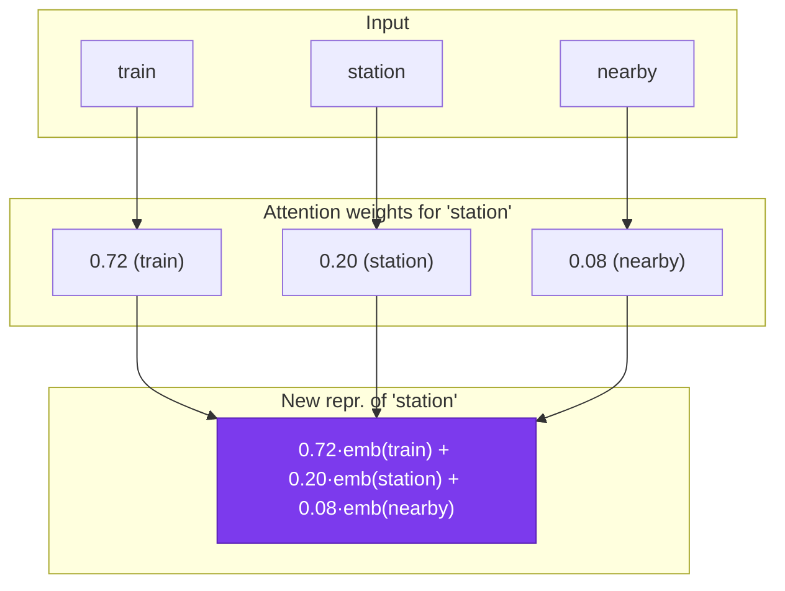
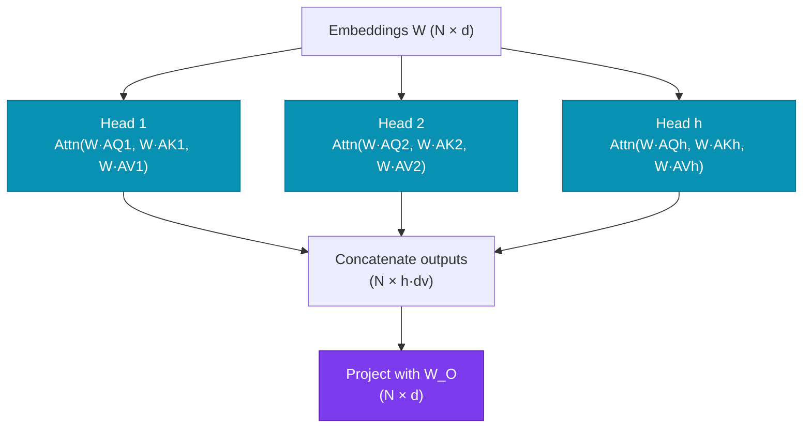
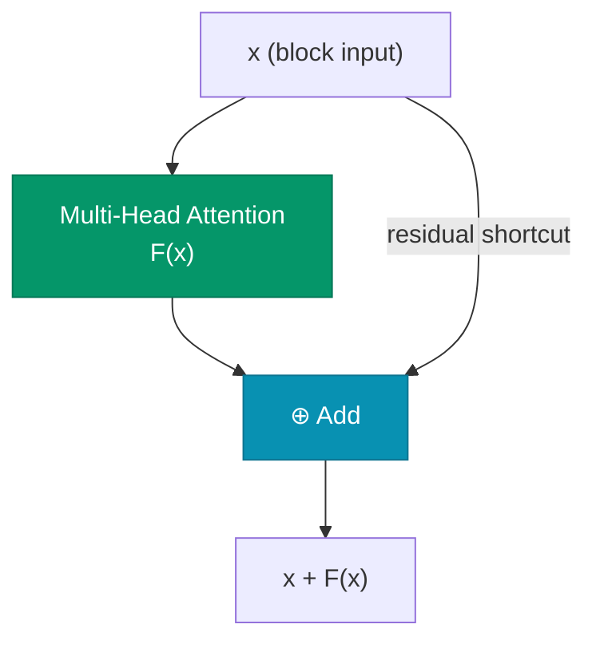
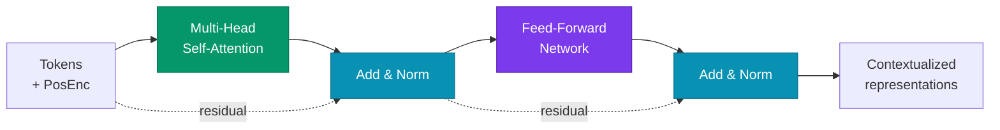
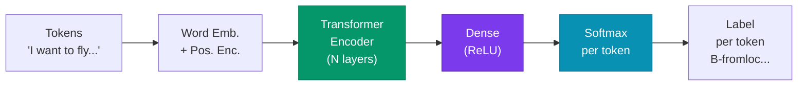

# Lecture 6

## Transformers: Attention Mechanism

<div class="pt-12">
  <span class="px-2 py-1 rounded cursor-pointer" hover:bg="white op-10">
    Advanced Topics in Artificial Intelligence · UFABC
  </span>
</div>

---

# Lecture outline

<div class="grid grid-cols-2 gap-6 mt-5 text-sm">

<div class="space-y-3">

<div class="p-3 rounded bg-blue-900/30 border border-blue-500/40">

**Part 1 — Motivation**
Polysemy, ATIS task, and requirements for a solution

</div>

<div class="p-3 rounded bg-violet-900/30 border border-violet-500/40">

**Part 2 — Self-Attention**
Contextual representation, dot product, softmax

</div>

<div class="p-3 rounded bg-cyan-900/30 border border-cyan-500/40">

**Part 3 — Multi-Head Attention**
Parallel heads, concatenation and projection

</div>

</div>

<div class="space-y-3">

<div class="p-3 rounded bg-amber-900/30 border border-amber-500/40">

**Part 4 — Positional Encoding**
Permutation invariance problem, positional embeddings

</div>

<div class="p-3 rounded bg-emerald-900/30 border border-emerald-500/40">

**Part 5 — Full Encoder**
Q/K/V, residual connections, LayerNorm, complete block

</div>

<div class="p-3 rounded bg-rose-900/30 border border-rose-500/40">

**Part 6 — Applications**
Slot filling, task types, PyTorch code

</div>

</div>

</div>

---
layout: section
---

# Part 1 — Motivation

---

# From RNNs to Transformers

<div class="mt-2 text-sm">

In the previous lecture we covered RNNs and LSTMs as sequence models. Why aren't they enough for modern NLP?

<div class="grid grid-cols-3 gap-3 mt-3 text-xs">

<div class="p-2 rounded bg-slate-700/50 border border-slate-500/30" v-click>

**Sequential processing**

RNNs compute h_t from h_{t-1} — impossible to parallelize. N tokens = N serial steps, even on GPUs.

❌ Slow training on long sequences

</div>

<div class="p-2 rounded bg-slate-700/50 border border-slate-500/30" v-click>

**Vanishing gradient**

Gradients dissipate when backpropagating through many steps. LSTMs mitigate but do not eliminate the problem.

❌ Long-range dependencies are hard to learn

</div>

<div class="p-2 rounded bg-slate-700/50 border border-slate-500/30" v-click>

**Compressed context**

The entire sequence history is compressed into a single vector h_t. Information from distant tokens progressively dilutes.

❌ In long sequences, h_t carries almost no information from the first tokens

</div>

</div>

<div class="mt-3 p-2 rounded bg-indigo-900/30 border border-indigo-500/30 text-xs" v-click>

**Transformer** (Vaswani et al., 2017) eliminates recurrence: each token connects directly to all others via **self-attention** — fully parallel processing, global context, no vanishing gradient in attention.

</div>

</div>
---

# The polysemy problem

<div class="grid grid-cols-2 gap-5 mt-3 text-sm">

<div>

**Polysemy:** the same word has different meanings depending on context.

<div class="mt-3 space-y-3">

<div class="p-3 rounded bg-blue-900/30 border border-blue-500/40" v-click>

**"station"**
- *"I arrived at the train **station**."* → railway station
- *"She works at a radio **station**."* → broadcasting station

</div>

<div class="p-3 rounded bg-blue-900/30 border border-blue-500/40" v-click>

**"bank"**
- *"I deposited money at the **bank**."* → financial institution
- *"We sat on the river **bank**."* → riverbank

</div>

</div>

</div>

<div v-click>

**The problem with static word embeddings**

<div class="p-3 rounded bg-red-900/30 border border-red-500/30 text-xs mt-2">

❌ Word2Vec and GloVe assign **one single vector** per word — regardless of context.

"bank" always has the same embedding, blending both meanings together.

</div>

<div class="p-3 rounded bg-emerald-900/30 border border-emerald-500/30 text-xs mt-3" v-click>

✅ We need **contextual representations**: the embedding of "station" should depend on surrounding words.

"train station" → close to railway-related terms  
"radio station" → close to media-related terms

</div>

</div>

</div>

---

# ATIS task — Slot Filling

<div class="mt-2 text-sm">

**ATIS (Airline Travel Information System):** classify each word in a sentence into semantic categories (*slots*).

<div class="mt-3 p-3 rounded bg-blue-900/30 border border-blue-500/40 font-mono text-xs">

```
Sentence: I   want  to   fly  from  boston  at   7   am   and  arrive  in   denver  at  11   in  the  morning
Label:    O    O     O    O    O    B-from  O   B-dep  I-dep  O    O    O   B-arr    O  B-arr  I-arr  I-arr  I-arr
```

</div>

<div class="grid grid-cols-3 gap-3 mt-4 text-xs">

<div class="p-2 rounded bg-slate-800/50 border border-slate-600/30" v-click>

**B-fromloc.city_name**
"boston" = origin city  
B = beginning of the entity

</div>

<div class="p-2 rounded bg-slate-800/50 border border-slate-600/30" v-click>

**B-depart_time.time**
"7 am" = departure time  
I = continuation of the entity

</div>

<div class="p-2 rounded bg-slate-800/50 border border-slate-600/30" v-click>

**B-toloc.city_name**
"denver" = destination city  
O = outside any entity

</div>

</div>

<div class="mt-4 p-3 rounded bg-indigo-900/30 border border-indigo-500/30 text-xs" v-click>

**Challenge:** the label of each word depends on context. "at" before "boston" is different from "at" before "7 am". The model needs to look at the surroundings of each token to assign the correct label.

</div>

</div>

---

# Three requirements for a solution

<div class="grid grid-cols-3 gap-4 mt-5 text-sm">

<div class="p-3 rounded bg-blue-900/30 border border-blue-500/40" v-click>

**1. Output same length as input**

For slot filling, each input token needs a corresponding label.

Input: N tokens → Output: N labels

</div>

<div class="p-3 rounded bg-blue-900/30 border border-blue-500/40" v-click>

**2. Capture surrounding context**

The representation of each word must take all other words in the sequence into account.

"station" in "train station" ≠ "station" in "radio station"

</div>

<div class="p-3 rounded bg-blue-900/30 border border-blue-500/40" v-click>

**3. Capture word order**

"cat ate mouse" ≠ "mouse ate cat"

The position of each token carries essential semantic information.

</div>

</div>

<div class="mt-5 p-3 rounded bg-indigo-900/30 border border-indigo-500/30 text-sm" v-click>

**RNNs partially meet these** — they process tokens in order and maintain a hidden state. But future context is ignored (unless bidirectional) and long-range dependencies suffer from vanishing gradient.

**The Transformer** solves all three requirements in parallel and efficiently via **self-attention**.

</div>

---
layout: section
---

# Part 2 — Self-Attention

---

# Intuition: contextual representation

<div class="grid grid-cols-2 gap-5 mt-3 text-sm">

<div>

**Core idea:** the new representation of a word is a **weighted average** of the embeddings of all other words.

<div class="mt-3 p-3 rounded bg-violet-900/30 border border-violet-500/30 text-xs">

The weight of each word is **proportional to its similarity** to the target word.

</div>

<div class="mt-3 text-xs space-y-2" v-click>

**Example: "station" in "train station"**

- High similarity with "train" → high weight
- Low similarity with "the", "at" → low weight
- New representation of "station" moves toward "train" in vector space

</div>

<div class="mt-3 p-2 rounded bg-slate-800/50 border border-slate-600/30 text-xs" v-click>

Before (static embedding): "station" = fixed point in space  
After (self-attention): "station" = weighted combination of its context

</div>

</div>

<div v-click>



</div>

</div>

---

# How to compute similarity

**Similarity between word i and word j** = $\mathbf{w}_i \cdot \mathbf{w}_j$

<div class="mt-3 text-sm">

**Similarity = dot product of embeddings**

To compute the weight that word j receives when representing word i, we use the dot product of their embeddings.

<div class="mt-4 p-3 rounded bg-slate-800/50 border border-slate-600/30 text-xs" v-click>

**Why dot product?**

Vectors pointing in the same direction have a high dot product; orthogonal vectors have a dot product of zero. The dot product measures the **semantic alignment** between embeddings — words that co-occur in similar contexts will have aligned embeddings after training. The full formula (with softmax and scaling) comes in the next slides.

</div>

</div>
---

# Why does the dot product capture similarity?

$\mathbf{a} \cdot \mathbf{b} = |\mathbf{a}||\mathbf{b}|\cos\theta$ — measures the **directional alignment** between two vectors

<div class="mt-3 text-xs">

<div class="grid grid-cols-3 gap-3">

<div class="p-2 rounded bg-emerald-900/30 border border-emerald-500/30">

**θ ≈ 0° → high dot product**

"cat" and "kitten" share contexts → embeddings point in the same direction → high similarity

</div>

<div class="p-2 rounded bg-slate-700/50 border border-slate-500/30">

**θ = 90° → zero**

"cat" and "quantum" rarely co-occur → orthogonal embeddings → unrelated

</div>

<div class="p-2 rounded bg-red-900/30 border border-red-500/30">

**θ = 180° → negative**

Antonyms may have embeddings pointing in opposite directions

</div>

</div>

<div class="mt-3 p-2 rounded bg-amber-900/30 border border-amber-500/30" v-click>

**Why do embeddings align?** During training, words that co-occur in similar contexts receive similar gradients → their vectors converge toward the same direction in d-dimensional space. The dot product is **efficient** (O(d), differentiable) and captures exactly this alignment.

</div>

</div>

---

# Self-Attention: embedding as a "color fingerprint"

Sentence: **"train station nearby the radio station"** — same word, two meanings

<div class="mt-2 text-sm">

<div class="flex flex-col gap-2">

<div class="flex items-center gap-3">
  <div class="w-20 text-right font-bold text-blue-300 text-xs shrink-0">train</div>
  <div class="flex gap-1">
    <div style="width:28px;height:28px;border-radius:4px;background:rgba(59,130,246,0.90)"></div>
    <div style="width:28px;height:28px;border-radius:4px;background:rgba(239,68,68,0.20)"></div>
    <div style="width:28px;height:28px;border-radius:4px;background:rgba(34,197,94,0.10)"></div>
    <div style="width:28px;height:28px;border-radius:4px;background:rgba(168,85,247,0.10)"></div>
    <div style="width:28px;height:28px;border-radius:4px;background:rgba(249,115,22,0.80)"></div>
    <div style="width:28px;height:28px;border-radius:4px;background:rgba(6,182,212,0.30)"></div>
    <div style="width:28px;height:28px;border-radius:4px;background:rgba(236,72,153,0.60)"></div>
    <div style="width:28px;height:28px;border-radius:4px;background:rgba(234,179,8,0.20)"></div>
  </div>
  <div class="text-xs text-slate-400">🚂 railway semantics dominant</div>
</div>

<div class="flex items-center gap-3">
  <div class="w-20 text-right font-bold text-yellow-300 text-xs shrink-0">station</div>
  <div class="flex gap-1">
    <div style="width:28px;height:28px;border-radius:4px;background:rgba(59,130,246,0.40)"></div>
    <div style="width:28px;height:28px;border-radius:4px;background:rgba(239,68,68,0.30)"></div>
    <div style="width:28px;height:28px;border-radius:4px;background:rgba(34,197,94,0.80)"></div>
    <div style="width:28px;height:28px;border-radius:4px;background:rgba(168,85,247,0.50)"></div>
    <div style="width:28px;height:28px;border-radius:4px;background:rgba(249,115,22,0.50)"></div>
    <div style="width:28px;height:28px;border-radius:4px;background:rgba(6,182,212,0.40)"></div>
    <div style="width:28px;height:28px;border-radius:4px;background:rgba(236,72,153,0.50)"></div>
    <div style="width:28px;height:28px;border-radius:4px;background:rgba(234,179,8,0.30)"></div>
  </div>
  <div class="text-xs text-slate-400">❓ mixed pattern — ambiguous without context</div>
</div>

<div class="flex items-center gap-3">
  <div class="w-20 text-right font-bold text-purple-300 text-xs shrink-0">radio</div>
  <div class="flex gap-1">
    <div style="width:28px;height:28px;border-radius:4px;background:rgba(59,130,246,0.10)"></div>
    <div style="width:28px;height:28px;border-radius:4px;background:rgba(239,68,68,0.20)"></div>
    <div style="width:28px;height:28px;border-radius:4px;background:rgba(34,197,94,0.10)"></div>
    <div style="width:28px;height:28px;border-radius:4px;background:rgba(168,85,247,0.90)"></div>
    <div style="width:28px;height:28px;border-radius:4px;background:rgba(249,115,22,0.20)"></div>
    <div style="width:28px;height:28px;border-radius:4px;background:rgba(6,182,212,0.70)"></div>
    <div style="width:28px;height:28px;border-radius:4px;background:rgba(236,72,153,0.20)"></div>
    <div style="width:28px;height:28px;border-radius:4px;background:rgba(234,179,8,0.80)"></div>
  </div>
  <div class="text-xs text-slate-400">📻 media semantics dominant</div>
</div>

</div>

<div class="mt-2 text-xs text-slate-400">

**Similarity (dot product):** words with similar patterns receive higher weight — the neighboring context determines which meaning of "station" prevails

</div>

<div class="mt-2 flex flex-col gap-2">

<div class="flex items-center gap-3" v-click>
  <div class="w-20 text-right font-bold text-emerald-300 text-xs shrink-0">station'</div>
  <div class="flex gap-1">
    <div style="width:28px;height:28px;border-radius:4px;background:rgba(59,130,246,0.63)"></div>
    <div style="width:28px;height:28px;border-radius:4px;background:rgba(239,68,68,0.23)"></div>
    <div style="width:28px;height:28px;border-radius:4px;background:rgba(34,197,94,0.31)"></div>
    <div style="width:28px;height:28px;border-radius:4px;background:rgba(168,85,247,0.34)"></div>
    <div style="width:28px;height:28px;border-radius:4px;background:rgba(249,115,22,0.62)"></div>
    <div style="width:28px;height:28px;border-radius:4px;background:rgba(6,182,212,0.39)"></div>
    <div style="width:28px;height:28px;border-radius:4px;background:rgba(236,72,153,0.51)"></div>
    <div style="width:28px;height:28px;border-radius:4px;background:rgba(234,179,8,0.32)"></div>
  </div>
  <div class="text-xs text-emerald-300 font-bold">🚂 1st "station" (train station) — absorbed railway pattern</div>
</div>

<div class="flex items-center gap-3" v-click>
  <div class="w-20 text-right font-bold text-pink-300 text-xs shrink-0">station''</div>
  <div class="flex gap-1">
    <div style="width:28px;height:28px;border-radius:4px;background:rgba(59,130,246,0.31)"></div>
    <div style="width:28px;height:28px;border-radius:4px;background:rgba(239,68,68,0.23)"></div>
    <div style="width:28px;height:28px;border-radius:4px;background:rgba(34,197,94,0.31)"></div>
    <div style="width:28px;height:28px;border-radius:4px;background:rgba(168,85,247,0.66)"></div>
    <div style="width:28px;height:28px;border-radius:4px;background:rgba(249,115,22,0.38)"></div>
    <div style="width:28px;height:28px;border-radius:4px;background:rgba(6,182,212,0.55)"></div>
    <div style="width:28px;height:28px;border-radius:4px;background:rgba(236,72,153,0.35)"></div>
    <div style="width:28px;height:28px;border-radius:4px;background:rgba(234,179,8,0.56)"></div>
  </div>
  <div class="text-xs text-pink-300 font-bold">📻 2nd "station" (radio station) — absorbed media pattern</div>
</div>

</div>

</div>

---

# Self-Attention Formula

$$\text{Attention}(\mathbf{W}) = \text{softmax}\!\left(\frac{\mathbf{W}\mathbf{W}^\top}{\sqrt{d}}\right)\mathbf{W}$$

<div class="grid grid-cols-2 gap-4 mt-4 text-xs">

<div class="p-3 rounded bg-violet-900/30 border border-violet-500/30">

**Step-by-step interpretation**

- W (N × d): embedding matrix of the N words
- W · W^T (N × N): all pairwise dot products between words
- Divide by sqrt(d): stabilizes gradients (prevents saturated softmax)
- Row-wise softmax: attention weights sum to 1 per word
- Multiply by W: combine embeddings with the weights

</div>

<div class="p-3 rounded bg-slate-800/50 border border-slate-600/30" v-click>

**Why divide by sqrt(d)?**

With high-dimensional embeddings d, dot products have large magnitude — this saturates the softmax (gradients ≈ 0). Scaling by 1/√d keeps the variance of scores around 1, regardless of d.

**Computational efficiency:** the entire operation — N² dot products, scaling, softmax, and weighted combination — is expressed as dense matrix multiplications. GPUs execute this in parallel for all words simultaneously, with no explicit loops.

</div>

</div>

<div class="mt-3 p-2 rounded bg-indigo-900/30 border border-indigo-500/30 text-xs" v-click>

**Result:** a new N × d matrix where each row is a contextualized representation of the corresponding word — incorporating information from all other words in the sequence.

</div>

---

# Example: Self-Attention Step by Step (d=2)

**"train station nearby the radio station"** — "station" appears twice with identical initial embeddings

<div class="mt-2 text-xs">

<div class="grid grid-cols-2 gap-4">

<div class="p-2 rounded bg-slate-800/50 border border-slate-600/30">

**Initial embeddings W (4×2)**

<table class="mt-1 w-full text-center">
<thead><tr class="text-slate-400"><th></th><th>d₁</th><th>d₂</th></tr></thead>
<tbody>
<tr><td class="font-bold text-blue-300">tr.</td><td>0.9</td><td>0.1</td></tr>
<tr style="background:rgba(234,179,8,0.07)"><td class="font-bold text-yellow-300">sta₁</td><td>0.6</td><td>0.6</td></tr>
<tr><td class="font-bold text-purple-300">ra.</td><td>0.1</td><td>0.9</td></tr>
<tr style="background:rgba(234,179,8,0.07)"><td class="font-bold text-yellow-300">sta₂</td><td>0.6</td><td>0.6</td></tr>
</tbody>
</table>

<div class="mt-2 p-1 rounded text-yellow-300 border border-yellow-500/30" style="background:rgba(234,179,8,0.08)">

sta₁ and sta₂ have **identical** embedding [0.6, 0.6]

</div>

</div>

<div class="p-2 rounded bg-slate-800/50 border border-slate-600/30" v-click>

**Attention: softmax(W·Wᵀ ÷ √2)**

<table class="mt-1 w-full text-center"><thead><tr class="text-slate-400"><th></th><th>tr.</th><th>sta₁</th><th>ra.</th><th>sta₂</th></tr></thead><tbody><tr><td class="font-bold text-blue-300">tr.</td><td class="font-bold text-blue-200">0.3</td><td class="">0.25</td><td class="">0.19</td><td class="">0.25</td></tr><tr style="background:rgba(234,179,8,0.07)"><td class="font-bold text-yellow-300">sta₁</td><td class="">0.24</td><td class="font-bold text-yellow-200">0.26</td><td class="">0.24</td><td class="">0.26</td></tr><tr><td class="font-bold text-purple-300">ra.</td><td class="">0.19</td><td class="">0.25</td><td class="font-bold text-purple-200">0.3</td><td class="">0.25</td></tr><tr style="background:rgba(234,179,8,0.07)"><td class="font-bold text-yellow-300">sta₂</td><td class="">0.24</td><td class="">0.26</td><td class="">0.24</td><td class="font-bold text-yellow-200">0.26</td></tr></tbody></table>

<div class="mt-2 text-yellow-300 text-xs">🔁 rows sta₁ = sta₂: identical attention weights → same output representation!</div>

</div>

</div>

<div class="mt-3 p-2 rounded border border-amber-500/40 text-xs" style="background:rgba(245,158,11,0.1)" v-click>

**Problem:** without knowing position, the model cannot tell the 1st "station" from the 2nd. That is why the Transformer adds **positional encoding** to the embeddings.

</div>

</div>

---
layout: section
---

# Part 3 — Positional Encoding

---

# The problem: no position, no order

<div class="grid grid-cols-2 gap-3 mt-2 text-sm">

<div>

**Self-attention is permutation-invariant:**

If we shuffle the word order, the weights change but the operation cannot distinguish "position 1" from "position 5".

<div class="mt-2 p-2 rounded bg-red-900/30 border border-red-500/30 text-xs" v-click>

❌ Without modification, the Transformer treats as equivalent:

"cat ate mouse" = "mouse ate cat" = "ate mouse cat"

The model completely loses word order information.

</div>

</div>

<div v-click>

**Why does this matter?**

<div class="space-y-1 text-xs mt-1">

<div class="p-1 rounded bg-amber-900/30 border border-amber-500/30">

**Subject vs. object** — "John saw Mary" ≠ "Mary saw John": position determines who acts.

</div>

<div class="p-1 rounded bg-amber-900/30 border border-amber-500/30" v-click>

**Modifiers** — "big angry dog" ≠ "angry big dog": adjective order affects grammatical construction.

</div>

<div class="p-1 rounded bg-amber-900/30 border border-amber-500/30" v-click>

**Slot filling** — in "fly from boston at 7am", the position of "boston" after "from" defines it as origin city.

</div>

</div>

</div>

</div>

---

# Solution: Positional Encoding

**Idea:** add a positional vector to each word's embedding before it enters the Transformer.

$$\mathbf{x}'_i = \mathbf{x}_i + \mathbf{p}_i$$

<div class="mt-2 text-sm">

<div class="grid grid-cols-2 gap-4 mt-3 text-xs">

<div class="p-3 rounded bg-amber-900/30 border border-amber-500/30">

**Numerical example:**

| Token | Embedding | + Pos. Enc. | = Input |
|-------|-----------|-------------|---------|
| "cat" | (0.5, 7.1) | + (1.3, 3.9) | = (1.8, 11.0) |
| "sat" | (1.2, 5.3) | + (6.3, 3.7) | = (7.5, 9.0) |

The final inputs differ even if "cat" and "sat" had identical embeddings.

</div>

<div class="p-3 rounded bg-slate-800/50 border border-slate-600/30" v-click>

**Two approaches:**

**Learned:**
- Each position 0…N-1 has a trainable embedding vector
- Flexible, but limited to the maximum sequence length seen during training
- Used in BERT, GPT

**Sinusoidal (Vaswani et al., 2017):**
- p(i,2k) = sin(i / 10000^(2k/d))
- p(i,2k+1) = cos(i / 10000^(2k/d))
- Generalizes to sequences longer than those seen during training

</div>

</div>

<div class="mt-3 p-2 rounded bg-indigo-900/30 border border-indigo-500/30 text-xs" v-click>

**Result:** the model now distinguishes the position of each token. The input embedding encodes both the word's **meaning** and its **position** in the sequence.

</div>

</div>

---
layout: section
---

# Part 4 — Multi-Head Attention

---

# Q, K, V projections — making attention trainable

$$\text{score}(i,j) = \text{softmax}\!\left(\frac{(A_Q\,\mathbf{w}_i)\cdot(A_K\,\mathbf{w}_j)}{\sqrt{d_k}}\right) \qquad \text{output}_i = \sum_j \text{score}(i,j)\cdot A_V\,\mathbf{w}_j$$

<div class="grid grid-cols-2 gap-4 mt-3 text-xs">

<div class="p-3 rounded bg-emerald-900/30 border border-emerald-500/30">

**Why not use W · W^T directly?**

If Query and Key are the same vector w_i, the model can only learn similarity between the original embeddings — with no flexibility.

With separate A_Q, A_K, A_V:
- A_Q transforms w_i into a "query" (what am I looking for?)
- A_K transforms w_j into a "key" (what do I have to offer?)
- A_V transforms w_j into a "value" (what should I contribute?)

</div>

<div class="p-3 rounded bg-slate-800/50 border border-slate-600/30" v-click>

**Q, K, V names come from retrieval systems:**

Query (Q): the question I'm asking  
Key (K): the index of what is available  
Value (V): the associated content

Attention finds which Keys are most similar to the Query and returns a weighted combination of the corresponding Values.

The matrices A_Q, A_K, A_V are learned via backprop — the model decides what is "relevant" for each task.

</div>

</div>

---

# Multi-Head Attention

<div class="grid grid-cols-2 gap-5 mt-3 text-sm">

<div>

**Problem with a single head:**

A single attention head learns one similarity pattern. But words relate to each other in multiple ways simultaneously.

<div class="mt-3 space-y-2 text-xs">

<div class="p-2 rounded bg-cyan-900/30 border border-cyan-500/30" v-click>

**Head 1** — Verb tense agreement  
"ran" → connects with "yesterday", "quickly"

</div>

<div class="p-2 rounded bg-cyan-900/30 border border-cyan-500/30" v-click>

**Head 2** — Entity relationships  
"president" → connects with the governed country

</div>

<div class="p-2 rounded bg-cyan-900/30 border border-cyan-500/30" v-click>

**Head 3** — Tone and polarity  
"brilliant" → connects with other positive adjectives

</div>

</div>

</div>

<div v-click>

**Multi-Head Architecture**



<div class="mt-2 text-xs p-2 rounded bg-slate-800/50 border border-slate-600/30">

Each head has its own learnable matrices A_Q, A_K, A_V, capturing an independent attention pattern. The projection W_O combines all heads back to the original dimension d.

</div>

</div>

</div>

---
layout: section
---

# Part 5 — Full Encoder

---

# Residual Connections

<div class="grid grid-cols-2 gap-5 mt-3 text-sm">

<div>

**Problem:** deep Transformers (many layers) suffer from gradients that diminish as they pass through each non-linear transformation.

**Solution:** add the block's input to its output.

<div class="mt-3 p-3 rounded bg-emerald-900/30 border border-emerald-500/30 text-xs">

Block output = F(x) + x

where F(x) is the learned transformation (attention or FFN).

</div>

<div class="mt-3 text-xs space-y-2" v-click>

**Why does it work?**

- The gradient can flow directly through the additive connection
- The network only learns the **difference** (residual) from the input
- Enables training very deep networks (ResNets use the same principle)

</div>

</div>

<div v-click>



<div class="mt-3 p-2 rounded bg-amber-900/30 border border-amber-500/30 text-xs">

In practice: the residual connection is applied both after attention and after the FFN. This allows stacking dozens of layers without gradient degradation.

</div>

</div>

</div>

---

# Layer Normalization

<div class="grid grid-cols-2 gap-5 mt-3 text-sm">

<div>

**Problem:** after linear and non-linear transformations, embedding vectors can have highly variable scale and mean — making training unstable.

**Layer Normalization:** normalize each embedding individually.

<div class="mt-3 p-3 rounded bg-emerald-900/30 border border-emerald-500/30 text-xs">

For a vector h of dimension d:

mean = (1/d) × sum(h_i)

std = sqrt( (1/d) × sum((h_i - mean)^2) )

h_norm = (h - mean) / std

h_out = gamma × h_norm + beta

</div>

</div>

<div v-click>

**LayerNorm vs BatchNorm**

<div class="grid grid-cols-2 gap-2 text-xs mt-2">

<div class="p-2 rounded bg-slate-800/50 border border-slate-600/30">

**BatchNorm**
Normalizes along the batch dimension — problematic for variable-length sequences

</div>

<div class="p-2 rounded bg-slate-800/50 border border-slate-600/30">

**LayerNorm**
Normalizes along the embedding dimensions — independent of batch size or sequence length

</div>

</div>

<div class="mt-3 p-2 rounded bg-amber-900/30 border border-amber-500/30 text-xs" v-click>

**gamma and beta** are learnable parameters (scale and shift) — allow the model to recover the original scale if needed.

**Result:** weights remain stable during training, accelerating convergence even with larger learning rates.

</div>

</div>

</div>

---

# Full Encoder Block

<div class="mt-2 text-sm">

Each block: **MHA → Add & Norm → FFN → Add & Norm** (N times; BERT-base: N = 12)



<div class="grid grid-cols-2 gap-2 mt-3 text-xs">

<div class="p-1 rounded bg-emerald-900/30 border border-emerald-500/30">

**N stacked layers:** each block [MHA → Add&Norm → FFN → Add&Norm] is repeated N times (e.g., BERT-base: N=12).

</div>

<div class="p-1 rounded bg-slate-800/50 border border-slate-600/30">

**Optimized weights:** positional embeddings, word embeddings, A_Q/A_K/A_V per head, FFN weights, gamma/beta of LayerNorm.

</div>

</div>

</div>

---
layout: section
---

# Part 6 — Applications

---

# Slot Filling with Transformer

<div class="mt-2 text-sm">

**Complete pipeline for token-by-token classification:**



<div class="grid grid-cols-3 gap-3 mt-4 text-xs">

<div class="p-2 rounded bg-rose-900/30 border border-rose-500/30" v-click>

**Input**
Each sentence token is converted to an embedding and added to the corresponding positional encoding.

</div>

<div class="p-2 rounded bg-rose-900/30 border border-rose-500/30" v-click>

**Encoder**
The Transformer produces a contextual representation for each token — each vector has "seen" all other tokens.

</div>

<div class="p-2 rounded bg-rose-900/30 border border-rose-500/30" v-click>

**Classification**
A dense layer + per-token softmax produces a probability distribution over labels for each position.

</div>

</div>

</div>

---

# Task Types with Transformers

<div class="grid grid-cols-3 gap-3 mt-3 text-sm">

<div class="p-3 rounded bg-rose-900/30 border border-rose-500/40" v-click>

**1. Sequence Classification**

Use the `[CLS]` token or mean of final embeddings.

```text
[CLS] sentence... [SEP]
  ↓
Dense → Softmax
  ↓
sentence label
```

Ex: sentiment analysis, spam detection, topic classification.

</div>

<div class="p-3 rounded bg-rose-900/30 border border-rose-500/40" v-click>

**2. Sequence Labeling**

Use each token's embedding individually.

```text
tok1 tok2 tok3
 ↓    ↓    ↓
Dense → Softmax × N
 ↓    ↓    ↓
lab1 lab2 lab3
```

Ex: NER, slot filling, POS tagging.

</div>

<div class="p-3 rounded bg-rose-900/30 border border-rose-500/40" v-click>

**3. Sequence Generation**

Use Transformer decoder with causal attention (each token can only see previous tokens).

```text
[START] → tok1 → tok2 → tok3
```

Ex: machine translation, summarization, chatbots.

</div>

</div>

<div class="mt-3 grid grid-cols-2 gap-3 text-xs" v-click>

<div class="p-2 rounded bg-slate-800/50 border border-slate-500/30">

**`[CLS]`** *(Classification)* — special token inserted at the start of every input sequence. After the encoder, its embedding aggregates information from the entire sentence and is used as the global representation for classification.

</div>

<div class="p-2 rounded bg-slate-800/50 border border-slate-500/30">

**`[SEP]`** *(Separator)* — special token marking the end of a sentence or separating two sentences in pair tasks (e.g., textual entailment). Signals to the model where a sequence ends.

</div>

</div>

---

# Text Generation: Temperature and Top-k

<div class="mt-2 text-sm">

In **decoder** models, the softmax produces a **distribution over the vocabulary** at each step. How to pick the next token?

<div class="grid grid-cols-2 gap-3 mt-2 text-xs">

<div class="p-2 rounded bg-slate-700/50 border border-slate-500/30">

**Greedy (τ → 0)**

Always picks the most probable token. Deterministic and fast, but tends to repeat itself.

</div>

<div class="p-2 rounded bg-violet-900/30 border border-violet-500/30">

**Temperature (τ)**

softmax(logits / τ) — τ < 1 → more focused; τ > 1 → more creative/random; τ = 1 → model's original distribution.

</div>

<div class="p-2 rounded bg-emerald-900/30 border border-emerald-500/30">

**Top-k sampling**

Keeps only the k most probable tokens before softmax. k = 1 = greedy; k = 50 is common in practice.

</div>

<div class="p-2 rounded bg-amber-900/30 border border-amber-500/30">

**Top-p (nucleus sampling)**

Keeps the smallest set with cumulative probability ≥ p — k varies: smaller when the model is confident.

</div>

</div>

<div class="mt-3 p-2 rounded bg-slate-800/50 border border-slate-500/30 text-xs" v-click>

**In practice (LLM APIs):** temperature=0.7, top-p=0.9 are typical defaults. Higher values → more varied and creative; lower values → more deterministic and factual.

</div>

</div>
---

# PyTorch Code — Transformer Encoder

```python {scale: 0.85}
import torch
import torch.nn as nn

# One encoder block: Multi-Head Attention + FFN + Add&Norm
encoder_layer = nn.TransformerEncoderLayer(
    d_model=512,        # embedding dimension
    nhead=8,            # number of attention heads
    dim_feedforward=2048,  # internal FFN dimension
    dropout=0.1,
    batch_first=True    # format (batch, seq, d_model)
)

# Stack N encoder blocks
encoder = nn.TransformerEncoder(
    encoder_layer=encoder_layer,
    num_layers=6        # N = 6 blocks (as in the original paper)
)

# Input embeddings: words + position
embed = nn.Embedding(vocab_size, 512)
pos_enc = nn.Embedding(max_seq_len, 512)  # learned positional

# Forward pass
x = embed(tokens) + pos_enc(positions)   # (batch, seq, 512)
out = encoder(x)                          # (batch, seq, 512)

# Slot filling: classify each token
classifier = nn.Linear(512, num_labels)
logits = classifier(out)                  # (batch, seq, num_labels)
```

---

# Summary

<div class="grid grid-cols-3 gap-4 mt-4 text-xs text-left">

<div class="p-3 rounded bg-blue-900/30 border border-blue-500/30">

**Motivation**
- Polysemy requires contextual representations
- Slot filling: each token's label depends on context
- 3 requirements: same length, context, order

</div>

<div class="p-3 rounded bg-violet-900/30 border border-violet-500/30">

**Self-Attention**
- Representation = weighted average over embeddings
- Weight proportional to dot product (similarity)
- Softmax normalizes; divide by sqrt(d) stabilizes

</div>

<div class="p-3 rounded bg-cyan-900/30 border border-cyan-500/30">

**Multi-Head**
- Multiple heads capture different patterns
- Each head: independent A_Q, A_K, A_V
- Concatenate and project with W_O

</div>

<div class="p-3 rounded bg-amber-900/30 border border-amber-500/30">

**Positional Encoding**
- Without encoding: attention is order-invariant
- Add positional embedding to word embedding
- Learned (BERT) or sinusoidal (original paper)

</div>

<div class="p-3 rounded bg-emerald-900/30 border border-emerald-500/30">

**Full Encoder**
- Q/K/V make attention tunable via backprop
- Residual: gradients flow without attenuation
- LayerNorm: stable weights; N stacked blocks

</div>

<div class="p-3 rounded bg-rose-900/30 border border-rose-500/30">

**Next lecture**
- BERT: pre-training and fine-tuning
- GPT: autoregressive generation
- Practical applications: QA, summarization

</div>

</div>

---

# Next lecture

<div class="mt-6 grid grid-cols-2 gap-6 text-sm">

<div class="p-4 rounded bg-slate-800/50 border border-slate-600/30">

**Lecture 7 — BERT and Large Language Models**

- Pre-training: Masked LM and Next Sentence Prediction
- Fine-tuning for downstream tasks
- GPT and autoregressive generation
- Comparison BERT vs GPT vs T5
- ChatGPT and instruction-tuned models

</div>

<div class="p-4 rounded bg-indigo-900/30 border border-indigo-500/30">

**For this week**

- Notebook `lec06-transformers.ipynb`:
  - Implement self-attention from scratch in NumPy
  - Use nn.TransformerEncoder for slot filling
  - Visualize attention weights across different heads
  - Compare Transformer vs bidirectional LSTM on ATIS

</div>

</div>

---
layout: center
---

# Thank you! Questions?

<div class="text-sm opacity-60 mt-4">

CCM-109 · Deep Learning · UFABC

</div>
