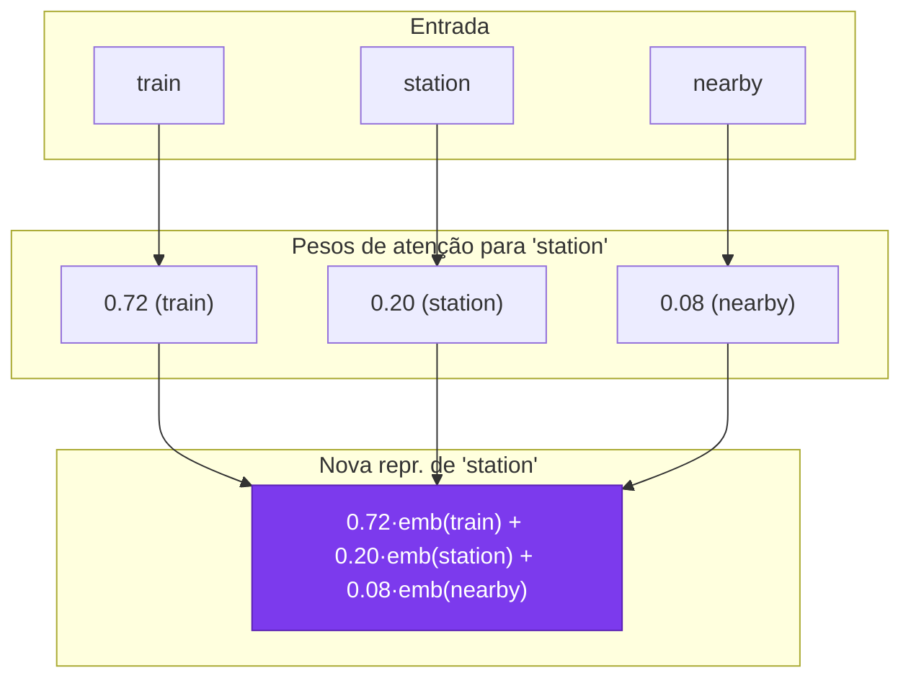
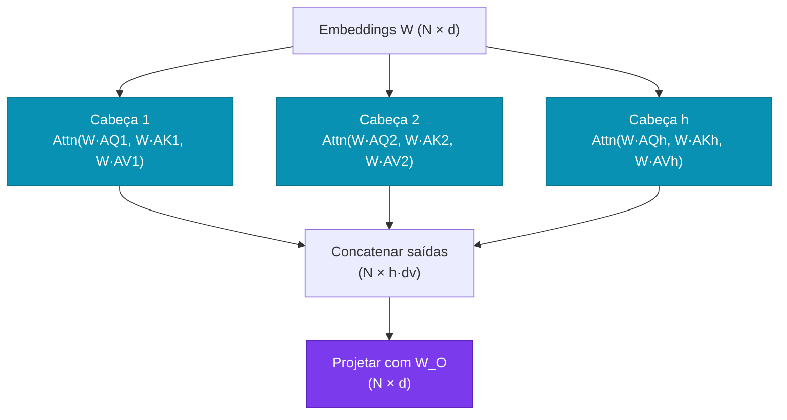
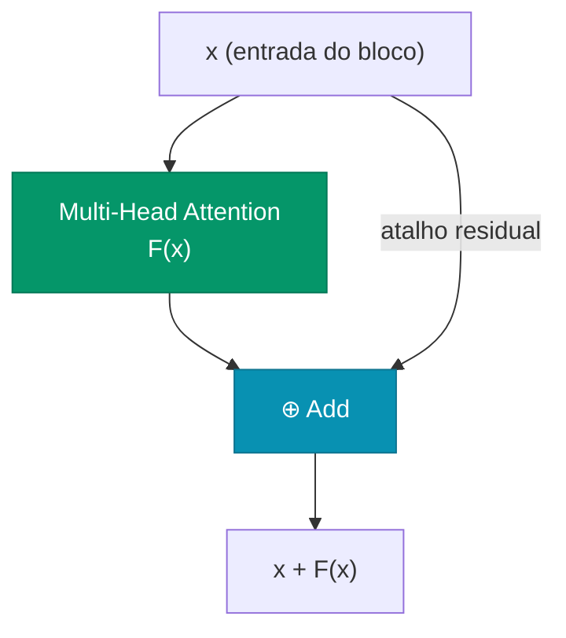
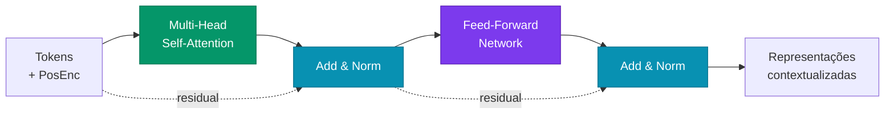
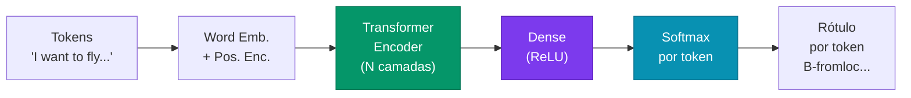

# Aula 6

## Transformers: Mecanismo de Atenção

<div class="pt-12">
  <span class="px-2 py-1 rounded cursor-pointer" hover:bg="white op-10">
    Tópicos Avançados em Inteligência Artificial · UFABC
  </span>
</div>

---

# Roteiro da aula

<div class="grid grid-cols-2 gap-6 mt-5 text-sm">

<div class="space-y-3">

<div class="p-3 rounded bg-blue-900/30 border border-blue-500/40">

**Parte 1 — Motivação**
Polissemia, tarefa ATIS e requisitos de uma solução

</div>

<div class="p-3 rounded bg-violet-900/30 border border-violet-500/40">

**Parte 2 — Self-Attention**
Representação contextual, produto interno, softmax

</div>

<div class="p-3 rounded bg-cyan-900/30 border border-cyan-500/40">

**Parte 3 — Multi-Head Attention**
Múltiplas cabeças paralelas, concatenação e projeção

</div>

</div>

<div class="space-y-3">

<div class="p-3 rounded bg-amber-900/30 border border-amber-500/40">

**Parte 4 — Positional Encoding**
Problema da permutabilidade, embeddings posicionais

</div>

<div class="p-3 rounded bg-emerald-900/30 border border-emerald-500/40">

**Parte 5 — Encoder Completo**
Q/K/V, conexões residuais, LayerNorm, bloco completo

</div>

<div class="p-3 rounded bg-rose-900/30 border border-rose-500/40">

**Parte 6 — Aplicações**
Slot filling, tipos de tarefas, código PyTorch

</div>

</div>

</div>

---
layout: section
---

# Parte 1 — Motivação

---

# De RNNs para Transformers

<div class="mt-2 text-sm">

Na aula anterior vimos RNNs e LSTMs como modelos para sequências. Por que não são suficientes para NLP moderno?

<div class="grid grid-cols-3 gap-3 mt-3 text-xs">

<div class="p-2 rounded bg-slate-700/50 border border-slate-500/30" v-click>

**Processamento sequencial**

RNNs calculam h_t a partir de h_{t-1} — impossível paralelizar. N tokens = N passos em série, mesmo em GPUs.

❌ Treinamento lento em sequências longas

</div>

<div class="p-2 rounded bg-slate-700/50 border border-slate-500/30" v-click>

**Vanishing gradient**

Gradientes se dissipam ao retropropagar por muitos passos. LSTMs atenuam, mas não eliminam o problema.

❌ Dependências de longo alcance são difíceis de aprender

</div>

<div class="p-2 rounded bg-slate-700/50 border border-slate-500/30" v-click>

**Contexto comprimido**

Toda a história da sequência é comprimida em um único vetor h_t. Informação de tokens distantes se dilui progressivamente.

❌ Em sequências longas, h_t quase não carrega informação dos primeiros tokens

</div>

</div>

<div class="mt-3 p-2 rounded bg-indigo-900/30 border border-indigo-500/30 text-xs" v-click>

**Transformer** (Vaswani et al., 2017) elimina a recorrência: cada token se conecta diretamente a todos os outros via **self-attention** — processamento totalmente paralelo, contexto global, sem vanishing gradient na atenção.

</div>

</div>
---

# O problema da polissemia

<div class="grid grid-cols-2 gap-5 mt-3 text-sm">

<div>

**Polissemia:** a mesma palavra tem significados diferentes dependendo do contexto.

<div class="mt-3 space-y-3">

<div class="p-3 rounded bg-blue-900/30 border border-blue-500/40" v-click>

**"station"**
- *"I arrived at the train **station**."* → estação ferroviária
- *"She works at a radio **station**."* → emissora de rádio

</div>

<div class="p-3 rounded bg-blue-900/30 border border-blue-500/40" v-click>

**"bank"**
- *"I deposited money at the **bank**."* → banco financeiro
- *"We sat on the river **bank**."* → margem do rio

</div>

</div>

</div>

<div v-click>

**O problema para word embeddings estáticos**

<div class="p-3 rounded bg-red-900/30 border border-red-500/30 text-xs mt-2">

❌ Word2Vec e GloVe atribuem **um único vetor** por palavra — independente do contexto.

"bank" tem sempre o mesmo embedding, misturando os dois significados.

</div>

<div class="p-3 rounded bg-emerald-900/30 border border-emerald-500/30 text-xs mt-3" v-click>

✅ Precisamos de **representações contextuais**: o embedding de "station" deve depender das palavras ao redor.

"train station" → próximo de termos ferroviários  
"radio station" → próximo de termos de mídia

</div>

</div>

</div>

---

# Tarefa ATIS — Slot Filling

<div class="mt-2 text-sm">

**ATIS (Airline Travel Information System):** classificar cada palavra de uma frase em categorias semânticas (*slots*).

<div class="mt-3 p-3 rounded bg-blue-900/30 border border-blue-500/40 font-mono text-xs">

```
Frase:   I   want  to   fly  from  boston  at   7   am   and  arrive  in   denver  at  11   in  the  morning
Rótulo:  O    O     O    O    O    B-from  O   B-dep  I-dep  O    O    O   B-arr    O  B-arr  I-arr  I-arr  I-arr
```

</div>

<div class="grid grid-cols-3 gap-3 mt-4 text-xs">

<div class="p-2 rounded bg-slate-800/50 border border-slate-600/30" v-click>

**B-fromloc.city_name**
"boston" = cidade de origem  
B = início da entidade

</div>

<div class="p-2 rounded bg-slate-800/50 border border-slate-600/30" v-click>

**B-depart_time.time**
"7 am" = horário de partida  
I = continuação da entidade

</div>

<div class="p-2 rounded bg-slate-800/50 border border-slate-600/30" v-click>

**B-toloc.city_name**
"denver" = cidade de destino  
O = fora de qualquer entidade

</div>

</div>

<div class="mt-4 p-3 rounded bg-indigo-900/30 border border-indigo-500/30 text-xs" v-click>

**Desafio:** o rótulo de cada palavra depende do contexto. "at" antes de "boston" é diferente de "at" antes de "7 am". O modelo precisa olhar para os arredores de cada token para atribuir o rótulo correto.

</div>

</div>

---

# Três requisitos para uma solução

<div class="grid grid-cols-3 gap-4 mt-5 text-sm">

<div class="p-3 rounded bg-blue-900/30 border border-blue-500/40" v-click>

**1. Saída do mesmo comprimento que a entrada**

Para slot filling, cada token de entrada precisa de um rótulo correspondente.

Entrada: N tokens → Saída: N rótulos

</div>

<div class="p-3 rounded bg-blue-900/30 border border-blue-500/40" v-click>

**2. Capturar contexto circundante**

A representação de cada palavra deve levar em conta todas as outras palavras da sequência.

"station" em "train station" ≠ "station" em "radio station"

</div>

<div class="p-3 rounded bg-blue-900/30 border border-blue-500/40" v-click>

**3. Capturar a ordem das palavras**

"gato comeu rato" ≠ "rato comeu gato"

A posição de cada token carrega informação semântica essencial.

</div>

</div>

<div class="mt-5 p-3 rounded bg-indigo-900/30 border border-indigo-500/30 text-sm" v-click>

**RNNs atendem parcialmente** — processam tokens em ordem e mantêm estado oculto. Mas o contexto futuro é ignorado (exceto se bidirecional) e dependências longas sofrem vanishing gradient.

**O Transformer** resolve os três requisitos de forma paralela e eficiente via **self-attention**.

</div>

---
layout: section
---

# Parte 2 — Self-Attention

---

# Intuição: representação contextual

<div class="grid grid-cols-2 gap-5 mt-3 text-sm">

<div>

**Ideia central:** a nova representação de uma palavra é uma **média ponderada** dos embeddings de todas as outras palavras.

<div class="mt-3 p-3 rounded bg-violet-900/30 border border-violet-500/30 text-xs">

O peso de cada palavra é **proporcional à similaridade** com a palavra alvo.

</div>

<div class="mt-3 text-xs space-y-2" v-click>

**Exemplo: "station" em "train station"**

- Alta similaridade com "train" → alto peso
- Baixa similaridade com "the", "at" → peso baixo
- Nova representação de "station" se move para perto de "train" no espaço vetorial

</div>

<div class="mt-3 p-2 rounded bg-slate-800/50 border border-slate-600/30 text-xs" v-click>

Antes (embedding estático): "station" = ponto fixo no espaço  
Depois (self-attention): "station" = combinação pesada de seu contexto

</div>

</div>

<div v-click>



</div>

</div>

---

# Como calcular a similaridade

**Similaridade entre palavra i e palavra j** = $\mathbf{w}_i \cdot \mathbf{w}_j$

<div class="mt-3 text-sm">

**Similaridade = produto interno (dot product) dos embeddings**

Para calcular o peso que a palavra j recebe ao representar a palavra i, usa-se o produto interno dos seus embeddings.

<div class="mt-4 p-3 rounded bg-slate-800/50 border border-slate-600/30 text-xs" v-click>

**Por que produto interno?**

Vetores que apontam na mesma direção têm produto interno alto; vetores ortogonais têm produto zero. O produto interno mede o **alinhamento semântico** entre os embeddings — palavras que co-ocorrem em contextos similares terão embeddings alinhados após o treino. A fórmula completa (com softmax e escala) vem nos próximos slides.

</div>

</div>
---

# Por que o produto interno captura similaridade?

$\mathbf{a} \cdot \mathbf{b} = |\mathbf{a}||\mathbf{b}|\cos\theta$ — mede o **alinhamento direcional** entre dois vetores

<div class="mt-3 text-xs">

<div class="grid grid-cols-3 gap-3">

<div class="p-2 rounded bg-emerald-900/30 border border-emerald-500/30">

**θ ≈ 0° → produto alto**

"cat" e "kitten" aparecem nos mesmos contextos → embeddings apontam na mesma direção → alta similaridade

</div>

<div class="p-2 rounded bg-slate-700/50 border border-slate-500/30">

**θ = 90° → produto zero**

"cat" e "quantum" raramente co-ocorrem → embeddings ortogonais → sem relação

</div>

<div class="p-2 rounded bg-red-900/30 border border-red-500/30">

**θ = 180° → produto negativo**

Antônimos podem ter embeddings em direções opostas

</div>

</div>

<div class="mt-3 p-2 rounded bg-amber-900/30 border border-amber-500/30" v-click>

**Por que os embeddings ficam alinhados?** Durante o treino, palavras que co-ocorrem em contextos semelhantes recebem gradientes similares → seus vetores convergem para a mesma direção no espaço d-dimensional. O produto interno é **eficiente** (O(d) e diferenciável) e captura exatamente esse alinhamento.

</div>

</div>

---

# Auto-atenção: embedding como "impressão digital"

Frase: **"train station nearby the radio station"** — mesma palavra, dois sentidos

<div class="mt-2 text-sm">

<div class="flex flex-col gap-2">

<div class="flex items-center gap-3">
  <div class="w-20 text-right font-bold text-blue-300 text-xs shrink-0">train</div>
  <div class="flex gap-1">
    <div style="width:28px;height:28px;border-radius:4px;background:rgba(59,130,246,0.90)"></div>
    <div style="width:28px;height:28px;border-radius:4px;background:rgba(239,68,68,0.20)"></div>
    <div style="width:28px;height:28px;border-radius:4px;background:rgba(34,197,94,0.10)"></div>
    <div style="width:28px;height:28px;border-radius:4px;background:rgba(168,85,247,0.10)"></div>
    <div style="width:28px;height:28px;border-radius:4px;background:rgba(249,115,22,0.80)"></div>
    <div style="width:28px;height:28px;border-radius:4px;background:rgba(6,182,212,0.30)"></div>
    <div style="width:28px;height:28px;border-radius:4px;background:rgba(236,72,153,0.60)"></div>
    <div style="width:28px;height:28px;border-radius:4px;background:rgba(234,179,8,0.20)"></div>
  </div>
  <div class="text-xs text-slate-400">🚂 semântica ferroviária dominante</div>
</div>

<div class="flex items-center gap-3">
  <div class="w-20 text-right font-bold text-yellow-300 text-xs shrink-0">station</div>
  <div class="flex gap-1">
    <div style="width:28px;height:28px;border-radius:4px;background:rgba(59,130,246,0.40)"></div>
    <div style="width:28px;height:28px;border-radius:4px;background:rgba(239,68,68,0.30)"></div>
    <div style="width:28px;height:28px;border-radius:4px;background:rgba(34,197,94,0.80)"></div>
    <div style="width:28px;height:28px;border-radius:4px;background:rgba(168,85,247,0.50)"></div>
    <div style="width:28px;height:28px;border-radius:4px;background:rgba(249,115,22,0.50)"></div>
    <div style="width:28px;height:28px;border-radius:4px;background:rgba(6,182,212,0.40)"></div>
    <div style="width:28px;height:28px;border-radius:4px;background:rgba(236,72,153,0.50)"></div>
    <div style="width:28px;height:28px;border-radius:4px;background:rgba(234,179,8,0.30)"></div>
  </div>
  <div class="text-xs text-slate-400">❓ padrão misto — ambígua sem contexto</div>
</div>

<div class="flex items-center gap-3">
  <div class="w-20 text-right font-bold text-purple-300 text-xs shrink-0">radio</div>
  <div class="flex gap-1">
    <div style="width:28px;height:28px;border-radius:4px;background:rgba(59,130,246,0.10)"></div>
    <div style="width:28px;height:28px;border-radius:4px;background:rgba(239,68,68,0.20)"></div>
    <div style="width:28px;height:28px;border-radius:4px;background:rgba(34,197,94,0.10)"></div>
    <div style="width:28px;height:28px;border-radius:4px;background:rgba(168,85,247,0.90)"></div>
    <div style="width:28px;height:28px;border-radius:4px;background:rgba(249,115,22,0.20)"></div>
    <div style="width:28px;height:28px;border-radius:4px;background:rgba(6,182,212,0.70)"></div>
    <div style="width:28px;height:28px;border-radius:4px;background:rgba(236,72,153,0.20)"></div>
    <div style="width:28px;height:28px;border-radius:4px;background:rgba(234,179,8,0.80)"></div>
  </div>
  <div class="text-xs text-slate-400">📻 semântica de mídia dominante</div>
</div>

</div>

<div class="mt-2 text-xs text-slate-400">

**Similaridade (dot product):** palavras com padrões parecidos recebem maior peso — o contexto vizinho determina qual sentido de "station" prevalece

</div>

<div class="mt-2 flex flex-col gap-2">

<div class="flex items-center gap-3" v-click>
  <div class="w-20 text-right font-bold text-emerald-300 text-xs shrink-0">station'</div>
  <div class="flex gap-1">
    <div style="width:28px;height:28px;border-radius:4px;background:rgba(59,130,246,0.63)"></div>
    <div style="width:28px;height:28px;border-radius:4px;background:rgba(239,68,68,0.23)"></div>
    <div style="width:28px;height:28px;border-radius:4px;background:rgba(34,197,94,0.31)"></div>
    <div style="width:28px;height:28px;border-radius:4px;background:rgba(168,85,247,0.34)"></div>
    <div style="width:28px;height:28px;border-radius:4px;background:rgba(249,115,22,0.62)"></div>
    <div style="width:28px;height:28px;border-radius:4px;background:rgba(6,182,212,0.39)"></div>
    <div style="width:28px;height:28px;border-radius:4px;background:rgba(236,72,153,0.51)"></div>
    <div style="width:28px;height:28px;border-radius:4px;background:rgba(234,179,8,0.32)"></div>
  </div>
  <div class="text-xs text-emerald-300 font-bold">🚂 1ª "station" (train station) — absorveu padrão ferroviário</div>
</div>

<div class="flex items-center gap-3" v-click>
  <div class="w-20 text-right font-bold text-pink-300 text-xs shrink-0">station''</div>
  <div class="flex gap-1">
    <div style="width:28px;height:28px;border-radius:4px;background:rgba(59,130,246,0.31)"></div>
    <div style="width:28px;height:28px;border-radius:4px;background:rgba(239,68,68,0.23)"></div>
    <div style="width:28px;height:28px;border-radius:4px;background:rgba(34,197,94,0.31)"></div>
    <div style="width:28px;height:28px;border-radius:4px;background:rgba(168,85,247,0.66)"></div>
    <div style="width:28px;height:28px;border-radius:4px;background:rgba(249,115,22,0.38)"></div>
    <div style="width:28px;height:28px;border-radius:4px;background:rgba(6,182,212,0.55)"></div>
    <div style="width:28px;height:28px;border-radius:4px;background:rgba(236,72,153,0.35)"></div>
    <div style="width:28px;height:28px;border-radius:4px;background:rgba(234,179,8,0.56)"></div>
  </div>
  <div class="text-xs text-pink-300 font-bold">📻 2ª "station" (radio station) — absorveu padrão de mídia</div>
</div>

</div>

</div>

---

# Fórmula do Self-Attention

$$\text{Attention}(\mathbf{W}) = \text{softmax}\!\left(\frac{\mathbf{W}\mathbf{W}^\top}{\sqrt{d}}\right)\mathbf{W}$$

<div class="grid grid-cols-2 gap-4 mt-4 text-xs">

<div class="p-3 rounded bg-violet-900/30 border border-violet-500/30">

**Interpretação passo a passo**

- W (N × d): matriz de embeddings das N palavras
- W · W^T (N × N): todos os produtos internos entre pares de palavras
- Dividir por sqrt(d): estabiliza gradientes (evita softmax saturada)
- softmax linha a linha: pesos de atenção somam 1 para cada palavra
- Multiplicar por W: combinar os embeddings com os pesos

</div>

<div class="p-3 rounded bg-slate-800/50 border border-slate-600/30" v-click>

**Por que dividir por sqrt(d)?**

Com embeddings de dimensão d grande, os produtos internos têm magnitude alta — isso satura o softmax (gradientes ≈ 0). Escalar por 1/√d mantém a variância dos scores em torno de 1, independente de d.

**Eficiência computacional:** toda a operação — N² produtos internos, escala, softmax e combinação — é expressa como multiplicações de matrizes densas. GPUs executam isso em paralelo para todas as palavras simultaneamente, sem nenhum loop explícito.

</div>

</div>

<div class="mt-3 p-2 rounded bg-indigo-900/30 border border-indigo-500/30 text-xs" v-click>

**Resultado:** uma nova matriz N × d onde cada linha é uma representação contextualizada da palavra correspondente — incorporando informação de todas as outras palavras da sequência.

</div>

---

# Exemplo: self-attention passo a passo (d=2)

**"train station nearby the radio station"** — "station" aparece 2× com embedding inicial idêntico

<div class="mt-2 text-xs">

<div class="grid grid-cols-2 gap-4">

<div class="p-2 rounded bg-slate-800/50 border border-slate-600/30">

**Embeddings iniciais W (4×2)**

<table class="mt-1 w-full text-center">
<thead><tr class="text-slate-400"><th></th><th>d₁</th><th>d₂</th></tr></thead>
<tbody>
<tr><td class="font-bold text-blue-300">tr.</td><td>0.9</td><td>0.1</td></tr>
<tr style="background:rgba(234,179,8,0.07)"><td class="font-bold text-yellow-300">sta₁</td><td>0.6</td><td>0.6</td></tr>
<tr><td class="font-bold text-purple-300">ra.</td><td>0.1</td><td>0.9</td></tr>
<tr style="background:rgba(234,179,8,0.07)"><td class="font-bold text-yellow-300">sta₂</td><td>0.6</td><td>0.6</td></tr>
</tbody>
</table>

<div class="mt-2 p-1 rounded text-yellow-300 border border-yellow-500/30" style="background:rgba(234,179,8,0.08)">

sta₁ e sta₂ têm embedding **idêntico** [0.6, 0.6]

</div>

</div>

<div class="p-2 rounded bg-slate-800/50 border border-slate-600/30" v-click>

**Atenção: softmax(W·Wᵀ ÷ √2)**

<table class="mt-1 w-full text-center"><thead><tr class="text-slate-400"><th></th><th>tr.</th><th>sta₁</th><th>ra.</th><th>sta₂</th></tr></thead><tbody><tr><td class="font-bold text-blue-300">tr.</td><td class="font-bold text-blue-200">0.3</td><td class="">0.25</td><td class="">0.19</td><td class="">0.25</td></tr><tr style="background:rgba(234,179,8,0.07)"><td class="font-bold text-yellow-300">sta₁</td><td class="">0.24</td><td class="font-bold text-yellow-200">0.26</td><td class="">0.24</td><td class="">0.26</td></tr><tr><td class="font-bold text-purple-300">ra.</td><td class="">0.19</td><td class="">0.25</td><td class="font-bold text-purple-200">0.3</td><td class="">0.25</td></tr><tr style="background:rgba(234,179,8,0.07)"><td class="font-bold text-yellow-300">sta₂</td><td class="">0.24</td><td class="">0.26</td><td class="">0.24</td><td class="font-bold text-yellow-200">0.26</td></tr></tbody></table>

<div class="mt-2 text-yellow-300 text-xs">🔁 linhas sta₁ = sta₂: pesos de atenção idênticos → mesma representação de saída!</div>

</div>

</div>

<div class="mt-3 p-2 rounded border border-amber-500/40 text-xs" style="background:rgba(245,158,11,0.1)" v-click>

**Problema:** sem saber a posição, o modelo não distingue a 1ª "station" da 2ª. Por isso o Transformer adiciona **positional encoding** aos embeddings.

</div>

</div>

---
layout: section
---

# Parte 3 — Positional Encoding

---

# O problema: sem posição, sem ordem

<div class="grid grid-cols-2 gap-3 mt-2 text-sm">

<div>

**Self-attention é invariante à permutação:**

Se embaralharmos a ordem das palavras, os pesos mudam mas a operação não distingue "posição 1" de "posição 5".

<div class="mt-2 p-2 rounded bg-red-900/30 border border-red-500/30 text-xs" v-click>

❌ Sem modificações, o Transformer trata como equivalentes:

"gato comeu rato" = "rato comeu gato" = "comeu gato rato"

O modelo perde totalmente a informação de ordem.

</div>

</div>

<div v-click>

**Por que isso importa?**

<div class="space-y-1 text-xs mt-1">

<div class="p-1 rounded bg-amber-900/30 border border-amber-500/30">

**Sujeito vs. objeto** — "João viu Maria" ≠ "Maria viu João": a posição determina quem age.

</div>

<div class="p-1 rounded bg-amber-900/30 border border-amber-500/30" v-click>

**Modificadores** — "cachorro grande bravo" ≠ "bravo grande cachorro": a ordem altera a construção gramatical.

</div>

<div class="p-1 rounded bg-amber-900/30 border border-amber-500/30" v-click>

**Slot filling** — em "fly from boston at 7am", a posição de "boston" após "from" define seu rótulo como origem.

</div>

</div>

</div>

</div>

---

# Solução: Positional Encoding

**Ideia:** somar um vetor posicional ao embedding de cada palavra antes de entrar no Transformer.

$$\mathbf{x}'_i = \mathbf{x}_i + \mathbf{p}_i$$

<div class="mt-2 text-sm">

<div class="grid grid-cols-2 gap-4 mt-3 text-xs">

<div class="p-3 rounded bg-amber-900/30 border border-amber-500/30">

**Exemplo numérico:**

| Token | Embedding | + Pos. Enc. | = Entrada |
|-------|-----------|-------------|-----------|
| "cat" | (0.5, 7.1) | + (1.3, 3.9) | = (1.8, 11.0) |
| "sat" | (1.2, 5.3) | + (6.3, 3.7) | = (7.5, 9.0) |

As entradas finais diferem mesmo se "cat" e "sat" tivessem embeddings idênticos.

</div>

<div class="p-3 rounded bg-slate-800/50 border border-slate-600/30" v-click>

**Duas abordagens:**

**Learned (aprendido):**
- Cada posição 0…N-1 tem um vetor de embedding treinável
- Flexível, mas limitado ao tamanho máximo de sequência visto no treino
- Usado em BERT, GPT

**Sinusoidal (Vaswani et al., 2017):**
- p(i,2k) = sin(i / 10000^(2k/d))
- p(i,2k+1) = cos(i / 10000^(2k/d))
- Generaliza para sequências mais longas que as do treino

</div>

</div>

<div class="mt-3 p-2 rounded bg-indigo-900/30 border border-indigo-500/30 text-xs" v-click>

**Resultado:** o modelo agora distingue a posição de cada token. O embedding de entrada codifica tanto o **significado** da palavra quanto sua **posição** na sequência.

</div>

</div>

---
layout: section
---

# Parte 4 — Multi-Head Attention

---

# Projeções Q, K, V — tornando a atenção treinável

$$\text{score}(i,j) = \text{softmax}\!\left(\frac{(A_Q\,\mathbf{w}_i)\cdot(A_K\,\mathbf{w}_j)}{\sqrt{d_k}}\right) \qquad \text{saída}_i = \sum_j \text{score}(i,j)\cdot A_V\,\mathbf{w}_j$$

<div class="grid grid-cols-2 gap-4 mt-3 text-xs">

<div class="p-3 rounded bg-emerald-900/30 border border-emerald-500/30">

**Por que não usar W · W^T diretamente?**

Se Query e Key forem o mesmo vetor w_i, o modelo só pode aprender a similaridade entre os embeddings originais — sem flexibilidade.

Com A_Q, A_K, A_V separados:
- A_Q transforma w_i em uma "consulta" (o que estou buscando?)
- A_K transforma w_j em uma "chave" (o que tenho para oferecer?)
- A_V transforma w_j em um "valor" (o que devo contribuir?)

</div>

<div class="p-3 rounded bg-slate-800/50 border border-slate-600/30" v-click>

**Nomes Q, K, V vêm de sistemas de recuperação:**

Query (Q): a pergunta que faço  
Key (K): o índice do que está disponível  
Value (V): o conteúdo associado

A atenção encontra quais Keys são mais similares à Query e retorna uma combinação pesada dos Values correspondentes.

As matrizes A_Q, A_K, A_V são aprendidas via backprop — o modelo decide o que é "relevante" para cada tarefa.

</div>

</div>

---

# Multi-Head Attention

<div class="grid grid-cols-2 gap-5 mt-3 text-sm">

<div>

**Problema com uma única cabeça:**

Uma só cabeça de atenção aprende um único padrão de similaridade. Mas palavras se relacionam de múltiplas formas simultaneamente.

<div class="mt-3 space-y-2 text-xs">

<div class="p-2 rounded bg-cyan-900/30 border border-cyan-500/30" v-click>

**Cabeça 1** — Concordância de tempo verbal  
"correu" → conecta com "ontem", "rapidamente"

</div>

<div class="p-2 rounded bg-cyan-900/30 border border-cyan-500/30" v-click>

**Cabeça 2** — Relações entre entidades  
"presidente" → conecta com o país que governa

</div>

<div class="p-2 rounded bg-cyan-900/30 border border-cyan-500/30" v-click>

**Cabeça 3** — Tom e polaridade  
"brilhante" → conecta com outros adjetivos positivos

</div>

</div>

</div>

<div v-click>

**Arquitetura Multi-Head**



<div class="mt-2 text-xs p-2 rounded bg-slate-800/50 border border-slate-600/30">

Cada cabeça tem suas próprias matrizes A_Q, A_K, A_V aprendíveis, capturando um padrão de atenção independente. A projeção W_O combina todas as cabeças de volta à dimensão original d.

</div>

</div>

</div>

---
layout: section
---

# Parte 5 — Encoder Completo

---

# Conexões Residuais

<div class="grid grid-cols-2 gap-5 mt-3 text-sm">

<div>

**Problema:** Transformers profundos (muitas camadas) sofrem de gradientes que diminuem ao passar por cada transformação não-linear.

**Solução:** somar a entrada do bloco à sua saída.

<div class="mt-3 p-3 rounded bg-emerald-900/30 border border-emerald-500/30 text-xs">

Saída do bloco = F(x) + x

onde F(x) é a transformação aprendida (atenção ou FFN).

</div>

<div class="mt-3 text-xs space-y-2" v-click>

**Por que funciona?**

- O gradiente pode fluir diretamente pela conexão aditiva
- A rede aprende apenas a **diferença** (resíduo) em relação à entrada
- Permite treinar redes muito profundas (ResNets usam o mesmo princípio)

</div>

</div>

<div v-click>



<div class="mt-3 p-2 rounded bg-amber-900/30 border border-amber-500/30 text-xs">

Em prática: a conexão residual é aplicada tanto após a atenção quanto após a FFN. Isso permite empilhar dezenas de camadas sem degradação de gradiente.

</div>

</div>

</div>

---

# Layer Normalization

<div class="grid grid-cols-2 gap-5 mt-3 text-sm">

<div>

**Problema:** após as transformações lineares e não-lineares, os vetores de embedding podem ter escala e média muito variáveis — dificultando o treinamento.

**Layer Normalization:** normalizar cada embedding individualmente.

<div class="mt-3 p-3 rounded bg-emerald-900/30 border border-emerald-500/30 text-xs">

Para um vetor h de dimensão d:

média = (1/d) × soma(h_i)

std = raiz( (1/d) × soma((h_i - média)^2) )

h_norm = (h - média) / std

h_out = gamma × h_norm + beta

</div>

</div>

<div v-click>

**LayerNorm vs BatchNorm**

<div class="grid grid-cols-2 gap-2 text-xs mt-2">

<div class="p-2 rounded bg-slate-800/50 border border-slate-600/30">

**BatchNorm**
Normaliza ao longo da dimensão do batch — problemático para sequências de tamanho variável

</div>

<div class="p-2 rounded bg-slate-800/50 border border-slate-600/30">

**LayerNorm**
Normaliza ao longo das dimensões do embedding — independente do tamanho do batch ou sequência

</div>

</div>

<div class="mt-3 p-2 rounded bg-amber-900/30 border border-amber-500/30 text-xs" v-click>

**gamma e beta** são parâmetros aprendíveis (escala e deslocamento) — permitem ao modelo recuperar a escala original se necessário.

**Resultado:** pesos ficam estáveis durante o treino, acelerando a convergência mesmo com learning rates maiores.

</div>

</div>

</div>

---

# Bloco Encoder Completo

<div class="mt-2 text-sm">

Cada bloco: **MHA → Add & Norm → FFN → Add & Norm** (N vezes; BERT-base: N = 12)



<div class="grid grid-cols-2 gap-2 mt-3 text-xs">

<div class="p-1 rounded bg-emerald-900/30 border border-emerald-500/30">

**N camadas empilhadas:** cada bloco [MHA → Add&Norm → FFN → Add&Norm] é repetido N vezes (ex: BERT-base: N=12).

</div>

<div class="p-1 rounded bg-slate-800/50 border border-slate-600/30">

**Pesos otimizados:** embeddings posicionais, embeddings de palavras, A_Q/A_K/A_V de cada cabeça, pesos da FFN, gamma/beta do LayerNorm.

</div>

</div>

</div>

---
layout: section
---

# Parte 6 — Aplicações

---

# Slot Filling com Transformer

<div class="mt-2 text-sm">

**Pipeline completo para classificação token-a-token:**



<div class="grid grid-cols-3 gap-3 mt-4 text-xs">

<div class="p-2 rounded bg-rose-900/30 border border-rose-500/30" v-click>

**Entrada**
Cada token da frase é convertido para embedding e somado ao encoding posicional correspondente.

</div>

<div class="p-2 rounded bg-rose-900/30 border border-rose-500/30" v-click>

**Encoder**
O Transformer produz uma representação contextual para cada token — cada vetor "viu" todos os outros tokens.

</div>

<div class="p-2 rounded bg-rose-900/30 border border-rose-500/30" v-click>

**Classificação**
Uma camada densa + softmax por token produz uma distribuição de probabilidade sobre os rótulos para cada posição.

</div>

</div>

</div>

---

# Tipos de Tarefas com Transformers

<div class="grid grid-cols-3 gap-3 mt-3 text-sm">

<div class="p-3 rounded bg-rose-900/30 border border-rose-500/40" v-click>

**1. Classificação de Sequência**

Usar o token `[CLS]` ou média dos embeddings finais.

```text
[CLS] frase... [SEP]
  ↓
Dense → Softmax
  ↓
rótulo da frase
```

Ex: análise de sentimento, detecção de spam, classificação de tópico.

</div>

<div class="p-3 rounded bg-rose-900/30 border border-rose-500/40" v-click>

**2. Rotulagem de Sequência**

Usar o embedding de cada token individualmente.

```text
tok1 tok2 tok3
 ↓    ↓    ↓
Dense → Softmax × N
 ↓    ↓    ↓
lab1 lab2 lab3
```

Ex: NER, slot filling, POS tagging.

</div>

<div class="p-3 rounded bg-rose-900/30 border border-rose-500/40" v-click>

**3. Geração de Sequência**

Usar Transformer decoder com atenção causal (cada token só pode ver tokens anteriores).

```text
[START] → tok1 → tok2 → tok3
```

Ex: tradução automática, sumarização, chatbots.

</div>

</div>

<div class="mt-3 grid grid-cols-2 gap-3 text-xs" v-click>

<div class="p-2 rounded bg-slate-800/50 border border-slate-500/30">

**`[CLS]`** *(Classification)* — token especial inserido no início de toda sequência. Após o encoder, seu embedding agrega informação de toda a frase e é usado como representação global para classificação.

</div>

<div class="p-2 rounded bg-slate-800/50 border border-slate-500/30">

**`[SEP]`** *(Separator)* — token especial que marca o fim de uma sentença ou separa duas sentenças em tarefas de par (ex: inferência textual). Sinaliza ao modelo onde uma sequência termina.

</div>

</div>

---

# Geração de Texto: temperatura e top-k

<div class="mt-2 text-sm">

Em modelos **decoder**, a softmax produz uma **distribuição sobre o vocabulário** a cada passo. Como escolher o próximo token?

<div class="grid grid-cols-2 gap-3 mt-2 text-xs">

<div class="p-2 rounded bg-slate-700/50 border border-slate-500/30">

**Greedy (τ → 0)**

Sempre escolhe o token mais provável. Determinístico e rápido, mas tende à repetição.

</div>

<div class="p-2 rounded bg-violet-900/30 border border-violet-500/30">

**Temperatura (τ)**

softmax(logits / τ) — τ < 1 → mais focado; τ > 1 → mais criativo/aleatório; τ = 1 → distribuição original do modelo.

</div>

<div class="p-2 rounded bg-emerald-900/30 border border-emerald-500/30">

**Top-k sampling**

Descarta todos exceto os k mais prováveis antes do softmax. k = 1 = greedy; k = 50 é valor comum na prática.

</div>

<div class="p-2 rounded bg-amber-900/30 border border-amber-500/30">

**Top-p (nucleus sampling)**

Mantém o menor conjunto com probabilidade acumulada ≥ p — k varia: menor quando o modelo está confiante.

</div>

</div>

<div class="mt-3 p-2 rounded bg-slate-800/50 border border-slate-500/30 text-xs" v-click>

**Na prática (APIs de LLMs):** temperatura=0.7, top-p=0.9 são valores típicos. Valores altos → mais variado e criativo; valores baixos → mais determinístico e factual.

</div>

</div>
---

# Código PyTorch — Transformer Encoder

```python {scale: 0.85}
import torch
import torch.nn as nn

# Um bloco do encoder: Multi-Head Attention + FFN + Add&Norm
encoder_layer = nn.TransformerEncoderLayer(
    d_model=512,        # dimensão dos embeddings
    nhead=8,            # número de cabeças de atenção
    dim_feedforward=2048,  # dimensão interna da FFN
    dropout=0.1,
    batch_first=True    # formato (batch, seq, d_model)
)

# Empilhar N blocos encoder
encoder = nn.TransformerEncoder(
    encoder_layer=encoder_layer,
    num_layers=6        # N = 6 blocos (como no paper original)
)

# Embeddings de entrada: palavras + posição
embed = nn.Embedding(vocab_size, 512)
pos_enc = nn.Embedding(max_seq_len, 512)  # learned positional

# Forward pass
x = embed(tokens) + pos_enc(positions)   # (batch, seq, 512)
out = encoder(x)                          # (batch, seq, 512)

# Slot filling: classificar cada token
classifier = nn.Linear(512, num_labels)
logits = classifier(out)                  # (batch, seq, num_labels)
```

---

# Recapitulando

<div class="grid grid-cols-3 gap-4 mt-4 text-xs text-left">

<div class="p-3 rounded bg-blue-900/30 border border-blue-500/30">

**Motivação**
- Polissemia exige representações contextuais
- Slot filling: rótulo de cada token depende do contexto
- 3 requisitos: mesmo comprimento, contexto, ordem

</div>

<div class="p-3 rounded bg-violet-900/30 border border-violet-500/30">

**Self-Attention**
- Representação = média ponderada pelos embeddings
- Peso proporcional ao produto interno (similaridade)
- Softmax normaliza; divisão por sqrt(d) estabiliza

</div>

<div class="p-3 rounded bg-cyan-900/30 border border-cyan-500/30">

**Multi-Head**
- Múltiplas cabeças capturam padrões diferentes
- Cada cabeça: A_Q, A_K, A_V independentes
- Concatenar e projetar com W_O

</div>

<div class="p-3 rounded bg-amber-900/30 border border-amber-500/30">

**Positional Encoding**
- Sem encoding: atenção é invariante à ordem
- Somar embedding posicional ao de palavra
- Learned (BERT) ou sinusoidal (original)

</div>

<div class="p-3 rounded bg-emerald-900/30 border border-emerald-500/30">

**Encoder Completo**
- Q/K/V tornam a atenção tunável via backprop
- Residual: gradientes fluem sem atenuação
- LayerNorm: pesos estáveis; N blocos empilhados

</div>

<div class="p-3 rounded bg-rose-900/30 border border-rose-500/30">

**Próxima aula**
- BERT: pré-treino e fine-tuning
- GPT: geração autorregressiva
- Aplicações práticas: QA, sumarização

</div>

</div>

---

# Próxima aula

<div class="mt-6 grid grid-cols-2 gap-6 text-sm">

<div class="p-4 rounded bg-slate-800/50 border border-slate-600/30">

**Aula 7 — BERT e Modelos de Linguagem de Grande Escala**

- Pré-treino: Masked LM e Next Sentence Prediction
- Fine-tuning para tarefas downstream
- GPT e geração autorregressiva
- Comparativo BERT vs GPT vs T5
- ChatGPT e modelos de instrução

</div>

<div class="p-4 rounded bg-indigo-900/30 border border-indigo-500/30">

**Para esta semana**

- Notebook `lec06-transformers.ipynb`:
  - Implementar self-attention do zero em NumPy
  - Usar nn.TransformerEncoder para slot filling
  - Visualizar os pesos de atenção de diferentes cabeças
  - Comparar Transformer vs LSTM bidirecional no ATIS

</div>

</div>

---
layout: center
---

# Obrigado! Perguntas?

<div class="text-sm opacity-60 mt-4">

CCM-109 · Deep Learning · UFABC

</div>
